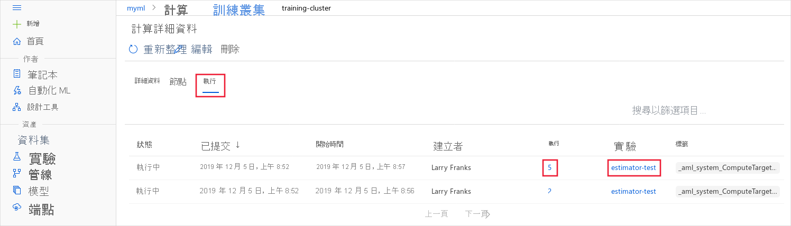

# <a name="monitor-azure-ml-experiment-runs-and-metrics"></a>監視 Azure ML 實驗運行和指標
[!INCLUDE [applies-to-skus](../../includes/aml-applies-to-basic-enterprise-sku.md)]

通過跟蹤實驗和監視運行指標來增強模型創建過程。 在本文中，瞭解如何將日誌記錄代碼添加到訓練腳本、提交實驗運行、監視運行以及檢查 Azure 機器學習中的結果。

> [!NOTE]
> Azure 機器學習還可以在培訓期間從其他來源（如自動機器學習運行）或運行培訓作業的 Docker 容器中記錄資訊。 這些日誌沒有記錄。 如果您遇到問題並聯系 Microsoft 支援人員，他們也許能夠在故障排除期間使用這些日誌。

> [!TIP]
> 本文檔中的資訊主要面向想要監視模型培訓過程的資料科學家和開發人員。 如果您是對監視 Azure 機器學習中的資源使用方式和事件（如配額、已完成訓練運行或已完成的模型部署）感興趣的管理員，請參閱[監視 Azure 機器學習](monitor-azure-machine-learning.md)。

## <a name="available-metrics-to-track"></a>可跟蹤的可用指標

訓練實驗時，可以將下列計量新增到執行中。 若要檢視可在回合中追蹤之內容的更詳細清單，請參閱 [Run 類別參考文件](https://docs.microsoft.com/python/api/azureml-core/azureml.core.run(class)?view=azure-ml-py) \(英文\)。

|類型| Python 函式 | 注意|
|----|:----|:----|
|純量值 |函式：<br>`run.log(name, value, description='')`<br><br>範例：<br>run.log("accuracy", 0.95) |使用指定名稱將數字或字串值記錄到執行中。 將計量記錄到執行中，會導致該計量儲存在實驗的執行記錄中。  您可以在執行中多次記錄相同的計量，結果會視為該計量的向量。|
|清單|函式：<br>`run.log_list(name, value, description='')`<br><br>範例：<br>run.log_list("accuracies", [0.6, 0.7, 0.87]) | 使用指定名稱將值清單記錄到執行中。|
|資料列|函式：<br>`run.log_row(name, description=None, **kwargs)`<br>範例：<br>run.log_row("Y over X", x=1, y=0.4) | 使用 log_row** 建立計量，並於其中包含 kwargs 中描述的多個資料行。 每個具名的參數都會產生一個具有指定值的資料行。  可以呼叫一次 *log_row* 以記錄任意 Tuple，或者在迴圈中多次呼叫以產生完整的資料表。|
|Table|函式：<br>`run.log_table(name, value, description='')`<br><br>範例：<br>run.log_table("Y over X", {"x":[1, 2, 3], "y":[0.6, 0.7, 0.89]}) | 使用指定名稱將字典物件記錄到執行中。 |
|影像|函式：<br>`run.log_image(name, path=None, plot=None)`<br><br>範例：<br>`run.log_image("ROC", plot=plt)` | 將映像記錄到執行記錄中。 使用 log_image 將映像檔案或 matplotlib 繪圖記錄到執行中。  這些映像會顯示在執行記錄中，並可供比較。|
|標記執行|函式：<br>`run.tag(key, value=None)`<br><br>範例：<br>run.tag("selected", "yes") | 使用字串索引鍵和可選字串值標記執行。|
|上傳檔案或目錄|函式：<br>`run.upload_file(name, path_or_stream)`<br> <br> 範例：<br>run.upload_file("best_model.pkl", "./model.pkl") | 將檔案上傳到執行記錄。 執行會自動擷取特定輸出目錄中的檔案，對於大多數執行類型，預設為「./outputs」。  只有在需要上傳其他檔案或未指定輸出目錄時，才使用 upload_file。 我們建議在名稱中加上 `outputs`，以便將其上傳到輸出目錄。 您可以透過呼叫 `run.get_file_names()`，列出與該執行記錄相關聯的所有檔案|

> [!NOTE]
> 純量、清單、資料列和資料表的計量可具有以下類型：浮點數、整數或字串。

## <a name="choose-a-logging-option"></a>選擇日誌記錄選項

如果您想要追蹤或監視您的實驗，必須新增程式碼，以在提交執行時開始記錄。 以下是觸發執行提交的方法：
* __Run.start_logging__ - 將記錄函式加入您的定型指令碼中，並在指定的實驗中，啟動互動式記錄工作階段。 **start_logging** 可建立互動式執行，以便用於 Notebook 等環境中。 工作階段期間記錄的所有計量都會加入實驗的執行記錄中。
* __ScriptRunConfig__ - 將記錄函式加入定型指令碼中，並在執行時載入整個指令碼資料夾。  **ScriptRunConfig** 是一種用於設定指令碼執行設定的類別。 使用此選項，您可以新增監視程式碼以通知完成，或取得視覺小工具以進行監視。

## <a name="set-up-the-workspace"></a>設定工作區
新增記錄並提交實驗之前，您必須先設定工作區。

1. 使用工作區。 要瞭解有關設置工作區配置的更多資訊，請參閱[工作區設定檔](how-to-configure-environment.md#workspace)。

[！筆記本-python]（*/機器學習筆記本/使用方式-azureml/培訓/筆記本內訓練/筆記本內訓練。ipynb？name_load_ws）]


## <a name="option-1-use-start_logging"></a>選項 1：使用 start_logging

**start_logging** 可建立互動式執行，以便用於 Notebook 等環境中。 工作階段期間記錄的所有計量都會加入實驗的執行記錄中。

以下範例在本機 Jupyter Notebook 中，將簡單的 sklearn Ridge 模型定型。 要瞭解有關將實驗提交到不同環境的更多內容，請參閱[為 Azure 機器學習的模型培訓設置計算目標](https://docs.microsoft.com/azure/machine-learning/how-to-set-up-training-targets)。

### <a name="load-the-data"></a>載入資料

此示例使用糖尿病資料集，這是一個眾所周知的小資料集，隨 scikit 學習一起。 此儲存格載入資料集並將其拆分為隨機訓練和測試集。

[！筆記本-python]（*/機器學習筆記本/使用方式-azureml/培訓/筆記本內訓練/筆記本內訓練。ipynb？name_load_data）]

### <a name="add-tracking"></a>添加跟蹤
使用 Azure 機器學習 SDK 添加實驗跟蹤，並將持久化模型上載到實驗運行記錄中。 以下程式碼新增標記、記錄，並將模型檔案上傳到實驗執行中。

[！筆記本-python]（*/機器學習筆記本/使用方式-azureml/培訓/筆記本內訓練/筆記本內訓練。ipynb？name_create_experiment）]

指令碼以 ```run.complete()``` 結尾，完成時會標記執行。  此函式通常用於互動式 Notebook 案例中。

## <a name="option-2-use-scriptrunconfig"></a>選項 2：使用 ScriptRunConfig

[**腳本 RunConfig**](https://docs.microsoft.com/python/api/azureml-core/azureml.core.scriptrunconfig?view=azure-ml-py)是一個用於為腳本回合設定配置的類。 使用此選項，您可以新增監視程式碼以通知完成，或取得視覺小工具以進行監視。

此範例擴展上述的基本 sklearn Ridge 模型。 它執行簡單的參數掃掠以掃掠模型的 Alpha 值，以在實驗下的執行中擷取計量和定型的模型。 此範例會針對使用者管理的環境在本機上執行。 

1. 建立定型指令碼 `train.py`。

   [！代碼-python]（*/機器學習筆記本/使用方式-azureml/培訓/本地培訓/培訓.py）]

2. `train.py` 指令碼參考 `mylib.py`，可讓您取得要在 Ridge 模型中使用的 Alpha 值清單。

   [！代碼-python]（*/機器學習筆記本/使用方式-azureml/培訓/本地培訓/mylib.py）] 

3. 設定使用者管理的本機環境。

   [！筆記本-python]（*/機器學習筆記本/使用方式-azureml/培訓/本地培訓/本地培訓.ipynb？name_user_managed_env）]


4. 提交要在使用者管理環境中執行的 ```train.py``` 指令碼。 提交整個指令碼資料夾進行定型，包括 ```mylib.py``` 檔案。

   [！筆記本-python]（*/機器學習筆記本/使用方式-azureml/培訓/本地培訓/本地培訓。ipynb？name_src）][！筆記本-python]（*/機器學習筆記本/使用方式-azureml/培訓/本地培訓/本地培訓。ipynb？name_run）]


## <a name="manage-a-run"></a>管理運行

["開始"、"監視"和"取消"培訓運行](how-to-manage-runs.md)文章重點介紹了有關如何管理實驗的特定 Azure 機器學習工作流。

## <a name="view-run-details"></a>檢視執行詳細資料

### <a name="view-activequeued-runs-from-the-browser"></a>從瀏覽器查看活動/排隊運行

用於訓練模型的計算目標是共用資源。 因此，它們可能在給定時間排隊或處於活動狀態多個運行。 要查看瀏覽器中特定計算目標的運行，請使用以下步驟：

1. 從[Azure 機器學習工作室](https://ml.azure.com/)中，選擇工作區，然後從頁面左側選擇 __"計算__"。

1. 選擇 __"訓練群集__"以顯示用於培訓的計算目標清單。 然後選擇群集。

    

1. 選擇 __"運行__"。 將顯示使用此群集的運行清單。 要查看特定運行的詳細資訊，請使用 __"運行"__ 列中的連結。 要查看實驗的詳細資訊，請使用 __"實驗"__ 列中的連結。

    
    
    > [!TIP]
    > 運行可以包含子運行，因此一個訓練作業可以導致多個條目。

運行完成後，它將不再顯示在此頁上。 要查看已完成運行的資訊，請訪問工作室__的實驗部分並__選擇實驗並運行。 有關詳細資訊，請參閱[查詢運行指標](#queryrunmetrics)部分。

### <a name="monitor-run-with-jupyter-notebook-widget"></a>使用聚居筆記本小部件進行監視器運行
當您使用**ScriptRunfig**方法提交運行時，您可以使用[Jupyter 小部件](https://docs.microsoft.com/python/api/azureml-widgets/azureml.widgets?view=azure-ml-py)觀看運行進度。 就像執行提交一樣，小工具為非同步工作，並每隔 10 至 15 秒提供即時更新，直到工作完成為止。

1. 等待執行完成時，檢視 Jupyter 小工具。

   ```python
   from azureml.widgets import RunDetails
   RunDetails(run).show()
   ```

   

   您還可以獲取指向工作區中相同顯示器的連結。

   ```python
   print(run.get_portal_url())
   ```

2. **[適用於自動化機器學習回合]** 存取來自上一個回合的圖表。 替換為`<<experiment_name>>`相應的實驗名稱：

   ``` 
   from azureml.widgets import RunDetails
   from azureml.core.run import Run

   experiment = Experiment (workspace, <<experiment_name>>)
   run_id = 'autoML_my_runID' #replace with run_ID
   run = Run(experiment, run_id)
   RunDetails(run).show()
   ```

   


要查看管道按一下管道的進一步詳細資訊，請在表中流覽，圖表將在 Azure 機器學習工作室的快顯視窗中呈現。

### <a name="get-log-results-upon-completion"></a>在完成時取得記錄檔結果

模型定型和監視在背景進行，以便您可以在等待時執行其他工作。 您也可以等到模型完成定型，再執行更多程式碼。 當您使用 **ScriptRunConfig** 時，可以使用 ```run.wait_for_completion(show_output = True)``` 以顯示模型定型完成的時間。 ```show_output``` 旗標為您提供詳細資訊輸出。 

<a id="queryrunmetrics"></a>

### <a name="query-run-metrics"></a>查詢執行計量

您可以使用 ```run.get_metrics()``` 檢視定型模型的計量。 您現在可以取得上述範例中記錄的所有計量，以確定最佳模型。

<a name="view-the-experiment-in-the-web-portal"></a>
## <a name="view-the-experiment-in-your-workspace-in-azure-machine-learning-studio"></a>在[Azure 機器學習工作室](https://ml.azure.com)的工作區中查看實驗

當實驗完成執行時，您可以瀏覽記錄的實驗執行記錄。 可以從[Azure 機器學習工作室](https://ml.azure.com)訪問歷史記錄。

導航到"實驗"選項卡並選擇您的實驗。 您將被帶到實驗運行儀表板，您可以在其中查看每次運行記錄的跟蹤指標和圖表。 在此情況下，我們會記錄 MSE 和 Alpha 值。

  

您可以向下切入到特定運行以查看其輸出或日誌，或下載您提交的實驗的快照，以便與其他人共用實驗資料夾。

### <a name="viewing-charts-in-run-details"></a>檢視執行詳細資料中的圖表

有多種方法可以使用日誌記錄 API 在運行期間記錄不同類型的指標，並將其視為 Azure 機器學習工作室中的圖表。

|記錄的值|程式碼範例| 在入口網站中檢視|
|----|----|----|
|記錄數值的陣列| `run.log_list(name='Fibonacci', value=[0, 1, 1, 2, 3, 5, 8, 13, 21, 34, 55, 89])`|單一變數的折線圖|
|透過重複使用的相同計量名稱，記錄單一數值 (例如，從 for 迴圈中)| `for i in tqdm(range(-10, 10)):    run.log(name='Sigmoid', value=1 / (1 + np.exp(-i))) angle = i / 2.0`| 單一變數的折線圖|
|使用 2 個數字資料行重複記錄資料列|`run.log_row(name='Cosine Wave', angle=angle, cos=np.cos(angle))   sines['angle'].append(angle)      sines['sine'].append(np.sin(angle))`|兩個變數的折線圖|
|使用 2 個數字資料行記錄資料表|`run.log_table(name='Sine Wave', value=sines)`|兩個變數的折線圖|


## <a name="example-notebooks"></a>Notebook 範例
下列 Notebook 示範了此文章中說明的概念：
* [how-to-use-azureml/training/train-within-notebook](https://github.com/Azure/MachineLearningNotebooks/blob/master/how-to-use-azureml/training/train-within-notebook)
* [how-to-use-azureml/training/train-on-local](https://github.com/Azure/MachineLearningNotebooks/blob/master/how-to-use-azureml/training/train-on-local)
* [如何使用-azureml/跟蹤和監控-實驗/日誌記錄-api](https://github.com/Azure/MachineLearningNotebooks/blob/master/how-to-use-azureml/track-and-monitor-experiments/logging-api)

[!INCLUDE [aml-clone-in-azure-notebook](../../includes/aml-clone-for-examples.md)]

## <a name="next-steps"></a>後續步驟

請嘗試下列步驟，了解如何使用適用於 Python 的 Azure Machine Learning SDK：

* 關於如何註冊最佳模型，並在教學課程中加以部署的範例，請參閱[使用 Azure Machine Learning 定型映像分類模型](tutorial-train-models-with-aml.md)。

* 了解如何[使用 Azure Machine Learning 定型 PyTorch 模型](how-to-train-pytorch.md)。
