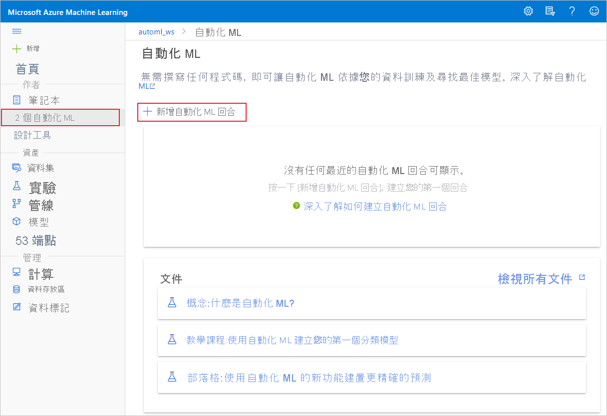
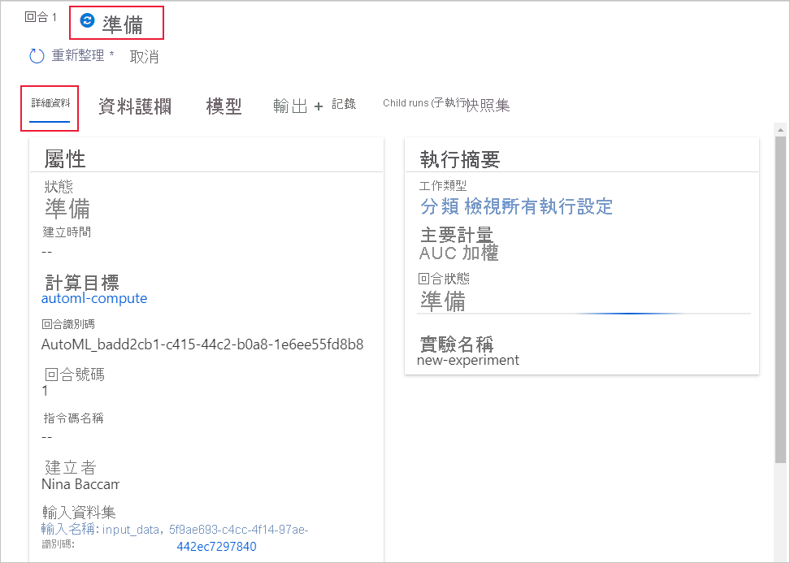

# <a name="create-review-and-deploy-automated-machine-learning-models-with-azure-machine-learning"></a>使用 Azure 機器學習建立、檢視並部署自動化機器學習模型
[!INCLUDE [applies-to-skus](../../includes/aml-applies-to-enterprise-sku.md)]

在本文中,您將瞭解如何在 Azure 機器學習的工作室界面中創建、探索和部署沒有單行代碼的自動機器學習模型。 自動機器學習是為您選擇用於特定數據的最佳機器學習演算法的過程。 此過程使您能夠快速生成機器學習模型。 [瞭解有關自動機器學習的更多。](concept-automated-ml.md)
 
對於端到端範例,請嘗試使用 Azure[機器學習的自動 ML 介面建立分類模型的教學](tutorial-first-experiment-automated-ml.md)。 

要取得 Python 代碼的體驗,請使用 Azure 機器學習 SDK[設定自動機器學習實驗](how-to-configure-auto-train.md)。

## <a name="prerequisites"></a>Prerequisites

* Azure 訂用帳戶。 如果您沒有 Azure 訂用帳戶，請在開始前先建立免費帳戶。 立即試用[免費或付費版本的 Azure Machine Learning](https://aka.ms/AMLFree)。

* 具有**企業版的**Azure 機器學習工作區。 請參閱[建立 Azure Machine Learning 工作區](how-to-manage-workspace.md)。  要將現有工作區升級到企業版,請參閱[升級到企業版](how-to-manage-workspace.md#upgrade)。

## <a name="get-started"></a>開始使用

1. 登入 Azure 機器學習https://ml.azure.com,在 。 

1. 選擇訂閱和工作區。 

1. 導航到左側窗格。 在 **「作者」** 部分下選擇**自動 ML。**

[](media/how-to-use-automated-ml-for-ml-models/nav-pane-expanded.png)

 如果這是您第一次進行任何實驗,您將看到一個空清單和指向文檔的連結。 

否則,您將看到最近自動機器學習實驗的清單,包括使用 SDK 創建的實驗。 

## <a name="create-and-run-experiment"></a>建立與執行實驗

1. 選擇 **= 新的自動 ML 執行**並填滿單表單。

1. 從存儲容器中選擇資料集,或創建新資料集。 數據集可以從本地檔案、Web URL、資料儲存或 Azure 打開數據集創建。 

    >[!Important]
    > 訓練資料要求:
    >* 數據必須以表格形式顯示。
    >* 要預測的值(目標列)必須存在於數據中。

    1. 要從本地電腦上的檔案建立新資料集,請選擇 **「瀏覽」,** 然後選擇該檔。 

    1. 為您的資料集提供唯一名稱，並提供選擇性的描述。 

    1. 選擇**下一步**以開啟**資料儲存與檔案選擇表單 。** 在此表單單,您可以選擇將資料集上載的位置;使用工作區自動建立的預設儲存容器,或選擇要用於實驗的儲存容器。 

    1. 查看 **「設定」和「預覽**」表單的準確性。 根據文件類型智慧填充表單。 

        欄位| 描述
        ----|----
        檔案格式| 定義檔案中所儲存資料的版面配置和類型。
        分隔符號| 一或多個字元，用來指定純文字或其他資料流程中個別獨立區域之間的界限。
        編碼| 識別要用來讀取資料集之字元結構描述資料表的位元。
        資料行標題| 指出資料集標題 (如果有的話) 的處理方式。
        Skip rows (略過資料列) | 指出資料集內略過多少資料列 (如果有的話)。
    
        選取 [下一步]  。

    1. **架構**表單**根據 「設定」和「預覽」** 窗體中的選擇進行智慧填充。 在此處配置每列的數據類型,查看列名稱,並選擇要未**包括**哪些列用於實驗。 
            
        選擇 **「下一步」。**

    1. **"確認詳細資訊**"窗體是"**基本資訊**"和 **"設置"和"預覽**表單"中以前填充的資訊的摘要。 您還可以選擇使用啟用分析的計算為資料集創建資料設定檔。 深入了解[資料分析](#profile)。

        選取 [下一步]  。
1. 顯示新創建的數據集后,選擇該數據集。 您還可以查看數據集和範例統計資訊的預覽。 

1. 在 **「設定執行**」窗體上,輸入唯一的實驗名稱。

1. 選擇目標列;這是您要對的列進行預測。

1. 為數據分析和培訓作業選擇計算。 現有計算的清單在下拉清單中可用。 要創建新計算,請按照步驟 7 中的說明進行操作。

1. 選擇 **「創建新計算**」 以為此實驗設定計算上下文。

    欄位|描述
    ---|---
    計算名稱| 輸入可識別您計算內容的唯一名稱。
    虛擬機器大小| 為您的計算選取虛擬機器大小。
    最小/最大節點數 (在 [進階設定] 中)| 若要分析資料，您必須指定一個或多個節點。 輸入計算的最大節點數。 默認值為 AML 計算的 6 個節點。
    
    選取 [建立]  。 創建新計算可能需要幾分鐘時間。

    >[!NOTE]
    > 計算名稱將指示您選擇的/建立的計算是否*啟用分析*。 (有關詳細資訊,請參閱部分[數據分析](#profile))。

    選取 [下一步]  。

1. 在**任務類型和設置**窗體上,選擇任務類型:分類、回歸或預測。 [有關詳細資訊,請參閱如何定義工作類型](how-to-define-task-type.md)。

    1. 對於分類,您還可以啟用用於文本壯舉的深度學習。

    1. 用於預測:
        1. 選擇時間列:此列包含要使用的時間數據。

        1. 選擇預測範圍:指示模型能夠預測未來的時間單位數(分鐘/小時/天/周/月/年)。 模型預測到未來越遠,其準確性就越低。 [瞭解更多關於預測和預測地平線](how-to-auto-train-forecast.md)。

1. ( 選擇性的 )查看添加配置設置:可用於更好地控制培訓作業的其他設置。 否則會根據實驗選取範圍和資料來套用預設值。 

    其他組態|描述
    ------|------
    主要計量| 用於對模型進行評分的主要指標。 [瞭解有關模型指標的更多](how-to-configure-auto-train.md#explore-model-metrics)。
    自動特製化| 選擇該選擇以啟用或禁用通過自動機器學習完成的預處理。 預處理包括自動資料清理、準備和轉換,以生成合成功能。 不支援時間序列預測任務類型。 [瞭解此預處理的更多](#featurization)。 
    解釋最佳模型 | 選擇以開啟或關閉以顯示最佳型號的可解釋性
    封鎖演演算法| 選擇要從培訓作業中排除的演演演算法。
    結束準則| 當滿足上述任何條件時,培訓作業將停止。 <br> *培訓作業時間(小時):* 允許培訓作業運行多長時間。 <br> *指標分數閾值*:所有管道的最低指標分數。 這可確保,如果您想要達到的已定義的目標指標,您不會在培訓作業上花費的時間超過必要的時間。
    驗證| 選擇要在培訓作業中使用的交叉驗證選項之一。 [瞭解有關交叉驗證的更多](how-to-configure-auto-train.md)。
    並行| *最大併發反覆運算*:要在培訓作業中測試的最大管道數(反覆運算)。 作業的運行次數不會超過指定的反覆運算次數。

1. ( 選擇性的 )查看壯舉設置:如果選擇在 **「其他設定設定**」窗體中啟用**自動壯舉**,則此窗體是指定要執行這些壯舉的列的位置,並選擇用於缺失值的統計資訊值。

<a name="profile"></a>

## <a name="data-profiling--summary-stats"></a>資料分析&摘要統計資訊

您可以在資料集中獲取各種摘要統計資訊,以驗證數據集是否已就緒。 對於非數位列,它們僅包括基本統計資訊,如最小、最大值和錯誤計數。 對於數位列,您還可以查看其統計時刻和估計的量化。 具體來說,我們的數據配置檔包括:

>[!NOTE]
> 對於類型不相關的要素,將顯示空白條目。

統計資料|描述
------|------
功能| 正在匯總的列的名稱。
設定檔| 基於推斷類型進行內聯可視化。 例如,字串、布爾和日期將具有值計數,而小數(數位)具有近似直方圖。 這使您能夠快速了解數據的分佈情況。
類型分配| 列中類型的內聯值計數。 null 是它們自己的類型,因此此可視化效果可用於檢測奇數值或缺失值。
類型|列的推斷類型。 可能的值包括:字串、布爾、日期和十進位。
最小值| 列的最小值。 對於類型沒有固有順序(例如布林斯)的要素,將顯示空白條目。
最大值| 列的最大值。 
Count| 列中缺少的條目和非缺失條目的總數。
未遺漏計數| 列中未缺少的條目數。 空字串和錯誤被視為值,因此它們不會導致"不漏計數"。
Quantiles| 每個分位數的近似值,以提供數據分佈的感知。
平均值| 列的算術平均值或平均值。
標準差| 測量此列數據的分散量或變化量。
Variance| 衡量此列數據與其平均值的分佈距離。 
偏度| 衡量此列的數據與正態分佈的不同程度。
峰度| 測量與正態分佈相比,此列數據的跟蹤程度。

<a name="featurization"></a>

## <a name="advanced-featurization-options"></a>進階壯舉選項

自動機器學習自動提供預處理和數據保護,以説明您識別和管理數據的潛在問題。 

### <a name="preprocessing"></a>前置處理

> [!NOTE]
> 如果您計劃將自動 ML 創建的模型匯出到[ONNX 型號](concept-onnx.md),則僅支援 ONNX 格式中帶有 * 的奇才化選項。 瞭解有關[將模型轉換為 ONNX](concept-automated-ml.md#use-with-onnx)的更多資訊。 

|預處理&nbsp;步驟| 描述 |
| ------------- | ------------- |
|刪除高基數或無方差特徵* |從訓練和驗證集中刪除這些值,包括缺少所有值、所有行中的值相同或基數極高(例如,哈希、I 或 GUID)。|
|已歸名缺失值* |對於數值要素,用列中值的平均值進行歸因。<br/><br/>對於分類要素,具有最頻繁的值。|
|產生其他功能* |對於 DateTime 功能:年、月、日、星期一、一年中的一天、季度、一年中的一周、小時、分鐘、秒。<br/><br/>對於文本功能:基於單格、雙克和三字元克的術語頻率。|
|轉換和編碼 ||具有很少唯一值的數位要素將轉換為分類要素。<br/><br/>為低基數分類執行一熱編碼;對於高基數,一熱哈希編碼。|
|單字嵌入|使用預先訓練的模型將文本標記的向量轉換為句子向量的文本計算機。 每個單詞在文檔中的嵌入向量聚合在一起以生成文檔要素向量。|
|目標編碼|對於分類要素,使用回歸問題的平均目標值映射每個類別,以及分類問題的每個類的類概率。 應用基於頻率的加權和 k 折交叉驗證來減少稀疏數據類別導致的映射過度擬合和雜訊。|
|文字目標編碼|對於文本輸入,使用帶有單詞袋的堆疊線性模型來生成每個類的概率。|
|證據重量(WoE)|將 WoE 計算為分類列與目標列相關性的度量。 計算為類內概率與類外概率比率的日誌。 此步驟每類輸出一個數位要素列,無需顯式估計缺失值和異常值處理。|
|叢集距離|在所有數位列上訓練 k-表示聚類模型。  輸出 k 新功能,每個群集一個新的數值要素,包含每個樣本到每個群集的質心的距離。|

### <a name="data-guardrails"></a>資料護欄

啟用自動壯舉或將驗證設置為自動驗證時,將應用數據保護程式。數據保護欄可説明您識別數據的潛在問題(例如缺少值、類不平衡),並幫助採取糾正措施以改進結果。 

用戶可以在自動 ML 運行**的數據護欄**選項卡中查看演播室中的資料護欄,或者在使用 Python SDK```show_output=True```提交實驗時設定數據護欄。 

#### <a name="data-guardrail-states"></a>資料保護軌狀態

資料保護列將顯示三種狀態之一:**已透過**、**完成**或**警示**。

State| 描述
----|----
已通過| 未檢測到數據問題,也不需要使用者操作。 
完成| 更改已應用於您的數據。 我們鼓勵使用者查看自動 ML 採取的糾正措施,以確保更改與預期結果保持一致。 
提醒| 檢測到無法補救的數據問題。 我們鼓勵使用者修改和修復該問題。 

>[!NOTE]
> 早期版本的自動 ML 實驗顯示第四種狀態:**固定**。 較新的實驗將不會顯示此狀態,並且顯示 **「固定**」狀態的所有護欄現在都將顯示 **「完成**」。   

下表描述了當前支持的數據護欄,以及使用者在提交實驗時可能會遇到的關聯狀態。

護欄|狀態|觸發&nbsp;條件&nbsp;
---|---|---
缺少歸因要素值 |**已通過** <br><br><br> **完成**| 在訓練數據中未檢測到缺少的要素值。 瞭解有關[缺少值歸因](https://docs.microsoft.com/azure/machine-learning/how-to-use-automated-ml-for-ml-models#advanced-featurization-options)的更多資訊。 <br><br> 在訓練資料中偵測到缺少特徵值並歸為
高基數特徵處理 |**已通過** <br><br><br> **完成**| 對輸入進行了分析,未檢測到高基數特徵。 瞭解有關[高基數特徵檢測](https://docs.microsoft.com/azure/machine-learning/how-to-use-automated-ml-for-ml-models#advanced-featurization-options)的更多詳細資訊。 <br><br> 在輸入中檢測到高基數特徵並處理。
驗證分割處理 |**完成**| *驗證配置設置為"自動",訓練數據包含**少於**20,000 行。* <br> 通過交叉驗證驗證了訓練模型的每個反覆運算。 瞭解有關[驗證數據的更多詳細資訊。](https://docs.microsoft.com/azure/machine-learning/how-to-configure-auto-train#train-and-validation-data) <br><br> *驗證配置設置為"自動",訓練數據包含 20,000**多**行。* <br> 輸入數據已拆分為訓練數據集和驗證數據集,用於驗證模型。
類平衡檢測 |**已通過** <br><br><br><br> **提醒** | 您的輸入已分析,所有課程在培訓數據中處於平衡。 如果每個類在數據集中具有良好的表示形式(以樣本的數量和比率來衡量),則數據集被視為平衡數據集。 <br><br><br> 在輸入中檢測到不平衡類。 要修復模型偏差,修復平衡問題。 瞭解有關[不平衡數據的更多。](https://docs.microsoft.com/azure/machine-learning/concept-manage-ml-pitfalls#identify-models-with-imbalanced-data)
記憶體問題偵測 |**已通過** <br><br><br><br> **完成** |<br> 分析了選定的[視界、滯後、滾動視窗]值,未檢測到潛在的記憶體不足問題。 瞭解有關時間序列[預測配置](https://docs.microsoft.com/azure/machine-learning/how-to-auto-train-forecast#configure-and-run-experiment)的更多資訊。 <br><br><br>已分析選定的[視界、延遲、滾動視窗]值,並可能導致實驗記憶體不足。 已關閉延遲或滾動視窗配置。
頻率偵測 |**已通過** <br><br><br><br> **完成** |<br> 分析了時間序列,所有數據點與檢測到的頻率對齊。 <br> <br> 分析了時間序列,並檢測到與檢測到的頻率不一致的數據點。 這些數據點從資料集中刪除。 詳細瞭解[時間序列預測的數據準備。](https://docs.microsoft.com/azure/machine-learning/how-to-auto-train-forecast#preparing-data)

## <a name="run-experiment-and-view-results"></a>執行實驗並檢視結果

選擇 **「完成」** 以執行實驗。 實驗準備流程最多需要 10 分鐘。 訓練作業可能需要額外 2-3 分鐘不等，才能讓每個管線完成執行。

### <a name="view-experiment-details"></a>檢視實驗詳細資料

執行**詳細資訊**「螢幕將開啟到」**詳細資訊選項**卡。此屏幕顯示實驗運行的摘要,包括運行編號旁邊的頂部的狀態列。 

[模型]**** 索引標籤包含依計量分數所建立的模型清單。 依預設，根據所選計量評分最高的模型會出現在清單頂端。 如果訓練作業嘗試多個模型，系統會將所有結果新增到清單中。 使用此方式快速比較到目前為止所產生的各個模型計量。

[](media/how-to-use-automated-ml-for-ml-models/run-details-expanded.png#lightbox)

### <a name="view-training-run-details"></a>檢視培訓執行詳細資訊

向下鑽取任何已完成的模型以檢視訓練執行詳細資訊,例如 **「模型詳細資訊**」選項卡上的跑步指標或**視覺化**選項卡上的效能圖表。[詳細瞭解圖表](how-to-understand-automated-ml.md)。

[](media/how-to-use-automated-ml-for-ml-models/iteration-details-expanded.png)

## <a name="deploy-your-model"></a>部署模型

一旦您擁有了最佳模型,就該將其部署為 Web 服務以預測新數據。

自動 ML 可協助您部署模型,而無需編寫程式碼:

1. 有幾個部署選項。 

    + 選項 1:要部署最佳模型(根據定義的指標條件),請在「**詳細資訊」** 選項卡上選擇 **「部署最佳模型**」按鈕。

    + 選項 2:要部署此實驗中的特定模型反覆運算,請向下鑽取模型以打開其**模型詳細資訊**選項卡,然後選擇 **「部署模型**」。

1. 填充 **「部署」模型**窗格。

    欄位| 值
    ----|----
    名稱| 輸入部署的唯一名稱。
    描述| 輸入說明以更好地標識此部署的用點。
    計算類型| 選擇要部署的終結點類型 *:Azure 庫伯奈斯服務 (AKS)* 或*Azure 容器實例 (ACI)。*
    計算名稱| *只適用於 AKS:* 選擇要部署到的 AKS 群集的名稱。
    啟用驗證 | 選擇以允許基於權杖或基於金鑰的身份驗證。
    使用自訂部署資產| 如果要上傳自己的評分腳本和環境檔,請啟用此功能。 [瞭解此選項的詳情的詳情](how-to-deploy-and-where.md#script)。

    >[!Important]
    > 檔名必須低於 32 個字元,並且必須以字母數位開始和結束。 可能包括短劃線、下劃線、點和介於之間的字母數位。 不允許空格。

    *"進階"* 選單提供預設部署功能,如[資料收集](how-to-enable-app-insights.md)和資源利用率設定。 如果要重寫這些預設值,可以在此功能表中執行此操作。

1. 選取 [部署]  。 部署可能需要大約 20 分鐘才能完成。

現在,您有一個可操作的 Web 服務來生成預測! 您可以通過從[Power BI 內置的 Azure 機器學習支援](how-to-consume-web-service.md#consume-the-service-from-power-bi)中查詢服務來測試預測。

## <a name="next-steps"></a>後續步驟

* [瞭解如何使用 Web 服務](https://docs.microsoft.com/azure/machine-learning/how-to-consume-web-service)。
* [瞭解自動機器學習結果](how-to-understand-automated-ml.md)。
* [瞭解有關自動機器學習](concept-automated-ml.md)和 Azure 機器學習的更多詳細資訊。
