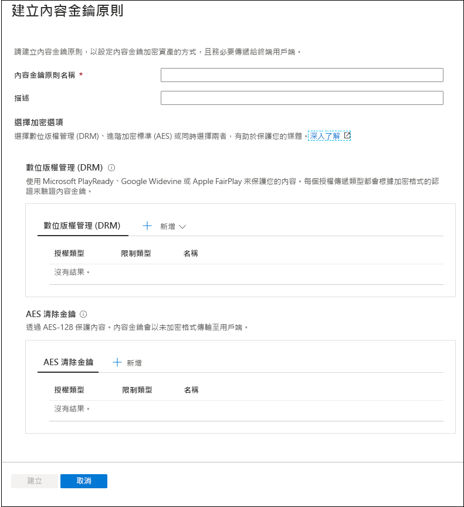
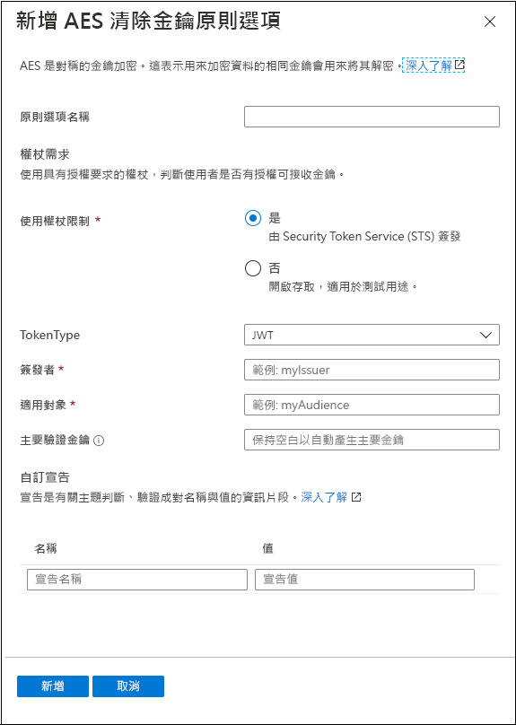
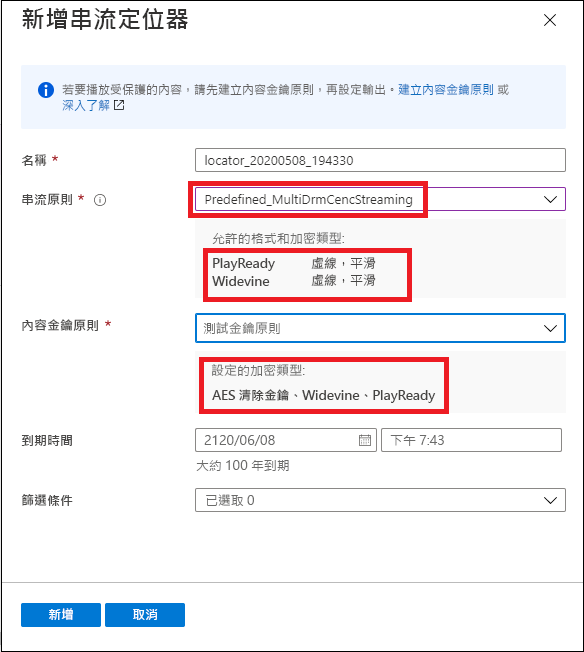

# 快速入門：使用入口網站加密內容

[!INCLUDE [media services api v3 logo](./includes/v3-hr.md)]

使用 Azure 媒體服務來協助保護媒體從離開電腦到進行儲存、處理和傳遞時的安全。 使用媒體服務，您就能傳遞利用進階加密標準 (AES-128) 或下列三個主要數位版權管理 (DRM) 系統中任一個所動態加密的即時與隨選內容：Microsoft PlayReady、Google Widevine 和 Apple FairPlay。 媒體服務也提供服務，可傳遞 AES 金鑰和 DRM (PlayReady、Widevine 和 FairPlay) 授權給授權用戶端。 
 
若要在您的串流上指定加密選項，請使用**串流原則**，並將其與您的串流定位器產生關聯。 您會建立**內容金鑰原則**，設定內容金鑰 (提供**資產**的安全存取) 如何傳遞給終端用戶端。 您需要在內容金鑰原則上設定需求 (限制)，而且必須符合這些需求 (限制)，具有指定組態的金鑰才能傳遞給用戶端。 

> [!NOTE]
> 清除串流或下載時不需要內容金鑰原則。

播放程式要求串流時，媒體服務便會使用 AES 清除金鑰或 DRM 加密，使用指定的金鑰動態加密您的內容。 為了將串流解密，播放程式會向媒體服務金鑰傳遞服務或您指定的金鑰傳遞服務要求金鑰。 為了決定使用者是否有權取得金鑰，服務會評估您為金鑰指定的**內容金鑰原則**。

本快速入門說明如何建立內容金鑰原則，在這裡您會指定哪個加密應在串流您的資產時套用至該資產。 快速入門也會說明如何在您的資產上設定已設定的加密。

### 建議的閱讀準備事項

* [動態加密和金鑰傳遞](content-protection-overview.md)
* [串流定位器](streaming-locators-concept.md)
* [串流原則](streaming-policy-concept.md)
* [內容金鑰原則](content-key-policy-concept.md)

## 必要條件

上傳及處理您的內容，如[管理 Azure 入口網站中的資產](manage-assets-quickstart.md)中所述

## 建立內容金鑰原則

建立**內容金鑰原則**，設定內容金鑰 (提供**資產**的安全存取) 如何傳遞給終端用戶端。

1. 登入 [Azure 入口網站](https://portal.azure.com/)。
1. 找出並按一下您的媒體服務帳戶。
1. 選取 [內容金鑰原則 (新增)]。
1. 在視窗頂端，按下 [+ 新增內容金鑰原則]。 

[建立內容金鑰原則] 視窗隨即出現。 在此視窗中，您可以選擇加密選項。 您可以選擇數位版權管理 (DRM)、進階加密標準 (AES) 或同時選擇兩者，來保護您的媒體。  

無論您選擇的是 DRM 選項還是 AES-128 清除金鑰選項，都建議您指定您想要設定限制的方式。 您可以選擇具有開放或權杖限制。 如需詳細說明，請參閱[控制內容存取](content-protection-overview.md#controlling-content-access)。

### 新增 DRM 內容金鑰

您可以選擇使用 Microsoft PlayReady 和/或 Google Widevine 或 Apple FairPlay 來保護您的內容。 每個授權傳遞類型都會根據加密格式的認證來驗證內容金鑰。

#### 回應範本

如需授權範本的詳細資料，請參閱：

* [Google Widevine 授權範本](widevine-license-template-overview.md)

    > [!NOTE]
    > 您可以建立不含任何值的空白授權範本，也就是 "{}"。 授權範本會以預設值建立。 大部分案例的預設工作。
* [Apple FairPlay 授權需求和設定](fairplay-license-overview.md)
* [PlayReady 授權範本](playready-license-template-overview.md)

### 新增 AES 清除金鑰

您也可以將 AES-128 清除金鑰加密新增至您的內容。 內容金鑰會以未加密格式傳輸至用戶端。

## 為您的資產建立串流定位器

1. 找出並按一下您的媒體服務帳戶。
1. 選取 [資產 (新增)]。
1. 從資產清單中，選取您想要加密的資產。  
1. 在所選取資產的 [串流定位器] 區段中，按下 [+ 新增串流定位器]。 
1. 選取**串流原則**，其適用於您已設定的**內容金鑰原則**。

    [串流原則](streaming-policy-concept.md)主題詳述哪個串流原則符合哪個內容金鑰原則。
1. 一旦選取了適當的串流原則，您就可以從下拉式清單中選取內容金鑰原則。
1. 按下 [新增]，將串流定位器新增至您的資產。

    這會發佈資產並產生串流 URL。

## 清除資源

如果您想要嘗試其他快速入門，應該保留所建立的資源。 否則，請移至 Azure 入口網站，瀏覽至您的資源群組並選取您執行本快速入門所用的資源群組，然後刪除所有資源。

## 後續步驟

[管理資產](manage-assets-quickstart.md)
