# 使用入口網站和 Wirecast 建立 Azure 媒體服務即時串流

本使用者入門指南假設您有 Azure 訂用帳戶，並已建立 Azure 媒體服務帳戶。

如果您沒有 Azure 訂用帳戶，請在開始前建立[免費帳戶](https://azure.microsoft.com/free/)。

## 登入 Azure 入口網站

開啟 Web 瀏覽器並瀏覽至 [Microsoft Azure 入口網站](https://portal.azure.com/)。 輸入您的認證來登入此入口網站。 預設檢視是您的服務儀表板。

在本快速入門中，我們將討論：

- 使用 Telestream Wirecast 的免費試用版來設定內部部署編碼器
- 設定即時串流
- 設定即時串流輸出
- 執行預設串流端點
- 使用 Azure 媒體播放器來檢視即時串流和隨選輸出

為了簡單起見，我們將針對 Wirecast 中的 Azure 媒體服務使用編碼預設值，包括傳遞雲端編碼和 RTMP。

## 使用 Wirecast 設定內部部署編碼器

1. 請下載並安裝適用於您作業系統的 Wirecast： https://www.telestream.net
1. 啟動應用程式，並使用您最愛的電子郵件地址來註冊產品。  讓應用程式保持開啟狀態。
1. 您會收到一封電子郵件，要求您驗證電子郵件地址，然後應用程式會開始免費試用。
1. 建議︰觀賞應用程式開啟畫面中的影片教學課程。

## 設定 Azure Media Services 即時串流

1. 在入口網站中瀏覽至 Azure 媒體服務帳戶後，請從媒體服務清單中選取 [即時串流]  。 
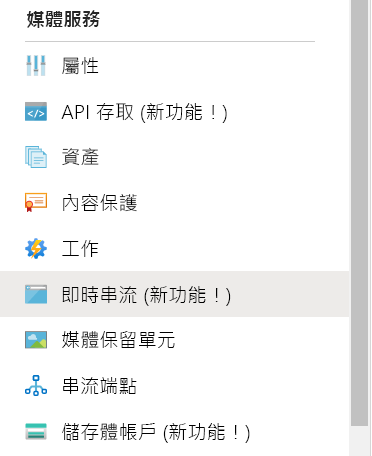 
1. 按一下 [新增即時活動]  ，以建立新的即時串流活動。 
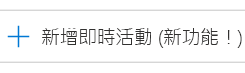 
1. 在即時活動的 [名稱]  欄位中，輸入新活動的名稱，例如 *TestLiveEvent*。 
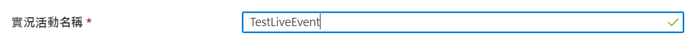 
1. 您可以選擇在**描述**欄位中輸入活動描述。
1. 選取 [傳遞 - 沒有雲端編碼]  選項按鈕。 
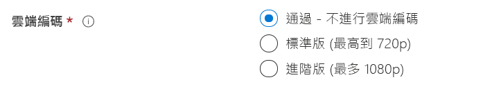
1. 選取 [RTMP]  選項按鈕。
1. 請確定已選取開始即時活動的 [否]  選項按鈕，避免系統在即時活動準備就緒之前計費。  (啟動即時活動之後就會開始計費。) 
1. 按一下 [檢閱 + 建立]  按鈕以檢閱設定。
1. 按一下 [建立]  按鈕以建立即時活動。 您接著會回到即時活動清單檢視。
1. 按一下**即時活動連結**，前往您剛建立的即時活動。 請注意，您的活動已停止。
1. 將在瀏覽器中將此頁面狀態保持為開啟。  我們稍後會再到這裡。

## 使用 Wirecast Studio 設定即時串流

1. 假設您的 Wirecast 應用程式仍然保持開啟，請從主功能表選取 [建立空白文件]  ，然後按一下 [繼續]  。
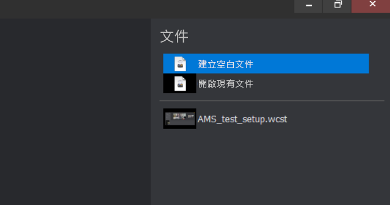
1. 將滑鼠停留在 Wirecast 圖層區域中的第一個圖層。  按一下顯示的 [新增]  圖示，然後選取您要串流的影片輸入。  [主要圖層 1] 對話方塊隨即開啟。 
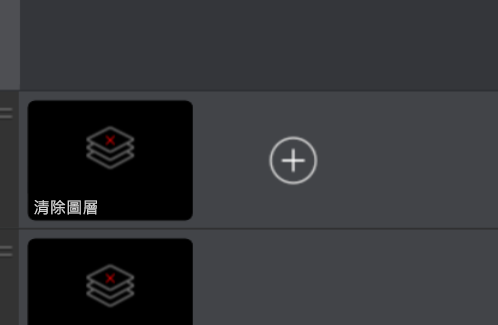
1. 從功能表中選取 [影片擷取]  ，然後選取您要使用的相機。 若選取相機，相機中的檢視就會顯示在預覽區域中。

1. 將滑鼠停留在 Wirecast 圖層區域中的第二個圖層。 按一下顯示的 [新增]  圖示，然後選取您要串流的音訊輸入。  [主要圖層 2] 對話方塊隨即開啟。
1. 從功能表中選取 [音訊擷取]  ，然後選取您要使用的音訊輸入。

1. 從主功能表中，選取 [輸出設定]  。  [輸出] 對話方塊隨即顯示。
1. 從 [輸出] 下拉式清單中選取 [Azure 媒體服務]  。  Azure 媒體服務的輸出設定會自動填入*大部分的*輸出設定。 
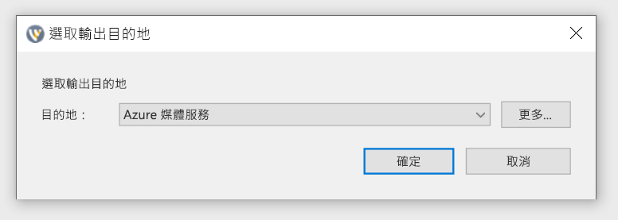
1. 在下一節中，您將回到瀏覽器中的 Azure 媒體服務，複製*輸入 URL* 以在輸出設定中輸入該值。

### 複製並貼上輸入 URL

1. 回到入口網站的 Azure 媒體服務頁面，按一下 [開始]  來啟動即時串流活動。 (此時會開始計費。) 
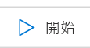
2. 按一下 [安全/不安全]  進行切換，將其設定為**不安全**。  如此會將通訊協定設定為 RTMP，而不是 RTMPS。
3. 將**輸入 URL** 複製到剪貼簿。
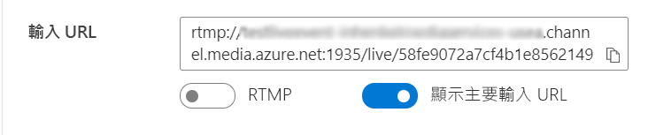
4. 切換至 Wirecast 應用程式，並將**輸入 URL** 貼到輸出設定的 [位址]  欄位中。 
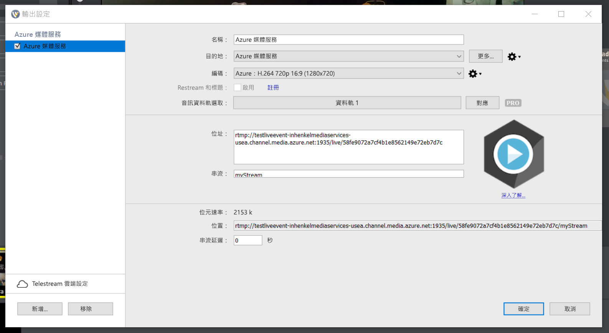
5. 按一下 [確定]  。

## 設定輸出

此部分會設定您的輸出，並可讓您儲存即時串流的記錄。  

> [!NOTE]
> 為了串流此輸出，串流端點必須正在執行。  請參閱下方的執行預設串流端點一節。

1. 按一下輸出影片檢視器下方的 [建立輸出]  連結。
1. 您也可以在 [名稱]  欄位中編輯輸出的名稱，讓使用者更容易了解，以便稍後能輕鬆找到。
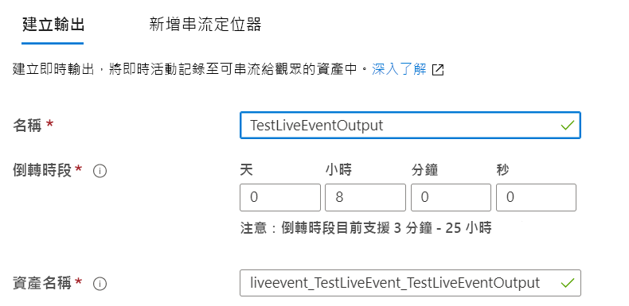
1. 目前請先讓其餘所有欄位保持原狀。
1. 按一下 [下一步]  以新增串流定位器。
1. 如有需要，請變更定位器的名稱，讓使用者更容易了解。
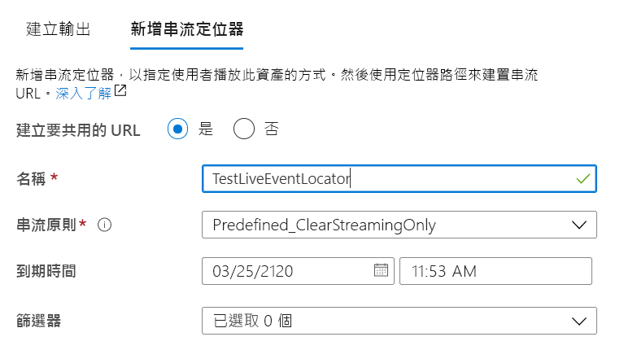
1. 目前請讓此畫面上的所有其他項目保持原狀。
1. 按一下頁面底部的 [新增]  。

## 開始直播

1. 在 Wirecast 中，選取 [輸出 > 開始/停止直播 > 開始 Azure 媒體服務：  Azure 媒體服務]，您可在主功能表中找到這些選項。  當串流傳送至即時活動時，Wirecast 中的 [即時] 視窗會顯示在 Azure 媒體服務中即時活動頁面的即時活動影片播放機中。

   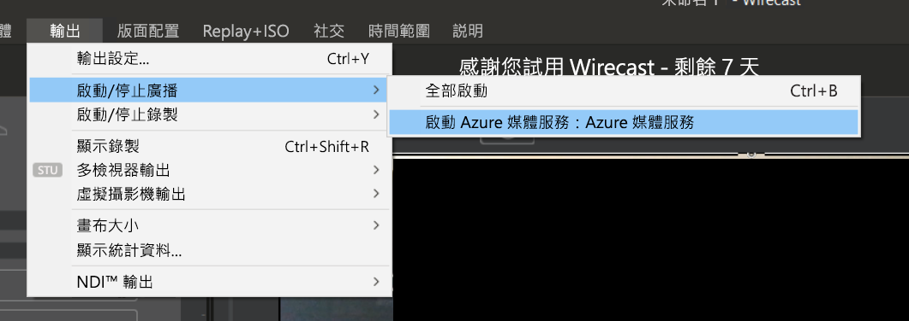

1. 按一下 [預覽] 視窗下的 [開始]  按鈕，開始直播您為 Wirecast 圖層選取的影片和音訊。

   

   > [!TIP]
   > 如果發生錯誤，請按一下播放機上方的 [重新載入播放機] 連結，嘗試重新載入播放機。

## 執行預設串流端點

1. 選取媒體服務清單中的 [串流端點]  ，以確定您的串流端點正在執行。 您將會進入 [串流端點] 頁面。 
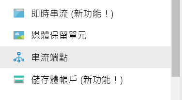
1. 如果預設的串流端點狀態為已停止，請按一下 [預設]  串流端點。 這會帶您前往該端點的頁面。
1. 按一下 [啟動]  。  這會啟動串流端點。 

## 使用 Azure 媒體播放器播放輸出直播

1. 複製輸出影片播放機下的**串流 URL**。
1. 在網頁瀏覽器中，開啟示範的 Azure 媒體播放器 https://ampdemo.azureedge.net/azuremediaplayer.html
1. 將**串流 URL** 貼到 Azure 媒體播放器的 URL 欄位中。
1. 按一下 [更新播放機]  按鈕。
1. 按一下影片上的 [播放]  圖示，以查看您的即時串流。

## 停止直播

當您認為已經串流足夠的內容時，請停止直播。

1. 在 Wirecast 中，按一下 [直播]  按鈕。  這會停止來自 Wirecast 的直播。
1. 在入口網站中，按一下 [停止]  。 您會收到一則警告訊息，指出即時串流已停止，但輸出現在會成為隨選資產。
1. 按一下警告訊息中的 [停止]  。 Azure 媒體播放器現在也會顯示錯誤，因為無法再使用即時串流。

## 以 Azure 媒體播放器播放隨選輸出

只要您的串流端點持續執行，您建立的輸出目前就可供隨選串流處理。

1. 瀏覽至媒體服務清單，然後選取 [資產]  。
1. 尋找您稍早建立的活動輸出，然後按一下**資產的連結**。 [資產輸出] 頁面隨即開啟。
1. 複製影片播放機下資產的**串流 URL**。
1. 返回瀏覽器中的 Azure 媒體播放器，並將**串流 URL** 貼至 Azure 媒體播放器的 URL 欄位中。
1. 按一下 [更新播放機]  。
1. 按一下影片上的 [播放]  圖示，以查看隨選資產。

## 清除資源

> [!IMPORTANT]
> 停止服務！ 當您完成本快速入門中的步驟後，請務必停止即時活動和串流端點，否則系統會繼續以持續執行的時間計費。 要停止即時活動，請參閱上述「停止直播」中的步驟 2 和 3。

### 停止串流端點

1. 從媒體服務清單中，選取 [串流端點]  。
2. 按一下您稍早啟動的**預設**串流端點。 這會開啟端點的頁面。
3. 按一下 [停止]  。  這會停止串流端點。

> [!TIP]
> 如果您不想保留此活動的資產，請務必將其刪除，以防止系統對儲存體計費。

## 後續步驟
> [!div class="nextstepaction"]
> [下一篇文章是什麼](./live-events-outputs-concept.md)
