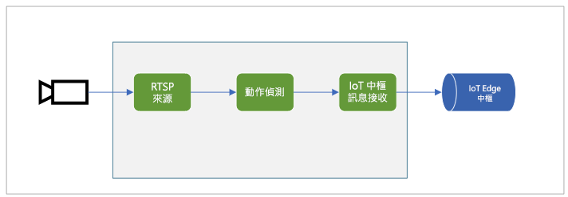
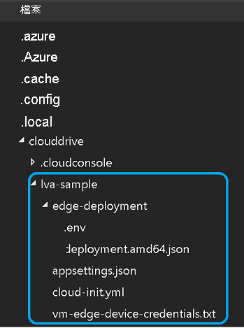
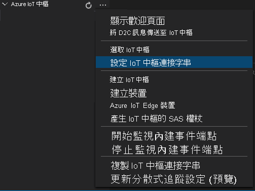
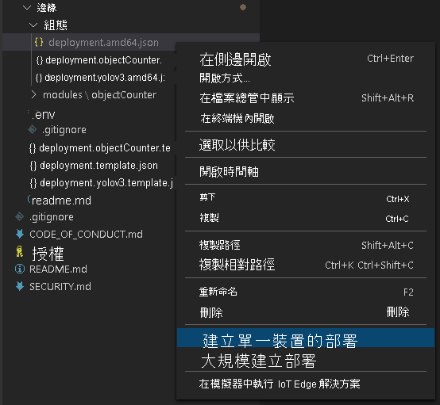

# <a name="quickstart-detect-motion-and-emit-events"></a>快速入門：偵測動作並發出事件

本快速入門會逐步引導您完成在 IoT Edge 上開始使用 Live Video Analytics 的步驟。 這裡使用 Azure VM 作為 IoT Edge 裝置，以及模擬的即時影片串流。 完成設定步驟之後，您將能夠透過媒體圖表執行模擬的即時影片串流，以偵測並報告該串流中的任何動作。 下圖顯示該媒體圖表的圖表表示。

 

本文是以利用 C# 撰寫的[範例程式碼](https://github.com/Azure-Samples/live-video-analytics-iot-edge-csharp)為基礎。

## <a name="prerequisites"></a>必要條件

* 具有有效訂用帳戶的 Azure 帳戶。 如果您還未擁有帳戶，請[建立免費帳戶](https://azure.microsoft.com/free/?WT.mc_id=A261C142F)。
* 具有下列擴充功能的 [Visual Studio Code](https://code.visualstudio.com/) \(英文\)：
    * [Azure IoT 工具組](https://marketplace.visualstudio.com/items?itemName=vsciot-vscode.azure-iot-tools)
    * [C#](https://marketplace.visualstudio.com/items?itemName=ms-dotnettools.csharp)
* [.NET Core 3.1 SDK](https://dotnet.microsoft.com/download/dotnet-core/3.1)。 

> [!TIP]
> 安裝 Azure IoT Tools 擴充功能時，系統可能會提示您安裝 Docker。 您可以忽略提示。

## <a name="set-up-azure-resources"></a>設定 Azure 資源

本教學課程需要下列 Azure 資源：

* IoT 中樞
* 儲存體帳戶
* Azure 媒體服務帳戶
* Azure 中的 Linux VM，已安裝 [IoT Edge 執行階段](https://docs.microsoft.com/azure/iot-edge/how-to-install-iot-edge-linux)

在本快速入門中，我們建議您使用 [Live Video Analytics 資源設定指令碼](https://github.com/Azure/live-video-analytics/tree/master/edge/setup)，在您的 Azure 訂用帳戶中部署所需的資源。 若要這樣做，請依照下列步驟執行：

1. 開啟 [Azure Cloud Shell](https://shell.azure.com)。
1. 如果您第一次使用 Cloud Shell，系統會提示您選取用來建立儲存體帳戶和 Microsoft Azure 檔案共用的訂用帳戶。 選取 [建立儲存體]，以建立可供儲存 Cloud Shell 工作階段資訊的儲存體帳戶。 此儲存體帳戶與指令碼將建立來搭配您 Azure 媒體服務帳戶使用的帳戶不同。
1. 在 Cloud Shell 視窗左側的下拉式功能表中，選取 [Bash] 作為您的環境。

    

1. 執行下列命令。

    ```
    bash -c "$(curl -sL https://aka.ms/lva-edge/setup-resources-for-samples)"
    ```

    如果指令碼成功完成，您應該會在訂用帳戶中看到所有所需資源。

1. 在指令碼完成後，選取大括弧以公開資料夾結構。 您會在 *~/clouddrive/lva-sample* 目錄下看到一些檔案。 與本快速入門相關的項目包括：

     * ***~/clouddrive/lva-sample/edge-deployment/.env*** - 此檔案包含 Visual Studio Code 用來將模組部署至邊緣裝置的屬性。
     * ***~/clouddrive/lva-sample/appsetting.json*** - Visual Studio Code 會使用此檔案來執行範例程式碼。
     
在下一節的 Visual Studio Code 中設定開發環境時，您將需要這些檔案。 目前，您可以將這些檔案複製到本機檔案。

 

## <a name="set-up-your-development-environment"></a>設定開發環境

1. 從這個位置複製存放庫： https://github.com/Azure-Samples/live-video-analytics-iot-edge-csharp 。
1. 在 Visual Studio Code 中，開啟存放庫下載所在的資料夾。
1. 在 Visual Studio Code 中，移至 *src/cloud-to-device-console-app* 資料夾。 在其中建立一個檔案，並將其命名為 *appsettings.json*。 此檔案將包含執行程式所需的設定。
1. 從您稍早在本快速入門中產生的 *~/clouddrive/lva-sample/appsettings.json* 檔案複製內容。

    文字看起來應該會像下列輸出。

    ```
    {  
        "IoThubConnectionString" : "HostName=xxx.azure-devices.net;SharedAccessKeyName=iothubowner;SharedAccessKey=XXX",  
        "deviceId" : "lva-sample-device",  
        "moduleId" : "lvaEdge"  
    }
    ```
1. 移至 *src/edge* 資料夾，並建立名為 *.env* 的檔案。
1. 複製 */clouddrive/lva-sample/edge-deployment/.env* 檔案的內容。 文字看起來應該會像下列程式碼。

    ```
    SUBSCRIPTION_ID="<Subscription ID>"  
    RESOURCE_GROUP="<Resource Group>"  
    AMS_ACCOUNT="<AMS Account ID>"  
    IOTHUB_CONNECTION_STRING="HostName=xxx.azure-devices.net;SharedAccessKeyName=iothubowner;SharedAccessKey=xxx"  
    AAD_TENANT_ID="<AAD Tenant ID>"  
    AAD_SERVICE_PRINCIPAL_ID="<AAD SERVICE_PRINCIPAL ID>"  
    AAD_SERVICE_PRINCIPAL_SECRET="<AAD SERVICE_PRINCIPAL ID>"  
    INPUT_VIDEO_FOLDER_ON_DEVICE="/home/lvaadmin/samples/input"  
    OUTPUT_VIDEO_FOLDER_ON_DEVICE="/home/lvaadmin/samples/input"
    APPDATA_FOLDER_ON_DEVICE="/var/local/mediaservices"
    CONTAINER_REGISTRY_USERNAME_myacr="<your container registry username>"  
    CONTAINER_REGISTRY_PASSWORD_myacr="<your container registry username>"      
    ```

## <a name="examine-the-sample-files"></a>檢查範例檔案

1. 在 Visual Studio Code 中，移至 *src/edge*。 您會看到 *.env* 檔案和一些部署範本檔案。

    部署範本會參照邊緣裝置的部署資訊清單，其中會使用變數來代表某些屬性。 *.env* 檔案包含這些變數的值。
1. 移至 *src/cloud-to-device-console-app* 資料夾。 在這裡，您會看到 *appsettings.json* 檔案和其他幾個檔案：

    * ***c2d-console-app.csproj*** - Visual Studio Code 的專案檔。
    * ***operations.json*** - 您想要讓程式執行的作業清單。
    * ***Program.cs*** - 範例程式碼。 此程式碼：
    
      * 載入應用程式設定。
      * 叫用 IoT Edge 模組上 Live Video Analytics 所公開的直接方法。 您可以使用模組，藉由叫用其[直接方法](direct-methods.md)來分析即時影片串流。
      * 會暫停，讓您可以在 [終端機] 視窗中檢查程式的輸出，並在 [輸出] 視窗中檢查模組所產生的事件。
      * 叫用直接方法來清除資源。   

## <a name="generate-and-deploy-the-deployment-manifest"></a>產生和部署部署資訊清單

部署資訊清單會定義要將哪些模組部署至邊緣裝置。 其也會定義這些模組的組態設定。 

請遵循下列步驟，從範本檔案產生資訊清單，然後將其部署到邊緣裝置。

1. 開啟 Visual Studio Code。
1. 在 [Azure IoT 中樞] 窗格旁，選取 [其他動作] 圖示，以設定 IoT 中樞的連接字串。 您可以從 *src/cloud-to-device-console-app/appsettings.json* 檔案複製字串。 

    

1. 以滑鼠右鍵按一下 **src/edge/deployment.template.json**，然後選取 [產生 IoT Edge 部署資訊清單]。

    

    此動作應該會在 *src/edge/config* 資料夾中，建立名為 *deployment.amd64.json* 的資訊清單檔。
1. 以滑鼠右鍵按一下 **src/edge/config/deployment.amd64.json**、選取 [建立單一裝置的部署]，然後選取您的邊緣裝置名稱。

    

1. 當系統提示您選取 IoT 中樞裝置時，請從下拉式功能表中選擇 [lva-sample-device]。
1. 大約 30 秒之後，請在視窗左下角重新整理 Azure IoT 中樞。 邊緣裝置現在會顯示下列已部署的模組：

    * IoT Edge 上的 Live Video Analytics (模組名稱 `lvaEdge`)
    * 即時串流通訊協定 (RTSP) 模擬器 (模組名稱 `rtspsim`)

RTSP 模擬器模組會在您執行 [Live Video Analytics 資源設定指令碼](https://github.com/Azure/live-video-analytics/tree/master/edge/setup)時，使用複製到您邊緣裝置的影片檔案來模擬即時影片串流。 

在這個階段，模組已完成部署，但沒有任何媒體圖表處於作用中狀態。

## <a name="prepare-to-monitor-events"></a>準備監視事件

您將會在 IoT Edge 模組上使用 Live Video Analytics，以偵測傳入即時影片串流中的動作，並將事件傳送至 IoT 中樞。 若要查看這些事件，請遵循下列步驟：

1. 在 Visual Studio Code 中開啟 [檔案總管] 窗格，然後在左下角尋找 Azure IoT 中樞。
1. 展開 [裝置] 節點。
1. 以滑鼠右鍵按一下 [lva-sample-device]，然後選取 [開始監視內建事件端點]。

    

## <a name="run-the-sample-program"></a>執行範例程式

請遵循下列步驟以執行範例程式碼：

1. 在 Visual Studio Code 中，移至 *src/cloud-to-device-console-app/operations.json*。
1. 在 [GraphTopologySet] 節點上，確定您有看到下列值：

    `"topologyUrl" : "https://raw.githubusercontent.com/Azure/live-video-analytics/master/MediaGraph/topologies/motion-detection/topology.json"`
1. 在 [GraphInstanceSet] 和 [GraphTopologyDelete] 節點上，確定 `topologyName` 的值符合圖表拓撲中 `name` 屬性的值：

    `"topologyName" : "MotionDetection"`
    
1. 選取 F5 鍵來啟動偵錯工作階段。 [終端機] 視窗將會顯示一些訊息。
1. *operations.json* 檔案首先會呼叫 `GraphTopologyList` 和 `GraphInstanceList`。 如果您在完成先前的快速入門之後清除了資源，則此程序會傳回空的清單，然後暫停。 若要繼續，請選取 Enter 鍵。

    ```
    --------------------------------------------------------------------------
    Executing operation GraphTopologyList
    -----------------------  Request: GraphTopologyList  --------------------------------------------------
    {
        "@apiVersion": "1.0"
    }
    ---------------  Response: GraphTopologyList - Status: 200  ---------------
    {
        "value": []
    }
    --------------------------------------------------------------------------
    Executing operation WaitForInput
    Press Enter to continue
    ```

    [終端機] 視窗會顯示下一組直接方法呼叫：
     
     * 會使用上述 `topologyUrl` 的對 `GraphTopologySet` 呼叫
     * 會使用下列主體的對 `GraphInstanceSet` 呼叫：
     
         ```
         {
           "@apiVersion": "1.0",
           "name": "Sample-Graph",
           "properties": {
             "topologyName": "MotionDetection",
             "description": "Sample graph description",
             "parameters": [
               {
                 "name": "rtspUrl",
                 "value": "rtsp://rtspsim:554/media/camera-300s.mkv"
               },
               {
                 "name": "rtspUserName",
                 "value": "testuser"
               },
               {
                 "name": "rtspPassword",
                 "value": "testpassword"
               }
             ]
           }
         }
         ```
     
     * 會啟動圖表執行個體和影片流程的對 `GraphInstanceActivate` 呼叫
     * 對 `GraphInstanceList` 的第二個呼叫，會顯示處於執行中狀態的圖表執行個體
1. [終端機] 視窗中的輸出會在 `Press Enter to continue` 暫停。 還不要選取 Enter 鍵。 請向上捲動，查看您所叫用直接方法的 JSON 回應承載。
1. 切換至 Visual Studio Code 中的 [輸出] 視窗。 您會看到訊息指出 IoT Edge 模組上的 Live Video Analytics 正在傳送到 IoT 中樞。 本快速入門的下一節會討論這些訊息。
1. 媒體圖表會繼續執行並列印結果。 RTSP 模擬器會持續循環播放來源影片。 若要停止媒體圖表，請返回 [終端機] 視窗，然後選取 Enter 鍵。 

    下一系列的呼叫會清除資源：
     * 對 `GraphInstanceDeactivate` 的呼叫會停用圖表執行個體。
     * 對 `GraphInstanceDelete` 的呼叫會刪除執行個體。
     * 對 `GraphTopologyDelete` 的呼叫會刪除拓撲。
     * 最後對 `GraphTopologyList` 的呼叫會顯示清單是空的。

## <a name="interpret-results"></a>解譯結果

當您執行媒體圖表時，來自動作偵測器處理器節點的結果會透過 IoT 中樞接收節點傳遞至 IoT 中樞。 您在 Visual Studio Code 的 [輸出] 視窗中看到的訊息包含 `body` 區段和 `applicationProperties` 區段。 如需詳細資訊，請參閱[建立及讀取 IoT 中樞訊息](https://docs.microsoft.com/azure/iot-hub/iot-hub-devguide-messages-construct)。

在下列訊息中，Live Video Analytics 模組會定義應用程式屬性和主體內容。

### <a name="mediasessionestablished-event"></a>MediaSessionEstablished 事件

具現化媒體圖表時，RTSP 來源節點會嘗試連線到在 rtspsim-live555 容器中執行的 RTSP 伺服器。 如果連線成功，則會列印下列事件。

```
[IoTHubMonitor] [9:42:18 AM] Message received from [lvaedgesample/lvaEdge]:  
{  
"body": {
"sdp": "SDP:\nv=0\r\no=- 1586450538111534 1 IN IP4 xxx.xxx.xxx.xxx\r\ns=Matroska video+audio+(optional)subtitles, streamed by the LIVE555 Media Server\r\ni=media/camera-300s.mkv\r\nt=0 0\r\na=tool:LIVE555 Streaming Media v2020.03.06\r\na=type:broadcast\r\na=control:*\r\na=range:npt=0-300.000\r\na=x-qt-text-nam:Matroska video+audio+(optional)subtitles, streamed by the LIVE555 Media Server\r\na=x-qt-text-inf:media/camera-300s.mkv\r\nm=video 0 RTP/AVP 96\r\nc=IN IP4 0.0.0.0\r\nb=AS:500\r\na=rtpmap:96 H264/90000\r\na=fmtp:96 packetization-mode=1;profile-level-id=4D0029;sprop-parameter-sets={SPS}\r\na=control:track1\r\n"  
},  
"applicationProperties": {  
    "dataVersion": "1.0",  
    "topic": "/subscriptions/{subscriptionID}/resourceGroups/{name}/providers/microsoft.media/mediaservices/hubname",  
    "subject": "/graphInstances/GRAPHINSTANCENAMEHERE/sources/rtspSource",  
    "eventType": "Microsoft.Media.MediaGraph.Diagnostics.MediaSessionEstablished",  
    "eventTime": "2020-04-09T16:42:18.1280000Z"  
    }  
}
```

在上述輸出中： 
* 此訊息為診斷事件 `MediaSessionEstablished`。 這表示 RTSP 來源節點 (主體) 已與 RTSP 模擬器連線，並開始接收 (模擬的) 即時摘要。
* 在 `applicationProperties` 中，`subject` 會參考訊息產生來源圖表拓撲中的節點。 在此案例中，訊息來自 RTSP 來源節點。
* 在 `applicationProperties` 中，`eventType` 表示此事件是診斷事件。
* `eventTime` 值表示事件的發生時間。
* `body` 區段包含診斷事件的相關資料。 在此情況下，資料包含[工作階段描述通訊協定 (SDP)](https://en.wikipedia.org/wiki/Session_Description_Protocol) 詳細資料。


### <a name="motiondetection-event"></a>MotionDetection 事件

當偵測到動作時，IoT Edge 模組上的 Live Video Analytics 會傳送推斷事件。 `type` 會設定為 `motion` 以表示這是來自動作偵測處理器的結果。 `eventTime` 值會告訴您動作的發生時間 (UTC)。 

這個訊息的範例如下：

```
  {  
  "body": {  
    "timestamp": 142843967343090,
    "inferences": [  
      {  
        "type": "motion",  
        "motion": {  
          "box": {  
            "l": 0.573222,  
            "t": 0.492537,  
            "w": 0.141667,  
            "h": 0.074074  
          }  
        }  
      }  
    ]  
  },  
  "applicationProperties": {  
    "topic": "/subscriptions/{subscriptionID}/resourceGroups/{name}/providers/microsoft.media/mediaservices/hubname",  
    "subject": "/graphInstances/GRAPHINSTANCENAME/processors/md",  
    "eventType": "Microsoft.Media.Graph.Analytics.Inference",  
    "eventTime": "2020-04-17T20:26:32.7010000Z",
    "dataVersion": "1.0"  
  }  
}  
```

在此範例中： 

* 在 `applicationProperties` 中，`subject` 會參考訊息產生來源媒體圖表中的節點。 在此情況下，訊息是來自動作偵測處理器節點。
* 在 `applicationProperties` 中，`eventType` 表示此事件是分析事件。
* `eventTime` 值是事件的發生時間。
* `body` 值包含分析事件的相關資料。 在此情況下，事件是推斷事件，因此主體包含 `timestamp` 和 `inferences` 資料。
* `inferences` 資料指出 `type` 是 `motion`。 其具有關於該 `motion` 事件的其他資料。
* `box` 區段包含移動物件外圍週框方塊的座標。 這些值會依影片的寬度和高度 (以像素為單位) 進行一般化。 例如，寬度為 1920，而高度為 1080。

    ```
    l - distance from left of image
    t - distance from top of image
    w - width of bounding box
    h - height of bounding box
    ```
    
## <a name="clean-up-resources"></a>清除資源

如果您想要嘗試其他快速入門，則請保留所建立的資源。 否則，請在 Azure 入口網站中移至您的資源群組、選取您執行本快速入門時所用的資源群組，然後刪除所有資源。

## <a name="next-steps"></a>後續步驟

執行其他快速入門，例如，偵測即時影片摘要中的物件。        
