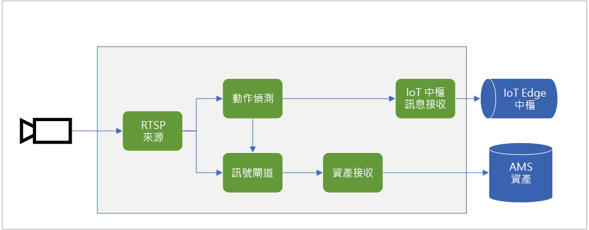
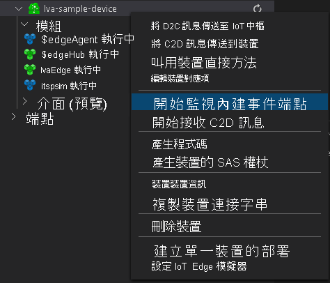
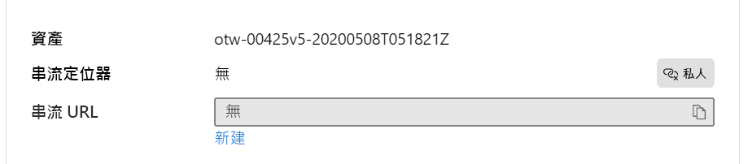

# <a name="quickstart-detect-motion-record-video-to-media-services"></a>快速入門：偵測動作、將影片錄製到媒體服務

本文會逐步引導您在 IoT Edge 上使用 Live Video Analytics 來進行[以事件為基礎的錄製](event-based-video-recording-concept.md)。 這裡使用 Azure 中的 Linux VM 作為 IoT Edge 裝置，以及模擬的即時影片串流。 此影片串流會經過分析，以了解是否有移動中的物件。 偵測到動作時，系統會將事件傳送至 Azure IoT 中樞，並將影片串流的相關部分錄製到 Azure 媒體服務作為其中的資產。

本文建立在[開始使用快速入門](get-started-detect-motion-emit-events-quickstart.md)之上。

## <a name="prerequisites"></a>必要條件

* 具有有效訂用帳戶的 Azure 帳戶。 [免費建立帳戶](https://azure.microsoft.com/free/?WT.mc_id=A261C142F)。
* 您電腦上的 [Visual Studio Code](https://code.visualstudio.com/)，搭配 [Azure IoT Tools 延伸模組](https://marketplace.visualstudio.com/items?itemName=vsciot-vscode.azure-iot-tools)。
* 如果您先前未完成[開始使用快速入門](get-started-detect-motion-emit-events-quickstart.md)，請完成下列步驟：
    * [設定 Azure 資源](get-started-detect-motion-emit-events-quickstart.md#set-up-azure-resources)
    * [部署模組](get-started-detect-motion-emit-events-quickstart.md#deploy-modules-on-your-edge-device)
    * [設定 Visual Studio Code](get-started-detect-motion-emit-events-quickstart.md#configure-the-azure-iot-tools-extension)

## <a name="review-the-sample-video"></a>檢閱範例影片

在設定 Azure 資源的上述步驟中，會將停車場的 (簡短) 影片複製到 Azure 中作為 IoT Edge 裝置使用的 Linux VM。 此影片檔案將用來模擬本教學課程的即時串流。

您可以使用 [VLC Player](https://www.videolan.org/vlc/) 之類的應用程式、加以啟動、按 Control+N，然後將[此](https://lvamedia.blob.core.windows.net/public/lots_015.mkv)連結貼到停車場影片以開始播放。 在大約 5 秒標記處，一輛白色汽車駛進停車場。

當您完成下列步驟時，將在 IoT Edge 上使用 Live Video Analytics 來偵測汽車的移動，並從大約 5 秒標記處開始錄製影片剪輯。 下圖是整體流程的視覺表示法。



## <a name="use-direct-methods"></a>使用直接方法

您可以使用模組，藉由叫用直接方法來分析即時影片串流。 請參閱 [IoT Edge 上 Live Video Analytics 的直接方法](direct-methods.md)，以了解模組所提供的所有直接方法。 

### <a name="invoke-graphtopologylist"></a>叫用 GraphTopologyList
此步驟會列舉模組中的所有[圖表拓撲](media-graph-concept.md#media-graph-topologies-and-instances)。

1. 以滑鼠右鍵按一下 [lvaEdge] 模組，然後從操作功能表中選取 [叫用模組直接方法]。
1. 您會在 Visual Studio Code 視窗的頂端中央看到快顯編輯方塊。 在編輯方塊中輸入 "GraphTopologyList"，然後按 Enter 鍵。
1. 接下來，在編輯方塊中複製並貼上下列 JSON 承載，然後按 Enter 鍵。
    
    ```
    {
        "@apiVersion" : "1.0"
    }
    ```

    在幾秒內，您會在 Visual Studio Code 快顯中看到 [輸出] 視窗，其中包含下列回應
    
    ```
    [DirectMethod] Invoking Direct Method [GraphTopologyList] to [lva-sample-device/lvaEdge] ...
    [DirectMethod] Response from [lva-sample-device/lvaEdge]:
    {
      "status": 200,
      "payload": {
        "value": []
      }
    }
    ```
    
    預期會有上述回應，因為尚未建立任何圖表拓撲。

### <a name="invoke-graphtopologyset"></a>叫用 GraphTopologySet

使用與叫用 GraphTopologyList 所概述的相同步驟，您可以使用下列 JSON 作為承載，來叫用 GraphTopologySet 以設定[圖表拓撲](media-graph-concept.md#media-graph-topologies-and-instances)。 您將會建立名為 "EVRtoAssetsOnMotionDetecion" 的圖表拓撲。

```
{
    "@apiVersion": "1.0",
    "name": "EVRtoAssetsOnMotionDetecion",
    "properties": {
      "description": "Event-based video recording to Assets based on motion events",
      "parameters": [
        {
            "name": "rtspUserName",
            "type": "String",
            "description": "rtsp source user name.",
            "default": "dummyUserName"
        },
        {
            "name": "rtspPassword",
            "type": "String",
            "description": "rtsp source password.",
            "default" : "dummyPassword"
        },
        {
            "name": "rtspUrl",
            "type": "String",
            "description": "rtsp Url"
        },
        {
            "name": "motionSensitivity",
            "type": "String",
            "description": "motion detection sensitivity",
            "default" : "medium"
        },
        {
            "name": "hubSinkOutputName",
            "type": "String",
            "description": "hub sink output name",
            "default" : "iothubsinkoutput"
        }                              
    ],         

      "sources": [
        {
          "@type": "#Microsoft.Media.MediaGraphRtspSource",
          "name": "rtspSource",
          "endpoint": {
            "@type": "#Microsoft.Media.MediaGraphUnsecuredEndpoint",
            "url": "${rtspUrl}",
            "credentials": {
              "@type": "#Microsoft.Media.MediaGraphUsernamePasswordCredentials",
              "username": "${rtspUserName}",
              "password": "${rtspPassword}"
            }
          }
        }
      ],
      "processors": [
        {
          "@type": "#Microsoft.Media.MediaGraphMotionDetectionProcessor",
          "name": "motionDetection",
          "sensitivity": "${motionSensitivity}",
          "inputs": [
            {
              "nodeName": "rtspSource"
            }
          ]
        },
        {
          "@type": "#Microsoft.Media.MediaGraphSignalGateProcessor",
          "name": "signalGateProcessor",
          "inputs": [
            {
              "nodeName": "motionDetection"
            },
            {
              "nodeName": "rtspSource"
            }
          ],
          "activationEvaluationWindow": "PT1S",
          "activationSignalOffset": "PT0S",
          "minimumActivationTime": "PT30S",
          "maximumActivationTime": "PT30S"
        }
      ],
      "sinks": [
        {
          "@type": "#Microsoft.Media.MediaGraphAssetSink",
          "name": "assetSink",
          "assetNamePattern": "sampleAssetFromEVR-LVAEdge-${System.DateTime}",
          "segmentLength": "PT0M30S",
          "localMediaCacheMaximumSizeMiB": "2048",
          "localMediaCachePath": "/var/lib/azuremediaservices/tmp/",
          "inputs": [
            {
              "nodeName": "signalGateProcessor"
            }
          ]
        },
        {
          "@type": "#Microsoft.Media.MediaGraphIoTHubMessageSink",
          "name": "hubSink",
          "hubOutputName": "${hubSinkOutputName}",
          "inputs": [
            {
              "nodeName": "motionDetection"
            }
          ]
        }
      ]
    }
}
```

上述 JSON 承載會造成建立圖表拓撲，以定義五個參數 (其中四個具有預設值)。 此拓撲具有一個來源節點 ([RTSP 來源](media-graph-concept.md#rtsp-source))、兩個處理器節點 ([動作偵測處理器](media-graph-concept.md#motion-detection-processor)和[信號閘道處理器](media-graph-concept.md#signal-gate-processor))，以及兩個接收節點 (IoT 中樞接收和[資產接收](media-graph-concept.md#asset-sink))。 此拓撲的視覺表示法如上所示。

在幾秒內，您會在 [輸出] 視窗中看到下列回應。

```
[DirectMethod] Invoking Direct Method [GraphTopologySet] to [lva-sample-device/lvaEdge] ...
[DirectMethod] Response from [lva-sample-device/lvaEdge]:
{
  "status": 201,
  "payload": {
    "systemData": {
      "createdAt": "2020-05-12T22:05:31.603Z",
      "lastModifiedAt": "2020-05-12T22:05:31.603Z"
    },
    "name": "EVRtoAssetsOnMotionDetecion",
    "properties": {
      "description": "Event-based video recording to assets based on motion events",
      "parameters": [
        {
          "name": "rtspUserName",
          "type": "String",
          "description": "rtsp source user name.",
          "default": "dummyUserName"
        },
        {
          "name": "rtspPassword",
          "type": "String",
          "description": "rtsp source password.",
          "default": "dummyPassword"
        },
        {
          "name": "rtspUrl",
          "type": "String",
          "description": "rtsp Url"
        },
        {
          "name": "motionSensitivity",
          "type": "String",
          "description": "motion detection sensitivity",
          "default": "medium"
        },
        {
          "name": "hubSinkOutputName",
          "type": "String",
          "description": "hub sink output name",
          "default": "iothubsinkoutput"
        }
      ],
      "sources": [
        {
          "@type": "#Microsoft.Media.MediaGraphRtspSource",
          "name": "rtspSource",
          "transport": "Tcp",
          "endpoint": {
            "@type": "#Microsoft.Media.MediaGraphUnsecuredEndpoint",
            "url": "${rtspUrl}",
            "credentials": {
              "@type": "#Microsoft.Media.MediaGraphUsernamePasswordCredentials",
              "username": "${rtspUserName}",
              "password": "${rtspPassword}"
            }
          }
        }
      ],
      "processors": [
        {
          "@type": "#Microsoft.Media.MediaGraphMotionDetectionProcessor",
          "sensitivity": "${motionSensitivity}",
          "name": "motionDetection",
          "inputs": [
            {
              "nodeName": "rtspSource",
              "outputSelectors": []
            }
          ]
        },
        {
          "@type": "#Microsoft.Media.MediaGraphSignalGateProcessor",
          "activationEvaluationWindow": "PT1S",
          "activationSignalOffset": "PT0S",
          "minimumActivationTime": "PT30S",
          "maximumActivationTime": "PT30S",
          "name": "signalGateProcessor",
          "inputs": [
            {
              "nodeName": "motionDetection",
              "outputSelectors": []
            },
            {
              "nodeName": "rtspSource",
              "outputSelectors": []
            }
          ]
        }
      ],
      "sinks": [
        {
          "@type": "#Microsoft.Media.MediaGraphAssetSink",
          "localMediaCachePath": "/var/lib/azuremediaservices/tmp/",
          "localMediaCacheMaximumSizeMiB": "2048",
          "segmentLength": "PT0M30S",
          "assetNamePattern": "sampleAssetFromEVR-LVAEdge-${System.DateTime}",
          "name": "assetSink",
          "inputs": [
            {
              "nodeName": "signalGateProcessor",
              "outputSelectors": []
            }
          ]
        },
        {
          "@type": "#Microsoft.Media.MediaGraphIoTHubMessageSink",
          "hubOutputName": "${hubSinkOutputName}",
          "name": "hubSink",
          "inputs": [
            {
              "nodeName": "motionDetection",
              "outputSelectors": []
            }
          ]
        }
      ]
    }
  }
}
```

傳回的狀態為 201，表示已建立新的圖表拓撲。 在後續步驟中，請嘗試下列直接方法：

* 再次叫用 GraphTopologySet，並檢查傳回的狀態碼為 200。 狀態碼 200 表示已成功更新現有的圖表拓撲。
* 再次叫用 GraphTopologySet，但變更描述字串。 檢查回應中的狀態碼是否為 200，且描述已更新為新的值。
* 如前一節中所概述叫用 GraphTopologyList，並檢查您現在是否可以在傳回的承載中看到 "EVRtoAssetsOnMotionDetecion" 圖表拓撲。

### <a name="invoke-graphtopologyget"></a>叫用 GraphTopologyGet

現在使用下列承載叫用 GraphTopologyGet
```

{
    "@apiVersion" : "1.0",
    "name" : "EVRtoAssetsOnMotionDetecion"
}
```

在幾秒內，您應該會在 [輸出] 視窗中看到下列回應

```
[DirectMethod] Invoking Direct Method [GraphTopologyGet] to [lva-sample-device/lvaEdge] ...
[DirectMethod] Response from [lva-sample-device/lvaEdge]:
{
  "status": 200,
  "payload": {
    "systemData": {
      "createdAt": "2020-05-12T22:05:31.603Z",
      "lastModifiedAt": "2020-05-12T22:05:31.603Z"
    },
    "name": "EVRtoAssetsOnMotionDetecion",
    "properties": {
      "description": "Event-based video recording to Assets based on motion events",
      "parameters": [
        {
          "name": "rtspUserName",
          "type": "String",
          "description": "rtsp source user name.",
          "default": "dummyUserName"
        },
        {
          "name": "rtspPassword",
          "type": "String",
          "description": "rtsp source password.",
          "default": "dummyPassword"
        },
        {
          "name": "rtspUrl",
          "type": "String",
          "description": "rtsp Url"
        },
        {
          "name": "motionSensitivity",
          "type": "String",
          "description": "motion detection sensitivity",
          "default": "medium"
        },
        {
          "name": "hubSinkOutputName",
          "type": "String",
          "description": "hub sink output name",
          "default": "iothubsinkoutput"
        }
      ],
      "sources": [
        {
          "@type": "#Microsoft.Media.MediaGraphRtspSource",
          "name": "rtspSource",
          "transport": "Tcp",
          "endpoint": {
            "@type": "#Microsoft.Media.MediaGraphUnsecuredEndpoint",
            "url": "${rtspUrl}",
            "credentials": {
              "@type": "#Microsoft.Media.MediaGraphUsernamePasswordCredentials",
              "username": "${rtspUserName}",
              "password": "${rtspPassword}"
            }
          }
        }
      ],
      "processors": [
        {
          "@type": "#Microsoft.Media.MediaGraphMotionDetectionProcessor",
          "sensitivity": "${motionSensitivity}",
          "name": "motionDetection",
          "inputs": [
            {
              "nodeName": "rtspSource",
              "outputSelectors": []
            }
          ]
        },
        {
          "@type": "#Microsoft.Media.MediaGraphSignalGateProcessor",
          "activationEvaluationWindow": "PT1S",
          "activationSignalOffset": "PT0S",
          "minimumActivationTime": "PT30S",
          "maximumActivationTime": "PT30S",
          "name": "signalGateProcessor",
          "inputs": [
            {
              "nodeName": "motionDetection",
              "outputSelectors": []
            },
            {
              "nodeName": "rtspSource",
              "outputSelectors": []
            }
          ]
        }
      ],
      "sinks": [
        {
          "@type": "#Microsoft.Media.MediaGraphAssetSink",
          "localMediaCachePath": "/var/lib/azuremediaservices/tmp/",
          "localMediaCacheMaximumSizeMiB": "2048",
          "segmentLength": "PT0M30S",
          "assetNamePattern": "sampleAssetFromEVR-LVAEdge-${System.DateTime}",
          "name": "assetSink",
          "inputs": [
            {
              "nodeName": "signalGateProcessor",
              "outputSelectors": []
            }
          ]
        },
        {
          "@type": "#Microsoft.Media.MediaGraphIoTHubMessageSink",
          "hubOutputName": "${hubSinkOutputName}",
          "name": "hubSink",
          "inputs": [
            {
              "nodeName": "motionDetection",
              "outputSelectors": []
            }
          ]
        }
      ]
    }
  }
}
```

請注意回應承載中的下列屬性：

* 狀態碼為 200，表示成功。
* 承載具有 "created" 和 "lastModified" 時間戳記。

### <a name="invoke-graphinstanceset"></a>叫用 GraphInstanceSet

接下來，建立參考上述圖表拓撲的圖表執行個體。 如[這裡](media-graph-concept.md#media-graph-topologies-and-instances)所述，圖表執行個體可讓您使用相同的圖表拓撲，分析來自許多攝影機的即時影片串流。

現在使用下列承載叫用 GraphInstanceSet 直接方法：

```
{
    "@apiVersion" : "1.0",
    "name" : "Sample-Graph-2",
    "properties" : {
        "topologyName" : "EVRtoAssetsOnMotionDetecion",
        "description" : "Sample graph description",
        "parameters" : [
            { "name" : "rtspUrl", "value" : "rtsp://rtspsim:554/media/lots_015.mkv" }
        ]
    }
}
```

請注意：

* 上述承載會指定需要建立圖表執行個體的圖表拓撲名稱 (EVRtoAssetsOnMotionDetecion)。
* 此承載包含 "rtspUrl" 的參數值，在拓撲承載中沒有預設值。

在幾秒內，您會在 [輸出] 視窗中看到下列回應：

```
[DirectMethod] Invoking Direct Method [GraphInstanceSet] to [lva-sample-device/lvaEdge] ...
[DirectMethod] Response from [lva-sample-device/lvaEdge]:
{
  "status": 201,
  "payload": {
    "systemData": {
      "createdAt": "2020-05-12T23:30:20.666Z",
      "lastModifiedAt": "2020-05-12T23:30:20.666Z"
    },
    "name": "Sample-Graph-2",
    "properties": {
      "state": "Inactive",
      "description": "Sample graph description",
      "topologyName": "EVRtoAssetsOnMotionDetecion",
      "parameters": [
        {
          "name": "rtspUrl",
          "value": "rtsp://rtspsim:554/media/lots_015.mkv"
        }
      ]
    }
  }
}
```

請注意回應承載中的下列屬性：

* 狀態碼為 201，表示已建立新的執行個體。
* 狀態為 "Inactive" (非作用中)，表示圖表執行個體已建立但未啟動。 如需詳細資訊，請參閱[媒體圖表](media-graph-concept.md)狀態。

在後續步驟中，請嘗試下列直接方法：

* 使用相同的承載再次叫用 GraphInstanceSet，並請注意傳回的狀態碼現在是 200。
* 再次叫用 GraphInstanceSet，但使用不同的描述，並請注意回應承載中已更新的描述，表示已成功更新圖表執行個體。
* 叫用 GraphInstanceSet，但將名稱變更為 "Sample-Graph-3"，然後觀察回應承載。 請注意，這會建立新的圖表執行個體 (亦即狀態碼為 201)。 當您完成本快速入門時，請記得清除這類重複的執行個體。

### <a name="prepare-for-monitoring-events"></a>準備監視事件

您所建立的媒體圖表會使用動作偵測處理器節點來偵測動作，而這類事件會轉送到您的 IoT 中樞。 若要準備觀察這類事件，請遵循下列步驟

1. 在 Visual Studio Code 中開啟 [Explorer] 窗格，然後在左下角尋找 Azure IoT 中樞。
1. 展開 [裝置] 節點
1. 以滑鼠右鍵按一下 [lva-sample-device]，然後選擇 [開始監視內建事件監視] 選項

    
    
    在幾秒內，您會在 [輸出] 視窗中看到下列訊息：

    ```
    [IoTHubMonitor] Start monitoring message arrived in built-in endpoint for all devices ...
    [IoTHubMonitor] Created partition receiver [0] for consumerGroup [$Default]
    [IoTHubMonitor] Created partition receiver [1] for consumerGroup [$Default]
    [IoTHubMonitor] Created partition receiver [2] for consumerGroup [$Default]
    [IoTHubMonitor] Created partition receiver [3] for consumerGroup [$Default]
    ```

### <a name="invoke-graphinstanceactivate"></a>叫用 GraphInstanceActivate

現在啟動圖表執行個體 - 這會透過模組開始即時影片的流程。 使用下列承載叫用直接方法 GraphInstanceActivate：

```
{
    "@apiVersion" : "1.0",
    "name" : "Sample-Graph-2"
}
```

在幾秒內，您應該會在 [輸出] 視窗中看到下列回應

```
[DirectMethod] Invoking Direct Method [GraphInstanceActivate] to [lva-sample-device/lvaEdge] ...
[DirectMethod] Response from [lva-sample-device/lvaEdge]:
{
  "status": 200,
  "payload": null
}
```

回應承載中的狀態碼 200 表示已成功啟動圖表執行個體。

### <a name="invoke-graphinstanceget"></a>叫用 GraphInstanceGet

現在使用下列承載叫用 GraphInstanceGet 直接方法：

```
{
    "@apiVersion" : "1.0",
    "name" : "Sample-Graph-2"
}
```

在幾秒內，您應該會在 [輸出] 視窗中看到下列回應

```
[DirectMethod] Invoking Direct Method [GraphInstanceGet] to [lva-sample-device/lvaEdge] ...
[DirectMethod] Response from [lva-sample-device/lvaEdge]:
{
  "status": 200,
  "payload": {
    "systemData": {
      "createdAt": "2020-05-12T23:30:20.666Z",
      "lastModifiedAt": "2020-05-12T23:30:20.666Z"
    },
    "name": "Sample-Graph-2",
    "properties": {
      "state": "Active",
      "description": "Sample graph description",
      "topologyName": "EVRtoAssetsOnMotionDetecion",
      "parameters": [
        {
          "name": "rtspUrl",
          "value": "rtsp://rtspsim:554/media/lots_015.mkv"
        }
      ]
    }
  }
}
```

請注意回應承載中的下列屬性：

* 狀態碼為 200，表示成功。
* 狀態為 "Active" (作用中)，表示圖表執行個體現在處於 [作用中] 狀態。

## <a name="observe-results"></a>觀察結果

您在上面建立及啟動的圖表執行個體會使用動作偵測處理器節點來偵測傳入即時影片串流中的動作，並將事件傳送至 IoT 中樞接收。 接著，這些事件會轉送到您的 IoT 中樞，現在可以觀察到。 您會在 [輸出] 視窗中看到下列訊息

```
[IoTHubMonitor] [4:33:04 PM] Message received from [lva-sample-device/lvaEdge]:
{
  "body": {
    "sdp": "SDP:\nv=0\r\no=- 1589326384077235 1 IN IP4 XXX.XX.XX.XXX\r\ns=Matroska video+audio+(optional)subtitles, streamed by the LIVE555 Media Server\r\ni=media/lots_015.mkv\r\nt=0 0\r\na=tool:LIVE555 Streaming Media v2020.04.12\r\na=type:broadcast\r\na=control:*\r\na=range:npt=0-73.000\r\na=x-qt-text-nam:Matroska video+audio+(optional)subtitles, streamed by the LIVE555 Media Server\r\na=x-qt-text-inf:media/lots_015.mkv\r\nm=video 0 RTP/AVP 96\r\nc=IN IP4 0.0.0.0\r\nb=AS:500\r\na=rtpmap:96 H264/90000\r\na=fmtp:96 packetization-mode=1;profile-level-id=640028;sprop-parameter-sets=XXXXXXXXXXXXXXXXXXXXXXXXXXXXXXXXXXX\r\na=control:track1\r\n"
  },
  "applicationProperties": {
    "topic": "/subscriptions/{subscriptionId}/resourceGroups/{resourceGroupName}/providers/microsoft.media/mediaservices/{amsAccountName}",
    "subject": "/graphInstances/Sample-Graph-2/sources/rtspSource",
    "eventType": "Microsoft.Media.Graph.Diagnostics.MediaSessionEstablished",
    "eventTime": "2020-05-12T23:33:04.077Z",
    "dataVersion": "1.0"
  }
}
[IoTHubMonitor] [4:33:09 PM] Message received from [lva-sample-device/lvaEdge]:
{
  "body": {
    "timestamp": 143039375044290,
    "inferences": [
      {
        "type": "motion",
        "motion": {
          "box": {
            "l": 0.48954,
            "t": 0.140741,
            "w": 0.075,
            "h": 0.058824
          }
        }
      }
    ]
  },
  "applicationProperties": {
    "topic": "/subscriptions/{subscriptionId}/resourceGroups/{resourceGroupName}/providers/microsoft.media/mediaservices/{amsAccountName}",
    "subject": "/graphInstances/Sample-Graph-2/processors/md",
    "eventType": "Microsoft.Media.Graph.Analytics.Inference",
    "eventTime": "2020-05-12T23:33:09.381Z",
    "dataVersion": "1.0"
  }
}
```

請注意上述訊息中的下列屬性

* 每則訊息都包含 "body" 區段和 "applicationProperties" 區段。 若要了解這些區段所代表的意思，請參閱[建立及讀取 IoT 中樞訊息](https://docs.microsoft.com/azure/iot-hub/iot-hub-devguide-messages-construct) (機器翻譯) 一文。
* 第一則訊息為診斷事件 MediaSessionEstablished，表示 RTSP 來源節點 (主體) 能夠與 RTSP 模擬器建立連線，並開始接收 (模擬的) 即時摘要。
* applicationProperties 中的 "subject" 會參考產生訊息之圖表拓撲中的節點。 在此案例中，訊息是來自 RTSP 來源節點。
* applicationProperties 中的 "eventType" 表示這是診斷事件。
* "eventTime" 表示事件發生的時間。
* "body" 包含診斷事件的相關資料 - 這是 [SDP](https://en.wikipedia.org/wiki/Session_Description_Protocol) 訊息。
* 第二則訊息為分析事件。 您可以檢查這是否會在 MediaSessionEstablished 訊息後大約 5 秒傳送，對應至影片開始到汽車駛進停車場之間的延遲。
* applicationProperties 中的 "subject" 會參考圖表中的動作偵測處理器節點，從而產生此訊息
* 此事件為推斷事件，因此 "body" 包含 "timestamp" 和 "inferences" 資料。
* "inferences" 區段指出 "type" 為 "motion"，並包含有關 "motion" 事件的其他資料。

以下是您會看到的下一則訊息。

```
[IoTHubMonitor] [4:33:10 PM] Message received from [lva-sample-device/lvaEdge]:
{
  "body": {
    "outputType": "assetName",
    "outputLocation": "sampleAssetFromEVR-LVAEdge-20200512T233309Z"
  },
  "applicationProperties": {
    "topic": "/subscriptions/{subscriptionId}/resourceGroups/{resourceGroupName}/providers/microsoft.media/mediaservices/{amsAccountName}",
    "subject": "/graphInstances/Sample-Graph-2/sinks/assetSink",
    "eventType": "Microsoft.Media.Graph.Operational.RecordingStarted",
    "eventTime": "2020-05-12T23:33:10.392Z",
    "dataVersion": "1.0"
  }
}
```

* 第三則訊息為操作事件。 您可以檢查這是否會在動作偵測訊息後幾乎立即傳送，作為開始錄製的觸發程序。
* applicationProperties 中的 "subject" 會參考圖表中的資產接收節點，從而產生此訊息。
* 本文包含輸出位置的相關資訊，在此案例中，這是用來錄製影片的 Azure 媒體服務資產名稱。 請記下此值，稍後會在快速入門中使用。

在拓撲中，信號閘道處理器節點已設定 30 秒的啟動時間，這表示圖表拓撲會將大約 30 秒的影片錄製到資產中。 錄製影片時，動作偵測處理器節點會繼續發出推斷事件，這會顯示在[輸出] 視窗中。 經過一段時間後，您會看到下列訊息。

```
[IoTHubMonitor] [4:33:31 PM] Message received from [lva-sample-device/lvaEdge]:
{
  "body": {
    "outputType": "assetName",
    "outputLocation": "sampleAssetFromEVR-LVAEdge-20200512T233309Z"
  },
  "applicationProperties": {
    "topic": "/subscriptions/{subscriptionId}/resourceGroups/{resourceGroupName}/providers/microsoft.media/mediaservices/{amsAccountName}",
    "subject": "/graphInstances/Sample-Graph-2/sinks/assetSink",
    "eventType": "Microsoft.Media.Graph.Operational.RecordingAvailable",
    "eventTime": "2020-05-12T23:33:31.051Z",
    "dataVersion": "1.0"
  }
}
```

* 此訊息也是操作事件。 事件 RecordingAvailable 表示已將足夠的資料寫入資產，讓播放器/用戶端可起始播放影片
* applicationProperties 中的 "subject" 會參考圖表中的資產接收節點，從而產生此訊息
* 本文包含輸出位置的相關資訊，在此案例中，這是用來錄製影片的 Azure 媒體服務資產名稱。

如果您讓圖表執行個體繼續執行，您會看到此訊息。

```
[IoTHubMonitor] [4:33:40 PM] Message received from [lva-sample-device/lvaEdge]:
{
  "body": {
    "outputType": "assetName",
    "outputLocation": "sampleAssetFromEVR-LVAEdge-20200512T233309Z"
  },
  "applicationProperties": {
    "topic": "/subscriptions/{subscriptionId}/resourceGroups/{resourceGroupName}/providers/microsoft.media/mediaservices/{amsAccountName}",
    "subject": "/graphInstances/Sample-Graph-2/sinks/assetSink",
    "eventType": "Microsoft.Media.Graph.Operational.RecordingStopped",
    "eventTime": "2020-05-12T23:33:40.014Z",
    "dataVersion": "1.0"
  }
}
```

* 此訊息也是操作事件。 事件 RecordingStopped 表示錄製已停止。
* 請注意，自 RecordingStarted 事件後已經過大約 30 秒，符合信號閘道處理器節點中的啟動時間值。
* applicationProperties 中的 "subject" 會參考圖表中的資產接收節點，從而產生此訊息。
* 本文包含輸出位置的相關資訊，在此案例中，這是用來錄製影片的 Azure 媒體服務資產名稱。

如果您讓圖表執行個體繼續執行，RTSP 模擬器會到達影片檔案的結尾，並停止/中斷連線。 然後，RTSP 來源節點會重新連線到模擬器，而此程序將會重複。
    
## <a name="invoke-additional-direct-methods-to-clean-up"></a>叫用其他直接方法來清除

現在，叫用直接方法來停用及刪除圖表執行個體 (依該順序)。

### <a name="invoke-graphinstancedeactivate"></a>叫用 GraphInstanceDeactivate

使用下列承載叫用 GraphInstanceDeactivate 直接方法：

```
{
    "@apiVersion" : "1.0",
    "name" : "Sample-Graph-2"
}
```

在幾秒內，您應該會在 [輸出] 視窗中看到下列回應。

```
[DirectMethod] Invoking Direct Method [GraphInstanceDeactivate] to [lva-sample-device/lvaEdge] ...
[DirectMethod] Response from [lva-sample-device/lvaEdge]:
{
  "status": 200,
  "payload": null
}
```

狀態碼 200 表示已成功停用圖表執行個體。

在後續步驟中，請嘗試下列項目：

* 如先前章節所示叫用 GraphInstanceGet，並觀察 "state" (狀態) 值。

### <a name="invoke-graphinstancedelete"></a>叫用 GraphInstanceDelete

使用下列承載叫用直接方法 GraphInstanceDelete

```
{
    "@apiVersion" : "1.0",
    "name" : "Sample-Graph-2"
}
```

在幾秒內，您應該會在 [輸出] 視窗中看到下列回應：

```
[DirectMethod] Invoking Direct Method [GraphInstanceDelete] to [lva-sample-device/lvaEdge] ...
[DirectMethod] Response from [lva-sample-device/lvaEdge]:
{
  "status": 200,
  "payload": null
}
```

回應中的狀態碼 200 表示已成功刪除圖表執行個體。

### <a name="invoke-graphtopologydelete"></a>叫用 GraphTopologyDelete

使用下列承載叫用 GraphTopologyDelete 直接方法：

```
{
    "@apiVersion" : "1.0",
    "name" : "EVRtoAssetsOnMotionDetecion"
}
```

在幾秒內，您應該會在 [輸出] 視窗中看到下列回應

```
[DirectMethod] Invoking Direct Method [GraphTopologyDelete] to [lva-sample-device/lvaEdge] ...
[DirectMethod] Response from [lva-sample-device/lvaEdge]:
{
  "status": 200,
  "payload": null
}
```

狀態碼 200 表示已成功刪除 MediaGraph 拓撲。

在後續步驟中，請嘗試下列直接方法：

* 叫用 GraphTopologyList，並觀察模組中沒有任何圖表拓撲。
* 使用與 GraphTopologyList 相同的承載來叫用 GraphInstanceList，並觀察不會列舉任何圖表執行個體。

## <a name="playing-back-the-recorded-video"></a>播放錄製的影片

接下來，您可以使用 Azure 入口網站來播放您錄製的影片。

1. 登入 [Azure 入口網站](https://portal.azure.com/)，在搜尋方塊中鍵入「媒體服務」。
1. 找到您的 Azure 媒體服務帳戶並加以開啟。
1. 在 [媒體服務] 清單中找到並選取 [資產] 項目。

    ![[媒體服務] 清單中的 [資產] 項目](./media/quickstarts/asset-entity.png)
1. 如果本快速入門是您第一次使用 Azure 媒體服務，則只會列出從本快速入門產生的資產，而且您可以選取最舊的資產。
1. 否則，請使用在上述操作事件中提供作為 outputLocation 的資產名稱。
1. 在開啟的詳細資料頁面中，按一下 [串流 URL] 文字方塊正下方的 [新建] 連結。

    
1. 在開啟的 [新增串流定位器] 窗格中，接受預設值，然後按底部的 [新增]。
1. 在 [資產] 詳細資料頁面中，影片播放器現在應該會載入至影片的第一個畫面，而且您可以按播放按鈕。 檢查您是否看到汽車駛進停車場的影片部分。

    

> [!NOTE]
> 由於模擬的即時影片會在您啟動圖表時開始，因此與日期時間值無關，也不會透過此播放器捷徑公開。 持續影片錄製和播放的教學課程說明如何顯示這些時間戳記。

## <a name="clean-up-resources"></a>清除資源

如果您不打算繼續使用此應用程式，請刪除本快速入門中建立的資源。

## <a name="next-steps"></a>後續步驟

* 了解如何在以程式設計方式叫用在 IoT Edge 上的 Live Video Analytics [直接方法](direct-methods.md)。
* 深入了解診斷訊息。    
