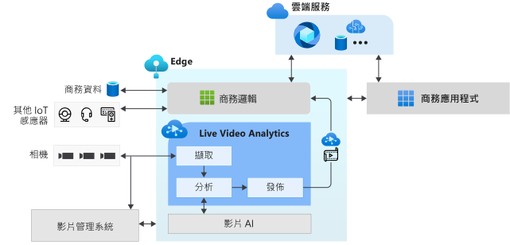

# 何謂 IoT Edge 上的 Live Video Analytics？ (預覽)

IoT Edge 上的 Live Video Analytics 提供一個平台，可建立跨 Edge 和雲端的智慧型影片應用程式。 此平台提供擷取、記錄和分析即時影片的功能，並將結果 (影片及 (或) 影片分析) 發佈至 Azure 服務 (雲端及 (或) Edge)。 此平台可用於搭配影片分析，增強 IoT 解決方案。 IoT Edge 上的 Live Video Analytics 可與其他 Azure IoT Edge 模組相結合，如 IoT Edge 上的串流分析、IoT Edge 上的認知服務及雲端中的 Azure 服務 (如媒體服務、事件中樞、認知服務等)，以建立功能強大的混合式 (例如，Edge + 雲端) 應用程式。

IoT Edge 上的 Live Video Analytics 設計成可延伸的平台，讓您可以將不同的影片分析 Edge 模組 (如認知服務容器、您使用開放原始碼機器學習模型所建置的自訂 Edge 模組，或使用您自己資料所定型的自訂模型)，連線至此平台，並使用這些模組來分析即時影片，而不必擔心建置和執行即時影片管線的複雜性。

## 加速 IoT 解決方案的開發 

此 IoT 解決方案結合影片分析與其他 IoT 感應器及 (或) 商務資料的訊號，有助於自動化或半自動化進行業務決策，進而提高生產力。 IoT Edge 上的 Live Video Analytics 可讓您更快速地建立這類解決方案。 您可以專注於建立適合您業務的影片分析模組和邏輯，並讓平台隱藏管理和執行影片管線的複雜性。

使用 IoT Edge 上的 Live Video Analytics，可以繼續將 [CCTV 相機](https://en.wikipedia.org/wiki/Closed-circuit_television_camera)與您現有的[影片管理系統 (VMS)](https://en.wikipedia.org/wiki/Video_management_system) 搭配使用，並各別建立影片分析應用程式。 IoT Edge 上的 Live Video Analytics 可用於結合電腦視覺軟體 SDK 和工具組，建立尖端的 IoT 解決方案。 下圖說明這個特色。

## 支援的環境

支援 Linux x86-64 和 ARM64 環境。
> [!NOTE]
> `1.0.4` 和更新版本的組建中都有提供 ARM64 裝置的支援。
> 在 ARM64 裝置上執行 Azure IoT Edge 執行階段的支援處於[公開預覽](https://azure.microsoft.com/support/legal/preview-supplemental-terms/)狀態。

## 開始使用

閱讀下列概念性文章，然後嘗試快速入門，對即時影片摘要執行動態偵測。

### 概念

* [媒體圖表](media-graph-concept.md)
* [錄製影片](video-recording-concept.md)
* [播放影片](video-playback-concept.md)
* [錄製連續影片](continuous-video-recording-concept.md)
* [發生事件時錄製影片](event-based-video-recording-concept.md)
* [不錄製影片但進行 Live Video Analytics](analyze-live-video-concept.md)

## 後續步驟

* 遵循 [快速入門：使用您自己的模型執行 Live Video Analytics](use-your-model-quickstart.md) (英文) 一文，了解如何對即時影片摘要執行動態偵測。
* 檢閱[術語](terminology.md) (英文)
* 探索 [Live Video Analytics 開放原始碼素材](https://github.com/Azure/live-video-analytics) (英文)

