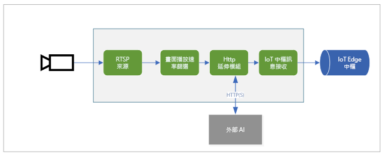

# <a name="quickstart-analyze-live-video-by-using-your-own-model"></a>快速入門：使用您自己的模型分析即時影片

本快速入門說明如何在 IoT Edge 上使用 Live Video Analytics，從 (模擬) IP 攝影機分析即時影片摘要。 您將了解如何套用電腦視覺模型來偵測物件。 即時影片摘要中的框架子集會傳送至推斷服務。 結果會傳送至 IoT Edge 中樞。 

本快速入門會使用 Azure VM 作為 IoT Edge 裝置，以及使用模擬的即時影片串流。 其根據的是以 C# 撰寫的範例程式碼，並且會在[偵測動作並發出事件](detect-motion-emit-events-quickstart.md)快速入門的基礎上來建置。 

## <a name="prerequisites"></a>必要條件

* 包含有效訂用帳戶的 Azure 帳戶。 如果您還未擁有帳戶，請[建立免費帳戶](https://azure.microsoft.com/free/?WT.mc_id=A261C142F)。
* 具有下列擴充功能的 [Visual Studio Code](https://code.visualstudio.com/)：
    * [Azure IoT 工具組](https://marketplace.visualstudio.com/items?itemName=vsciot-vscode.azure-iot-tools)
    * [C#](https://marketplace.visualstudio.com/items?itemName=ms-dotnettools.csharp)
* [.NET Core 3.1 SDK](https://dotnet.microsoft.com/download/dotnet-core/3.1)。
* 如果您未完成[偵測動作並發出事件](detect-motion-emit-events-quickstart.md)快速入門，則請務必[設定 Azure 資源](detect-motion-emit-events-quickstart.md#set-up-azure-resources)。

> [!TIP]
> 安裝 Azure IoT Tools 時，系統可能會提示您安裝 Docker。 您可以忽略提示。

## <a name="review-the-sample-video"></a>檢閱範例影片
當您設定 Azure 資源時，系統會將高速公路車流的短片複製到 Azure 中您要作為 IoT Edge 裝置的 Linux VM。 本快速入門會使用影片檔案來模擬即時串流。

開啟應用程式，例如 [VLC media player](https://www.videolan.org/vlc/)。 選取 Ctrl+N，然後貼上[影片](https://lvamedia.blob.core.windows.net/public/camera-300s.mkv)的連結以開始播放。 您會看到許多車輛在高速公路車流中移動的畫面。

在本快速入門中，您將在 IoT Edge 上使用 Live Video Analytics 以偵測車輛和人員等物件。 您會將相關聯的推斷事件發佈到 IoT Edge 中樞。

## <a name="overview"></a>概觀



上圖顯示本快速入門中的信號流動方式。 [邊緣模組](https://github.com/Azure/live-video-analytics/tree/master/utilities/rtspsim-live555)會模擬裝載了即時串流通訊協定 (RTSP) 伺服器的 IP 攝影機。 [RTSP 來源](media-graph-concept.md#rtsp-source)節點會從這部伺服器提取影片摘要，並將影片畫面傳送到[畫面播放速率篩選處理器](media-graph-concept.md#frame-rate-filter-processor)節點。 此處理器會限制影片串流到達 [HTTP 延伸模組處理器](media-graph-concept.md#http-extension-processor)節點的畫面播放速率。 

HTTP 延伸模組節點扮演 Proxy 的角色。 其會將影片畫面轉換成指定的影像類型。 然後，會透過 REST 將影像轉送至另一個邊緣模組，以在 HTTP 端點後方執行 AI 模型。 在此範例中，邊緣模組是使用 [YOLOv3](https://github.com/Azure/live-video-analytics/tree/master/utilities/video-analysis/yolov3-onnx) 模型所建置的，因此能夠偵測許多類型的物件。 HTTP 延伸模組處理器節點會收集偵測結果，並將事件發佈至 [IoT 中樞接收](media-graph-concept.md#iot-hub-message-sink)節點。 節點接著會將這些事件傳送至 [IoT Edge 中樞](../../iot-edge/iot-edge-glossary.md#iot-edge-hub)。

在本快速入門中，您將：

1. 建立和部署媒體圖表。
1. 解譯解譯。
1. 清除資源。


## <a name="create-and-deploy-the-media-graph"></a>建立和部署媒體圖表
    
### <a name="examine-and-edit-the-sample-files"></a>查看和編輯範例檔案

您必須將範例程式碼下載至資料夾，這是必要條件的一部分。 請遵循下列步驟來檢查和編輯範例檔案。

1. 在 Visual Studio Code 中，移至 *src/edge*。 您會看到 *.env* 檔案和一些部署範本檔案。

    部署範本會參考邊緣裝置的部署資訊清單。 其包含一些預留位置值。 *.env* 檔案包含這些變數的值。

1. 移至 *src/cloud-to-device-console-app* 資料夾。 在這裡，您會看到 *appsettings.json* 檔案和其他幾個檔案：

    * ***c2d-console-app.csproj*** - Visual Studio Code 的專案檔。
    * ***operations.json*** - 您想要讓程式執行的作業清單。
    * ***Program.cs*** - 範例程式碼。 此程式碼：

        * 載入應用程式設定。
        * 叫用 IoT Edge 模組上 Live Video Analytics 所公開的直接方法。 您可以使用模組，藉由叫用其[直接方法](direct-methods.md)來分析即時影片串流。
        * 會暫停，讓您可以在 [終端機] 視窗中檢查程式的輸出，並在 [輸出] 視窗中檢查模組所產生的事件。
        * 叫用直接方法來清除資源。


1. 編輯 *operations.json* 檔案：
    * 變更圖表拓撲的連結：

        `"topologyUrl" : "https://raw.githubusercontent.com/Azure/live-video-analytics/master/MediaGraph/topologies/httpExtension/topology.json"`

    * 在 `GraphInstanceSet` 底下，編輯圖表拓撲的名稱，使其符合前一個連結中的值：

      `"topologyName" : "InferencingWithHttpExtension"`

    * 在 `GraphTopologyDelete` 底下，編輯名稱：

      `"name": "InferencingWithHttpExtension"`

### <a name="generate-and-deploy-the-iot-edge-deployment-manifest"></a>產生和部署 IoT Edge 部署資訊清單

1. 以滑鼠右鍵按一下 *src/edge/ deployment.yolov3.template.json* 檔案，然後選取 [產生 IoT Edge 部署資訊清單]。

      

    *deployment.yolov3.amd64.json* 資訊清單檔案會建立在 *src/edge/config* 資料夾中。

1. 如果您已完成[偵測動作並發出事件](detect-motion-emit-events-quickstart.md)快速入門，請略過此步驟。 

    否則，請在左下角的 [Azure IoT 中樞] 窗格附近，選取 [其他動作] 圖示，然後選取 [設定 IoT 中樞連接字串]。 您可以從 *appsettings.json* 檔案複製字串。 或者，若要確保您已在 Visual Studio Code 中設定適當的 IoT 中樞，請使用[選取 IoT 中樞命令](https://github.com/Microsoft/vscode-azure-iot-toolkit/wiki/Select-IoT-Hub)。
    
    

1. 以滑鼠右鍵按一下 *src/edge/config/ deployment.yolov3.amd64.json*，然後選取 [建立單一裝置的部署]。 

    

1. 當系統提示您選取 IoT 中樞裝置時，請選取 [lva-sample-device]。
1. 大約 30 秒之後，請在視窗左下角重新整理 Azure IoT 中樞。 邊緣裝置現在會顯示下列已部署的模組：

    * 名為 **lvaEdge** 的 Live Video Analytics 模組
    * 名為 **rtspsim** 的模組，其會模擬 RTSP 伺服器並作為即時影片摘要的來源
    * **yolov3** 模組，這是 YOLOv3 物件偵測模型，會將電腦視覺套用至映像並傳回多個物件類型類別
 
      

### <a name="prepare-to-monitor-events"></a>準備監視事件

以滑鼠右鍵按一下 Live Video Analytics 裝置，然後選取 [開始監視內建事件端點]。 您需要執行此步驟，才能在 Visual Studio Code 的 [輸出] 視窗中監視 IoT 中樞事件。 

 

### <a name="run-the-sample-program"></a>執行範例程式

1. 若要啟動偵錯工作階段，請選取 F5 鍵。 您會在 [終端機] 視窗中看到一些列印的訊息。
1. *operations.json* 程式碼首先會呼叫直接方法 `GraphTopologyList` 和 `GraphInstanceList`。 如果您在完成先前的快速入門之後清除了資源，則此程序會傳回空的清單，然後暫停。 若要繼續，請選取 Enter 鍵。

   ```
   --------------------------------------------------------------------------
   Executing operation GraphTopologyList
   -----------------------  Request: GraphTopologyList  --------------------------------------------------
   {
   "@apiVersion": "1.0"
   }
   ---------------  Response: GraphTopologyList - Status: 200  ---------------
   {
   "value": []
   }
   --------------------------------------------------------------------------
   Executing operation WaitForInput
   Press Enter to continue
   ```

    [終端機] 視窗會顯示下一組直接方法呼叫：

     * 會使用上述 `topologyUrl` 的對 `GraphTopologySet` 呼叫
     * 會使用下列主體的對 `GraphInstanceSet` 呼叫：

         ```
         {
           "@apiVersion": "1.0",
           "name": "Sample-Graph-1",
           "properties": {
             "topologyName": "InferencingWithHttpExtension",
             "description": "Sample graph description",
             "parameters": [
               {
                 "name": "rtspUrl",
                 "value": "rtsp://rtspsim:554/media/camera-300s.mkv"
               },
               {
                 "name": "rtspUserName",
                 "value": "testuser"
               },
               {
                 "name": "rtspPassword",
                 "value": "testpassword"
               }
             ]
           }
         }
         ```

     * 會啟動圖表執行個體和影片流程的對 `GraphInstanceActivate` 呼叫
     * 對 `GraphInstanceList` 的第二個呼叫，會顯示處於執行中狀態的圖表執行個體
1. [終端機] 視窗中的輸出會在 `Press Enter to continue` 提示字元處暫停。 還不要選取 Enter 鍵。 請向上捲動，查看您所叫用直接方法的 JSON 回應承載。
1. 切換至 Visual Studio Code 中的 [輸出] 視窗。 您會看到訊息指出 IoT Edge 模組上的 Live Video Analytics 正在傳送到 IoT 中樞。 本快速入門的下一節會討論這些訊息。
1. 媒體圖表會繼續執行並列印結果。 RTSP 模擬器會持續循環播放來源影片。 若要停止媒體圖表，請返回 [終端機] 視窗，然後選取 Enter 鍵。 

    下一系列的呼叫會清除資源：
      * 對 `GraphInstanceDeactivate` 的呼叫會停用圖表執行個體。
      * 對 `GraphInstanceDelete` 的呼叫會刪除執行個體。
      * 對 `GraphTopologyDelete` 的呼叫會刪除拓撲。
      * 最後對 `GraphTopologyList` 的呼叫會顯示清單是空的。

## <a name="interpret-results"></a>解譯結果

當您執行媒體圖表時，來自 HTTP 延伸模組處理器節點的結果會將 IoT 中樞接收節點傳遞至 IoT 中樞。 您在 [輸出] 視窗中看到的訊息包含 `body` 區段和 `applicationProperties` 區段。 如需詳細資訊，請參閱[建立及讀取 IoT 中樞訊息](../../iot-hub/iot-hub-devguide-messages-construct.md)。

在下列訊息中，Live Video Analytics 模組會定義應用程式屬性和主體內容。 

### <a name="mediasessionestablished-event"></a>MediaSessionEstablished 事件

具現化媒體圖表時，RTSP 來源節點會嘗試連線到在 rtspsim-live555 容器中執行的 RTSP 伺服器。 如果連線成功，則會列印下列事件。 事件類型是 `Microsoft.Media.MediaGraph.Diagnostics.MediaSessionEstablished`。

```
[IoTHubMonitor] [9:42:18 AM] Message received from [lvaedgesample/lvaEdge]:
{
  "body": {
    "sdp": "SDP:\nv=0\r\no=- 1586450538111534 1 IN IP4 nnn.nn.0.6\r\ns=Matroska video+audio+(optional)subtitles, streamed by the LIVE555 Media Server\r\ni=media/camera-300s.mkv\r\nt=0 0\r\na=tool:LIVE555 Streaming Media v2020.03.06\r\na=type:broadcast\r\na=control:*\r\na=range:npt=0-300.000\r\na=x-qt-text-nam:Matroska video+audio+(optional)subtitles, streamed by the LIVE555 Media Server\r\na=x-qt-text-inf:media/camera-300s.mkv\r\nm=video 0 RTP/AVP 96\r\nc=IN IP4 0.0.0.0\r\nb=AS:500\r\na=rtpmap:96 H264/90000\r\na=fmtp:96 packetization-mode=1;profile-level-id=4D0029;sprop-parameter-sets=Z00AKeKQCgC3YC3AQEBpB4kRUA==,aO48gA==\r\na=control:track1\r\n"
  },
  "applicationProperties": {
    "dataVersion": "1.0",
    "topic": "/subscriptions/{subscriptionID}/resourceGroups/{name}/providers/microsoft.media/mediaservices/hubname",
    "subject": "/graphInstances/GRAPHINSTANCENAMEHERE/sources/rtspSource",
    "eventType": "Microsoft.Media.MediaGraph.Diagnostics.MediaSessionEstablished",
    "eventTime": "2020-04-09T16:42:18.1280000Z"
  }
}
```

在此訊息中，請注意下列詳細資料：

* 此訊息為診斷事件。 `MediaSessionEstablished` 表示 RTSP 來源節點 (主體) 已與 RTSP 模擬器連線，並開始接收 (模擬的) 即時摘要。
* 在 `applicationProperties` 中，`subject` 表示訊息是從媒體圖表中的 RTSP 來源節點所產生。
* 在 `applicationProperties` 中，`eventType` 表示此事件是診斷事件。
* `eventTime` 表示事件的發生時間。
* `body` 包含診斷事件的相關資料。 在此情況下，資料包含[工作階段描述通訊協定 (SDP)](https://en.wikipedia.org/wiki/Session_Description_Protocol) 詳細資料。

### <a name="inference-event"></a>推斷事件

HTTP 延伸模組處理器節點會接收來自 yolov3 模組的推斷結果。 然後，其會透過 IoT 中樞接收節點，以推斷事件的形式來發出結果。 

在這些事件中，類型會設定為 `entity` 以表示其為實體，例如汽車或卡車。 `eventTime` 值是偵測到物件的 UTC 時間。 

在下列範例中，我們會在相同的影片畫面中偵測到兩台車，各自具有不同的信賴等級。

```
[IoTHubMonitor] [11:37:17 PM] Message received from [lva-sample-device/lvaEdge]:
{
  "body": {
    "inferences": [
      {
        "entity": {
          "box": {
            "h": 0.0344108157687717,
            "l": 0.5756940841674805,
            "t": 0.5929375966389974,
            "w": 0.04484643936157227
          },
          "tag": {
            "confidence": 0.8714089393615723,
            "value": "car"
          }
        },
        "type": "entity"
      },
      {
        "entity": {
          "box": {
            "h": 0.03960910373263889,
            "l": 0.2750667095184326,
            "t": 0.6102327558729383,
            "w": 0.031027007102966308
          },
          "tag": {
            "confidence": 0.7042660713195801,
            "value": "car"
          }
        },
        "type": "entity"
      }
    ]
  },
  "applicationProperties": {
    "topic": "/subscriptions/{subscriptionID}/resourceGroups/{name}/providers/microsoft.media/mediaservices/hubname",
    "subject": "/graphInstances/GRAPHINSTANCENAMEHERE/processors/inferenceClient",
    "eventType": "Microsoft.Media.Graph.Analytics.Inference",
    "eventTime": "2020-04-23T06:37:16.097Z"
  }
}
```

在訊息中，請注意下列詳細資料：

* 在 `applicationProperties` 中，`subject` 會參考訊息產生來源圖表拓撲中的節點。 
* 在 `applicationProperties` 中，`eventType` 表示此事件是分析事件。
* `eventTime` 值是事件的發生時間。
* `body` 包含有關分析事件的資料。 在此情況下，事件是推斷事件，因此主體包含 `inferences` 資料。
* `inferences` 區段表示 `type` 是 `entity`。 此區段包含實體的其他相關資料。

## <a name="clean-up-resources"></a>清除資源

如果您想要嘗試其他快速入門，請保留您建立的資源。 否則，請移至 Azure 入口網站、移至您的資源群組、選取您執行本快速入門時所用的資源群組，然後刪除所有資源。

## <a name="next-steps"></a>後續步驟

* 試用[安全版的 YOLOv3 模型](https://github.com/Azure/live-video-analytics/blob/master/utilities/video-analysis/tls-yolov3-onnx/readme.md)，並將其部署至 IOT 邊緣裝置。 

檢閱進階使用者的其他挑戰：

* 使用具有 RTSP 支援的 [IP 攝影機](https://en.wikipedia.org/wiki/IP_camera)，而非使用 RTSP 模擬器。 您可以在[符合 ONVIF 標準的](https://www.onvif.org/conformant-products/)產品頁面上，搜尋支援 RTSP 的 IP 攝影機。 尋找符合設定檔 G、S 或 T 的裝置。
* 使用 AMD64 或 x64 Linux 裝置 (而非使用 Azure Linux VM)。 此裝置必須與 IP 攝影機位於相同的網路中。 您可以遵循[在 Linux 上安裝 Azure IoT Edge 執行階段](../../iot-edge/how-to-install-iot-edge-linux.md)中的指示。 然後遵循[將您的第一個 IoT Edge 模組部署至虛擬 Linux 裝置](../../iot-edge/quickstart-linux.md)中的指示，向 Azure IoT 中樞註冊裝置。
