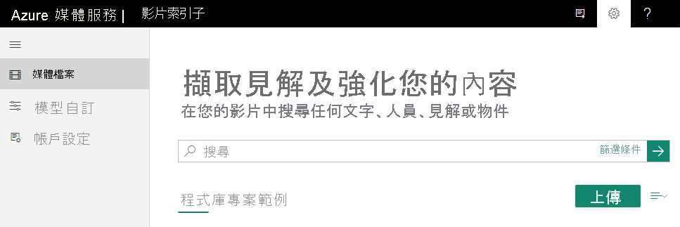

# <a name="upload-and-index-your-videos"></a>上傳影片及編製影片索引  

使用影片索引器 API 上傳視訊時，您會有下列上傳選項： 

* 從 URL 上傳您的影片 (首選)、
* 將影片檔案當作要求本文中的位元組陣列傳送、
* 藉由提供[資產識別碼](../latest/assets-concept.md)來使用現有的 Azure 媒體服務資產 (僅支援付費帳戶)。

上傳您的影片後，影片索引子 (選擇性地) 編碼) 文章中所討論的影片 (。 建立影片索引器帳戶時，您可以選擇免費試用帳戶 (您可取得特定的免費編製索引分鐘數) 或付費選項 (您不會受限於配額)。 使用免費試用時，影片索引器最多可為網站使用者提供 600 分鐘的免費編製索引，以及為 API 使用者提供 2400 分鐘的免費索引編製。 使用付費選項時，您建立的影片索引器帳戶會[連線到您的 Azure 訂用帳戶和 Azure 媒體服務帳戶](connect-to-azure.md)。 您需支付已編製索引的分鐘數，以及媒體帳戶相關費用。 

本文說明如何使用下列選項來上傳您的影片並為其編制索引：

* [使用影片索引子網站](#website) 
* [影片索引子 API](#apis)

## <a name="uploading-considerations-and-limitations"></a>上傳考量與限制
 
- 影片名稱不得超過 80 個字元。
- 若根據 URL 上傳影片 (首選)，則必須使用 TLS 1.2 (或更高版本) 來保護端點。
- 具有 URL 選項的上傳大小限制為 30GB。
- 要求 URL 長度限制為 6144 個字元，其中查詢字串 URL 長度限制為 4096 個字元。
- 具有位元組陣列選項的上傳大小限制為 2GB。
- 位元組陣列選項會在 30 分鐘後逾時。
- 在參數中提供的 URL `videoURL` 必須經過編碼。
- 編製索引媒體服務資產與從 URL 編製索引的限制相同。
- 影片索引子的最大持續時間限制為單一檔案 4 小時。
- URL 必須可供存取 (例如公用 URL)。 

    如果是私人 URL，必須在要求中提供存取權杖。
- URL 必須指向有效的媒體檔案，而不是指向網頁的連結，例如頁面的連結 `www.youtube.com` 。
- 在付費帳戶中，每分鐘最多可以上傳 50 部電影，在試用帳戶中，每分鐘最多可以上傳 5 部電影。

> [!Tip]
> 建議使用 .NET Framework 4.6.2 版。 或更高版本，因為舊版 .NET Framework 不會預設使用 TLS 1.2。
>
> 如果您必須使用舊版 .NET Framework，請在進行 REST API 呼叫之前，在程式碼中新增一行：  <br/> System.Net.ServicePointManager.SecurityProtocol = SecurityProtocolType.Tls | SecurityProtocolType.Tls11 | SecurityProtocolType.Tls12;

## <a name="supported-file-formats-for-video-indexer"></a>影片索引子支援的檔案格式

如需可與影片索引子搭配使用的檔案格式清單，請參閱[輸入容器/檔案格式](../latest/media-encoder-standard-formats.md#input-containerfile-formats)一文。

## <a name="video-files-storage"></a>影片檔案儲存體

- 使用付費的影片索引子帳戶，您可以建立連線至 Azure 訂用帳戶的影片索引子帳戶和 Azure 媒體服務帳戶。 如需詳細資訊，請參閱 [建立連線到 Azure 的影片索引子帳戶](connect-to-azure.md)。
- 影片檔案會藉由 Azure 媒體服務儲存在 Azure 儲存體中。 沒有時間限制。
- 您一律可以刪除影片和音訊檔案，以及影片索引子從這些檔案中解壓縮的任何中繼資料和見解。 當您從影片索引器刪除檔案時，該檔案和其中繼資料與見解都會從影片索引器中永久移除。 不過，如果您已在 Azure 儲存體中實作屬於自己的備份解決方案，那些檔案將會保留在您的 Azure 儲存體中。
- 無論上傳是否已從影片索引子網站或使用上傳 API 來完成，影片的持續性都完全相同。
   
## <a name="upload-and-index-a-video-using-the-video-indexer-website"></a><a name="website"></a>使用影片索引子網站上傳影片並為其編制索引

> [!NOTE]
> 影片名稱不得超過 80 個字元。

1. 登入 [Video Indexer](https://www.videoindexer.ai/) 網站。
2. 若要上傳影片，請按 [上傳]**** 按鈕或連結。

    

    上傳您的影片後，Video Indexer 會開始編製索引及分析影片。

     

    Video Indexer 完成分析後，您會收到通知，內含您的影片連結以及在影片中找到的簡短描述。 例如：人員、主題、OCR。

## <a name="upload-and-index-with-api"></a><a name="apis"></a>使用 API 上傳和編制索引

使用上 [傳影片](https://api-portal.videoindexer.ai/docs/services/operations/operations/Upload-video?) API，根據 URL 上傳影片並編制其索引。 接下來的程式碼範例包含批註化的程式碼，說明如何上傳位元組陣列。 

### <a name="configurations-and-params"></a>設定與參數

本節將說明一些選擇性參數及設定這些參數的時機。

#### <a name="externalid"></a>externalID 

此參數可讓您指定要與影片建立關聯的識別碼。 識別碼可以套用至外部的「影片內容管理」(VCM) 系統整合。 您可以使用指定的外部識別碼，搜尋位在影片索引器入口網站中的影片。

#### <a name="callbackurl"></a>callbackUrl

用來通知客戶下列事件的 URL (使用 POST 要求)：

- 索引狀態變更： 
    - 屬性：    
    
        |名稱|描述|
        |---|---|
        |id|影片識別碼|
        |state|影片狀態|  
    - 範例： HTTPs： \/ /test.com/notifyme?projectName=MyProject&識別碼 = 1234abcd&狀態 = 已處理
- 在影片中識別到的人員：
  - 屬性
    
      |名稱|描述|
      |---|---|
      |id| 影片識別碼|
      |faceId|影片索引中出現的臉部識別碼|
      |knownPersonId|臉部模型中唯一的個人識別碼|
      |personName|人員名稱|
        
    - 範例： HTTPs： \/ /test.com/notifyme?projectName=MyProject&id = 1234abcd&faceid = 12&knownPersonId = CCA84350-89B7-4262-861C-3CAC796542A5&personName = Inigo_Montoya 

##### <a name="notes"></a>注意

- 影片索引器會傳回原始 URL 中提供的任何現有參數。
- 提供的 URL 必須進行編碼。

#### <a name="indexingpreset"></a>indexingPreset

如果原始或外部錄影包含背景雜訊，請使用此參數。 此參數會用來設定索引編製程序。 您可以指定下列值：

- `AudioOnly` – 只使用音訊 (忽略視訊) 來編製索引及擷取深入解析
- `VideoOnly` -只使用影片編制索引和解壓縮見解 (忽略音訊) 
- `Default` – 使用音訊和視訊來編製索引及擷取深入解析
- `DefaultWithNoiseReduction` – 從音訊及視訊編製索引及擷取深入解析的同時，在音訊串流上套用減少雜訊演算法

> [!NOTE]
> 影片索引子最多可涵蓋兩個音訊曲目。 如果檔案中有更多音訊播放軌，則會將它們視為一個曲目。<br/>
如果您想要個別編制追蹤的索引，您必須將相關的音訊檔案解壓縮，並將其索引為 `AudioOnly` 。

價格取決於選取的索引編製選項。  

#### <a name="priority"></a>priority

影片索引器會根據影片的優先順序來為其編製索引。 請使用 **priority** 參數來指定索引的優先順序。 下列是有效值：**Low (低)**、**Normal** (一般，預設值) 和 **High (高)**。

僅有付費帳戶可支援 **Priority** 參數。

#### <a name="streamingpreset"></a>streamingPreset

上傳您的影片後，影片索引器會選擇性地對影片進行編碼。 然後，繼續進行索引編製並分析影片。 當影片索引器完成分析時，您會收到包含影片識別碼的通知。  

使用[上傳影片](https://api-portal.videoindexer.ai/docs/services/operations/operations/Upload-video?)或[重新編製影片索引](https://api-portal.videoindexer.ai/docs/services/operations/operations/Re-index-video?) API 時，其中一個選擇性參數為 `streamingPreset`。 如果您將 `streamingPreset` 設定為 `Default`、`SingleBitrate` 或 `AdaptiveBitrate`，就會觸發編碼程序。 完成編製索引及編碼工作後，影片就會發佈，因此您也可以對影片進行串流處理。 您想要串流影片的串流端點必須處於 [執行中]**** 狀態。

若為 SingleBitrate，則會依據輸出套用標準編碼器成本。 如果影片高度大於或等於720，影片索引子會將它編碼為1280x720。 否則為640x468。
預設設定為 [內容感知編碼](../latest/content-aware-encoding.md)。

若要執行編製索引及編碼工作，[連線至您影片索引器帳戶的 Azure 媒體服務帳戶](connect-to-azure.md)需要保留單元。 如需詳細資訊，請參閱[調整媒體處理](../previous/media-services-scale-media-processing-overview.md)。 由於這些都是計算密集的作業，強烈建議使用 S3 單元類型。 RU 數量會定義可以平行執行的作業數目上限。 基準建議是 10 個 S3 RU。 

如果您只想要編製影片索引，但不要對影片進行編碼，請將 `streamingPreset` 設定為 `NoStreaming`。

#### <a name="videourl"></a>videoUrl

要對其編製索引的視訊/音訊檔案 URL。 URL 必須指向媒體檔案 (不支援 HTML 網頁)。 作為 URI 一部分提供的存取權杖可以保護檔案，而處理檔案的端點必須透過 TLS 1.2 或更高版本來保護。 URL 必須進行編碼。 

如果未指定 `videoUrl`，影片索引器將預期您會以多部分/表單主體內容的形式傳遞檔案。

### <a name="code-sample"></a>程式碼範例

下列 C# 程式碼片段會示範一起使用所有影片索引器 API 的方式。

#### <a name="instructions-for-running-this-code-sample"></a>執行此程式碼範例的指示

將此程式碼複製到您的開發平臺之後，您必須提供兩個參數： API 管理驗證金鑰和影片 URL。

* API 金鑰-API 金鑰是您的個人 API 管理訂用帳戶金鑰，可讓您取得存取權杖，以便在您的影片索引子帳戶上執行作業。 

    若要取得您的 API 金鑰，請執行下列流程：

    * 巡覽到 https://api-portal.videoindexer.ai/
    * 登入
    * 前往**Products**  ->  **授權**  ->  **授權訂**用帳戶
    * 複製 **主要金鑰**
* 影片 URL –要編制索引之影片/音訊檔案的 URL。 URL 必須指向媒體檔案 (不支援 HTML 網頁)。 作為 URI 一部分提供的存取權杖可以保護檔案，而處理檔案的端點必須透過 TLS 1.2 或更高版本來保護。 URL 必須進行編碼。

成功執行程式碼範例的結果將包含深入解析小工具 URL 和播放機 widget URL，可讓您分別檢查上傳的見解和影片。 


```csharp
public async Task Sample()
{
    var apiUrl = "https://api.videoindexer.ai";
    var apiKey = "..."; // replace with API key taken from https://aka.ms/viapi

    System.Net.ServicePointManager.SecurityProtocol =
        System.Net.ServicePointManager.SecurityProtocol | System.Net.SecurityProtocolType.Tls12;

    // create the http client
    var handler = new HttpClientHandler();
    handler.AllowAutoRedirect = false;
    var client = new HttpClient(handler);
    client.DefaultRequestHeaders.Add("Ocp-Apim-Subscription-Key", apiKey);

    // obtain account information and access token
    string queryParams = CreateQueryString(
        new Dictionary<string, string>()
        {
            {"generateAccessTokens", "true"},
            {"allowEdit", "true"},
        });
    HttpResponseMessage result = await client.GetAsync($"{apiUrl}/auth/trial/Accounts?{queryParams}");
    var json = await result.Content.ReadAsStringAsync();
    var accounts = JsonConvert.DeserializeObject<AccountContractSlim[]>(json);
    
    // take the relevant account, here we simply take the first, 
    // you can also get the account via accounts.First(account => account.Id == <GUID>);
    var accountInfo = accounts.First();

    // we will use the access token from here on, no need for the apim key
    client.DefaultRequestHeaders.Remove("Ocp-Apim-Subscription-Key");

    // upload a video
    var content = new MultipartFormDataContent();
    Console.WriteLine("Uploading...");
    // get the video from URL
    var videoUrl = "VIDEO_URL"; // replace with the video URL

    // as an alternative to specifying video URL, you can upload a file.
    // remove the videoUrl parameter from the query params below and add the following lines:
    //FileStream video =File.OpenRead(Globals.VIDEOFILE_PATH);
    //byte[] buffer =new byte[video.Length];
    //video.Read(buffer, 0, buffer.Length);
    //content.Add(new ByteArrayContent(buffer));

    queryParams = CreateQueryString(
        new Dictionary<string, string>()
        {
            {"accessToken", accountInfo.AccessToken},
            {"name", "video_name"},
            {"description", "video_description"},
            {"privacy", "private"},
            {"partition", "partition"},
            {"videoUrl", videoUrl},
        });
    var uploadRequestResult = await client.PostAsync($"{apiUrl}/{accountInfo.Location}/Accounts/{accountInfo.Id}/Videos?{queryParams}", content);
    var uploadResult = await uploadRequestResult.Content.ReadAsStringAsync();

    // get the video ID from the upload result
    string videoId = JsonConvert.DeserializeObject<dynamic>(uploadResult)["id"];
    Console.WriteLine("Uploaded");
    Console.WriteLine("Video ID:");
    Console.WriteLine(videoId);

    // wait for the video index to finish
    while (true)
    {
        await Task.Delay(10000);

        queryParams = CreateQueryString(
            new Dictionary<string, string>()
            {
                {"accessToken", accountInfo.AccessToken},
                {"language", "English"},
            });

        var videoGetIndexRequestResult = await client.GetAsync($"{apiUrl}/{accountInfo.Location}/Accounts/{accountInfo.Id}/Videos/{videoId}/Index?{queryParams}");
        var videoGetIndexResult = await videoGetIndexRequestResult.Content.ReadAsStringAsync();

        string processingState = JsonConvert.DeserializeObject<dynamic>(videoGetIndexResult)["state"];

        Console.WriteLine("");
        Console.WriteLine("State:");
        Console.WriteLine(processingState);

        // job is finished
        if (processingState != "Uploaded" && processingState != "Processing")
        {
            Console.WriteLine("");
            Console.WriteLine("Full JSON:");
            Console.WriteLine(videoGetIndexResult);
            break;
        }
    }

    // search for the video
    queryParams = CreateQueryString(
        new Dictionary<string, string>()
        {
            {"accessToken", accountInfo.AccessToken},
            {"id", videoId},
        });

    var searchRequestResult = await client.GetAsync($"{apiUrl}/{accountInfo.Location}/Accounts/{accountInfo.Id}/Videos/Search?{queryParams}");
    var searchResult = await searchRequestResult.Content.ReadAsStringAsync();
    Console.WriteLine("");
    Console.WriteLine("Search:");
    Console.WriteLine(searchResult);

    // Generate video access token (used for get widget calls)
    client.DefaultRequestHeaders.Add("Ocp-Apim-Subscription-Key", apiKey);
    var videoTokenRequestResult = await client.GetAsync($"{apiUrl}/auth/{accountInfo.Location}/Accounts/{accountInfo.Id}/Videos/{videoId}/AccessToken?allowEdit=true");
    var videoAccessToken = (await videoTokenRequestResult.Content.ReadAsStringAsync()).Replace("\"", "");
    client.DefaultRequestHeaders.Remove("Ocp-Apim-Subscription-Key");

    // get insights widget url
    queryParams = CreateQueryString(
        new Dictionary<string, string>()
        {
            {"accessToken", videoAccessToken},
            {"widgetType", "Keywords"},
            {"allowEdit", "true"},
        });
    var insightsWidgetRequestResult = await client.GetAsync($"{apiUrl}/{accountInfo.Location}/Accounts/{accountInfo.Id}/Videos/{videoId}/InsightsWidget?{queryParams}");
    var insightsWidgetLink = insightsWidgetRequestResult.Headers.Location;
    Console.WriteLine("Insights Widget url:");
    Console.WriteLine(insightsWidgetLink);

    // get player widget url
    queryParams = CreateQueryString(
        new Dictionary<string, string>()
        {
            {"accessToken", videoAccessToken},
        });
    var playerWidgetRequestResult = await client.GetAsync($"{apiUrl}/{accountInfo.Location}/Accounts/{accountInfo.Id}/Videos/{videoId}/PlayerWidget?{queryParams}");
    var playerWidgetLink = playerWidgetRequestResult.Headers.Location;
     Console.WriteLine("");
     Console.WriteLine("Player Widget url:");
     Console.WriteLine(playerWidgetLink);
     Console.WriteLine("\nPress Enter to exit...");
     String line = Console.ReadLine();
     if (line == "enter")
     {
         System.Environment.Exit(0);
     }

}

private string CreateQueryString(IDictionary<string, string> parameters)
{
    var queryParameters = HttpUtility.ParseQueryString(string.Empty);
    foreach (var parameter in parameters)
    {
        queryParameters[parameter.Key] = parameter.Value;
    }

    return queryParameters.ToString();
}

public class AccountContractSlim
{
    public Guid Id { get; set; }
    public string Name { get; set; }
    public string Location { get; set; }
    public string AccountType { get; set; }
    public string Url { get; set; }
    public string AccessToken { get; set; }
}
```

### <a name="common-errors"></a>常見錯誤

下表列出上傳作業可能會傳回的狀態碼。

|狀態碼|ErrorType (在回應本文中)|描述|
|---|---|---|
|409|VIDEO_INDEXING_IN_PROGRESS|指定帳戶中已有正在處理的相同影片。|
|400|VIDEO_ALREADY_FAILED|不到 2 小時前，指定帳戶中有相同的影片處理失敗。 API 用戶端應該等待至少 2 小時，才能重新上傳影片。|
|429||試用帳戶每分鐘允許5次上傳。 每分鐘允許付費帳戶50上傳。|

## <a name="next-steps"></a>後續步驟

[檢查 API 所產生的 Azure 影片索引子輸出](video-indexer-output-json-v2.md)
