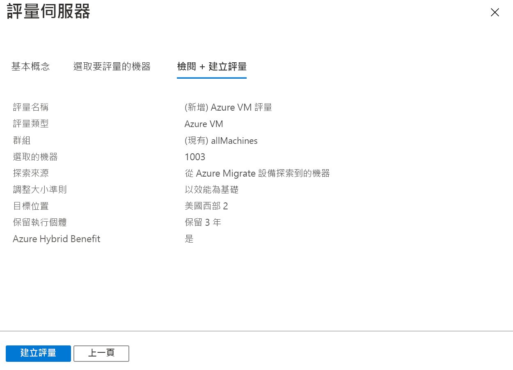

# <a name="assess-vmware-vms-by-using-azure-migrate-server-assessment"></a>使用 Azure Migrate 伺服器評估來評估 VMware VM

本文說明如何使用 [Azure Migrate：伺服器評量](migrate-services-overview.md#azure-migrate-server-assessment-tool)工具來評估內部部署 VMware 虛擬機器 (VM)。


本教學課程是一個系列中的第二篇，會示範如何評估 VMware VM 並將其遷移至 Azure。 在本教學課程中，您會了解如何：
> [!div class="checklist"]
> * 設定 Azure Migrate 專案。
> * 設定內部部署環境中執行的 Azure Migrate 設備來評估 VM。
> * 開始連續探索內部部署 VM。 設備會將探索到的 VM 組態和效能資料傳送至 Azure。
> * 將探索到的 VM 群組在一起，然後評估該 VM 群組。
> * 檢閱評估結果。

> [!NOTE]
> 教學課程將會針對案例示範最簡單的部署路徑，讓您可以快速設定概念證明。 教學課程在情況允許時都會使用預設選項，且不會顯示所有可能的設定與路徑。 如需詳細指示，請檢閱操作說明文章。

如果您沒有 Azure 訂用帳戶，請在開始前建立[免費帳戶](https://azure.microsoft.com/pricing/free-trial/)。

## <a name="prerequisites"></a>Prerequisites

- [完成](tutorial-prepare-vmware.md)本系列的第一個教學課程。 如果未完成，本教學課程中的指示便沒有作用。
- 您在第一個教學課程中應該已完成下列作業：
    - [準備 Azure](tutorial-prepare-vmware.md#prepare-azure) 以使用 Azure Migrate。
    - [準備VMware 以進行評量](tutorial-prepare-vmware.md#prepare-for-vmware-vm-assessment)。 這包括檢查 VMware 設定、設定 Azure Migrate 可用來存取 vCenter Server 的帳戶。
    - [確認](tutorial-prepare-vmware.md#verify-appliance-settings-for-assessment)您需要哪些內容，才能部署 VMware 評量所需的 Azure Migrate 設備。

## <a name="set-up-an-azure-migrate-project"></a>設定 Azure Migrate 專案

設定新的 Azure Migrate 專案，如下所示：

1. 在 Azure 入口網站 > [所有服務]  中，搜尋 **Azure Migrate**。
1. 在 [服務]  下，選取 [Azure Migrate]  。
1. 在 [概觀]  的 [探索、評估和遷移伺服器]  底下，選取 [評估和遷移伺服器]  。

   

1. 在 [開始使用]  中，選取 [新增工具]  。
1. 在 [Migrate 專案]  中選取您的 Azure 訂用帳戶，並建立資源群組 (如果您還沒有的話)。     
1. 在 [專案詳細資料]  中，指定專案名稱以及要在其中建立專案的地理位置。 支援亞洲、歐洲、英國和美國。

   專案地理區域只會用來儲存從內部部署 VM 收集到的中繼資料。 當您執行移轉時，可以選取任何目的地區域。

   

1. 選取 [下一步]  。
1. 在 [選取評量工具]  中，選取 **[Azure Migrate：伺服器評量]**  > [下一步]  。

   

1. 在 [選取移轉工具]  中，選取 [暫時跳過新增移轉工具]   > [下一步]  。
1. 在 [檢閱 + 新增工具]  中檢閱設定，然後選取 [新增工具]  。
1. 等候幾分鐘讓 Azure Migrate 專案完成部署。 您會進入專案頁面。 如果您沒有看到專案，則可以從 Azure Migrate 儀表板中的 [伺服器]  來存取。

## <a name="set-up-the-azure-migrate-appliance"></a>設定 Azure Migrate 設備

Azure Migrate：伺服器評量會使用輕量的 Azure Migrate 設備。 設備會執行 VM 探索，並將 VM 的中繼資料和效能資料傳送至 Azure Migrate。
- 您可以使用下載的 OVA 範本，在 VMware VM 上設定設備。 或者，您也可以使用 PowerShell 安裝程式指令碼，在 VM 或實體機器上設定設備。
- 本教學課程會使用 OVA 範本。 如果您想要使用指令碼來設定設備，請參閱[本文](deploy-appliance-script.md)。

建立設備之後，您會檢查其是否可以連線到 Azure Migrate：伺服器評量、進行第一次設，以及向 Azure Migrate 專案註冊設備。


### <a name="download-the-ova-template"></a>下載 OVA 範本

1. 在 [移轉目標]   > [伺服器]   >  **[Azure Migrate：伺服器評估]** 中，選取 [探索]  。
1. 在 [探索機器]   > [機器是否已虛擬化?]  中，選取 [是，使用 VMWare vSphere Hypervisor]  。
1. 選取 [下載]  以下載 OVA 範本檔案。

   

### <a name="verify-security"></a>確認安全性

請先確認 OVA 檔案是安全的，再進行部署：

1. 在存放下載檔案的目標電腦上，開啟系統管理員命令視窗。
1. 執行下列命令以產生 OVA 檔案的雜湊：
  
   ```C:\>CertUtil -HashFile <file_location> [Hashing Algorithm]```
   
   使用方式範例：```C:\>CertUtil -HashFile C:\AzureMigrate\AzureMigrate.ova SHA256```

針對版本 2.19.07.30，產生的雜湊應符合這些值：

**演算法** | **雜湊值**
--- | ---
MD5 | c06ac2a2c0f870d3b274a0b7a73b78b1
SHA256 | 4ce4faa3a78189a09a26bfa5b817c7afcf5b555eb46999c2fad9d2ebc808540c

### <a name="create-the-appliance-vm"></a>建立設備 VM

匯入所下載的檔案，並建立 VM：

1. 在 vSphere 用戶端主控台中，選取 [檔案]   > [部署 OVF 範本]  。

   

1. 在 [部署 OVF 範本精靈] > [來源]  中，指定 OVA 檔案的位置。
1. 在 [名稱]   和 [位置] 中，指定 VM 的易記名稱。 選取將裝載 VM 的庫存物件。
1. 在 [主機/叢集]  中，指定 VM 的執行所在主機或叢集。
1. 在**儲存體**中，指定 VM 的儲存目的地。
1. 在 [磁碟格式]  中，指定磁碟類型和大小。
1. 在 [網路對應]  中，指定 VM 所要連線的網路。 此網路必須能夠連線到網際網路，以將中繼資料傳送至 Azure Migrate 伺服器評估。
1. 檢閱並確認設定，然後選取 [完成]  。

### <a name="verify-appliance-access-to-azure"></a>確認設備是否能存取 Azure

請確定設備 VM 可以連線至 [Azure URL](migrate-appliance.md#url-access)。

### <a name="configure-the-appliance"></a>設定設備

第一次設定設備。

> [!NOTE]
> 如果您使用 [PowerShell 指令碼](deploy-appliance-script.md)來設定設備 (而非使用下載的 OVA)，則此程序中的前兩個步驟將與之無關。

1. 在 vSphere 用戶端主控台中，以滑鼠右鍵按一下 VM，然後選取 [開啟主控台]  。
1. 提供設備的語言、時區和密碼。
1. 在任何可連線至 VM 的機器上開啟瀏覽器，並開啟設備 Web 應用程式的 URL：**https://設備名稱或 IP 位址  :44368**。

   或者，您也可以選取應用程式捷徑，從設備桌面開啟應用程式。
1. 在 [Web 應用程式] > [設定必要條件]  中，執行下列動作：
   - **授權**：接受授權條款，並閱讀第三方資訊。
   - **連線能力**：應用程式會確認 VM 是否能夠存取網際網路。 如果 VM 使用 Proxy：
     - 選取 [Proxy 設定]  ，然後以 http://ProxyIPAddress 或 http://ProxyFQDN 格式指定 Proxy 位址和接聽連接埠。
     - 如果 Proxy 需要驗證，請指定認證。
     - 請注意，僅支援 HTTP Proxy。
   - **時間同步**：設備上的時間應該與網際網路時間同步，探索才能正常運作。
   - **安裝更新**：設備會確保已安裝最新的更新。
   - **安裝 VDDK**：設備會檢查是否已安裝 VMWare vSphere 虛擬磁碟開發套件 (VDDK)。 如果未安裝，則會從 VMware 下載 VDDK 6.7，並將下載的 zip 內容解壓縮到設備上的指定位置。

     在遷移至 Azure 期間，Azure Migrate 伺服器移轉會使用 VDDK 來複寫機器。       

### <a name="register-the-appliance-with-azure-migrate"></a>向 Azure Migrate 註冊設備

1. 選取 [登入]  。 如果未出現，請確定您已在瀏覽器中停用快顯封鎖程式。
1. 在新的索引標籤上，使用您的 Azure 使用者名稱和密碼登入。
   
   不支援使用 PIN 登入。
1. 成功登入後，返回 Web 應用程式。
1. 選取 Azure Migrate 專案建立所在的訂用帳戶，然後選取專案。
1. 指定設備的名稱。 名稱應該是英數位元，且長度不超過 14 個字元。
1. 選取 [註冊]  。


## <a name="start-continuous-discovery"></a>開始連續探索

設備必須連線到 vCenter Server，才能探索 VM 的設定與效能資料。

### <a name="specify-vcenter-server-details"></a>指定 vCenter Server 詳細資料
1. 在 [指定 vCenter Server 詳細資料]  中，指定 vCenter Server 執行個體的名稱 (FQDN) 或 IP 位址。 您可以保留預設的連接埠，或指定 vCenter Server 接聽的自訂連接埠。
2. 在 [使用者名稱]  和 [密碼]  中，指定設備要用來在 vCenter Server 執行個體上探索 VM 的 vCenter Server 帳戶認證。 

    - 您應該已在[上一個教學課程](tutorial-prepare-vmware.md#set-up-an-account-for-assessment)中設定具有必要權限的帳戶。
    - 如果您想要將探索範圍限定成特定的 VMware 物件 (vCenter Server 資料中心、叢集、叢集的資料夾、主機、主機的資料夾或個別的 VM)，請參閱本文的[指示](set-discovery-scope.md)來限制 Azure Migrate 所使用的帳戶。

3. 選取 [驗證連線]  以確定設備可以連線到 vCenter Server。
4. 在 [探索 VM 上的應用程式和相依性]  中，選擇性地按一下 [新增認證]  ，並指定與認證相關的作業系統，以及認證的使用者名稱和密碼。 然後按一下 [新增]  。

    - 如果您已建立可用於[應用程式探索功能](how-to-discover-applications.md)，或[無代理程式相依性分析功能](how-to-create-group-machine-dependencies-agentless.md)的認證，您可以選擇性地在此新增認證。
    - 如果您不使用這些功能，則可以略過這項設定。
    - 請檢閱[應用程式探索](migrate-support-matrix-vmware.md#application-discovery)或[無代理程式分析](migrate-support-matrix-vmware.md#agentless-dependency-analysis-requirements)所需的認證。

5. **儲存並啟動探索**，即可啟動 VM 探索。

探索的運作方式如下：
- 所探索到的 VM 中繼資料會在大約 15 分鐘後出現在入口網站中。
- 探索已安裝的應用程式、角色和功能需要花一點時間。 時間長短取決於所探索的 VM 數目。 針對 500 部 VM，應用程式清查大約需要一小時才會出現在 Azure Migrate 入口網站中。

### <a name="verify-vms-in-the-portal"></a>在入口網站中確認 VM

探索完成後，便可以確認 VM 是否出現在 Azure 入口網站中：

1. 開啟 Azure Migrate 儀表板。
1. 在 Azure Migrate - 伺服器   >  **Azure Migrate：伺服器評估** 中，選取圖示以顯示 探索到的伺服器  計數。

## <a name="set-up-an-assessment"></a>設定評估

您可以使用 Azure Migrate 伺服器評估來建立兩種評估：

**評量** | **詳細資料** | **Data**
--- | --- | ---
**以效能為基礎** | 以所收集效能資料為基礎的評估 | **建議的 VM 大小**：以 CPU 和記憶體使用量資料為基礎。<br/><br/> **建議的磁碟類型 (標準或進階受控磁碟**)：以內部部署磁碟的 IOPS 和輸送量為基礎。
**作為內部部署** | 以內部部署大小調整為基礎的評估 | **建議的 VM 大小**：以內部部署 VM 大小為基礎。<br/><br> **建議的磁碟類型**：以您為評估選取的儲存體類型設定為基礎。

## <a name="run-an-assessment"></a>執行評估

執行評估，如下所示：

1. 檢閱適用於建立評估的[最佳做法](best-practices-assessment.md)。
1. 在 [伺服器]  索引標籤的 **[Azure Migrate：伺服器評估]** 圖格中，選取 [評估]  。

   ![[評估] 按鈕的位置](./media/tutorial-assess-vmware/assess.png)

1. 在 [評估伺服器]  中，指定評估的名稱。
1. 選取 [檢視全部]  ，然後檢閱評估屬性。

   

1. 在 [選取或建立群組]  中，選取 [新建]  ，然後指定群組名稱。 群組會將一或多個 VM 收集在一起以進行評估。
1. 在 [將機器新增至群組]  中，選取要新增至群組的 VM。
1. 選取 [建立評估]  以建立群組，然後執行評估。

   

1. 評量建立好之後，可在 [伺服器]   >  **[Azure Migrate：伺服器評量]**  > [評量]  中加以檢視。
1. 選取 [匯出評估]  ，將其下載為 Excel 檔案。

## <a name="review-an-assessment"></a>檢閱評量

評量會說明：

- **Azure 移轉整備程度**：VM 是否適合移轉至 Azure。
- **每月成本預估**：在 Azure 中執行 VM 的預估每月計算和儲存體成本。
- **每月儲存體成本預估**：移轉之後的磁碟儲存體預估成本。

若要檢視評估：

1. 在 [移轉目標]   > [伺服器]  中，選取 [Azure Migrate：伺服器評估]  中的 [評估]  。
1. 在 [評估]  中，選取評估來加以開啟。

   

### <a name="review-azure-readiness"></a>檢閱 Azure 移轉整備程度

1. 在 [Azure 移轉整備程度]  中，確認 VM 是否已準備好移轉至 Azure。
1. 檢查 VM 狀態：
    - **可供 Azure 使用**：當 Azure Migrate 針對評估中的 VM 建議 VM 大小和成本估計值時會用到。
    - **有條件的備妥**：顯示問題和建議的補救措施。
    - **未備妥供 Azure 使用**：顯示問題和建議的補救措施。
    - **移轉整備程度未知**：當 Azure Migrate 因資料可用性問題而無法評估整備程度時，便會使用此狀態。

1. 選取 [Azure 移轉整備程度]  狀態。 您可以檢視 VM 移轉整備程度的詳細資料。 您也可以向下切入以查看 VM 詳細資料，包括計算、儲存體和網路設定。

### <a name="review-cost-details"></a>檢閱成本詳細資料

此評估摘要會顯示在 Azure 中執行 VM 的計算和儲存體預估成本。 系統會針對評估群組中的所有 VM 匯總成本。 您可以向下切入以查看特定 VM 的成本詳細資料。

> [!NOTE]
> 系統會根據機器的大小建議、其磁碟和其屬性來預估成本。 此估計適用於執行內部部署 VM 來作為 IaaS Vm。 Azure Migrate 伺服器評估不會考慮 PaaS 或 SaaS 的成本。

所評估群組的彙總儲存體成本會分割為不同類型的儲存體磁碟。 

### <a name="review-confidence-rating"></a>檢閱信賴評等

Azure Migrate 伺服器評估會對以效能為基礎的評估指派信賴評等，分數為 1 顆星 (最低) 到 5 顆星 (最高)。


信賴評等可協助您預估評估的大小建議是否可靠。 此評等會以計算評估所需的資料點可用性作為基礎：

**資料點可用性** | **信賴評等**
--- | ---
0%-20% | 1 顆星
21%-40% | 2 顆星
41%-60% | 3 顆星
61%-80% | 4 顆星
81%-100% | 5 顆星

[了解](best-practices-assessment.md#best-practices-for-confidence-ratings)信賴評等的最佳做法。

## <a name="next-steps"></a>後續步驟

在本教學課程中，您已設定 Azure Migrate 設備。 您也已經建立和檢閱評估。

若要了解如何使用 Azure Migrate 伺服器移轉將 VMware VM 遷移至 Azure，請繼續進行本系列的第三個教學課程：

> [!div class="nextstepaction"]
> [遷移 VMware VM](./tutorial-migrate-vmware.md)
