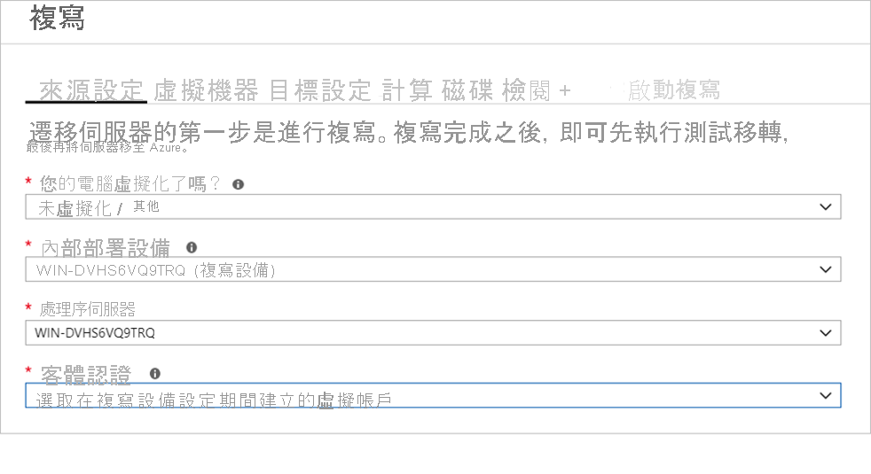

# <a name="discover-assess-and-migrate-google-cloud-platform-gcp-vms-to-azure"></a>探索和評估 Google Cloud Platform (GCP) VM 並將其遷移至 Azure

本教學課程示範如何使用 Azure Migrate 來探索、評估 Google Cloud Platform (GCP) 虛擬機器 (VM)，並將其遷移至 Azure VM：伺服器評量和 Azure Migrate：伺服器移轉工具。

在本教學課程中，您將學會如何：
> [!div class="checklist"]
>
> * 驗證移轉的必要條件。
> * 使用 Azure Migrate 來準備 Azure 資源：伺服器移轉。 設定 Azure 帳戶和資源的權限，以搭配使用 Azure Migrate。
> * 準備 GCP VM 執行個體以進行遷移。
> * 新增 Azure Migrate：伺服器移轉工具，位於 Azure Migrate 中樞內。
> * 設定複寫設備並部署設定伺服器。
> * 在您要遷移的 GCP VM 上安裝行動服務。
> * 啟用 VM 複寫。
> * 追蹤並監視複寫狀態。 
> * 執行測試移轉，確定一切都沒問題。
> * 執行對 Azure 的完整移轉。

如果您沒有 Azure 訂用帳戶，請在開始前建立[免費帳戶](https://azure.microsoft.com/pricing/free-trial/)。

## <a name="discover-and-assess"></a>探索和評估

遷移至 Azure 之前，建議您先執行 VM 探索和移轉評量。 此評量可協助您將 GCP VM 調整為適當大小來遷移至 Azure，並預估潛在的 Azure 執行成本。

設定評量，如下所示：

1. 請遵循[教學課程](./tutorial-discover-gcp.md)來設定 Azure，並準備 GCP VM 來進行評量。 請注意：

    - Azure Migrate 在探索 GCP VM 執行個體時，會使用密碼驗證。 依預設，GCP 執行個體不支援密碼驗證。 您必須先啟用密碼驗證，才可以進行探索。
        - 針對 Windows 電腦，允許 WinRM 連接埠 5985 (HTTP)。 這會允許遠端 WMI 呼叫。
        - 針對 Linux 電腦：
            1. 登入每一部 Linux 電腦。
            2. 開啟 sshd_config 檔案：vi /etc/ssh/sshd_config
            3. 在檔案中，找出 **PasswordAuthentication** 行，並將值變更為 **yes**。
            4. 儲存並關閉檔案。 重新啟動 ssh 服務
    - 如果您使用根使用者來探索 Linux VM，請確定已允許在 VM 上進行根登入。
        1. 登入每一部 Linux 電腦
        2. 開啟 sshd_config 檔案：vi /etc/ssh/sshd_config
        3. 在檔案中，找出 **PermitRootLogin** 行，並將值變更為 **yes**。
        4. 儲存並關閉檔案。 重新啟動 ssh 服務

2. 然後，遵循此[教學課程](./tutorial-assess-gcp.md)來設定 Azure Migrate 專案和設備，以探索及評估您的 GCP VM。

雖然我們建議您嘗試進行評量，但執行評量並不是遷移 VM 的必要步驟。


## <a name="prerequisites"></a>Prerequisites 

- 確定您想要遷移的 GCP VM 正執行支援的 OS 版本。 基於此移轉的目的，我們會將 GCP VM 視為實體機器來處理。 請檢閱實體伺服器移轉工作流程[支援的作業系統和核心版本](../site-recovery/vmware-physical-azure-support-matrix.md#replicated-machines)。 您可以使用標準命令，例如 hostnamectl 或 uname -a 來檢查 Linux VM 的 OS 和核心版本。  建議您執行測試移轉來驗證 VM 是否如預期般運作，然後再繼續進行實際的移轉。
- 請確定您的 GCP VM 符合[支援的設定](./migrate-support-matrix-physical-migration.md#physical-server-requirements)，以順利遷移至 Azure。
- 確認您複寫到 Azure 的 GCP VM 符合 [Azure VM 需求](./migrate-support-matrix-physical-migration.md#azure-vm-requirements)。
- 在您將 VM 遷移至 Azure 之前，VM 需要進行一些變更。
    - 在某些作業系統上，Azure Migrate 會自動進行這些變更。
    - 請務必先進行這些變更再開始移轉。 如果您先遷移 VM 再進行變更，VM 可能無法在 Azure 中啟動。
請參閱您所需進行的 [Windows](prepare-for-migration.md#windows-machines) 和 [Linux](prepare-for-migration.md#linux-machines) 變更。

### <a name="prepare-azure-resources-for-migration"></a>準備 Azure 資源以進行移轉

準備 Azure 以使用 Azure Migrate：伺服器移轉工具來進行移轉。

**Task** | **詳細資料**
--- | ---
**建立 Azure Migrate 專案** | 您的 Azure 帳戶需要參與者或擁有者權限，才能[建立新專案](https://docs.microsoft.com/azure/migrate/create-manage-projects)。
**驗證您 Azure 帳戶的權限** | 您的 Azure 帳戶必須有建立 VM 以及寫入至 Azure 受控磁碟的權限。

### <a name="assign-permissions-to-create-project"></a>指派建立專案的權限

1. 在 Azure 入口網站中開啟訂用帳戶，然後選取 [存取控制 (IAM)]。
2. 在 [檢查存取權] 中，尋找相關的帳戶，然後按一下以查看權限。
3. 您應該會具有「參與者」或「擁有者」權限。
    - 如果您剛建立免費的 Azure 帳戶，您就是訂用帳戶的擁有者。
    - 如果您不是訂用帳戶擁有者，請與擁有者合作以指派角色。

### <a name="assign-azure-account-permissions"></a>指派 Azure 帳戶權限

將「虛擬機器參與者」角色指派給 Azure 帳戶。 這會提供權限給：

- 在所選的資源群組中建立 VM。
- 在所選的虛擬網路中建立 VM。
- 寫入至 Azure 受控磁碟。 

### <a name="create-an-azure-network"></a>建立 Azure 網路

[設定](../virtual-network/manage-virtual-network.md#create-a-virtual-network) Azure 虛擬網路 (VNet)。 當您複寫至 Azure 時，所建立的 Azure VM 會加入至您設定移轉時所指定的 Azure VNet。

## <a name="prepare-gcp-instances-for-migration"></a>準備 GCP 執行個體以進行遷移

若要針對 GCP 至 Azure 的移轉作準備，您需要準備和部署複寫設備以進行移轉。

### <a name="prepare-a-machine-for-the-replication-appliance"></a>準備複寫設備的機器

Azure Migrate：伺服器移轉會使用複寫設備將機器複寫至 Azure。 複寫設備會執行下列元件。

- **設定伺服器**：設定伺服器會協調 GCP VM 與 Azure 之間的通訊，以及管理資料複寫。
- **處理序伺服器**：處理序伺服器可作為複寫閘道。 負責接收複寫資料，以快取、壓縮和加密進行最佳化，然後將其傳送至 Azure 中的快取儲存體帳戶。

準備設備部署，如下所示：

- 設定個別的 GCP VM 來裝載複寫設備。 此執行個體必須執行 Windows Server 2012 R2 或 Windows Server 2016。 [請參閱](./migrate-replication-appliance.md#appliance-requirements)設備的硬體、軟體和網路需求。
- 設備不應該安裝在您想要複寫的來源 VM 上，也不應該安裝在您先前已安裝的 Azure Migrate 探索和評估設備上。 應該部署在不同的 VM 上。
- 要遷移的來源 GCP VM 應該能透過網路直達複寫設備。 設定必要的防火牆規則以啟用此功能。 建議您將複寫設備和要遷移的來源 VM 部署在相同的 VPC 網路中。 如果複寫設備必須位於不同的 VPC，則這些 VPC 必須透過 VPC 對等互連來連線。
- 來源 GCP VM 會在連接埠 HTTPS 443 (控制通道協調流程) 和用於輸入的 TCP 9443 (資料傳輸) 上與複寫設備通訊，以管理複寫和傳輸複寫資料。 複寫設備接著會透過連接埠 HTTPS 443 (輸出) 來協調複寫資料，並將其傳送至 Azure。 若要設定這些規則，請使用適當的連接埠和來源 IP 資訊來編輯安全性群組的輸入/輸出規則。

   
     
 
   

- 複寫設備會使用 MySQL。 檢閱在設備上安裝 MySQL 的[選項](migrate-replication-appliance.md#mysql-installation)。
- 檢閱複寫設備存取[公用](migrate-replication-appliance.md#url-access)和[政府](migrate-replication-appliance.md#azure-government-url-access)雲端所需的 Azure URL。

## <a name="set-up-the-replication-appliance"></a>設定複寫設備

移轉的第一個步驟是設定複寫設備。 若要設定設備以進行 GCP VM 移轉，您必須下載設備的安裝程式檔案，然後在[您準備的 VM](#prepare-a-machine-for-the-replication-appliance) 上執行該檔案。

### <a name="download-the-replication-appliance-installer"></a>下載複寫設備安裝程式

1. 在 [Azure Migrate 專案] > [伺服器] 的 **[Azure Migrate：伺服器移轉]** 中，按一下 [探索]。

    

2. 在 [探索機器] > [機器是否已虛擬化?] 中，按一下 [未虛擬化/其他]。
3. 在 [目標區域] 中，選取您要將機器遷移到的 Azure 區域。
4. 選取 [確認移轉的目標區域為 <region-name>]。
5. 按一下 [建立資源]。 這會在背景中建立 Azure Site Recovery 保存庫。
    - 如果您已使用「Azure Migrate 伺服器移轉」來設定移轉，則無法設定目標選項，因為先前已設定資源。
    - 按一下此按鈕後，即無法變更此專案的目標區域。
    - 若要將您的 VM 遷移至不同的區域，您必須建立新的/不同的 Azure Migrate 專案。

6. 在 [是否要安裝新的複寫設備?] 中，選取 [安裝複寫設備]。
7. 在 [下載並安裝複寫設備軟體] 中，下載設備安裝程式和註冊金鑰。 您必須要有金鑰，才能註冊設備。 此金鑰在下載後有五天的有效期。

    

8. 將設備安裝程式檔案和金鑰檔案複製到您為複寫設備建立的 Windows Server 2016 或 Windows Server 2012 GCP VM。
9. 依照下一個程序中的說明，執行複寫設備安裝檔案。  
    9.1. 在 [開始之前] 下，選取 [安裝設定伺服器和處理序伺服器]，然後選取 [下一步]。   
    9.2 在 [第三方軟體授權] 中，選取 [我接受第三方授權合約]，然後選取 [下一步]。   
    9.3 在 [註冊] 中，選取 [瀏覽]，然後移至您放置保存庫註冊金鑰檔的位置。 選取 [下一步] 。  
    9.4 在 [網際網路設定] 中，選取 [不使用 Proxy 伺服器而連線到 Azure Site Recovery]，然後選取 [下一步]。  
    9.5 [檢查必要條件] 頁面會檢查數個項目。 完成時，選取 [下一步]。  
    9.6 在 [MySQL 組態] 中，提供 MySQL DB 的密碼，然後選取 [下一步]。  
    9.7 在 [環境詳細資料] 中，選取 [否]。 您不需要保護 VM。 然後，選取 [下一步]。  
    9.8 在 [安裝位置] 中，選取 [下一步] 接受預設值。  
    9.9 在 [選取網路] 中，選取 [下一步] 接受預設值。  
    9.10 在 [摘要] 中，選取 [安裝]。   
    9.11 [安裝進度] 會顯示安裝程序相關資訊。 完成時，選取 [完成]。 視窗會顯示重新開機的相關訊息。 選取 [確定]。   
    9.12 接下來，視窗會顯示有關組態伺服器連線複雜密碼的訊息。 將複雜密碼複製到剪貼簿，並將複雜密碼儲存在來源 VM 上的暫存文字檔中。 您稍後會在行動服務安裝程序期間用到此複雜密碼。
10. 安裝完成之後，系統會自動啟動設備設定精靈 (您也可以使用在設備桌面上建立的 cspsconfigtool 捷徑來手動啟動精靈)。 使用精靈的 [管理帳戶] 索引標籤，新增要用於行動服務推送安裝的帳戶詳細資料。 在本教學課程中，我們將在要複寫的來源 VM 上手動安裝行動服務，因此請在此步驟中建立虛擬帳戶並繼續進行。 您可以提供下列詳細資料，以建立虛擬帳戶：「來賓」作為易記名稱、「使用者名稱」作為使用者名稱，以及「密碼」作為帳戶的密碼。 您將會在啟用複寫階段中使用此虛擬帳戶。 
11. 在安裝後重新啟動設備之後，在 [探索機器] 的 [選取組態伺服器] 中選取新設備，然後按一下 [完成註冊]。 完成註冊作業會執行數項最終工作，以備妥複寫設備。

    

## <a name="install-the-mobility-service"></a>安裝行動服務

行動服務代理程式必須安裝在要遷移的來源 GCP VM 上。 代理程式安裝程式可在複寫設備上取得。 您必須找出正確的安裝程式，並在要遷移的每個機器上安裝代理程式。 做法如下所示：

1. 登入複寫設備。
2. 瀏覽至 **%ProgramData%\ASR\home\svsystems\pushinstallsvc\repository**。
3. 尋找來源 GCP VM 作業系統和版本適用的安裝程式。 檢閱[支援的作業系統](../site-recovery/vmware-physical-azure-support-matrix.md#replicated-machines)。
4. 將安裝程式檔案複製到要遷移的來源 GCP VM。
5. 請確定您已儲存安裝複寫設備時所建立的複雜密碼文字檔。
    - 如果您忘記儲存複雜密碼，您可以使用此步驟來查看複寫設備上的複雜密碼。 從命令列執行 **C:\ProgramData\ASR\home\svsystems\bin\genpassphrase.exe -v**，可檢視目前的複雜密碼。
    - 現在，將此複雜密碼複製到剪貼簿，並將其儲存在來源 VM 上的暫存文字檔中。

### <a name="installation-guide-for-windows-gcp-vms"></a>Windows GCP VM 的安裝指南

1. 將安裝程式檔案的內容解壓縮到 GCP VM 上的本機資料夾 (例如 C:\Temp)，如下所示：

    ```
    ren Microsoft-ASR_UA*Windows*release.exe MobilityServiceInstaller.exe
    MobilityServiceInstaller.exe /q /x:C:\Temp\Extracted
    cd C:\Temp\Extracted
    ```  

2. 執行行動服務安裝程式：
    ```
   UnifiedAgent.exe /Role "MS" /Silent
    ```  

3. 將代理程式註冊至複寫設備：
    ```
    cd C:\Program Files (x86)\Microsoft Azure Site Recovery\agent
    UnifiedAgentConfigurator.exe  /CSEndPoint <replication appliance IP address> /PassphraseFilePath <Passphrase File Path>
    ```

### <a name="installation-guide-for-linux-gcp-vms"></a>Linux GCP VM 的安裝指南

1. 將安裝程式 tarball 的內容解壓縮到 GCP VM 上的本機資料夾 (例如 /tmp/MobSvcInstaller)，如下所示：
    ```
    mkdir /tmp/MobSvcInstaller
    tar -C /tmp/MobSvcInstaller -xvf <Installer tarball>
    cd /tmp/MobSvcInstaller
    ```  

2. 執行安裝程式指令碼：
    ```
    sudo ./install -r MS -q
    ```  

3. 將代理程式註冊至複寫設備：
    ```
    /usr/local/ASR/Vx/bin/UnifiedAgentConfigurator.sh -i <replication appliance IP address> -P <Passphrase File Path>
    ```

## <a name="enable-replication-for-gcp-vms"></a>啟用 GCP VM 複寫

> [!NOTE]
> 透過入口網站，您可以一次新增最多 10 個 VM 來進行複寫。 若要同時複寫更多 VM，您可以分為 10 個批次來新增 VM。

1. 在 [Azure Migrate 專案] > [伺服器]、 **[Azure Migrate：伺服器移轉]** 中，按一下 [複寫]。

    

2. 在 [複寫] > [來源設定][您的電腦虛擬化了嗎] >  中，選取 [未虛擬化/其他]。
3. 在 [內部部署設備] 中，選取您設定的 Azure Migrate 設備的名稱。
4. 在 [處理序伺服器] 中，選取複寫設備的名稱。 
5. 在 **來賓認證** 中，請選取先前在 [複寫安裝程式安裝](#download-the-replication-appliance-installer)期間建立的虛擬帳戶以手動安裝行動服務 (不支援推送安裝)。 然後按 [下一步：**虛擬機器]** 。   
 
    
6. 在 [虛擬機器] 的 [從評量匯入移轉設定?] 中，保留預設設定 [否，我將手動指定移轉設定]。
7. 檢查您要遷移的每個 VM。 然後按 [下一步：目標設定]。

    

8. 在 [目標設定] 中，選取訂用帳戶、您的遷移目標區域，並指定 Azure VM 在移轉後所在的資源群組。
9. 在 [虛擬網路] 中，選取 Azure VM 在移轉後所將加入的 Azure VNet/子網路。
10. 在 **可用性選項** 中，選取：
    -  可用性區域，將已遷移的機器釘選到該區域中特定的可用性區域。 使用此選項可將形成多節點應用程式層的伺服器散發到可用性區域。 如果選取此選項，則必須在計算索引標籤中指定要用於每部所選電腦的可用性區域。只有選取要移轉的目的地區域支援可用性區域時，才可以使用此選項
    -  可用性設定組，可將遷移的電腦放在可用性設定組中。 選取的目標資源群組必須有一或多個可用性設定組，才能使用此選項。
    - 如果您不需要為已遷移的電腦提供任何一種可用性設定，則不需要任何基礎結構備援選項。
11. 在 **磁碟加密類型** 中，選取：
    - 使用平台代控金鑰加密待用資料
    - 使用客戶自控金鑰加密待用資料
    - 使用平台管理和客戶管理的金鑰進行雙重加密

   > [!NOTE]
   > 若要使用 CMK 複寫 VM，您必須在目標資源群組下[建立磁碟加密集](https://go.microsoft.com/fwlink/?linkid=2151800)。 磁碟加密設定物件會將受控磁碟對應至包含要用於 SSE 之 CMK 的 Key Vault。
  
12. 在 [Azure Hybrid Benefit] 中：

    - 如果您不想套用 Azure Hybrid Benefit，請選取 [否]。 然後按一下 [下一步]  。
    - 如果您有 Windows Server 機器涵蓋於有效的軟體保證或 Windows Server 訂用帳戶下，且您想要將權益套用至要移轉的機器，請選取 [是]。 然後按一下 [下一步]  。

    

13. 請檢閱 **計算** 中的 VM 名稱、大小、OS 磁碟類型和可用性設定 (如果有在上一個步驟中選取)。 VM 必須符合 [Azure 需求](migrate-support-matrix-physical-migration.md#azure-vm-requirements)。

    - **VM 大小**：如果您使用評估建議，[VM 大小] 下拉式清單會顯示建議的大小。 否則，Azure Migrate 會根據 Azure 訂用帳戶中最接近的相符項來選擇大小。 或者，您可以在 [Azure VM 大小] 中手動選擇大小。
    - **OS 磁碟**：指定 VM 的 OS (開機) 磁碟。 OS 磁碟是具有作業系統開機載入器和安裝程式的磁碟。
    - **可用性區域**：指定要使用的可用性區域。
    - **可用性設定組**：指定要使用的可用性設定組。


14. 在 [磁碟] 中，指定是否應將 VM 磁碟複寫至 Azure，並選取 Azure 中的磁碟類型 (標準 SSD/HDD 或進階受控磁碟)。 然後按一下 [下一步]  。
    - 您可以從複寫排除磁碟。
    - 如果您排除磁碟，則在移轉後磁碟將不會出現在 Azure VM 上。 

    

15. 在 [檢閱並啟動複寫] 中檢閱設定，然後按一下 [複寫] 以啟動伺服器的初始複寫。

> [!NOTE]
> 您可以在複寫開始之前隨時更新複寫設定 (經由 [管理] > [複寫機器])。 在複寫啟動後，就無法變更設定。

## <a name="track-and-monitor-replication-status"></a>追蹤和監視複寫狀態

- 按一下 [複寫] 後，就會開始進行「啟動複寫」作業。
- 當「啟動複寫」作業順利完成後，VM 就會開始進行對 Azure 的初始複寫。
- 初始複寫完成後，就會開始進行差異複寫。 對 GCP VM 磁碟的累加變更會定期複寫至 Azure 中的複本磁碟。

您可以在入口網站通知中追蹤作業狀態。

您可以監視複寫狀態，只要按一下 [複寫伺服器] 即可 (位於 **[Azure Migrate：伺服器移轉]** 中)。  


## <a name="run-a-test-migration"></a>執行測試移轉

在差異複寫開始後，您可以在執行對 Azure 的完整移轉之前，為 VM 執行測試移轉。 強烈建議您使用測試移轉，以在繼續進行實際的移轉之前，有機會探索到任何潛在問題並加以修正。 建議您針對每個 VM 都至少執行一次此測試，然後再進行移轉。

- 執行測試移轉會檢查移轉是否將如預期運作，且不會影響到 GCP VM；機器仍可運作，並繼續進行複寫。
- 測試移轉會使用複寫的資料建立 Azure VM，來模擬移轉 (通常會移轉至 Azure 訂用帳戶中的非生產 VNet)。
- 您可以使用複寫的測試 Azure VM 來驗證移轉、執行應用程式測試以及解決任何問題，然後再進行完整移轉。

依照下列方式執行測試移轉：

1. 在 [移轉目標] > [伺服器] >  **[Azure Migrate：伺服器移轉]** 中，按一下 [測試遷移的伺服器]。

     

2. 以滑鼠右鍵按一下要測試的 VM，然後按一下 [測試遷移]。

    

3. 在 [測試移轉] 中，選取 Azure VM 在移轉後將位於其中的 Azure VNet。 建議您使用非生產 VNet。
4. **測試移轉** 作業隨即啟動。 請在入口網站通知中監視作業。
5. 移轉完成之後，請在 Azure 入口網站的 [虛擬機器] 中檢視已遷移的 Azure VM。 機器名稱會具有尾碼 **-Test**。
6. 測試完成之後，以滑鼠右鍵按一下 [複寫機器] 中的 Azure VM，然後按一下 [清除測試移轉]。

    


## <a name="migrate-gcp-vms"></a>遷移 GCP VM

確認測試移轉如預期運作之後，您就可以遷移 GCP VM。

1. 在 [Azure Migrate 專案] > [伺服器] >  **[Azure Migrate：伺服器移轉]** 中，按一下 [複寫伺服器]。

    

2. 在 [複寫機器] 中，以滑鼠右鍵按一下 VM > [遷移]。
3. 在 [遷移] > [將虛擬機器關機，在沒有資料遺失的情況下執行計劃性移轉] 中，選取 [是] > [確定]。
    - 如果您不想關閉 VM，請選取 [否]。
4. VM 會啟動移轉作業。 若要檢視作業狀態，請按一下入口網站頁面右上方的通知鈴鐺圖示，或移至伺服器移轉工具的 [作業] 頁面 (按一下工具圖格上的 [概觀] > 從左側功能表中選取 [作業])。
5. 作業完成後，您可以從 [虛擬機器] 頁面檢視及管理 VM。

### <a name="complete-the-migration"></a>完成移轉

1. 完成移轉之後，以滑鼠右鍵按一下 VM > [停止移轉]。 這會執行以下動作：
    - 停止 GCP VM 的複寫。
    - 從 Azure Migrate 中的 **複寫伺服器** 計數移除 GCP VM：伺服器移轉。
    - 清除 VM 的複寫狀態資訊。
2. 在已遷移的機器上安裝 Azure VM [Windows](../virtual-machines/extensions/agent-windows.md) 或 [Linux](../virtual-machines/extensions/agent-linux.md) 代理程式。
3. 執行任何移轉後應用程式調整，例如更新資料庫連接字串和 Web 伺服器設定。
4. 在現在於 Azure 中執行的已移轉應用程式上，執行最終的應用程式和移轉接受度測試。
5. 將流量完全移轉至已遷移的 Azure VM 執行個體。
6. 更新任何內部文件，以顯示 Azure VM 的新位置和 IP 位址。 


## <a name="post-migration-best-practices"></a>移轉後的最佳做法

- 針對提升復原能力：
    - 使用「Azure 備份」服務來備份 Azure VM 以維護資料安全。 [深入了解](../backup/quick-backup-vm-portal.md)。
    - 使用 Site Recovery 將 Azure VM 複寫至次要區域，讓工作負載保持執行且持續可供使用。 [深入了解](../site-recovery/azure-to-azure-tutorial-enable-replication.md)。
- 針對提升安全性：
    - 使用 [Azure 資訊安全中心 - Just In Time 系統管理](../security-center/security-center-just-in-time.md)來鎖定並限制輸入流量存取。
    - 使用[網路安全性群組](../virtual-network/network-security-groups-overview.md)來限制傳送至管理端點的網路流量。
    - 部署 [Azure 磁碟加密](../security/fundamentals/azure-disk-encryption-vms-vmss.md)以協助保護磁碟，以及防止資料遭到竊取和受到未經授權的存取。
    - 深入了解如何[保護 IaaS 資源](https://azure.microsoft.com/services/virtual-machines/secure-well-managed-iaas/)，並瀏覽 [Azure 資訊安全中心](https://azure.microsoft.com/services/security-center/)。
- 針對監視及管理：
    - 可考慮部署 [Azure 成本管理](../cost-management-billing/cloudyn/overview.md)來監視資源使用情況和花費。


## <a name="troubleshooting--tips"></a>疑難排解 / 秘訣

**問：** 我在用於移轉的伺服器探索清單中看不到我的 GCP VM   
**答：** 請檢查您的複寫設備是否符合需求。 請確定行動代理程式已安裝在要遷移的來源 VM 上，並且已註冊設定伺服器。 檢查防火牆規則，以啟用複寫設備與來源 GCP VM 之間的網路路徑。  

**問：** 如何知道我的 VM 是否已成功遷移   
**答：** 移轉之後，您可以從 [虛擬機器] 頁面檢視及管理 VM。 連線到已遷移的 VM 來進行驗證。  

**問：** 我無法從先前建立的伺服器評量結果匯入 VM 來進行移轉   
**答：** 目前，我們不支援針對此工作流程匯入評量。 因應措施是，您可以匯出評量，然後在啟用複寫步驟中手動選取 VM 建議。
  
**問：** 嘗試探索 GCP VM 時，我收到「無法提取 BIOS GUID」錯誤   
**答：** 請使用根登入進行驗證，而不要使用任何虛擬使用者。 如果您無法使用根使用者，請務必根據[支援矩陣](migrate-support-matrix-physical.md#physical-server-requirements)中提供的指示，對使用者設定必要的功能。 也請檢閱 GCP VM 支援的作業系統。  

**問：** 我的複寫狀態沒有進展   
**答：** 請檢查您的複寫設備是否符合需求。 請確定您已在複寫設備 TCP 連接埠 9443 和 HTTPS 443 上啟用資料傳輸所需的連接埠。 請確定沒有任何過時且重複的複寫設備版本連線到相同的專案。   

**問：** 由於遠端 Windows 管理服務發出 HTTP 狀態碼 504，我無法使用 Azure Migrate 來探索 GCP 執行個體    
**答：** 請務必檢閱 Azure 遷移設備需求和 URL 存取需求。 請確定沒有任何 Proxy 設定封鎖了設備註冊。

**問：** 我必須在將 GCP VM 遷移至 Azure 之前進行任何變更嗎   
**答：** 您可能必須先進行這些變更，才能將 EC2 VM 遷移至 Azure：

- 如果您使用雲端初始佈建 VM，建議您先在 VM 上停用雲端初始，再複寫至 Azure。 VM 上的雲端初始所執行的佈建步驟可能是 GCP 特有步驟，而且在遷移至 Azure 之後將變為無效。  
- 請檢閱[必要條件](#prerequisites)一節，以判斷作業系統是否需要任何必要的變更，才能遷移至 Azure。
- 我們建議您在進行最後移轉之前，先執行測試移轉。  

## <a name="next-steps"></a>後續步驟

調查 Azure 雲端採用架構中的[雲端移轉旅程](/azure/architecture/cloud-adoption/getting-started/migrate)。