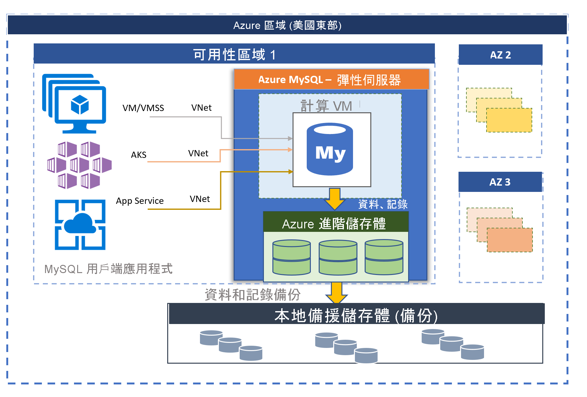

# 適用於 MySQL 的 Azure 資料庫 - 彈性伺服器 (預覽)

由 MySQL 社群版本提供的適用於 MySQL 的 Azure 資料庫有二種部署模式：
- 單一伺服器 
- 彈性伺服器 (預覽)

在本文中，我們將提供彈性伺服器部署模型之核心概念的概觀和簡介。 如需如何決定適合您工作負載部署選項的詳細資訊，請參閱[在 Azure 中選擇正確的 MySQL 伺服器選項](./../select-right-deployment-type.md)。

## 概觀

適用於 MySQL 的 Azure 資料庫彈性伺服器是完全受控的資料庫服務，其設計目的是要在資料庫管理功能和設定方面提供更細微的控制和彈性。 一般而言，此服務會根據使用者需求提供更多彈性和伺服器組態自訂選項。 彈性伺服器架構可讓使用者選擇在單一可用性區域和跨多個可用性區域中實現高可用性。 彈性伺服器也提供更好的成本最佳化控制項，讓您能夠停止/啟動伺服器和高載 SKU，非常適合不需要持續使用完整計算容量的工作負載。 本服務目前支援 MySQL 5.7 的社區版本。 本服務目前已在各個 [Azure 區域](https://azure.microsoft.com/global-infrastructure/services/)中提供預覽版本。

彈性伺服器最適合 
- 需要更佳的控制和自訂功能的應用程式開發。
- 區域備援高可用性
- 可管理的維護期間

 

## 跨可用性區域之間的高可用性

彈性伺服器部署模型的設計支援在單一可用性區域和跨多個可用性區域中實現高可用性。 此模型架構會將計算和儲存體分開。 資料庫引擎會在虛擬機器上執行，而資料檔案則位於 Azure 儲存體上。 儲存體會維護三個資料庫檔案本機備援同步複本，確保隨時都能維持資料持久性。 

在單一可用性區域內，如果伺服器因為計畫或未規劃的事件而停止運作，服務會使用下列自動化程序來維護伺服器的高可用性：

1. 佈建新的計算 VM。
2. 將具有資料檔案的儲存體對應到新的虛擬機器
3. MySQL 資料庫引擎會在新的虛擬機器上上線。
4. 伺服器準備好接受連線後，用戶端應用程式就可以重新連線。
   
:::image type="content" source="media/overview/2-flexible-server-architecture.png" alt-text="單一區域高可用性概念圖表"::: 

如果已設定區域備援高可用性，服務會在相同 Azure 區域內的可用性區域佈建和維護熱待命伺服器。 來源伺服器上的資料變更會同步複寫到待命伺服器，以確保零資料遺失。 有了區域備援高可用性，一旦觸發計畫或未規劃的容錯移轉事件，待命伺服器就會立即上線，並可處理傳入的異動。 一般容錯移轉的時間範圍為 60-120 秒。 這可讓服務支援高可用性，並針對指定 Azure 區域中的單一可用性區域失敗，提供提升容錯的復原能力。 

如需更多詳細資料，請參閱[高可用性概念](concepts-high-availability.md)。

:::image type="content" source="media/overview/3-flexible-server-overview-zone-redundant-ha.png" alt-text="單一區域高可用性概念圖表"::: 

## 使用受控維護視窗進行自動修補

此服務會執行基礎硬體、OS 和資料庫引擎的自動修補。 修補包含安全性和軟體更新。 針對 MySQL 引擎，次要版本升級會包含在計劃性維護版本中。 使用者可以將修補排程設定為系統管理或定義自訂排程。 在維護排程期間，系統會套用修補檔，而伺服器可能需要重新開機，修補程序才能完成更新。 使用自訂排程，使用者可以預測修補週期，並選擇對企業影響最小的維護視窗。 一般而言，服務會遵循持續整合和發行內的每月發行排程。

如需其他詳細資料，請參閱[排程維護](concepts-maintenance.md)。 

## 自動備份

彈性伺服器服務會自動建立伺服器備份，並將其儲存在使用者設定的本地備援或異地備援儲存體中。 備份可以在保留期間內將伺服器還原至任何時間點。 預設的備份保留期限是七天。 您可以將保留期設定為最多 35 天。 所有備份皆會使用 AES 256 位元加密進行加密。 

若要深入了解，請參閱[備份概念](concepts-backup-restore.md)。

## 網路隔離

您有兩個網路功能選項可連線到適用於 MySQL 的 Azure 資料庫彈性伺服器。 包括**私人存取 (VNet 整合)** 和**公用存取 (允許的 IP 位址)** 。 

* **私人存取 (VNet 整合)** - 您可以將彈性伺服器部署至 [Azure 虛擬網路](../../virtual-network/virtual-networks-overview.md)。 Azure 虛擬網路提供私人且安全的網路通訊。 這可讓虛擬網路中的資源透過私人 IP 位址通訊。

   如果您想使用下列功能，請選擇 VNet 整合選項：
   * 使用私人 IP 位址，從相同虛擬網路中的 Azure 資源連線到您的彈性伺服器
   * 使用 VPN 或 ExpressRoute 從非 Azure 資源連線到您的彈性伺服器
   * 沒有公用端點

* **公用存取 (允許的 IP 位址)** - 您可以使用公用端點部署彈性伺服器。 公用端點是可公開解析的 DNS 位址。 「允許的 IP 位址」一詞指的是您選擇授與伺服器存取權的 IP 範圍。 這些權限稱為**防火牆規則**。

若要深入了解，請參閱[網路概念](concepts-networking.md)。

## 在幾秒之內即可調整效能和規模

有三個 SKU 層級提供彈性伺服器服務：分別是基本、一般用途及記憶體最佳化。 高載層最適合用於低成本的開發和低並行工作負載，而不需要持續完整的計算容量。 一般用途和記憶體最佳化較適合需要高並行、縮放和可預測效能的生產工作負載。 您可以在小型資料庫中建置第一個應用程式，一個月只需少許花費，就能順暢調整規模以滿足解決方案的需求。 縮放儲存體比例功能已上線，並支援儲存體自動成長。 動態延展性可讓您的資料庫以透明的方式回應快速變化的資源需求。 您只需就您取用的資源付費。 

若要深入了解，請參閱[計算和儲存體概念](concepts-compute-storage.md)。

## 停止/啟動伺服器以將成本最佳化

彈性伺服器服務可讓您視需要停止和啟動伺服器，以將成本最佳化。 當伺服器停止時，計算層計費會立即停止。 這可讓您在開發、測試和具有時間限制的可預測生產工作負載期間，節省大量的成本。 除非重新開機，否則伺服器會維持在停止狀態七天。 

若要深入了解，請參閱[伺服器概念](concept-servers.md)。 

## 企業級安全性與隱私權

彈性伺服器服務針對待用資料儲存體加密是使用符合 FIPS 140-2 的加密模組。 系統會將資料 (包含備份) 和執行查詢時所建立的暫存檔案加密。 該服務使用包含在 Azure 儲存體加密中的 AES 256 位元加密，且金鑰是由系統管理 (預設)。 

服務預設會以強制執行傳輸層安全性的方式來加密資料。 彈性伺服器僅支援使用傳輸層安全性 (TLS 1.2) 的加密連線，且會拒絕所有使用 TLS 1.0 和 TLS 1.1 的連入連線。 

如需深入了解，請參閱[如何使用加密的連線與彈性伺服器連線](https://docs.mongodb.com/manual/tutorial/configure-ssl)。

彈性伺服器允許使用 [Azure 虛擬網路](https://docs.microsoft.com/azure/virtual-network/virtual-networks-overview) (VNet) 整合，對伺服器進行完整的私人存取。 Azure 虛擬網路中的伺服器只能透過私人 IP 位址連線。 使用 VNet 整合時，公用存取會遭到拒絕，且無法使用公用端點連線到伺服器。 

若要深入了解，請參閱[網路概念](concepts-networking.md)。

## 監視和警示

彈性伺服器服務具備內建的效能監視和警示功能。 所有 Azure 計量都有一分鐘頻率，且每個計量皆提供 30 天的記錄。 您可以在計量上設定警示。 服務會公開主機伺服器計量來監視資源使用率，並允許設定慢速查詢記錄。 使用這些工具，您可以快速將工作負載最佳化，並設定伺服器以獲得最佳效能。 

若要深入了解，請參閱[監視概念](concepts-monitoring.md)。

## 遷移

此服務會執行 MySQL 的社群版本。 這允許完整的應用程式相容性，而且需要的重構成本最少，就能將 MySQL 引擎上開發的現有應用程式遷移至單一伺服器服務。 您可以使用下列其中一個選項移轉單一伺服器：

- **傾印和還原** - 供離線移轉使用，使用者使用 mysqldump/mydumper 等社群工具時，可以承擔一些停機時間、傾印和還原，可最快執行遷移。 參閱使用傾印和還原遷移以取得詳細資料。 
- **Azure 資料庫移轉服務** - 可使用 [Azure 資料庫移轉服務](https://docs.microsoft.com/azure/dms/tutorial-mysql-azure-mysql-online)，讓您在最短停機時間的情況下，執行順暢且簡化的單一伺服器移轉。 

## 連絡人
若您對適用於 MySQL 的 Azure 資料庫有任何疑問或需要建議，請傳送電子郵件給適用於 MySQL 的 Azure 資料庫小組 ([@Ask Azure DB for MySQL](mailto:AskAzureDBforMySQL@service.microsoft.com))。 此電子郵件地址不是技術支援的別名。

此外，請根據您的情況考量下列連絡要點：

- 若要連絡 Azure 支援，[請從 Azure 入口網站提出票證](https://portal.azure.com/?#blade/Microsoft_Azure_Support/HelpAndSupportBlade)。
- 若要修正您的帳戶問題，請在 Azure 入口網站中提出[支援要求](https://ms.portal.azure.com/#blade/Microsoft_Azure_Support/HelpAndSupportBlade/newsupportrequest)。
- 若要提供意見反應或要求新功能，請透過 [UserVoice](https://feedback.azure.com/forums/597982-azure-database-for-mysql) 建立項目。

## 後續步驟
您已看過適用於 MySQL 的 Azure 資料庫單一伺服器部署模式的簡介，接下來您可以：

- 建立第一個伺服器。 
  - [使用 Azure 入口網站建立適用於 MySQL 的 Azure 資料庫彈性伺服器](quickstart-create-server-portal.md)
  - [使用 Azure CLI 建立適用於 MySQL 的 Azure 資料庫彈性伺服器](quickstart-create-server-cli.md)
  - [使用 Azure CLI 管理適用於 MySQL 的 Azure 資料庫彈性伺服器](how-to-manage-server-portal.md)

- 使用您慣用的語言建置您的第一個應用程式：
  - [Python](connect-python.md)
  - [Php](connect-php.md)
