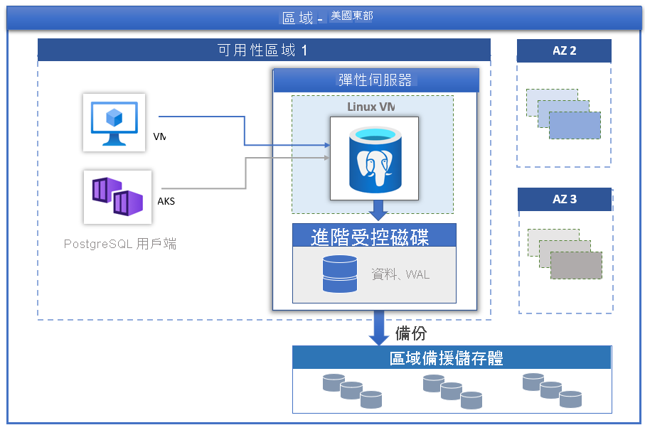

# 適用於 PostgreSQL 的 Azure 資料庫 - 彈性伺服器

由 PostgreSQL 社群版本提供的[適用於 PostgreSQL 的 Azure 資料庫](../overview.md)有三種部署模式：

- [單一伺服器](../overview-single-server.md)
- 彈性伺服器 (預覽)
- 超大規模資料庫 (Citus)

在本文中，我們將提供彈性伺服器部署模型之核心概念的概觀和簡介。

> [!IMPORTANT]
> 適用於 PostgreSQL 的 Azure 資料庫 - 彈性伺服器為預覽狀態

## 概觀

適用於 PostgreSQL 的 Azure 資料庫 - 彈性伺服器是完全受控的資料庫服務，其設計目的是要在資料庫管理功能和設定方面提供更細微的控制和彈性。 一般而言，此服務會根據使用者需求提供更多彈性和伺服器組態自訂選項。 彈性伺服器架構可讓使用者透過用戶端層來共置資料庫引擎以降低延遲，選擇單一可用性區域內的高可用性，以及跨多個可用性區域。 彈性伺服器也提供更好的成本最佳化控制項，讓您能夠停止/啟動伺服器和高載計算層，非常適合不需要持續使用完整計算容量的工作負載。 本服務目前支援 PostgreSQL 11 和 12 的社區版本。 本服務目前已在各個 [Azure 區域](https://azure.microsoft.com/global-infrastructure/services/)中提供預覽版本。

彈性伺服器最適合

- 需要更佳的控制和自訂功能的應用程式開發。
- 區域備援高可用性
- 可管理的維護期間
  
## 高可用性

彈性伺服器部署模型的設計支援在單一可用性區域和跨多個可用性區域中實現高可用性。 此模型架構會將計算和儲存體分開。 資料庫引擎會在 Linux 虛擬機器上執行，而資料檔案則位於 Azure 儲存體上。 儲存體會維護三個資料庫檔案本機備援同步複本，確保能維持資料持久性。

如果伺服器在計畫或未規劃的容錯移轉事件而停止運作，服務會使用下列自動化程序來維護伺服器的高可用性：

1. 佈建新的計算 Linux VM。
2. 將具有資料檔案的儲存體對應到新的虛擬機器
3. PostgreSQL 資料庫引擎會在新的虛擬機器上上線。
4. 閘道服務可執行透明容錯移轉，以確保不需要變更應用程式端。

下圖顯示 VM 和儲存體失敗的轉換。

 :::image type="content" source="./media/overview/overview-azure-postgres-flex-virtualmachine-storage-failure.png" alt-text="彈性伺服器 - VM 和儲存體失敗":::

如果已設定區域備援高可用性，服務會在相同 Azure 區域內的可用性區域佈建和維護熱待命伺服器。 來源伺服器上的資料變更會同步複寫到待命伺服器，以確保零資料遺失。 有了區域備援高可用性，一旦觸發計畫或未規劃的容錯移轉事件，待命伺服器就會立即上線，並可處理傳入的異動。 這可讓服務在支援多個可用性區域的 Azure 區域內復原可用性區域失敗，如下圖所示。

 :::image type="content" source="./media/business-continuity/concepts-zone-redundant-high-availability-architecture.png" alt-text="區域備援高可用性":::

 如需更多詳細資料，請參閱[高可用性文件](./concepts-high-availability.md)。

## 使用受控維護視窗進行自動修補

此服務會執行基礎硬體、OS 和資料庫引擎的自動修補。 修補包含安全性和軟體更新。 針對 PostgreSQL 引擎，次要版本升級會包含在計劃性維護版本中。 使用者可以將修補排程設定為系統管理或定義自訂排程。 在維護排程期間，系統會套用修補檔，而伺服器可能需要重新開機，修補程序才能完成更新。 使用自訂排程，使用者可以預測修補週期，並選擇對企業影響最小的維護視窗。 一般而言，服務會遵循持續整合和發行內的每月發行排程。

## 自動備份

彈性伺服器服務會自動建立伺服器備份，並將其儲存在使用者設定的本地區域備援 (ZRS) 中。 備份可以在保留期間內將伺服器還原至任何時間點。 預設的備份保留期限是七天。 您可以將保留期設定為最多 35 天。 所有備份皆會使用 AES 256 位元加密進行加密。 如需更多詳細資訊，請參閱[備份](./concepts-backup-restore.md)。

## 在幾秒之內即可調整效能和規模

有三個計算層級提供彈性伺服器服務：分別是基本、一般用途及記憶體最佳化。 高載層最適合用於低成本的開發和低並行工作負載，而不需要持續完整的計算容量。 一般用途和記憶體最佳化較適合需要高並行、縮放和可預測效能的生產工作負載。 您可以在小型資料庫中建置第一個應用程式，一個月只需少許花費，就能順暢調整規模以滿足解決方案的需求。

## 停止/啟動伺服器以降低 TCO

彈性伺服器服務可讓您視需要停止和啟動伺服器，以降低您的 TCO。 當伺服器停止時，計算層計費會立即停止。 這可讓您在開發、測試和具有時間限制的可預測生產工作負載期間，節省大量的成本。 除非重新開機，否則伺服器會維持在停止狀態七天。

## 企業級安全性

彈性伺服器服務針對待用資料儲存體加密是使用符合 FIPS 140-2 的加密模組。 系統會將資料 (包含備份) 和執行查詢時所建立的暫存檔案加密。 該服務使用包含在 Azure 儲存體加密中的 AES 256 位元加密，且金鑰是由系統管理 (預設)。 服務預設會以強制執行傳輸層安全性 (SSL/TLS) 的方式來加密資料。 此服務只會強制執行並支援 TLS 版本 1.2。

彈性伺服器允許使用 Azure 虛擬網路 (VNet 整合)，對伺服器進行完整的私人存取。 Azure 虛擬網路中的伺服器只能透過私人 IP 位址連線。 使用 VNet 整合時，公用存取會遭到拒絕，且無法使用公用端點連線到伺服器。

## 監視和警示

彈性伺服器服務具備內建的效能監視和警示功能。 所有 Azure 計量都有一分鐘頻率，且每個計量皆提供 30 天的記錄。 您可以在計量上設定警示。 服務會公開主機伺服器計量來監視資源使用率，並允許設定慢速查詢記錄。 使用這些工具，您可以快速將工作負載最佳化，並設定伺服器以獲得最佳效能。

## 遷移

此服務會執行 PostgreSQL 的社群版本。 這允許完整的應用程式相容性，而且需要的重構成本最少，就能將 PostgreSQL 引擎上開發的現有應用程式遷移至彈性伺服器。 

- **傾印和還原** - 供離線移轉使用，使用者使用 pg_dump 和 pg_restore 等社群工具時，可以承擔一些停機時間、傾印和還原，可最快執行遷移。 參閱[使用傾印和還原遷移](https://docs.microsoft.com/azure/postgresql/howto-migrate-using-dump-and-restore)以取得詳細資料。
- **Azure 資料庫移轉服務** - 可使用 Azure 資料庫移轉服務，讓您在最短停機時間的情況下，執行順暢且簡化的彈性伺服器移轉。 請[透過入口網站參閱 DMS](https://docs.microsoft.com/azure/dms/tutorial-postgresql-azure-postgresql-online-portal)，或[透過 CLI 參閱 DMS](https://docs.microsoft.com/azure/dms/tutorial-postgresql-azure-postgresql-online)。 您可以從適用於 PostgreSQL 的 Azure 資料庫 - 單一伺服器遷移至彈性伺服器。 如需詳細資料，請參閱這篇 [DMS 文章](https://docs.microsoft.com/azure/dms/tutorial-azure-postgresql-to-azure-postgresql-online-portal)。

## 後續步驟

您已看過適用於 PostgreSQL 的 Azure 資料庫彈性伺服器部署模式的簡介，接下來您可以建立第一個伺服器：[使用 Azure 入口網站建立適用於 PostgreSQL 的 Azure 資料庫 - 彈性伺服器](./quickstart-create-server-portal.md)

