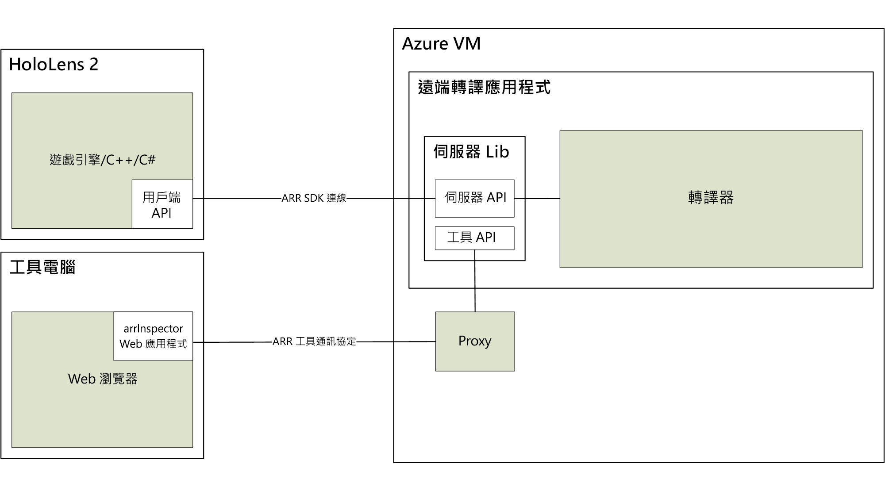

# 關於 Azure 遠端轉譯

> [!IMPORTANT]
> **Azure 遠端轉譯**目前處於公開預覽狀態。
> 此預覽版本是在沒有服務等級協定的情況下提供，不建議用於生產工作負載。 可能不支援特定功能，或可能已經限制功能。 如需詳細資訊，請參閱 [Microsoft Azure 預覽版增補使用條款](https://azure.microsoft.com/support/legal/preview-supplemental-terms/)。

*Azure 遠端轉譯* (ARR) 是一項服務，可讓您在雲端轉譯高品質、互動式3D 內容，並將其即時串流至裝置，例如 HoloLens 2。

不受控裝置的計算能力有限，無法轉譯複雜的模型。 不過，對於許多應用程式而言，無法接受以任何方式降低視覺精確度。

*遠端轉譯*會將轉譯工作負載移至雲端中的高階 GPU，藉此解決此問題。 雲端裝載的圖形引擎會轉譯影像、將其編碼為影片串流，然後串流至目標裝置。

## 混合式轉譯

在大部分的應用程式中，只轉譯複雜的模型並不夠。 您也需要自訂 UI 以提供功能給使用者。 Azure 遠端轉譯不會強制您使用專用的 UI 架構，而會支援「混合式轉譯」  。 這表示您可以使用慣用的方法 (例如 [MRTK](https://microsoft.github.io/MixedRealityToolkit-Unity/Documentation/GettingStartedWithTheMRTK.html))，在裝置上轉譯元素。

在畫面結束時，Azure 遠端轉譯會自動合併本機轉譯內容與遠端影像。 甚至能夠使用正確的遮蔽來執行此動作。

## 多 GPU 轉譯

有些模型太複雜而無法以互動式畫面播放速率轉譯，即使是高階 GPU 也一樣。 尤其在產業視覺效果中，這是常見的問題。 若要進一步推送限制，Azure 遠端轉譯可以將工作負載分散於多個 GPU。 結果會合併成單一影像，讓使用者完全清楚此程序。

## 高階架構

此圖說明遠端轉譯架構：

映像產生的完整週期包含下列步驟：

1. 用戶端：畫面設定
    1. 您的程式碼：使用者輸入已處理，場景圖表已更新
    1. ARR 程式碼：場景圖表會更新且預測的頭部姿勢會傳送至伺服器
1. 伺服器端：遠端轉譯
    1. 轉譯引擎會將轉譯分散於可用的 GPU
    1. 來自多個 GPU 的輸出會組成單一影像
    1. 影像已編碼為影片串流，並傳送回用戶端
1. 用戶端：完成
    1. 您的程式碼：選擇性本機內容 (UI、標記等) 已轉譯
    1. ARR 程式碼：目前，本機轉譯內容會自動與影片串流合併

網路延遲是主要問題。 對互動式畫面播放速率而言，傳送要求與接收結果之間的周轉時間通常太長。 因此，隨時可能有一個以上畫面在傳輸中。

## 後續步驟

* [系統需求](system-requirements.md)
* [快速入門：使用 Unity 轉譯模型](../quickstarts/render-model.md)
