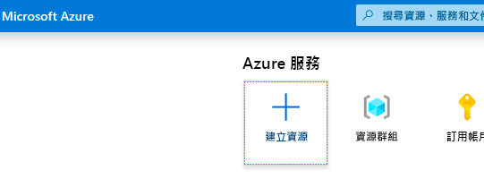
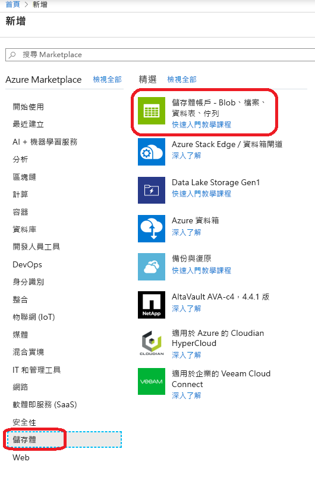
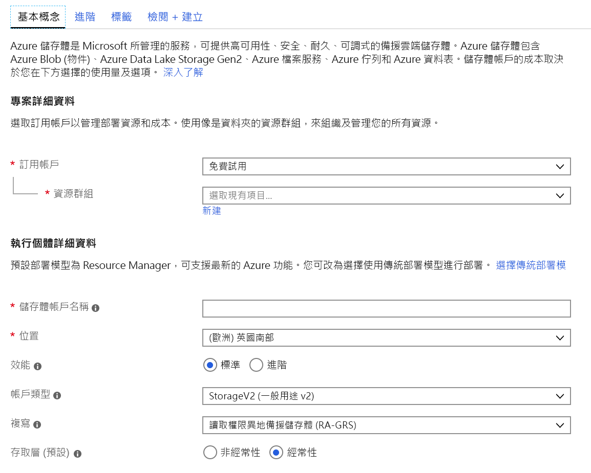
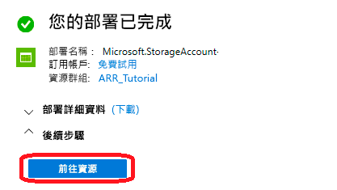
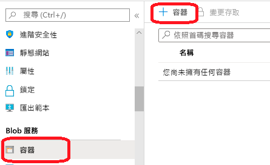
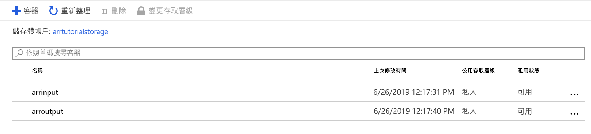
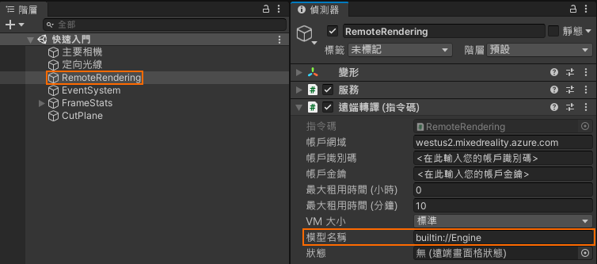
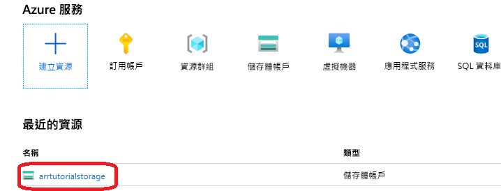
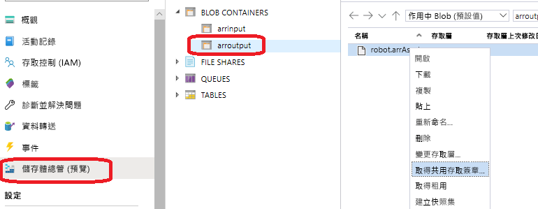

# <a name="quickstart-convert-a-model-for-rendering"></a>快速入門：轉換模型以進行轉譯

在[快速入門：使用 Unity 轉譯模型](render-model.md)中，您已了解如何使用 Unity 範例專案來轉譯內建模型。 本指南說明如何轉換自己的模型。

您將學習如何：

> [!div class="checklist"]
>
> * 為輸入和輸出設定 Azure Blob 儲存體帳戶
> * 上傳和轉換3D 模型以便搭配 Azure 遠端轉譯使用
> * 在應用程式中包含轉換後的3D 模型以進行轉譯

## <a name="prerequisites"></a>必要條件

* 完成[快速入門：使用 Unity 轉譯模型](render-model.md)
* 安裝 Azure PowerShell [(文件)](https://docs.microsoft.com/powershell/azure/)
  * 以系統管理員權限開啟 PowerShell
  * 執行：`Install-Module -Name Az -AllowClobber`

## <a name="overview"></a>概觀

伺服器上的轉譯器無法直接搭配來源模型格式 (例如 FBX 或 GLTF) 運作。 然而，其要求模型採用專屬的二進位格式。
轉換服務會使用 Azure Blob 儲存體中的模型，並將已轉換的模型寫回所提供的 Azure Blob 儲存體容器。

您需要：

* Azure 訂用帳戶
* 訂用帳戶中的 'StorageV2' 帳戶
* 輸入模型的 Blob 儲存體容器
* 輸出資料的 Blob 儲存體容器
* 要轉換的模型，請參閱[範例模型](../samples/sample-model.md)
  * 請參閱[支援的來源格式](../how-tos/conversion/model-conversion.md#supported-source-formats)清單
  * 若要使用範例轉換指令碼，請務必準備一個輸入資料夾，其中包含模型和所有外部相依性 (例如外部紋理或幾何)

## <a name="azure-setup"></a>Azure 設定

如果您還沒有帳戶，請移至 [https://azure.microsoft.com/get-started/](https://azure.microsoft.com/get-started/)，按一下免費帳戶選項，然後依照指示操作。

有了 Azure 帳戶後，請移至 [https://ms.portal.azure.com/#home](https://ms.portal.azure.com/#home)。

### <a name="storage-account-creation"></a>儲存體帳戶建立

若要建立 Blob 儲存體，您必須先有儲存體帳戶。
若要建立一個帳戶，請按一下 [建立資源] 按鈕：



在新的畫面中，選擇左側的 [儲存體]，然後從下一個資料行中選擇 [儲存體帳戶 - Blob、檔案、資料表、佇列]：



按一下此按鈕會顯示以下畫面，其中包含要填寫的儲存體屬性：



以下列方式填寫表單：

* 從下拉式方塊下方的連結建立新的資源群組，並將此命名為 **ARR_Tutorial**
* 針對 [儲存體帳戶名稱]，在此輸入唯一名稱。 **此名稱必須是全域唯一的**，否則會出現提示，告知您該名稱已被使用。 在本快速入門的範圍中，我們將其命名為 **arrtutorialstorage**。 因此，您需要以您的名稱取代本快速入門中任何出現的項目。
* 選取您附近的**位置**。 在理想情況下，使用在其他快速入門中用於設定轉譯的相同位置。
* **效能**設為「標準」
* **帳戶種類**設為「StorageV2 (一般用途 V2)」
* **複寫**設為「讀取權限異地備援儲存體 (RA-GRS)」
* **存取層**設為「經常性」

其他索引標籤中的屬性都不需要變更，因此您可以繼續進行 [審查 + 建立]，然後遵循步驟來完成設定。

網站現在會通知您有關部署的進度，最後會回報「您的部署已完成」。 針對後續步驟按一下 [前往資源] 按鈕：



### <a name="blob-storage-creation"></a>Blob 儲存體建立

接下來，我們需要兩個 Blob 容器，一個用於輸入，另一個用於輸出。

從上方的 [移至資源] 按鈕，您會進入左側有面板的頁面，其中包含清單功能表。 在 [Blob 服務] 分類下的該清單中，按一下 [容器] 按鈕：



按下 [+ 容器] 按鈕，以建立**輸入** Blob 儲存體容器。
建立容器時，請使用下列設定︰
  
* 名稱 = arrinput
* 公用存取層級 = 私人

建立容器之後，再次按一下 [+ 容器]，然後對**輸出**容器重複使用下列設定：

* 名稱 = arroutput
* 公用存取層級 = 私人

您現在應該有兩個 Blob 儲存體容器：



## <a name="run-the-conversion"></a>執行轉換

為了讓您更輕鬆地呼叫資產轉換服務，我們提供了一個公用程式指令碼。 其位於 *Scripts* 資料夾並稱為 **Conversion.ps1**。

特別是，此指令碼會

1. 將指定目錄中的所有檔案從本機磁碟上傳至輸入儲存體容器
1. 呼叫[資產轉換 REST API](../how-tos/conversion/conversion-rest-api.md)，其會從輸入儲存體容器擷取資料，並開始轉換以傳回轉換識別碼
1. 使用所擷取的轉換識別碼來輪詢轉換狀態 API，直到轉換程序因成功或失敗而終止
1. 擷取輸出儲存體中已轉換資產的連結

指令碼會從 *Scripts\arrconfig.json* 檔案讀取其組態。 在文字編輯器中開啟 JSON 檔案。

```json
{
    "accountSettings": {
        "arrAccountId": "8*******-****-****-****-*********d7e",
        "arrAccountKey": "R***************************************l04=",
        "region": "<your-region>"
    },
    "renderingSessionSettings": {
        "vmSize": "standard",
        "maxLeaseTime": "1:00:00"
    },
    "assetConversionSettings": {
        "localAssetDirectoryPath": "D:\\tmp\\robot",
        "resourceGroup": "ARR_Tutorial",
        "storageAccountName": "arrexamplestorage",
        "blobInputContainerName": "arrinput",
        "inputFolderPath": "robotConversion",
        "inputAssetPath": "robot.fbx",
        "blobOutputContainerName": "arroutput",
        "outputFolderPath":"converted/robot",
        "outputAssetFileName": "robot.arrAsset"
    }
}
```

**accountSettings** 群組 (帳戶識別碼和金鑰) 內的組態應該填入類似於[使用 Unity 轉譯模型快速入門](render-model.md)中的認證。

在 **assetConversionSettings** 群組內，請務必變更 **resourceGroup**、**blobInputContainerName** 和 **blobOutputContainerName**，如上所示。
請注意，在儲存體帳戶建立期間，必須以您挑選的唯一名稱取代 **arrtutorialstorage** 值。

將 **localAssetDirectoryPath** 變更為指向磁碟上的目錄，其中包含您想要轉換的模型。 請小心使用雙反斜線 ("\\\\")，正確地逸出路徑中的反斜線 ("\\")。

**localAssetDirectoryPath** 指定路徑中的所有資料，都會上傳至 **inputFolderPath** 所指定子路徑下的 **blobInputContainerName** Blob 容器。 因此，在上述的範例組態中，"D:\\tmp\\robot" 目錄的內容將會上傳至 "robotConversion" 路徑下儲存體帳戶 "arrtutorialstorage" 的 Blob 容器 "arrinput"。 已經存在的檔案都會被覆寫。

將 **inputAssetPath** 變更為要轉換的模型路徑 - 此路徑相對於 localAssetDirectoryPath。 使用 "/"，而不是 "\\" 作為路徑分隔符號。 因此，如果是直接位於 "D:\\tmp\\robot" 中的 "robot.fbx" 檔案，請使用 "robot.fbx"。

轉換模型後，其會寫回 **blobOutputContainerName** 所指定的儲存體容器。 您可藉由提供選擇性 **outputFolderPath** 來指定子路徑。 在上述範例中，產生的 "robot.arrAsset" 會複製到 "converted/robot" 底下的輸出 Blob 容器。

組態設定 **outputAssetFileName** 會決定已轉換資產的名稱 - 這是選用參數，否則會從輸入檔案名稱推論輸出檔案名稱。

開啟 PowerShell，確定您已如[必要條件](#prerequisites)所述安裝 *Azure PowerShell*。 然後使用下列命令登入 Azure 訂用帳戶並遵循畫面上的指示操作：

```PowerShell
Connect-AzAccount
```

> [!NOTE]
> 如果您的組織有多個訂用帳戶，您可能需要指定 SubscriptionId 和 Tenant 引數。 在 [Connect-AzAccount documentation](https://docs.microsoft.com/powershell/module/az.accounts/connect-azaccount) 中尋找詳細資料。

切換至 `azure-remote-rendering\Scripts` 目錄，然後執行轉換指令碼：

```PowerShell
.\Conversion.ps1 -UseContainerSas
```

您應該會看到如下的結果：

## <a name="insert-new-model-into-quickstart-sample-app"></a>將新模型插入快速入門範例應用程式

轉換指令碼會為已轉換的模型產生「共用存取簽章 (SAS)」 URI。 您現在可以將此 URI 當作 [模型名稱] 複製到快速入門範例應用程式中 (請參閱[快速入門：使用 Unity 轉譯模型](render-model.md))。



 此範例現在應該會載入並轉譯您的自訂模型！

## <a name="optional-re-creating-a-sas-uri"></a>選擇性：重新建立 SAS URI

轉換指令碼所建立的 SAS URI 只會在 24 小時內有效。 但是，過期之後，您不需要再次轉換模型。 您反而可在入口網站中建立新的 SAS，如後續步驟所述：

1. 移至 [Azure 入口網站](https://www.portal.azure.com)
1. 按一下 [儲存體帳戶] 資源：
1. 在下列畫面中，按一下左面板中的 [儲存體總管]，然後在 *arroutput* Blob 儲存體容器中尋找您的輸出模型 (*arrAsset* 檔案)。 以滑鼠右鍵按一下檔案，然後從快顯功能表選取 [取得共用存取簽章]：
1. 新畫面隨即開啟，您可在其中選取到期日。 按下 [建立]，然後複製下一個對話方塊中所顯示的 URI。 這個新的 URI 會取代指令碼所建立的暫存 URI。

## <a name="next-steps"></a>後續步驟

您現已了解基本概念，請參閱我們的教學課程，以取得更深入的知識。

如果您想要了解模型轉換的詳細資訊，請參閱[模型轉換 REST API](../how-tos/conversion/conversion-rest-api.md)。

> [!div class="nextstepaction"]
> [教學課程：檢視遠端轉譯模型](../tutorials/unity/view-remote-models/view-remote-models.md)
