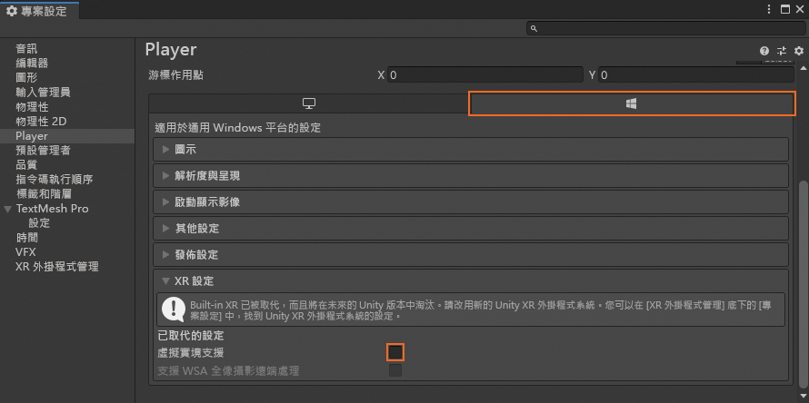
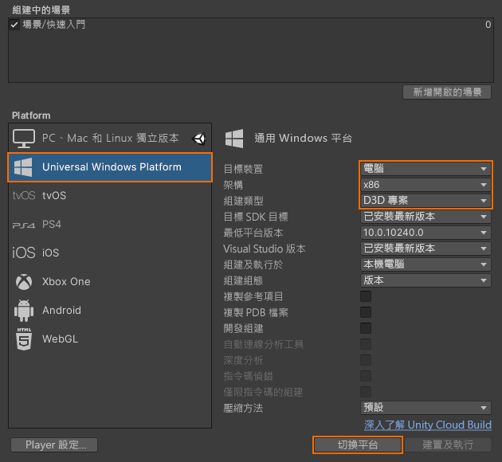
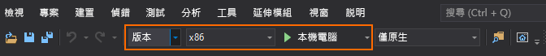

# 快速入門：將 Unity 範例部署到桌面

本快速入門說明如何將 Unity 的快速入門範例應用程式部署至桌上型電腦並加以執行。

在本快速入門中，您將了解如何：

> [!div class="checklist"]
>
>* 建置適用於桌上型電腦的快速入門範例應用程式
>* 將範例部署到電腦
>* 在電腦上執行範例

## 必要條件

在本快速入門中，我們從以下位置部署範例專案：[快速入門：使用 Unity 轉譯模型](render-model.md)。

請確定您的認證已正確地與場景一起儲存，而且您可以從 Unity 編輯器內連線到工作階段。

## 停用虛擬實境支援

桌上型電腦目前僅支援一般傳統型應用程式，因此必須停用 VR 支援。

1. 開啟 [編輯] > [專案設定...]
1. 選取左側的 [播放器]。
1. 選取 [通用 Windows 平台設定] 索引標籤。
1. 展開 [XR 設定]。
1. 停用 [虛擬實境支援]。\
    
1. 在 [XR 設定] 之上，展開 [發佈設定]。
1. 在 [支援的裝置系列] 中，確定已勾選 [傳統型]。

## 建置範例專案

1. 開啟 [檔案] -> [組建設定]。
1. 將 [平台] 變更為 [通用 Windows 平台] (也支援 [獨立電腦]，但此處不會使用，請參閱[平台限制](../reference/limits.md#platform-limitations))。
1. 將 [目標裝置] 設定為 [電腦]。
1. 將 [架構] 設定為 [x86]。
1. 將 [組建類型] 設定為 [D3D 專案]。\
  
1. 選取 [切換至平台]。
1. 按下 [建置] (或 [建置並執行]) 時，系統會要求您選取應儲存解決方案的資料夾。
1. 使用 Visual Studio 開啟所產生的 **Quickstart.sln**。
1. 將設定變更為 [版本] 和 [x86]。
1. 將偵錯工具模式切換到 [本機電腦]。\
  
1. 建置方案。

## 啟動範例專案

在 Visual Studio 中啟動偵錯工具 (F5)。 其會自動將應用程式部署到電腦。

範例應用程式應會啟動，然後啟動新的工作階段。 經過一段時間以後，工作階段便已就緒，而遠端轉譯的模型將會出現在您的面前。
如果您想要稍後再次啟動範例，現在也可以從 [開始] 功能表找到該範例。

## 後續步驟

在下一個快速入門中，我們將探討如何轉換自訂模型。

> [!div class="nextstepaction"]
> [快速入門：轉換模型以進行轉譯](convert-model.md)
