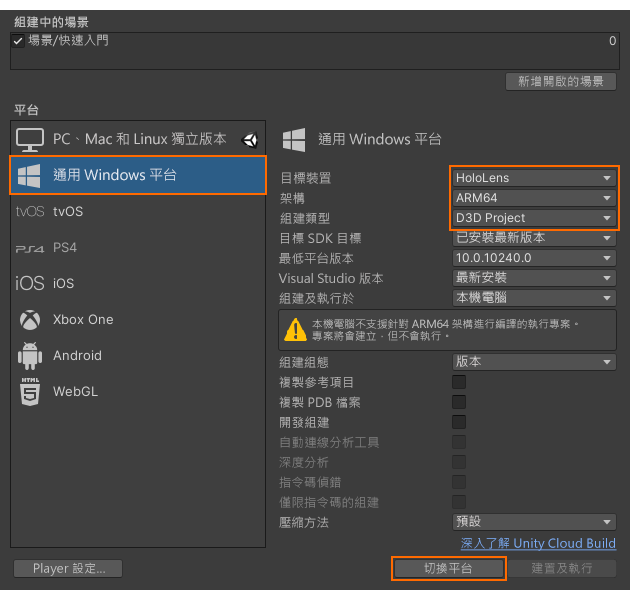
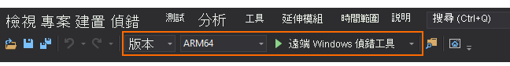

# 快速入門：將 Unity 範例部署至 HoloLens

本快速入門說明如何將 Unity 的快速入門範例應用程式部署至 HoloLens 2 並加以執行。

在本快速入門中，您將了解如何：

> [!div class="checklist"]
>
>* 建置適用於 HoloLens 的快速入門範例應用程式
>* 將範例部署到裝置
>* 在裝置上執行範例

## 必要條件

在本快速入門中，我們從以下位置部署範例專案：[快速入門：使用 Unity 轉譯模型](render-model.md)。

請確定您的認證已正確地與場景一起儲存，而且您可以從 Unity 編輯器內連線到工作階段。

## 建置範例專案

1. 開啟 [檔案] -> [組建設定]。
1. 將 [平台] 變更為 [通用 Windows 平台]
1. 將 [目標裝置] 設定為 [HoloLens]
1. 將 [架構] 設定為 [ARM64]
1. 將 [組建類型] 設定為 [D3D 專案]\
    
1. 選取 [切換至平台]
1. 按下 [建置] (或 [建置並執行]) 時，系統會要求您選取應儲存解決方案的資料夾
1. 使用 Visual Studio 開啟所產生的 **Quickstart.sln**
1. 將設定變更為 [版本] 和 [ARM64]
1. 將偵錯工具模式切換到 [遠端電腦]\
    
1. 建置解決方案 (F7)
1. 如需專案的「快速入門」，請移至 [屬性] > [偵錯]
    1. 請確定 [版本] 設定為作用中
    1. 將 [要啟動的偵錯工具] 設定為 [遠端電腦]
    1. 將 [電腦名稱] 變更為 [HoleLens 的 IP]

## 啟動範例專案

1. 透過 USB 纜線將 HoloLens 連接到您的電腦。
1. 在 Visual Studio 中啟動偵錯工具 (F5)。 其會將應用程式自動部署到裝置。

範例應用程式應會啟動，然後啟動新的工作階段。 經過一段時間以後，工作階段便已就緒，而遠端轉譯的模型將會出現在您的面前。
如果您想要稍後再次啟動範例，現在也可以從 HoloLens 的 [開始] 功能表找到該範例。

## 後續步驟

在下一個快速入門中，我們將探討如何轉換自訂模型。

> [!div class="nextstepaction"]
> [快速入門：轉換模型以進行轉譯](convert-model.md)
