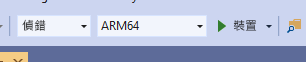

# <a name="quickstart-deploy-native-c-sample-to-hololens"></a>快速入門：將原生 C++ 範例部署至 HoloLens

本快速入門涵蓋如何在 HoloLens 2 上部署和執行原生 C++ 教學課程應用程式。

在本快速入門中，您將了解如何：

> [!div class="checklist"]
>
>* 建置 HoloLens 的教學課程應用程式。
>* 變更原始程式碼中的 ARR 認證。
>* 在裝置上部署和執行範例。

## <a name="prerequisites"></a>必要條件

若要取得 Azure 遠端轉譯服務的存取權，您必須先[建立帳戶](../../../how-tos/create-an-account.md)。

必須安裝下列軟體：

* Windows SDK 10.0.18362.0 [(下載)](https://developer.microsoft.com/windows/downloads/windows-10-sdk)
* 最新版的 Visual Studio 2019 [(下載)](https://visualstudio.microsoft.com/vs/older-downloads/)
* [適用於混合實境的 Visual Studio 工具](/windows/mixed-reality/install-the-tools)。 具體而言，必須要安裝下列「工作負載」：
  * **使用 C++ 開發桌面**
  * **通用 Windows 平台 (UWP) 開發**
* GIT [(下載)](https://git-scm.com/downloads)

## <a name="clone-the-arr-samples-repository"></a>複製 ARR 範例存放庫

在第一個步驟中，我們複製 Git 存放庫，其中裝載全域 Azure 遠端轉譯範例。 開啟命令提示字元 (在 Windows [開始] 功能表中輸入 `cmd`)，然後變更至您要儲存 ARR 範例專案的目錄。

執行下列命令：

```cmd
mkdir ARR
cd ARR
git clone https://github.com/Azure/azure-remote-rendering
```

最後一個命令會在 ARR 目錄中建立子目錄，其中包含 Azure 遠端轉譯的各種範例專案。

C++HoloLens 教學課程可以在 *NativeCpp/HoloLens* 的子目錄中找到。

## <a name="build-the-project"></a>建置專案

使用 Visual Studio 2019，開啟位於 *NativeCpp/HoloLens* 子目錄中的解決方案檔案 *HolographicApp.sln*。

將組建組態切換為 [偵錯] (或 [版本]) 和 [ARM64]。 此外，請確定偵錯工具模式設定為 [裝置]，而不是 [遠端電腦]：



由於帳戶認證會硬式編碼在教學課程的原始程式碼中，請將其變更為有效的認證。 為此，請開啟 Visual Studio 內的檔案 `HolographicAppMain.cpp`，並變更在類別 `HolographicAppMain` 構造函式內建立前端的部分：

```cpp
// 2. Create front end
{
    // Users need to fill out the following with their account data and model
    RR::AzureFrontendAccountInfo init;
    init.AccountId = "00000000-0000-0000-0000-000000000000";
    init.AccountKey = "<account key>";
    init.AccountDomain = "westus2.mixedreality.azure.com"; // <change to the region that the rendering session should be created in>
    init.AccountAuthenticationDomain = "westus2.mixedreality.azure.com"; // <change to the region the account was created in>
    m_modelURI = "builtin://Engine";
    m_sessionOverride = ""; // If there is a valid session ID to re-use, put it here. Otherwise a new one is created
    m_frontEnd = RR::ApiHandle(RR::AzureFrontend(init));
}
```

具體來說，請變更下列值：
* `init.AccountId`、`init.AccountKey` 和 `init.AccountAuthenticationDomain`，以使用您的帳戶資料。 請參閱有關如何[取出帳戶資訊](../../../how-tos/create-an-account.md#retrieve-the-account-information)的段落。
* 針對 `westus2` 以外的區域修改 `init.AccountDomain` 字串的區域部分 (例如 `"westeurope.mixedreality.azure.com"`)，以指定要建立遠端轉譯工作階段的位置。
* 此外，`m_sessionOverride` 可以變更為現有的工作階段識別碼。 工作階段可以在此範例外建立，例如，方法為使用 [PowerShell 指令碼](../../../samples/powershell-example-scripts.md#script-renderingsessionps1)或直接使用[工作階段 REST API](../../../how-tos/session-rest-api.md#create-a-session)。
當範例應該執行多次時，建議您在範例外建立工作階段。 如果未傳入任何工作階段，此範例會在每次啟動時建立新的工作階段，這可能需要幾分鐘的時間。

現在可以編譯應用程式。

## <a name="launch-the-application"></a>啟動應用程式

1. 透過 USB 纜線將 HoloLens 連接到您的電腦。
1. 開啟 HoloLens 並等待，直到 [開始] 功能表顯示為止。
1. 在 Visual Studio 中啟動偵錯工具 (F5)。 其會將應用程式自動部署到裝置。

範例應用程式應該會啟動，而且應該會出現一個文字面板，通知您目前的應用程式狀態。 啟動時的狀態是啟動新的工作階段工作階段，或連線到現有的工作階段。 在完成模型載入之後，內建引擎模型會出現在您的頭部位置右邊。 在遮擋方面，引擎模型會與在本機轉譯的旋轉 Cube 正常互動。

 如果您想要稍後再次啟動範例，也可以從 HoloLens 的 [開始] 功能表找到該範例，但請注意，其內可能已編譯過期的工作階段識別碼。

## <a name="next-steps"></a>後續步驟

本快速入門是以教學課程的成果為基礎，說明如何將所有的遠端轉譯相關片段整合到庫存 *全像攝影應用程式*。 若要了解所需的步驟，請遵循下列教學課程：

> [!div class="nextstepaction"]
> [教學課程：將遠端轉譯整合到 Hololens 全像攝影應用程式](../../../tutorials/native-cpp/hololens/integrate-remote-rendering-into-holographic-app.md)