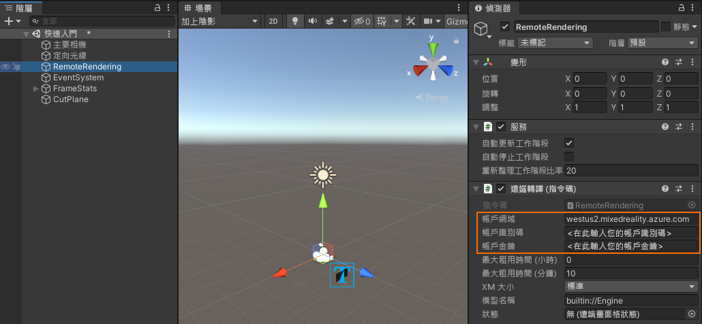
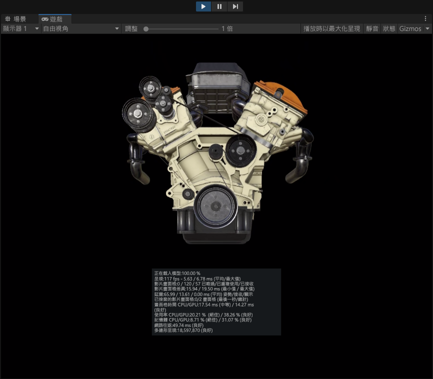
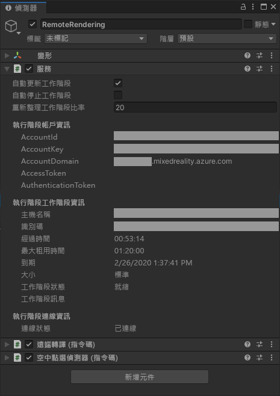
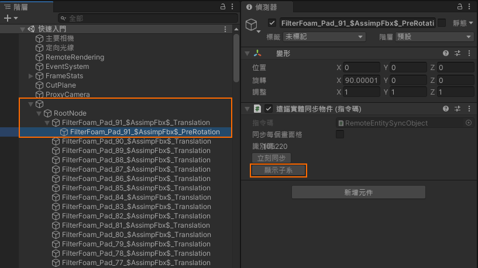
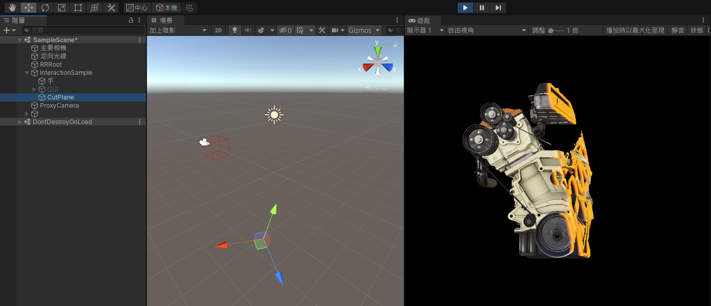

# <a name="quickstart-render-a-model-with-unity"></a>快速入門：使用 Unity 轉譯模型

本快速入門說明如何使用 Azure 遠端轉譯 (ARR) 服務，執行可從遠端轉譯內建模型的 Unity 範例。

我們不會詳細說明 ARR API 本身，或如何設定新的 Unity 專案。 這些主題會涵蓋於[教學課程：從頭開始設定 Unity 專案](../tutorials/unity/project-setup.md)。

在本快速入門中，您將了解如何：
> [!div class="checklist"]
>
>* 設定本機開發環境
>* 取得並建置適用於 Unity 的 ARR 快速入門範例應用程式
>* 在 ARR 快速入門範例應用程式中轉譯模型

## <a name="prerequisites"></a>必要條件

若要取得 Azure 遠端轉譯服務的存取權，您必須先[建立帳戶](../how-tos/create-an-account.md)。

必須安裝下列軟體：

* Windows SDK 10.0.18362.0 [(下載)](https://developer.microsoft.com/windows/downloads/windows-10-sdk)
* 最新版的 Visual Studio 2019 [(下載)](https://visualstudio.microsoft.com/vs/older-downloads/)
* [適用於混合實境的 Visual Studio 工具](https://docs.microsoft.com/windows/mixed-reality/install-the-tools)。 具體而言，必須要安裝下列*工作負載*：
  * **具備 C++ 的桌面開發**
  * **通用 Windows 平台 (UWP) 開發**
* GIT [(下載)](https://git-scm.com/downloads)
* Unity 2019.3.1 [(下載)](https://unity3d.com/get-unity/download)
  * 在 Unity 中安裝下列模組：
    * **UWP** - 通用 Windows 平台建置支援
    * **IL2CPP** - Windows 建置支援 (IL2CPP)

## <a name="clone-the-sample-app"></a>複製範例應用程式

開啟命令提示字元 (在 Windows [開始] 功能表中輸入 `cmd`)，然後變更至您要儲存 ARR 範例專案的目錄。

執行下列命令：

```cmd
mkdir ARR
cd ARR
git clone https://github.com/Azure/azure-remote-rendering
```

最後一個命令會在 ARR 目錄中建立子目錄，其中包含 Azure 遠端轉譯的各種範例專案。

在 *Unity/快速入門*的子目錄中可找到 Unity 的快速入門範例應用程式。

## <a name="rendering-a-model-with-the-unity-sample-project"></a>使用 Unity 範例專案轉譯模型

開啟 Unity Hub 並新增範例專案，這位於 *ARR\azure-remote-rendering\Unity\Quickstart* 資料夾。
開啟專案。 如有必要，允許 Unity 將專案升級為您已安裝的版本。

我們轉譯的預設模型是[內建範例模型](../samples/sample-model.md)。 我們將在[下一個快速入門](convert-model.md)中說明如何使用 ARR 轉換服務來轉換自訂模型。

### <a name="enter-your-account-info"></a>輸入您的帳戶資訊

1. 在 Unity 資產瀏覽器中，巡覽至 *Scenes* 資料夾，然後開啟 [快速入門] 場景。
1. 從 [階層] 中，選取 [RemoteRendering] 遊戲物件。
1. 在 [偵測器] 中，輸入您的[帳戶認證](../how-tos/create-an-account.md)。 如果您還沒有帳戶，請[建立帳戶](../how-tos/create-an-account.md)。



> [!IMPORTANT]
> Azure 入口網站只會將您帳戶的網域顯示為 *mixedreality.azure.com*。 這不足以順利連線。
> 將 [AccountDomain] 設定為 `<region>.mixedreality.azure.com`，其中 `<region>` 是 [您附近的其中一個可用區域](../reference/regions.md)。

稍後，我們想要將此專案部署至 HoloLens，並從該裝置連線到遠端轉譯服務。 由於我們沒有簡單的方法可在裝置上輸入認證，所以快速入門範例會**將認證儲存在 Unity 場景**中。

> [!WARNING]
> 切勿將含有已儲存認證的專案簽入到某個存放庫，因為會洩漏秘密登入資訊！

### <a name="create-a-session-and-view-the-default-model"></a>建立工作階段和檢視預設模型

按下 Unity 的 [播放] 按鈕以啟動工作階段。 您應會在 [遊戲] 面板中檢視區的底部看到狀態文字重疊。 工作階段將會經歷一系列的狀態轉換。 處於 [啟動中] 狀態時，遠端 VM 會啟動，這需要幾分鐘的時間。 成功時，其會轉換成 [就緒] 狀態。 現在工作階段會進入 [連線中] 狀態，並於此狀態嘗試連線到該 VM 上的轉譯執行階段。 成功時，範例會轉換成 [已連線] 狀態。 此時，其會開始下載模型以進行轉譯。 由於模型的大小，下載可能需要幾分鐘的時間。 然後遠端轉譯的模型就會出現。



恭喜！ 您現在正在檢視遠端轉譯的模型！

## <a name="inspecting-the-scene"></a>檢查場景

遠端轉譯連線一旦在執行中，[偵測器] 面板就會以其他狀態資訊進行更新：



您現在可以選取新節點，然後按一下 [偵測器] 中的 [顯示子系]，藉此探索場景圖表。



場景中有一個[切割平面](../overview/features/cut-planes.md)物件。 請嘗試在其屬性中加以啟用，並將其四處移動：



若要同步處理轉換，請按一下 [立即同步處理] 或勾選 [同步處理每個畫面] 選項。 若為元件屬性，只要進行變更就夠了。

## <a name="next-steps"></a>後續步驟

在下一個快速入門中，我們會將範例部署至 HoloLens，以原始大小檢視遠端轉譯的模型。

> [!div class="nextstepaction"]
> [快速入門：將 Unity 範例部署至 HoloLens](deploy-to-hololens.md)

或者，此範例也可部署到桌上型電腦。

> [!div class="nextstepaction"]
> [快速入門：將 Unity 範例部署到桌面](deploy-to-desktop.md)