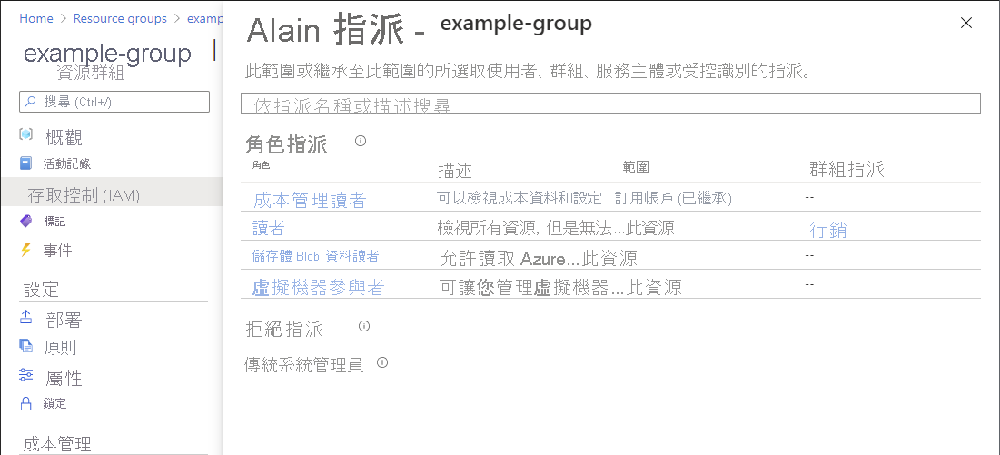
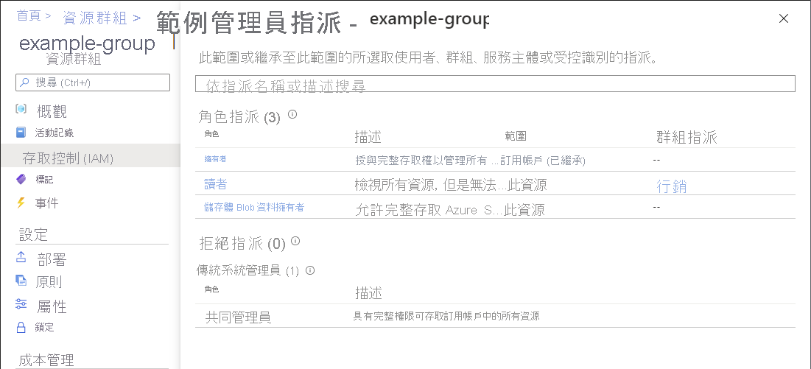

# 快速入門：檢查使用者的 Azure 資源存取權

有時候，您需要檢查使用者在一組 Azure 資源上的存取權為何。 您可以藉由列出其指派來檢查其存取權。 若要快速檢查單一使用者的存取權，請使用 **存取控制 (IAM)** 頁面上的 [檢查存取權] 功能。

## 步驟 1：開啟 Azure 資源

若要檢查使用者的存取權，必須先開啟要檢查其存取權的 Azure 資源。 Azure 資源會組織成層級，這些層級通常稱為「範圍」。 在 Azure 中，您可以在四個層級上指定範圍 (從寬到窄)：管理群組、訂用帳戶、資源群組或資源。

請遵循下列步驟來開啟您想要檢查其存取權的一組 Azure 資源。

1. 開啟 [Azure 入口網站](https://portal.azure.com)。

1. 開啟一組 Azure 資源，例如 **管理群組**、**訂用帳戶**、**資源群組** 或特定資源。

1. 按一下該範圍中的特定資源。

    以下顯示資源群組範例。

    

## 步驟 2:檢查使用者存取權

請遵循下列步驟，檢查單一使用者、群組、服務主體或受控識別在先前所選 Azure 資源上的存取權。

1. 按一下 [存取控制 (IAM)]。

    下面顯示某資源群組的 [存取控制 (IAM)] 頁面範例。

    ![資源群組存取控制 - [檢查存取權] 索引標籤](./media/shared/rg-access-control.png)

1. 在 [檢查存取權] 索引標籤的 [尋找] 清單中，選取想要檢查其存取權的使用者、群組、服務主體或受控識別。

1. 在搜尋方塊中，輸入字串以在目錄中搜尋顯示名稱、電子郵件地址或物件識別碼。

    

1. 按一下安全性主體以開啟 [指派]  窗格。

    在此窗格中，您可以看到此範圍內或繼承至此範圍的所選安全性主體有何存取權。 子系範圍上的指派不會列出。 您會看到下列指派：

    - 使用 Azure RBAC 新增的角色指派。
    - 使用 Azure 藍圖或 Azure 受控應用程式新增的否定性指派。
    - 傳統部署的傳統服務管理員或共同管理員指派。 

    

## 步驟 3：檢查您的存取權

請遵循下列步驟來檢查您在先前所選 Azure 資源上的存取權。

1. 按一下 [存取控制 (IAM)]。

1. 在 [檢查存取權] 索引標籤上，按一下 [檢視我的存取權] 按鈕。

    [指派] 窗格會隨即出現，並列出此範圍內和繼承至此範圍的存取權。 子系範圍上的指派不會列出。

    

## 後續步驟

> [!div class="nextstepaction"]
> [使用 Azure 入口網站列出 Azure 角色指派](role-assignments-list-portal.md)
