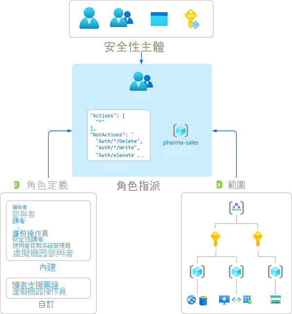
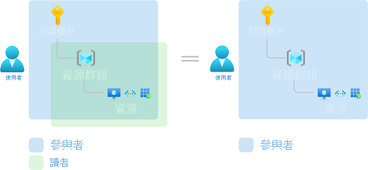

# 什麼是 Azure 角色型存取控制 (Azure RBAC)？

對於使用雲端的任何組織而言，雲端資源的存取管理是非常重要的功能。 Azure 角色型存取控制 (Azure RBAC) 可協助您管理可存取 Azure 資源的人員、這些人員如何使用資源，以及他們存取的區域。

Azure RBAC 是建置於 [Azure Resource Manager](../azure-resource-manager/management/overview.md) 上的授權系統，可提供更細緻的 Azure 資源存取管理。

這段影片提供 Azure RBAC 的快速概觀。

>[!VIDEO https://www.youtube.com/embed/Dzhm-garKBM]

## 我能用 Azure RBAC 來做什麼？

以下是 Azure RBAC 用途的一些例子：

- 允許一位使用者管理訂用帳戶中的虛擬機器，而另一位使用者管理虛擬網路
- 允許 DBA 群組管理訂用帳戶中的 SQL 資料庫
- 允許使用者管理資源群組中的所有資源，例如虛擬機器、網站和子網路
- 允許應用程式存取資源群組中的所有資源

## Azure RBAC 的運作方式

您利用 Azure RBAC 來控制資源存取權的方式就是建立角色指派。 這是很重要的概念 – 可讓您了解如何強制執行權限。 角色指派由三項元素所組成：安全性主體、角色定義和範圍。

### 安全性主體

「安全性主體」是一個物件，代表要求存取 Azure 資源的使用者、群組、服務主體或受控識別。 您可以將角色指派給任何安全性主體。

### 角色定義

「角色定義」是權限集合。 一般會直接稱之為 *角色*。 角色定義會列出可執行的作業，例如讀取、寫入和刪除。 角色可為高層級，例如擁有者或特定，例如虛擬機器讀取器。

Azure 包含數個您可使用的[內建角色](built-in-roles.md)。 例如，[虛擬機器參與者](built-in-roles.md#virtual-machine-contributor)角色可讓使用者建立和管理虛擬機器。 如果內建的角色無法滿足您組織的特定需求，您可以建立自己的 [Azure 自訂角色](custom-roles.md)。

這段影片提供內建角色和自訂角色的快速概觀。

>[!VIDEO https://www.youtube.com/embed/I1mefHptRgo]

Azure 具有可讓您授與物件內資料存取權的資料作業。 例如，如果使用者有儲存體帳戶的讀取資料存取權，則他們可讀取該儲存體帳戶中的 Blob 或訊息。

如需詳細資訊，請參閱[了解 Azure 角色定義](role-definitions.md)。

### 影響範圍

「範圍」是要套用存取權的一組資源。 當您指派角色時，可以藉由定義範圍來進一步限制動作。 如果您想要讓某位使用者成為[網站參與者](built-in-roles.md#website-contributor)，但僅限於某個資源群組，這會很實用。

在 Azure 中，您可以在四個層級指定範圍：[管理群組](../governance/management-groups/overview.md)、訂用帳戶、[資源群組](../azure-resource-manager/management/overview.md#resource-groups)或資源。 範圍的結構為父子式關聯性。 您可以在任何範圍層級指派角色。

如需範圍的詳細資訊，請參閱[了解範圍](scope-overview.md)。

### 角色指派

「角色指派」是一個連結程序，其為了授與存取權，而將角色定義連結至特定範圍的使用者、群組、服務主體或受控識別。 建立角色指派可授與存取權，而移除角色指派則可撤銷存取權。

下圖顯示角色指派的範例。 在此範例中，行銷群組已被指派醫藥銷售資源群組的[參與者](built-in-roles.md#contributor)角色。 這表示行銷群組中的使用者可以建立或管理醫藥銷售資源群組中的任何 Azure 資源。 行銷使用者無法存取醫藥銷售資源群組外的資源，除非他們具有另一個角色指派。

您可以使用 Azure 入口網站、Azure CLI、Azure PowerShell、Azure SDK 或 REST API 建立角色指派。

如需相關資訊，請參閱[新增角色指派的步驟](role-assignments-steps.md)。

## 多角色指派

所以，如果您有多個重疊的角色指派會發生什麼事？ Azure RBAC 是加法模型，因此，您的有效權限就是角色指派的總和。 請參考下列範例，其中使用者在訂用帳戶範圍中獲派「參與者」角色，並在資源群組中獲派「讀者」角色。 「參與者」權限和「讀者」權限的總和實際上就是資源群組的參與者角色。 因此，在此情況下，「讀者」角色的指派並沒有作用。

## 拒絕指派

在以前，Azure RBAC 為不含拒絕的僅允許模型，但現在，Azure RBAC 會以有限方式支援拒絕指派。 與角色指派相同，「拒絕指派」也會基於拒絕存取權的目的來連結一組在特定範圍內拒絕使用者、群組、服務主體或受控識別的動作。 角色指派會定義一組「允許」的動作，而拒絕指派會定義一組「不允許」的動作。 換句話說，拒絕指派會封鎖使用者執行指定的動作，即使角色指派授與他們存取權也一樣。 拒絕指派的優先順序高於角色指派。

如需詳細資訊，請參閱[了解 Azure 拒絕指派](deny-assignments.md)。

## Azure RBAC 如何判斷使用者是否有權存取資源

以下是 Azure RBAC 在管理平面上用來判斷您是否有權存取資源的概要步驟。 這有助於了解您是否正嘗試對存取問題進行疑難排解。

1. 使用者 (或服務主體) 會取得適用於 Azure Resource Manager 的權杖。

    權杖包含使用者的群組成員資格 (包括可轉移的群組成員資格)。

1. 使用者可以使用附加的權杖，來對 Azure Resource Manager 進行 REST API 呼叫。

1. Azure Resource Manager 會擷取所有角色指派和拒絕指派，以套用到要據以採取動作的資源。

1. Azure Resource Manager 會縮小要套用到此使用者或其群組之角色指派的範圍，並判斷使用者針對此資源需具備哪些角色。

1. Azure Resource Manager 會判斷 API 呼叫中的動作是否包含於使用者針對此資源所具備的角色中。

1. 如果使用者在要求範圍內不具含有該動作的角色，則不會授與存取權。 否則，Azure Resource Manager 會檢查拒絕指派是否適用。

1. 如果拒絕指派適用，則會封鎖存取。 否則會授與存取權。

## 授權需求

[!INCLUDE [Azure AD free license](../../includes/active-directory-free-license.md)]

## 後續步驟

- [使用 Azure 入口網站新增或移除 Azure 角色指派](role-assignments-portal.md)
- [了解不同的角色](rbac-and-directory-admin-roles.md)
- [雲端採用架構：Azure 中的資源存取管理](/azure/cloud-adoption-framework/govern/resource-consistency/resource-access-management)
