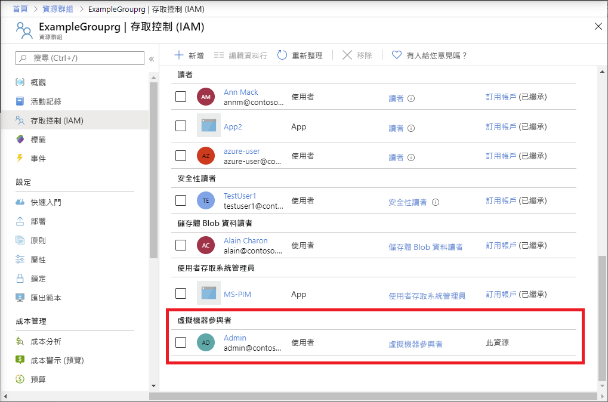

# <a name="quickstart-add-an-azure-role-assignment-using-an-arm-template"></a>快速入門：使用 ARM 範本新增 Azure 角色指派

[Azure 角色型存取控制 (Azure RBAC)](overview.md) 是您管理對 Azure 資源存取的機制。 在本快速入門中，您會建立資源群組並對使用者授與存取權，讓其在資源群組中建立和管理虛擬機器。 本快速入門會使用 Azure Resource Manager 範本 (ARM 範本) 來授與存取權。

[!INCLUDE [About Azure Resource Manager](../../includes/resource-manager-quickstart-introduction.md)]

如果您的環境符合必要條件，而且您很熟悉 ARM 範本，請選取 [部署至 Azure] 按鈕。 範本會在 Azure 入口網站中開啟。

[](https://portal.azure.com/#create/Microsoft.Template/uri/https%3A%2F%2Fraw.githubusercontent.com%2FAzure%2Fazure-quickstart-templates%2Fmaster%2F101-rbac-builtinrole-resourcegroup%2Fazuredeploy.json)

## <a name="prerequisites"></a>必要條件

若要新增角色指派，您必須具有：

- 如果您沒有 Azure 訂用帳戶，請在開始前建立[免費帳戶](https://azure.microsoft.com/free/?WT.mc_id=A261C142F)。
- `Microsoft.Authorization/roleAssignments/write` 和 `Microsoft.Authorization/roleAssignments/delete` 權限，例如[使用者存取系統管理員](built-in-roles.md#user-access-administrator)或[擁有者](built-in-roles.md#owner)
- 若要新增角色指派，您必須定三項元素：安全性主體、角色定義和範圍。 在本快速入門中，安全性主體是您或目錄中的其他使用者，角色定義為[虛擬機器參與者](built-in-roles.md#virtual-machine-contributor)，而範圍則是您指定的資源群組。

## <a name="review-the-template"></a>檢閱範本

本快速入門中使用的範本是來自 [Azure 快速入門範本](https://azure.microsoft.com/resources/templates/101-rbac-builtinrole-resourcegroup/)。 範本有三個參數和一個資源區段。 在 [資源] 區段中，請注意，其具有角色指派的三個元素：安全性主體、角色定義和範圍。

:::code language="json" source="~/quickstart-templates/101-rbac-builtinrole-resourcegroup/azuredeploy.json":::

範本中定義的資源為：

- [Microsoft.Authorization/roleAssignments](/azure/templates/Microsoft.Authorization/roleAssignments)

## <a name="deploy-the-template"></a>部署範本

1. 登入 [Azure 入口網站](https://portal.azure.com)。

1. 判斷與您 Azure 訂用帳戶相關聯的電子郵件地址。 或判斷目錄中另一位使用者的電子郵件地址。

1. 適用於 PowerShell 的 Azure Cloud Shell。

1. 請將下列指令碼複製並貼到 Cloud Shell。

    ```azurepowershell
    $resourceGroupName = Read-Host -Prompt "Enter a resource group name (i.e. ExampleGrouprg)"
    $emailAddress = Read-Host -Prompt "Enter an email address for a user in your directory"
    $location = Read-Host -Prompt "Enter a location (i.e. centralus)"
    
    $roleAssignmentName = New-Guid
    $principalId = (Get-AzAdUser -Mail $emailAddress).id
    $roleDefinitionId = (Get-AzRoleDefinition -name "Virtual Machine Contributor").id
    $templateUri = "https://raw.githubusercontent.com/Azure/azure-quickstart-templates/master/101-rbac-builtinrole-resourcegroup/azuredeploy.json"
    
    New-AzResourceGroup -Name $resourceGroupName -Location $location
    New-AzResourceGroupDeployment -ResourceGroupName $resourceGroupName -TemplateUri $templateUri -roleAssignmentName $roleAssignmentName -roleDefinitionID $roleDefinitionId -principalId $principalId
    ```

1. 輸入資源群組名稱，例如 ExampleGrouprg。

1. 輸入您自己或目錄中其他使用者的電子郵件地址。

1. 輸入資源群組的位置，例如 centralus。

1. 如有需要，請按 Enter 鍵以執行 New-AzResourceGroupDeployment 命令。

    [New-AzResourceGroup](/powershell/module/az.resources/new-azresourcegroup) 命令會建立新的資源群組，而 [New-AzResourceGroupDeployment](/powershell/module/az.resources/new-azresourcegroupdeployment) 命令會部署範本來新增角色指派。

    您應該會看到類似以下的輸出：

    ```azurepowershell
    PS> New-AzResourceGroupDeployment -ResourceGroupName $resourceGroupName -TemplateUri $templateUri -roleAssignmentName $roleAssignmentName -roleDefinitionID $roleDefinitionId -principalId $principalId
    
    DeploymentName          : azuredeploy
    ResourceGroupName       : ExampleGrouprg
    ProvisioningState       : Succeeded
    Timestamp               : 5/22/2020 9:01:30 PM
    Mode                    : Incremental
    TemplateLink            :
                              Uri            : https://raw.githubusercontent.com/Azure/azure-quickstart-templates/master/101-rbac-builtinrole-resourcegroup/azuredeploy.json
                              ContentVersion : 1.0.0.0
    
    Parameters              :
                              Name                  Type                       Value
                              ====================  =========================  ==========
                              roleAssignmentName    String                     {roleAssignmentName}
                              roleDefinitionID      String                     9980e02c-c2be-4d73-94e8-173b1dc7cf3c
                              principalId           String                     {principalId}
    
    Outputs                 :
    DeploymentDebugLogLevel :
    ```

## <a name="review-deployed-resources"></a>檢閱已部署的資源

1. 在 Azure 入口網站中，開啟您建立的資源群組。

1. 在左側功能表中，按一下 [存取控制 (IAM)]。

1. 按一下 [角色指派] 索引標籤。

1. 確認 [虛擬機器參與者] 角色已指派給您指定的使用者。

   

## <a name="clean-up-resources"></a>清除資源

若要移除您所建立的角色指派和資源群組，請遵循下列步驟。

1. 請將下列指令碼複製並貼到 Cloud Shell。

    ```azurepowershell
    $emailAddress = Read-Host -Prompt "Enter the email address of the user with the role assignment to remove"
    $resourceGroupName = Read-Host -Prompt "Enter the resource group name to remove (i.e. ExampleGrouprg)"
    
    $principalId = (Get-AzAdUser -Mail $emailAddress).id
    
    Remove-AzRoleAssignment -ObjectId $principalId -RoleDefinitionName "Virtual Machine Contributor" -ResourceGroupName $resourceGroupName
    Remove-AzResourceGroup -Name $resourceGroupName
    ```
    
1. 輸入要移除角色指派之使用者的電子郵件地址。

1. 輸入要移除的資源群組名稱，例如 ExampleGrouprg。

1. 如有需要，請按 Enter 鍵以執行 Remove-AzResourceGroup 命令。

1. 輸入 **Y**以確認您想要移除資源群組。

## <a name="next-steps"></a>後續步驟

> [!div class="nextstepaction"]
> [教學課程：使用 Azure PowerShell 為使用者授與 Azure 資源的存取權](tutorial-role-assignments-user-powershell.md)