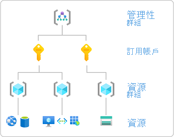
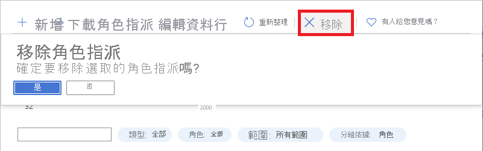

# 使用 Azure 入口網站新增或移除 Azure 角色指派

[!INCLUDE [Azure RBAC definition grant access](../../includes/role-based-access-control/definition-grant.md)] 本文說明如何使用 Azure 入口網站指派角色。

如果您需要在 Azure Active Directory 中指派系統管理員角色，請參閱 [Azure Active Directory 中的 [查看和指派系統管理員角色](../active-directory/roles/manage-roles-portal.md)]。

## Prerequisites

[!INCLUDE [Azure role assignment prerequisites](../../includes/role-based-access-control/prerequisites-role-assignments.md)]

## 新增角色指派

在 Azure RBAC 中，若要授與 Azure 資源的存取權，您可以新增角色指派。 請遵循下列步驟來指派角色。 如需步驟的高階總覽，請參閱 [新增角色指派的步驟](role-assignments-steps.md)。

### 步驟1：識別所需的範圍

[!INCLUDE [Scope for Azure RBAC introduction](../../includes/role-based-access-control/scope-intro.md)]

[!INCLUDE [Scope for Azure RBAC least privilege](../../includes/role-based-access-control/scope-least.md)] 如需範圍的詳細資訊，請參閱 [瞭解範圍](scope-overview.md)。

1. 登入 [Azure 入口網站](https://portal.azure.com)。

1. 在頂端的搜尋方塊中，搜尋您要授與存取權的範圍。 例如，搜尋 **管理群組**、訂用 **帳戶**、 **資源群組** 或特定資源。

    

1. 按一下該範圍的特定資源。

    以下顯示資源群組範例。

    

### 步驟2：開啟 [新增角色指派] 窗格

**存取控制 (IAM)** 是您通常用來指派角色以授與 Azure 資源存取權的頁面。 它也稱為身分識別和存取管理 (IAM) ，而且會出現在 Azure 入口網站中的數個位置。

1. 按一下 [存取控制 (IAM)]。

    下面顯示某資源群組的 [存取控制 (IAM)] 頁面範例。

    

1. 按一下 [ **角色指派** ] 索引標籤，以查看此範圍的角色指派。

1. 按一下 [**新增**  >  **新增角色指派**]。
   若您沒有指派角色的權限，[新增角色指派] 選項將會被停用。

   

    [新增角色指派] 窗格隨即開啟。

   ![[新增角色指派] 窗格](./media/shared/add-role-assignment.png)

### 步驟3：選取適當的角色

1. 在 [ **角色** ] 清單中，搜尋或滾動以尋找您要指派的角色。

    為了協助您判斷適當的角色，您可以將滑鼠停留在資訊圖示上，以顯示該角色的描述。 如需其他資訊，您可以查看 [Azure 內建角色](built-in-roles.md) 文章。

   ![在 [新增角色指派] 中選取角色](./media/role-assignments-portal/add-role-assignment-role.png)

1. 按一下以選取角色。

### 步驟4：選取需要存取的人員

1. 在 [ **指派存取** 權] 清單中，選取要指派存取權的安全性主體類型。

    | 類型 | 描述 |
    | --- | --- |
    | **使用者、群組或服務主體** | 如果您想要將角色指派給使用者、群組或服務主體 (應用程式) ，請選取此類型。 |
    | **使用者指派的受控識別** | 如果您想要將角色指派給 [使用者指派的受控識別](../active-directory/managed-identities-azure-resources/overview.md)，請選取此類型。 |
    | *系統指派的受控識別* | 如果您想要將角色指派給 [系統指派的受控識別](../active-directory/managed-identities-azure-resources/overview.md)，請選取受控識別所在的 Azure 服務實例。 |

   ![選取 [新增角色指派] 中的安全性主體類型](./media/role-assignments-portal/add-role-assignment-type.png)

1. 如果您選取了使用者指派的受控識別或系統指派的受控識別，請選取受控識別所在的 **訂** 用帳戶。

1. 在 [ **選取** ] 區段中，輸入字串或在清單中滾動，以搜尋安全性主體。

   ![在 [新增角色指派] 中選取使用者](./media/role-assignments-portal/add-role-assignment-user.png)

1. 一旦找到安全性主體，請按一下加以選取。

### 步驟5：指派角色

1. 若要指派角色，請按一下 [ **儲存**]。

   在幾分鐘之後，即會在所選範圍中指派安全性主體的角色。

1. 在 [ **角色指派** ] 索引標籤上，確認您在清單中看到角色指派。

    

## 移除角色指派

在 Azure RBAC 中，若要移除 Azure 資源的存取權，請移除角色指派。 請遵循下列步驟來移除角色指派。

1. 針對您要移除存取權的範圍 (例如管理群組、訂用帳戶、資源群組或資源) 開啟 [存取控制 (IAM)]。

1. 按一下 [角色指派] 索引標籤以檢視此範圍中的所有角色指派。

1. 在角色指派清單中，在具有您要移除的角色指派安全性主體旁加上核取記號。

   

1. 按一下 **[移除]** 。

   

1. 在顯示的移除角色指派訊息中，按一下 [是]。

    如果您看到無法移除繼承角色指派的訊息，則表示您嘗試移除子範圍的角色指派。 您應該在指派角色的範圍中開啟存取控制 (IAM) ，然後再試一次。 在正確的範圍中，快速開啟存取控制 (IAM) 的方法是查看 [ **領域** ] 資料行，然後按一下 [ **(繼承的)**] 旁的連結。

   

## 後續步驟

- [將使用者指派為 Azure 訂用帳戶的系統管理員](role-assignments-portal-subscription-admin.md)
- [新增受控識別的角色指派](role-assignments-portal-managed-identity.md)
- [針對 Azure RBAC 進行疑難排解](troubleshooting.md)
