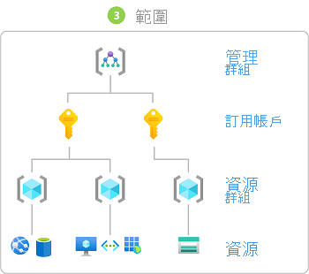

# 新增角色指派的步驟

[!INCLUDE [Azure RBAC definition grant access](../../includes/role-based-access-control-definition-grant.md)] 本文說明使用 [Azure 入口網站](role-assignments-portal.md)、 [Azure PowerShell](role-assignments-powershell.md)、 [Azure CLI](role-assignments-cli.md)或 [REST API](role-assignments-rest.md)新增角色指派的高階步驟。

## 步驟1：判斷需要存取的人員

首先，您必須決定誰需要存取權。 您可以將角色指派給使用者、群組、服務主體或受控識別。 這也稱為「 *安全性主體」（security principal*）。

- 使用者 - 在 Azure Active Directory 中具有設定檔的個人。 您也可以指派角色給其他租用戶中的使用者。 如需有關其他組織中使用者的資訊，請參閱 [Azure Active Directory B2B](../active-directory/b2b/what-is-b2b.md)。
- 群組 - 在 Azure Active Directory 中建立的一組使用者。 當您將角色指派給群組時，該群組內的所有使用者都具有該角色。 
- 服務主體 - 應用程式或服務用來存取特定 Azure 資源的安全性身分識別。 您可以將它視為應用程式的「使用者身分識別」(使用者名稱和密碼或憑證)。
- 受控識別 (MSI) - 在 Azure Active Directory 中由 Azure 自動管理的身分識別。 您通常會在開發雲端應用程式來管理 Azure 服務驗證所需的認證時，使用[受控識別](../active-directory/managed-identities-azure-resources/overview.md)。

## 步驟2：尋找適當的角色

許可權會群組在一起成為 *角色定義*。 一般會直接稱之為*角色*。 您可以從數個內建角色的清單中選取。 如果內建角色無法滿足您組織的特定需求，您可以建立自己的自訂角色。

以下列出四個基本內建角色。 前三個適用於所有資源類型。

- [擁有者](built-in-roles.md#owner) - 具有所有資源的完整存取權，包括將存取權委派給其他人的權限。
- [參與者](built-in-roles.md#contributor) - 可以建立和管理所有類型的 Azure 資源，但是不能將存取權授與其他人。
- [讀者](built-in-roles.md#reader) - 可以檢視現有的 Azure 資源。
- [使用者存取管理員](built-in-roles.md#user-access-administrator) - 讓您管理使用者對 Azure 資源的存取權。

其餘的 RBAC 角色可以管理特定 Azure 資源。 例如，[虛擬機器參與者](built-in-roles.md#virtual-machine-contributor)角色可讓使用者建立和管理虛擬機器。

1. 首先請參閱 [Azure 內建角色](built-in-roles.md)這篇內容豐富的文章。 文章開頭的表格是本文後續詳細資料的索引。

1. 在該文章中，流覽至您想要授與許可權之資源的 [服務] 類別 (例如 [計算]、[儲存體] 和 [資料庫]) 。 要找出您所需內容，最簡單的方式通常是在頁面中搜尋相關的關鍵字，例如 "blob"、「虛擬機器」等等。

1. 檢閱針對服務類別列出的角色，並識別您需的特定作業。 同樣地，一開始請一律採用最嚴格的角色。

    例如，如果安全性主體需要讀取 Azure 儲存體帳戶中的 blob，但不需要寫入存取權，則請選擇 [儲存體 Blob 資料讀取器](built-in-roles.md#storage-blob-data-reader) ，而不是 [儲存體 blob 資料參與者](built-in-roles.md#storage-blob-data-contributor) (，而且絕對不會) 系統管理員層級的 [儲存體 blob 資料擁有](built-in-roles.md#storage-blob-data-owner) 者角色。 其後，您隨時可以視需要更新角色指派。

1. 如果您找不到適合的角色，則可以建立 [自訂角色](custom-roles.md)。

## 步驟3：識別所需的範圍

「範圍」是要套用存取權的一組資源。 在 Azure 中，您可以在四個層級指定範圍： [管理群組](../governance/management-groups/overview.md)、訂用帳戶、 [資源群組](../azure-resource-manager/management/overview.md#resource-groups)和資源。 範圍的結構為父子式關聯性。 每個階層層級可讓範圍更加具體。 您可以在任何範圍層級指派角色。 您選取的層級會決定角色的套用幅度。 較低層級會從較高的層級繼承角色許可權。 

當您在父範圍指派角色時，這些許可權會繼承到子範圍。 例如：

- 如果您將 [讀者](built-in-roles.md#reader) 角色指派給管理群組範圍中的使用者，該使用者可以讀取管理群組中所有訂用帳戶的所有專案。
- 如果您將「 [帳單讀者](built-in-roles.md#billing-reader) 」角色指派給訂用帳戶範圍中的群組，該群組的成員可以讀取訂用帳戶中每個資源群組和資源的帳單資料。
- 如果您將[參與者](built-in-roles.md#contributor)角色指派給資源群組範圍的應用程式，則該應用程式可以管理該資源群組中所有類型的資源，但是無法管理訂用帳戶中的其他資源群組。

 如需詳細資訊，請參閱 [瞭解範圍](scope-overview.md)。

## 步驟 4： 檢查您的必要條件

若要指派角色，您必須使用已指派角色指派角色的使用者登入，例如在您嘗試指派角色的範圍[內擁有者或](built-in-roles.md#owner)[使用者存取系統管理員](built-in-roles.md#user-access-administrator)。 同樣地，若要移除角色指派，您必須具有角色指派的 [刪除] 許可權。

- `Microsoft.Authorization/roleAssignments/write`
- `Microsoft.Authorization/roleAssignments/delete`

如果您的使用者帳戶沒有足夠權限可在訂用帳戶中指派角色，您會看到錯誤訊息，這表示您的帳戶「沒有執行 'Microsoft.Authorization/roleAssignments/write' 動作的權限」。在此情況下，請洽詢訂用帳戶的管理員，因為他們可以代表您指派權限。

## 步驟 5。 新增角色指派

一旦您知道安全性主體、角色和範圍，就可以指派角色。 您可以使用 Azure 入口網站、Azure PowerShell、Azure CLI、Azure Sdk 或 REST Api 來新增角色指派。 您在每個訂用帳戶中可以有最多 **2000** 個角色指派。 此限制包括訂用帳戶、資源群組和資源範圍的角色指派。 在每個管理群組中，您最多可以有 **500** 個角色指派。

請參閱下列文章，以取得如何新增角色指派的詳細步驟。

- [使用 Azure 入口網站新增或移除 Azure 角色指派](role-assignments-portal.md)
- [使用 Azure PowerShell 新增或移除 Azure 角色指派](role-assignments-powershell.md)
- [使用 Azure CLI 新增或移除 Azure 角色指派](role-assignments-cli.md)
- [使用 REST API 新增或移除 Azure 角色指派](role-assignments-rest.md)

## 後續步驟

- [教學課程：使用 Azure 入口網站為使用者授與 Azure 資源的存取權](quickstart-assign-role-user-portal.md)
