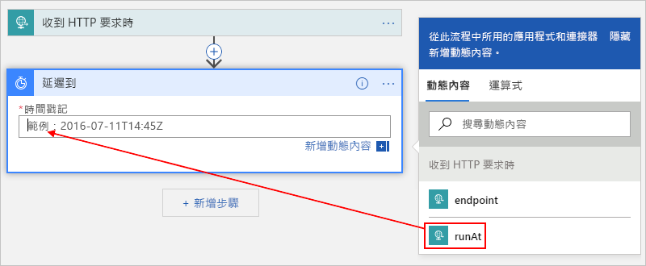
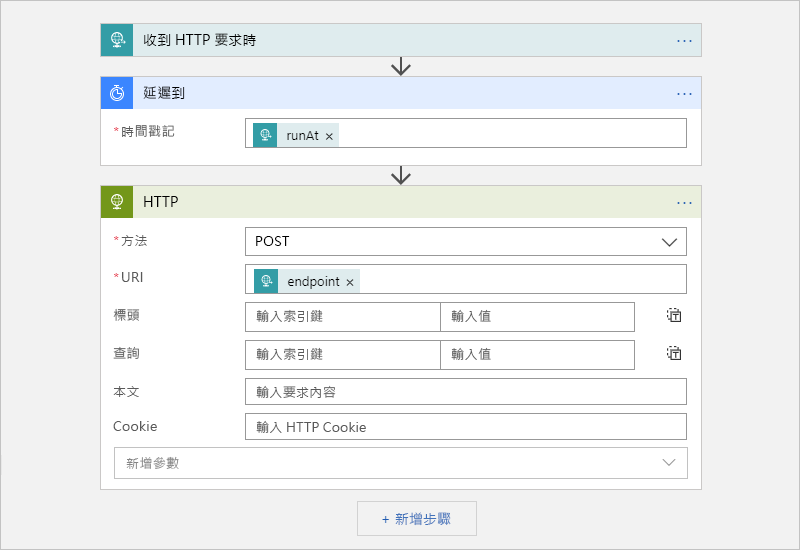

# <a name="migrate-azure-scheduler-jobs-to-azure-logic-apps"></a>將 Azure 排程器作業移轉至 Azure Logic Apps

> [!IMPORTANT]
> [Azure 邏輯應用](../logic-apps/logic-apps-overview.md)正在替換[正在停用](#retire-date)的 Azure 計畫程式。 要繼續處理在計畫程式中設置的作業，請按照本文儘快遷移到 Azure 邏輯應用。 
>
> 計畫程式在 Azure 門戶中不再可用，但[REST API](/rest/api/scheduler)和[Azure 計畫程式 PowerShell Cmdlet](scheduler-powershell-reference.md)此時仍然可用，以便您可以管理作業和作業集合。

本文說明如何使用 Azure Logic Apps 而非 Azure 排程器來建立自動化工作流程，藉以排程單次和週期性作業。 當您使用 Logic Apps 建立排程作業時，您會獲得下列權益：

* 通過使用來自數百個服務的視覺化設計器和[即用型連接器](../connectors/apis-list.md)（如 Azure Blob 存儲、Azure 服務匯流排、Office 365 Outlook 和 SAP）來構建作業。

* 將每個計畫工作流作為一流的 Azure 資源進行管理。 您不必擔心*作業集合*的概念，因為每個邏輯應用都是單獨的 Azure 資源。

* 使用單個邏輯應用運行多個一次性作業。

* 設置支援時區並自動調整為夏令時 （DST） 的計畫。

要瞭解更多資訊，請參閱[什麼是 Azure 邏輯應用？或](../logic-apps/logic-apps-overview.md)嘗試在此快速入門中創建第一個邏輯應用：[創建第一個邏輯應用](../logic-apps/quickstart-create-first-logic-app-workflow.md)。

## <a name="prerequisites"></a>Prerequisites

* Azure 訂用帳戶。 如果您沒有 Azure 訂用帳戶，請先[註冊免費的 Azure 帳戶](https://azure.microsoft.com/free/)。

* 若要藉由傳送 HTTP 要求來觸發邏輯應用程式，請使用 [Postman 桌面應用程式](https://www.getpostman.com/apps) \(英文\) 之類的工具。

## <a name="migrate-by-using-a-script"></a>使用腳本遷移

每個計畫程式作業都是唯一的，因此不存在用於將計畫程式作業遷移到 Azure 邏輯應用的單一大小適合的工具。 但是，您可以[編輯此腳本](https://github.com/Azure/logicapps/tree/master/scripts/scheduler-migration)以滿足您的需要。

## <a name="schedule-one-time-jobs"></a>排程單次作業

您可以只建立單一邏輯應用程式來執行多個單次作業。

1. 在 [Azure 入口網站](https://portal.azure.com)中，於邏輯應用程式設計工具中建立空白的邏輯應用程式。

   若要了解基本步驟，請遵循[快速入門：建立第一個邏輯應用程式](../logic-apps/quickstart-create-first-logic-app-workflow.md)。

1. 在搜索框中，輸入`when a http request`以查找請求觸發器。 從觸發程序清單中，選取此觸發程序：**收到 HTTP 要求時**

   

1. 對於請求觸發器，您可以選擇提供 JSON 架構，這有助於邏輯應用設計器瞭解對請求觸發器的入站調用中包含的輸入的結構，並使輸出更易於在工作流中稍後選擇。

   在 **"請求正文 JSON 架構"** 框中，輸入架構，例如：

   

   如果您沒有結構描述，但是有 JSON 格式的範例承載，即可從該承載產生 JSON 結構描述。

   1. 在要求觸發程序中，選取 [使用範例承載來產生結構描述]****。

   1. **在"輸入或粘貼 JSON 有效負載示例**"下，提供示例有效負載，然後選擇 **"完成**"，例如：

      

      ```json
      {
         "runat": "2012-08-04T00:00Z",
         "endpoint": "https://www.bing.com"
      }
      ```

1. 在觸發器下，選擇 **"下一步**"。

1. 在搜尋方塊中，輸入 `delay until` 作為篩選條件。 在動作清單下方，選取此動作：**延遲直到**

   此動作會暫停您的邏輯應用程式工作流程，直到指定的日期和時間為止。

   

1. 輸入您想要啟動邏輯應用程式工作流程的時間戳記。

   按一下**時間戳記**框內時，將顯示動態內容清單，以便可以選擇從觸發器中選擇輸出。

   

1. 通過從[數百個即用型連接器](../connectors/apis-list.md)中進行選擇，添加要運行的任何其他操作。

   例如，您可以包含將要求傳送至 URL 的 HTTP 動作，或使用儲存體佇列、服務匯流排佇列或服務匯流排主題的動作：

   

1. 完成後，儲存邏輯應用程式。

   

   當您第一次儲存邏輯應用程式時，邏輯應用程式要求觸發程序的端點 URL 會出現在 [HTTP POST URL]**** 方塊中。 當您想要呼叫邏輯應用程式，並將輸入傳送至您的邏輯應用程式進行處理時，請使用此 URL 作為呼叫目的地。

   

1. 複製並儲存此端點 URL，讓您稍後可以傳送手動要求來觸發邏輯應用程式。

## <a name="start-a-one-time-job"></a>啟動單次作業

若要手動執行或觸發單次作業，請針對邏輯應用程式的要求觸發程序傳送對端點 URL 的呼叫。 在此呼叫中，指定要傳送的輸入或承載，而您可能已在稍早藉由指定結構描述來說明此項。

例如，使用 Postman 應用，您可以創建具有與此示例類似的設置的 POST 請求，然後選擇"**發送**"以發出請求。

| 要求方法 | URL | body | headers |
|----------------|-----|------|---------|
| **發佈** | <*端點-URL*> | **raw** <p>**JSON(application/json)** <p>在**原始**框中，輸入要在請求中發送的有效負載。 <p>**附註**：此設定會自動設定 **Headers** \(標頭\) 值。 | **鍵**： 內容類型 <br>**值**： 應用程式 /json |
|||||


當您傳送呼叫之後，來自邏輯應用程式的回應就會出現在 [Body]**** \(主體\) 索引標籤上的 [raw]**** \(未經處理\) 方塊下方。 

<a name="workflow-run-id"></a>

> [!IMPORTANT]
>
> 如果以後要取消作業，請選擇 **"標題"** 選項卡。在回應中查找並複製**x-ms-workflow-運行 id**標頭值。 
>
> 

## <a name="cancel-a-one-time-job"></a>取消單次作業

在 Logic Apps 中，每個單次作業都會當成單一邏輯應用程式回合執行個體來執行。 若要取消單次作業，您可以在邏輯應用程式 REST API 中使用[工作流程回合 - 取消](https://docs.microsoft.com/rest/api/logic/workflowruns/cancel) \(英文\)。 當您將呼叫傳送給觸發程序時，請提供[工作流程回合識別碼](#workflow-run-id)。

## <a name="schedule-recurring-jobs"></a>排程週期性作業

1. 在 [Azure 入口網站](https://portal.azure.com)中，於邏輯應用程式設計工具中建立空白的邏輯應用程式。

   若要了解基本步驟，請遵循[快速入門：建立第一個邏輯應用程式](../logic-apps/quickstart-create-first-logic-app-workflow.md)。

1. 在搜尋方塊中，輸入 "recurrence" 作為篩選條件。 從觸發程序清單中，選取此觸發程序：**週期性**

   

1. 視需要來設定更進階的排程。

   

   有關高級計畫選項的詳細資訊，請參閱使用[Azure 邏輯應用創建和運行定期任務和工作流](../connectors/connectors-native-recurrence.md)。

1. 通過從[數百個即用型中選擇](../connectors/apis-list.md)添加所需的其他操作。 在觸發器下，選擇 **"下一步**"。 尋找並選取您想要的動作。

   例如，您可以包含將要求傳送至 URL 的 HTTP 動作，或使用儲存體佇列、服務匯流排佇列或服務匯流排主題的動作：

   

1. 完成後，儲存邏輯應用程式。

   

## <a name="advanced-setup"></a>進階設定

以下是您可用來自訂作業的其他方式。

### <a name="retry-policy"></a>重試原則

若要控制在發生間歇性失敗時某個動作嘗試在您邏輯應用程式中重新執行的方式，您可以在每個動作的設定中設定[重試原則](../logic-apps/logic-apps-exception-handling.md#retry-policies)，例如：

1. 打開操作的省略號 （**...）** 功能表，然後選擇 **"設置**"。

   

1. 選擇所需的重試策略。 如需每個原則的詳細資訊，請參閱[重試原則](../logic-apps/logic-apps-exception-handling.md#retry-policies)。

   

## <a name="handle-exceptions-and-errors"></a>處理例外狀況和錯誤

在 Azure 排程器中，如果預設動作無法執行，您可以執行替代的動作來解決錯誤狀況。 在 Azure Logic Apps 中，您也可以執行相同的工作。

1. 在邏輯應用設計器中，在要處理的操作上方，在步驟之間將指標移到箭頭上，然後選擇"**添加平行分支**"。

   

1. 尋找並選取您想要改為替代動作執行的動作。

   

1. 在替代操作上，打開橢圓 （**...）** 功能表，然後選擇 **"配置"後運行**。

   

1. 清除 [已成功]**** 屬性的方塊。 選取這些屬性：**已失敗**、**已跳過**和**已逾時**

   

1. 完成之後，選取 [完成]****。

若要深入了解例外狀況處理，請參閱[處理錯誤和例外狀況 - RunAfter 屬性](../logic-apps/logic-apps-exception-handling.md#control-run-after-behavior)。

## <a name="faq"></a>常見問題集

<a name="retire-date"></a>

**問**：Azure 排程器何時淘汰？ <br>
**答**：Azure 計畫程式計畫于 2019 年 12 月 31 日完全停用。 有關在此日期之前採取的重要步驟和詳細時程表，請參閱[將計畫計畫的退休日期延長至 2019 年 12 月 31 日](https://azure.microsoft.com/updates/extending-retirement-date-of-scheduler/)。 有關常規更新，請參閱[Azure 更新 - 計畫程式](https://azure.microsoft.com/updates/?product=scheduler)。

**問**：服務停用後，我的工作集和工作會發生什麼情況？ <br>
**A**： 所有計劃程式作業集合和作業停止運行，並從系統中刪除。

**問**：我是否需要先備份或執行任何其他工作，然後才能將排程器作業移轉至 Logic Apps？ <br>
**答**：最佳做法是一律備份您的工作。 請先檢查您所建立的邏輯應用程式均如預期般執行，然後再刪除或停用排程器作業。

**問**：是否有工具可協助我將作業從排程器移轉至 Logic Apps？ <br>
**答**：每個排程器作業都是唯一的，因此沒有一體適用的工具。 但是，根據您的需要，可以[編輯此腳本以將 Azure 計畫程式作業遷移到 Azure 邏輯應用](https://github.com/Azure/logicapps/tree/master/scripts/scheduler-migration)。

**問**：哪裡可以取得移轉排程器作業的支援？ <br>
**答**：以下是一些取得支援的方式：

**Azure 門戶**

如果您的 Azure 訂用帳戶具備付費的支援方案，則您可以在 Azure 入口網站中建立技術支援要求。 否則，您可以選取不同的支援選項。

1. 在 [Azure 入口網站](https://portal.azure.com)主功能表上，選取 [説明 + 支援]****。

1. 在 **"支援"** 功能表中，選擇 **"新建支援請求**"。 為您的請求提供此資訊：

   | 屬性 | 值 |
   |---------|-------|
   | **問題類型** | **技術** |
   | **訂閱** | <*Azure 訂閱*> |
   | **服務** | 在 [監視與管理]**** 下方，選取 [排程器]****。 如果找不到**計畫程式**，請先選擇 **"所有服務**"。 |
   ||| 

1. 選取您想要的支援選項。 如果您有付費支援計畫，請選擇 **"下一步**"。

**社群**

* [Azure Logic Apps 論壇](https://social.msdn.microsoft.com/Forums/en-US/home?forum=azurelogicapps)
* [Stack Overflow](https://stackoverflow.com/questions/tagged/azure-scheduler)

## <a name="next-steps"></a>後續步驟

* [使用 Azure Logic Apps 建立定期執行的工作和工作流程](../connectors/connectors-native-recurrence.md)