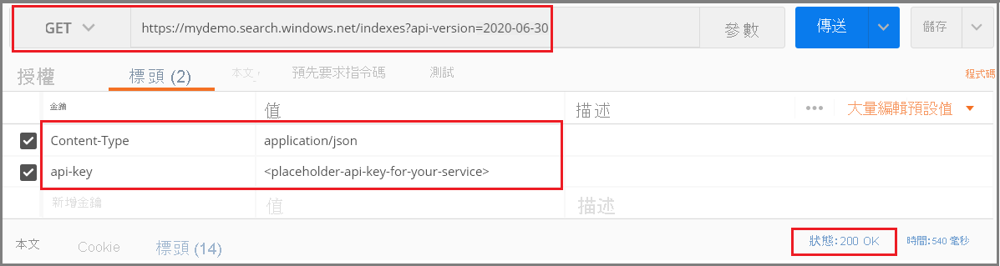
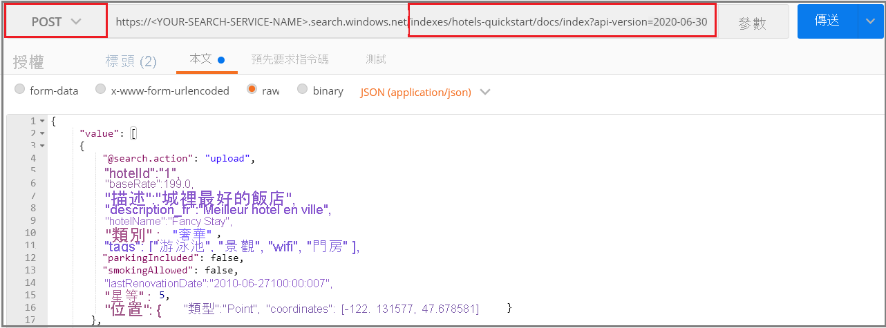
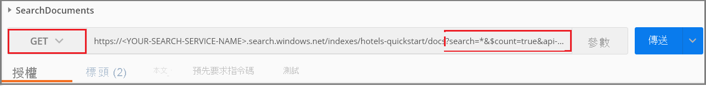
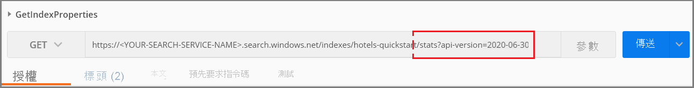

本文使用 Postman 桌面應用程式。 如果您偏好使用預先定義的要求，可以[下載並匯入 Postman 集合](https://github.com/Azure-Samples/azure-search-postman-samples/tree/master/Quickstart) \(英文\)。

## <a name="prerequisites"></a>Prerequisites

此快速入門需要下列服務和工具。 

+ [Postman 傳統型應用程式](https://www.getpostman.com/)可用來將要求傳送至 Azure 認知搜尋。

+ [建立 Azure 認知搜尋服務](../search-create-service-portal.md)，或在您目前的訂用帳戶下方[尋找現有服務](https://ms.portal.azure.com/#blade/HubsExtension/BrowseResourceBlade/resourceType/Microsoft.Search%2FsearchServices)。 您可以使用本快速入門的免費服務。 

## <a name="copy-a-key-and-url"></a>複製金鑰和 URL

REST 呼叫需要服務 URL 和每個要求的存取金鑰。 建立搜尋服務時需要這兩項資料，因此如果您將 Azure 認知搜尋新增至您的訂用帳戶，請依照下列步驟來取得必要的資訊：

1. [登入 Azure 入口網站](https://portal.azure.com/)，並在搜尋服務的 [概觀]  頁面上取得 URL。 範例端點看起來會像是 `https://mydemo.search.windows.net`。

1. 在 [設定]   >  [金鑰]  中，取得服務上完整權限的管理金鑰。 可互換的管理金鑰有兩個，可在您需要變換金鑰時提供商務持續性。 您可以在新增、修改及刪除物件的要求上使用主要或次要金鑰。


所有要求均都需要在傳送至您服務上的每個要求上使用 API 金鑰。 擁有有效的金鑰就能為每個要求在傳送要求之應用程式與處理要求之服務間建立信任。

## <a name="connect-to-azure-cognitive-search"></a>連線至 Azue 認知搜尋

在本節中，您可以使用選取的 Web 工具來設定 Azure 認知搜尋的連線。 每個工具都會保存工作階段的要求標頭資訊，這表示您只需要輸入一次 API 金鑰和內容類型。

針對任何一種工具，您都需要選擇命令 (GET、POST 及 PUT等等) 和提供 URL 端點，並且針對某些工作，在要求本文中提供 JSON。 使用有效值取代搜尋服務名稱 (YOUR-SEARCH-SERVICE-NAME)。 新增 `$select=name` 以僅傳回每個索引的名稱。 

> `https://<YOUR-SEARCH-SERVICE-NAME>.search.windows.net/indexes?api-version=2020-06-30&$select=name`

您會看到 HTTPS 前置詞、服務名稱、物件名稱 (此案例使用索引集合) 和 [API 版本](../search-api-versions.md)。 API 版本是針對目前版本指定的必要小寫字串，例如 `?api-version=2020-06-30`。 API 版本會定期更新。 在每個要求上包括 API 版本可讓您具備所使用之版本的完整控制權。  

要求標頭組合包含兩個元素：`Content-Type` 以及用來對 Azure 認知搜尋進行驗證的 `api-key`。 使用有效值取代系統管理員 API 金鑰 (YOUR-AZURE-SEARCH-ADMIN-API-KEY)。 

```http
api-key: <YOUR-AZURE-SEARCH-ADMIN-API-KEY>
Content-Type: application/json
```

在 Postman 中，可制訂如下列螢幕擷取畫面所示的要求。 選擇 **GET** 作為命令、提供 URL，然後按一下 [傳送]。 此命令會連線至 Azure 認知搜尋、讀取索引集合，並在連線成功時傳回 HTTP 狀態碼 200。 如果您的服務已有索引，回應也會包含索引定義。



## <a name="1---create-an-index"></a>1 - 建立索引

在 Azure 認知搜尋中，您通常會先建立索引，然後再載入資料。 這項工作會使用[建立索引 REST API](/rest/api/searchservice/create-index) \(英文\)。 

我們已延長 URL 來加入 `hotels` 索引名稱。

若要在 Postman 中執行這項操作：

1. 將命令變更為 **PUT**。

2. 複製此 URL `https://<YOUR-SEARCH-SERVICE-NAME>.search.windows.net/indexes/hotels-quickstart?api-version=2020-06-30`。

3. 在要求本文中提供索引定義 (下面提供可供複製的程式碼)。

4. 按一下 [ **傳送**]。


### <a name="index-definition"></a>索引定義

欄位集合會定義文件結構。 每份文件都必須有這些欄位，而且每個欄位都必須有資料類型。 在全文檢索搜尋中，會使用字串欄位。 如果您需要可搜尋的數值資料，必須將數值資料轉換成字串。

欄位上的屬性會決定允許的動作。 REST API 預設允許許多動作。 例如，預設所有字串都可搜尋、可擷取、可篩選，以及可 Facet。 通常，您只需要在必須關閉行為時設定屬性。

```json
{
    "name": "hotels-quickstart",  
    "fields": [
        {"name": "HotelId", "type": "Edm.String", "key": true, "filterable": true},
        {"name": "HotelName", "type": "Edm.String", "searchable": true, "filterable": false, "sortable": true, "facetable": false},
        {"name": "Description", "type": "Edm.String", "searchable": true, "filterable": false, "sortable": false, "facetable": false, "analyzer": "en.lucene"},
        {"name": "Category", "type": "Edm.String", "searchable": true, "filterable": true, "sortable": true, "facetable": true},
        {"name": "Tags", "type": "Collection(Edm.String)", "searchable": true, "filterable": true, "sortable": false, "facetable": true},
        {"name": "ParkingIncluded", "type": "Edm.Boolean", "filterable": true, "sortable": true, "facetable": true},
        {"name": "LastRenovationDate", "type": "Edm.DateTimeOffset", "filterable": true, "sortable": true, "facetable": true},
        {"name": "Rating", "type": "Edm.Double", "filterable": true, "sortable": true, "facetable": true},
        {"name": "Address", "type": "Edm.ComplexType", 
        "fields": [
        {"name": "StreetAddress", "type": "Edm.String", "filterable": false, "sortable": false, "facetable": false, "searchable": true},
        {"name": "City", "type": "Edm.String", "searchable": true, "filterable": true, "sortable": true, "facetable": true},
        {"name": "StateProvince", "type": "Edm.String", "searchable": true, "filterable": true, "sortable": true, "facetable": true},
        {"name": "PostalCode", "type": "Edm.String", "searchable": true, "filterable": true, "sortable": true, "facetable": true},
        {"name": "Country", "type": "Edm.String", "searchable": true, "filterable": true, "sortable": true, "facetable": true}
        ]
     }
  ]
}
```

當您提交此要求時，您應該會取得 HTTP 201 回應，指出已成功建立索引。 您可以在網站中驗證此動作，但是請注意，入口網站分頁有重新整理間隔，因此可能需要一兩分鐘才會更新。

> [!TIP]
> 如果您收到 HTTP 504，請確認 URL 所指定的是 HTTPS。 如果您看見 HTTP 400 或 404，請查看要求本文以確認並沒有「複製-貼上」錯誤。 HTTP 403 通常表示 API 金鑰有問題 (可能是金鑰無效或是用來指定 API 金鑰的語法有問題)。

## <a name="2---load-documents"></a>2 - 載入文件

建立索引和填入索引是個別的步驟。 在 Azure 認知搜尋中，索引會包含所有可搜尋的資料。 在此案例中，資料會以 JSON 文件的形式提供。 這項工作會使用[新增、更新或刪除文件 REST API](/rest/api/searchservice/addupdate-or-delete-documents) \(英文\)。 

我們已延長 URL 來加入 `docs` 集合和 `index` 作業。

若要在 Postman 中執行這項操作：

1. 將命令變更為 **POST**。

2. 複製此 URL `https://<YOUR-SEARCH-SERVICE-NAME>.search.windows.net/indexes/hotels-quickstart/docs/index?api-version=2020-06-30`。

3. 在要求本文中提供 JSON 文件 (下面提供可供複製的程式碼)。

4. 按一下 [ **傳送**]。



### <a name="json-documents-to-load-into-the-index"></a>要載入索引的 JSON 文件

[Request Body (要求本文)] 包含 4 個要新增到飯店索引的文件。

```json
{
    "value": [
    {
    "@search.action": "upload",
    "HotelId": "1",
    "HotelName": "Secret Point Motel",
    "Description": "The hotel is ideally located on the main commercial artery of the city in the heart of New York. A few minutes away is Time's Square and the historic centre of the city, as well as other places of interest that make New York one of America's most attractive and cosmopolitan cities.",
    "Category": "Boutique",
    "Tags": [ "pool", "air conditioning", "concierge" ],
    "ParkingIncluded": false,
    "LastRenovationDate": "1970-01-18T00:00:00Z",
    "Rating": 3.60,
    "Address": 
        {
        "StreetAddress": "677 5th Ave",
        "City": "New York",
        "StateProvince": "NY",
        "PostalCode": "10022",
        "Country": "USA"
        } 
    },
    {
    "@search.action": "upload",
    "HotelId": "2",
    "HotelName": "Twin Dome Motel",
    "Description": "The hotel is situated in a  nineteenth century plaza, which has been expanded and renovated to the highest architectural standards to create a modern, functional and first-class hotel in which art and unique historical elements coexist with the most modern comforts.",
    "Category": "Boutique",
    "Tags": [ "pool", "free wifi", "concierge" ],
    "ParkingIncluded": false,
    "LastRenovationDate": "1979-02-18T00:00:00Z",
    "Rating": 3.60,
    "Address": 
        {
        "StreetAddress": "140 University Town Center Dr",
        "City": "Sarasota",
        "StateProvince": "FL",
        "PostalCode": "34243",
        "Country": "USA"
        } 
    },
    {
    "@search.action": "upload",
    "HotelId": "3",
    "HotelName": "Triple Landscape Hotel",
    "Description": "The Hotel stands out for its gastronomic excellence under the management of William Dough, who advises on and oversees all of the Hotel’s restaurant services.",
    "Category": "Resort and Spa",
    "Tags": [ "air conditioning", "bar", "continental breakfast" ],
    "ParkingIncluded": true,
    "LastRenovationDate": "2015-09-20T00:00:00Z",
    "Rating": 4.80,
    "Address": 
        {
        "StreetAddress": "3393 Peachtree Rd",
        "City": "Atlanta",
        "StateProvince": "GA",
        "PostalCode": "30326",
        "Country": "USA"
        } 
    },
    {
    "@search.action": "upload",
    "HotelId": "4",
    "HotelName": "Sublime Cliff Hotel",
    "Description": "Sublime Cliff Hotel is located in the heart of the historic center of Sublime in an extremely vibrant and lively area within short walking distance to the sites and landmarks of the city and is surrounded by the extraordinary beauty of churches, buildings, shops and monuments. Sublime Cliff is part of a lovingly restored 1800 palace.",
    "Category": "Boutique",
    "Tags": [ "concierge", "view", "24-hour front desk service" ],
    "ParkingIncluded": true,
    "LastRenovationDate": "1960-02-06T00:00:00Z",
    "Rating": 4.60,
    "Address": 
        {
        "StreetAddress": "7400 San Pedro Ave",
        "City": "San Antonio",
        "StateProvince": "TX",
        "PostalCode": "78216",
        "Country": "USA"
        }
    }
  ]
}
```

幾秒鐘後，您應該就會在工作階段清單中看見 HTTP 201 回應。 這表示已成功建立文件。 

如果您收到 207，表示至少有一個文件上傳失敗。 如果您收到 404，則表示要求的標頭或本文有語法錯誤：確認您已變更端點以包含 `/docs/index`。

> [!Tip]
> 針對選取的資料來源，您可以選擇替代「索引子」方法，這個方法可簡化並減少編制索引所需的程式碼數量。 如需詳細資訊，請參閱[索引子作業](/rest/api/searchservice/indexer-operations)。


## <a name="3---search-an-index"></a>3 - 搜尋索引

現在已載入索引和文件集，您可以使用[搜尋文件 REST API](/rest/api/searchservice/search-documents) \(英文\) 對其發出查詢。

我們已延長 URL 來加入使用搜尋運算子指定的查詢運算式。

若要在 Postman 中執行這項操作：

1. 將命令變更為 **GET**。

2. 複製此 URL `https://<YOUR-SEARCH-SERVICE-NAME>.search.windows.net/indexes/hotels-quickstart/docs?search=*&$count=true&api-version=2020-06-30`。

3. 按一下 [ **傳送**]。

此查詢是空的，而且會在搜尋結果中傳回文件計數。 在您按一下 [傳送] 之後，Postman 的要求和回應看起來應該類似下列螢幕擷取畫面。 狀態碼應為 200。

 

嘗試其他幾個查詢範例來了解語法的風格。 您可以執行字串搜尋、逐字 $filter 查詢、限制結果集，將搜尋範圍限定在特定欄位等等。

使用下列 URL 交換目前的 URL，每次都按一下 [傳送] 以檢視結果。

```
# Query example 1 - Search on restaurant and wifi
# Return only the HotelName, Description, and Tags fields
https://<YOUR-SEARCH-SERVICE>.search.windows.net/indexes/hotels-quickstart/docs?search=restaurant wifi&$count=true&$select=HotelName,Description,Tags&api-version=2020-06-30

# Query example 2 - Apply a filter to the index to find hotels rated 4 or highter
# Returns the HotelName and Rating. Two documents match
https://<YOUR-SEARCH-SERVICE>.search.windows.net/indexes/hotels-quickstart/docs?search=*&$filter=Rating gt 4&$select=HotelName,Rating&api-version=2020-06-30

# Query example 3 - Take the top two results, and show only HotelName and Category in the results
https://<YOUR-SEARCH-SERVICE>.search.windows.net/indexes/hotels-quickstart/docs?search=boutique&$top=2&$select=HotelName,Category&api-version=2020-06-30

# Query example 4 - Sort by a specific field (Address/City) in ascending order
https://<YOUR-SEARCH-SERVICE>.search.windows.net/indexes/hotels-quickstart/docs?search=pool&$orderby=Address/City asc&$select=HotelName, Address/City, Tags, Rating&api-version=2020-06-30
```

## <a name="get-index-properties"></a>取得索引屬性

您也可以使用[取得統計資料](/rest/api/searchservice/get-index-statistics)來查詢文件計數和索引大小： 

```
https://<YOUR-SEARCH-SERVICE-NAME>.search.windows.net/indexes/hotels-quickstart/stats?api-version=2020-06-30
```

將 `/stats` 新增至您的 URL 會傳回索引資訊。 在 Postman 中，您的要求看起來應該與下方項目類似，回應會包括文件計數和使用的空格 (以位元組表示)。

 

請注意，API 版本語法不同。 針對此要求，使用 `?` 以附加 API 版本。 從查詢字串分隔 URL 路徑，`?` 會分隔查詢字串中的每個 'name=value' 組。 針對此查詢，API 版本是查詢字串中第一個也是唯一一個項目。