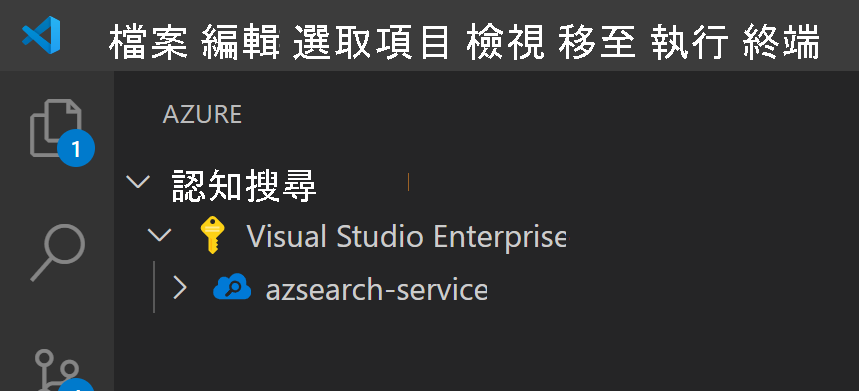
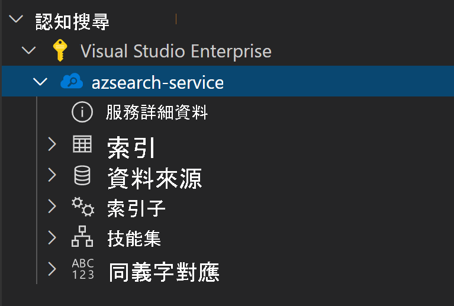
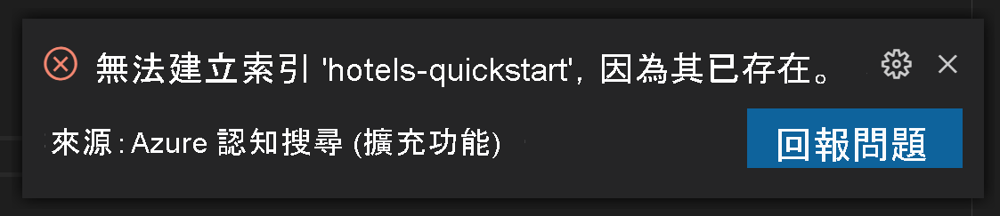
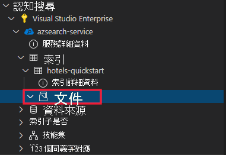
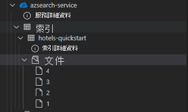

本文使用 Azure 認知搜尋 REST API 的 Visual Studio 程式碼擴充功能 (預覽)。

> [!IMPORTANT] 
> 此功能目前為公開預覽狀態。 預覽功能是在沒有服務等級協定的情況下提供，不建議用於生產工作負載。 如需詳細資訊，請參閱 [Microsoft Azure 預覽版增補使用條款](https://azure.microsoft.com/support/legal/preview-supplemental-terms/)。 

## <a name="prerequisites"></a>Prerequisites

此快速入門需要下列服務和工具。 

+ [Visual Studio Code](https://code.visualstudio.com/download)

+ [適用於 Visual Studio Code 的 Azure 認知搜尋 (預覽)](https://marketplace.visualstudio.com/items?itemName=ms-azuretools.vscode-azurecognitivesearch)

+ [建立 Azure 認知搜尋服務](../search-create-service-portal.md)，或在您目前的訂用帳戶下方[尋找現有服務](https://ms.portal.azure.com/#blade/HubsExtension/BrowseResourceBlade/resourceType/Microsoft.Search%2FsearchServices)。 您可以使用本快速入門的免費服務。 

## <a name="copy-a-key-and-url"></a>複製金鑰和 URL

REST 呼叫需要服務 URL 和每個要求的存取金鑰。 建立搜尋服務時需要這兩項資料，因此如果您將 Azure 認知搜尋新增至您的訂用帳戶，請依照下列步驟來取得必要的資訊：

1. [登入 Azure 入口網站](https://portal.azure.com/)，並在搜尋服務的 [概觀]  頁面上取得 URL。 範例端點看起來會像是 `https://mydemo.search.windows.net`。

1. 在 [設定]   >  [金鑰]  中，取得服務上完整權限的管理金鑰。 可互換的管理金鑰有兩個，可在您需要變換金鑰時提供商務持續性。 您可以在新增、修改及刪除物件的要求上使用主要或次要金鑰。


所有要求均都需要在傳送至您服務上的每個要求上使用 API 金鑰。 擁有有效的金鑰就能為每個要求在傳送要求之應用程式與處理要求之服務間建立信任。

## <a name="install-the-extension"></a>安裝延伸模組

首先，請開啟 [VS Code](https://code.visualstudio.com)。 選取活動列上的 [擴充功能] 索引標籤，然後搜尋 *Azure 認知搜尋*。 在搜尋結果中尋找擴充功能，然後選取 [安裝]。


或者，您也可以在網頁瀏覽器中，安裝來自 VS Code Marketplace 的 [Azure 認知搜尋擴充功能](https://aka.ms/vscode-search)。

您應該會看到新的 Azure 索引標籤顯示在活動列上 (如果您還沒有的話)。


## <a name="connect-to-your-subscription"></a>連線至您的訂用帳戶

選取 [登入 Azure...]，並登入您的 Azure 帳戶。

您應該會看到您的訂用帳戶。 請選取訂用帳戶，以查看訂用帳戶中的搜尋服務清單。



若要限制顯示的訂用帳戶，請開啟命令選擇區 (Ctrl+Shift+P 或 Cmd+Shift+P)，然後搜尋 *Azure* 或 *選取訂用帳戶*。 您也可以使用命令來登入和登出您的 Azure 帳戶。

當您展開搜尋服務時，您會看到每項認知搜尋資源的樹狀項目：索引、資料來源、索引子、技能集和同義字對應。



您可以展開這些樹狀項目，以顯示您在搜尋服務中有的任何資源

## <a name="1---create-an-index"></a>1 - 建立索引

若要開始使用 Azure 認知搜尋，您必須先建立搜尋索引。 此作業可使用[建立索引 REST API](/rest/api/searchservice/create-index) 來完成。 

透過 VS Code 擴充功能，您只需處理要求本文即可。 在本快速入門中，我們將提供範例索引定義和對應的文件。

### <a name="index-definition"></a>索引定義

以下索引定義是虛構飯店的範例結構描述。

`fields` 集合會定義搜尋索引中的文件結構。 每個欄位都有一個資料類型和一些額外的屬性，以決定欄位的使用方式。

```json
{
    "name": "hotels-quickstart",
    "fields": [
        {
            "name": "HotelId",
            "type": "Edm.String",
            "key": true,
            "filterable": true
        },
        {
            "name": "HotelName",
            "type": "Edm.String",
            "searchable": true,
            "filterable": false,
            "sortable": true,
            "facetable": false
        },
        {
            "name": "Description",
            "type": "Edm.String",
            "searchable": true,
            "filterable": false,
            "sortable": false,
            "facetable": false,
            "analyzer": "en.lucene"
        },
        {
            "name": "Description_fr",
            "type": "Edm.String",
            "searchable": true,
            "filterable": false,
            "sortable": false,
            "facetable": false,
            "analyzer": "fr.lucene"
        },
        {
            "name": "Category",
            "type": "Edm.String",
            "searchable": true,
            "filterable": true,
            "sortable": true,
            "facetable": true
        },
        {
            "name": "Tags",
            "type": "Collection(Edm.String)",
            "searchable": true,
            "filterable": true,
            "sortable": false,
            "facetable": true
        },
        {
            "name": "ParkingIncluded",
            "type": "Edm.Boolean",
            "filterable": true,
            "sortable": true,
            "facetable": true
        },
        {
            "name": "LastRenovationDate",
            "type": "Edm.DateTimeOffset",
            "filterable": true,
            "sortable": true,
            "facetable": true
        },
        {
            "name": "Rating",
            "type": "Edm.Double",
            "filterable": true,
            "sortable": true,
            "facetable": true
        },
        {
            "name": "Address",
            "type": "Edm.ComplexType",
            "fields": [
                {
                    "name": "StreetAddress",
                    "type": "Edm.String",
                    "filterable": false,
                    "sortable": false,
                    "facetable": false,
                    "searchable": true
                },
                {
                    "name": "City",
                    "type": "Edm.String",
                    "searchable": true,
                    "filterable": true,
                    "sortable": true,
                    "facetable": true
                },
                {
                    "name": "StateProvince",
                    "type": "Edm.String",
                    "searchable": true,
                    "filterable": true,
                    "sortable": true,
                    "facetable": true
                },
                {
                    "name": "PostalCode",
                    "type": "Edm.String",
                    "searchable": true,
                    "filterable": true,
                    "sortable": true,
                    "facetable": true
                },
                {
                    "name": "Country",
                    "type": "Edm.String",
                    "searchable": true,
                    "filterable": true,
                    "sortable": true,
                    "facetable": true
                }
            ]
        }
    ],
    "suggesters": [
        {
            "name": "sg",
            "searchMode": "analyzingInfixMatching",
            "sourceFields": [
                "HotelName"
            ]
        }
    ]
}
```

若要建立新的索引，請以滑鼠右鍵按一下 [索引]，然後選取 [建立新的索引]。 此時會顯示名稱類似於 `indexes-new-28c972f661.azsindex` 的編輯器。 

將上述索引定義貼到視窗中。 儲存檔案，並在系統提示您是否要更新索引時，選取 [上傳]。 這會建立索引，並將其提供於樹狀檢視中。


如果您的索引定義有問題，您應該會看到一則說明錯誤的錯誤訊息。



如果發生這種情況，請修正問題並重新儲存檔案。

## <a name="2---load-documents"></a>2 - 載入文件

建立索引和填入索引是個別的步驟。 在 Azure 認知搜尋中，索引會包含所有可搜尋的資料。 在此案例中，資料會以 JSON 文件的形式提供。 這項工作會使用[新增、更新或刪除文件 REST API](/rest/api/searchservice/addupdate-or-delete-documents) \(英文\)。 

若要在 VS Code 中新增文件：

1. 展開您所建立的 `hotels-quickstart` 索引。 以滑鼠右鍵按一下 [文件]，然後選取 [建立新的文件]。

    

2. 這會開啟已推斷索引結構描述的 JSON 編輯器。

    

3. 貼上下列 JSON，然後儲存檔案。 此時會開啟一則提示，要求您確認變更。 請選取 [上傳] 以儲存變更。

    ```json
    {
        "HotelId": "1",
        "HotelName": "Secret Point Motel",
        "Description": "The hotel is ideally located on the main commercial artery of the city in the heart of New York. A few minutes away is Time's Square and the historic centre of the city, as well as other places of interest that make New York one of America's most attractive and cosmopolitan cities.",
        "Category": "Boutique",
        "Tags": [ "pool", "air conditioning", "concierge" ],
        "ParkingIncluded": false,
        "LastRenovationDate": "1970-01-18T00:00:00Z",
        "Rating": 3.60,
        "Address": {
            "StreetAddress": "677 5th Ave",
            "City": "New York",
            "StateProvince": "NY",
            "PostalCode": "10022",
            "Country": "USA"
        } 
    }
    ```

4. 對其餘三份文件重複此程序

    文件 2：
    ```json
    {
        "HotelId": "2",
        "HotelName": "Twin Dome Motel",
        "Description": "The hotel is situated in a  nineteenth century plaza, which has been expanded and renovated to the highest architectural standards to create a modern, functional and first-class hotel in which art and unique historical elements coexist with the most modern comforts.",
        "Category": "Boutique",
        "Tags": [ "pool", "free wifi", "concierge" ],
        "ParkingIncluded": false,
        "LastRenovationDate": "1979-02-18T00:00:00Z",
        "Rating": 3.60,
        "Address": {
            "StreetAddress": "140 University Town Center Dr",
            "City": "Sarasota",
            "StateProvince": "FL",
            "PostalCode": "34243",
            "Country": "USA"
        } 
    }
    ```

    文件 3：
    ```json
    {
        "HotelId": "3",
        "HotelName": "Triple Landscape Hotel",
        "Description": "The Hotel stands out for its gastronomic excellence under the management of William Dough, who advises on and oversees all of the Hotel’s restaurant services.",
        "Category": "Resort and Spa",
        "Tags": [ "air conditioning", "bar", "continental breakfast" ],
        "ParkingIncluded": true,
        "LastRenovationDate": "2015-09-20T00:00:00Z",
        "Rating": 4.80,
        "Address": {
            "StreetAddress": "3393 Peachtree Rd",
            "City": "Atlanta",
            "StateProvince": "GA",
            "PostalCode": "30326",
            "Country": "USA"
        } 
    }
    ```

    文件 4：
    ```json
    {
        "HotelId": "4",
        "HotelName": "Sublime Cliff Hotel",
        "Description": "Sublime Cliff Hotel is located in the heart of the historic center of Sublime in an extremely vibrant and lively area within short walking distance to the sites and landmarks of the city and is surrounded by the extraordinary beauty of churches, buildings, shops and monuments. Sublime Cliff is part of a lovingly restored 1800 palace.",
        "Category": "Boutique",
        "Tags": [ "concierge", "view", "24-hour front desk service" ],
        "ParkingIncluded": true,
        "LastRenovationDate": "1960-02-06T00:00:00Z",
        "Rating": 4.60,
        "Address": {
            "StreetAddress": "7400 San Pedro Ave",
            "City": "San Antonio",
            "StateProvince": "TX",
            "PostalCode": "78216",
            "Country": "USA"
        }
    }
    ```

此時，您應該會在 [文件] 區段中看到四份文件全數顯示。



## <a name="3---search-an-index"></a>3 - 搜尋索引

索引和文件集現已載入，您可以使用[搜尋文件 REST API](/rest/api/searchservice/search-documents) 對其發出查詢。

若要在 VS Code 中執行此動作：

1. 以滑鼠右鍵按一下您要搜尋的索引，然後選取 [搜尋索引]。 這會開啟名稱類似於 `sandbox-b946dcda48.azs` 的編輯器。

    

2. 系統會自動填入簡單的查詢。 請按 **Ctrl+Alt+R** 或 **Cmd+Alt+R** 以提交查詢。 您會在左側的視窗中看到顯示的結果。

    


### <a name="example-queries"></a>查詢範例

嘗試其他幾個查詢範例來了解語法的風格。 此外還有以下四個查詢可供您試用。 您可以在相同的編輯器中新增多個查詢。 當您按 **Ctrl+Alt+R** 或 **Cmd+Alt+R** 時，游標所在的行會決定要提交的查詢。


在第一個查詢中，我們僅搜尋 `boutique` 並 `select` 特定欄位。 最佳做法是只針對所需的欄位執行 `select`，因為提取不必要的資料可能會讓查詢延遲。 此查詢也會設定 `$count=true`，以傳回搜尋結果的結果總數。

```
// Query example 1 - Search `boutique` with select and return count
search=boutique&$count=true&$select=HotelId,HotelName,Rating,Category
```

在下一個查詢中，我們會指定搜尋詞彙 `wifi`，同時包含一個篩選準則，只會傳回狀態等於 `'FL'` 的結果。 結果也會依飯店的 `Rating` 排序。

```
// Query example 2 - Search with filter, orderBy, select, and count
search=wifi&$filter=Address/StateProvince eq 'FL'&$select=HotelId,HotelName,Rating&$orderby=Rating desc
```

接下來，使用 `searchFields` 參數，將搜尋限制為單一可搜尋的欄位。 如果您只想要知道在特定欄位中的相符項目，這是很好的選項，會讓您的查詢更有效率。

```
// Query example 3 - Limit searchFields
search=submlime cliff&$select=HotelId,HotelName,Rating&searchFields=HotelName
```

另一個要包含在查詢中的常見選項是 `facets`。 Facet 可讓您在 UI 上建立篩選，讓使用者能夠輕鬆地知道可以篩選的值。

```
// Query example 4 - Take the top two results, and show only HotelName and Category in the results
search=*&$select=HotelId,HotelName,Rating&searchFields=HotelName&facet=Category
```

## <a name="open-index-in-the-portal"></a>在入口網站中開啟索引

如果您想要在入口網站中檢視搜尋服務，請以滑鼠右鍵按一下搜尋服務的名稱，然後選取 [在入口網站中開啟]。 這會使您移至 Azure 入口網站中的搜尋服務。