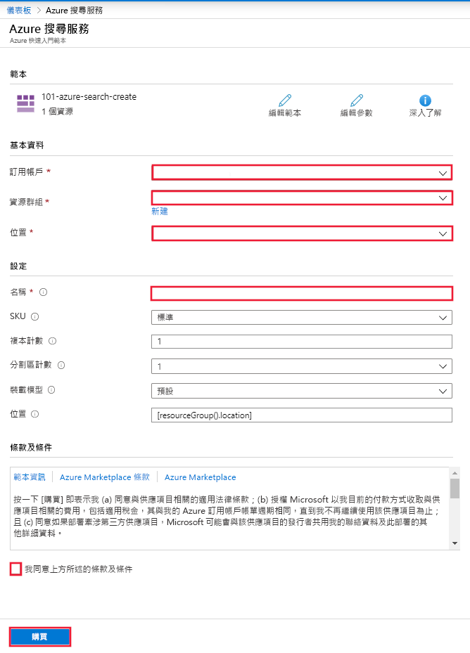

# 快速入門：使用 ARM 範本部署認知搜尋

本文會逐步引導您完成使用 Azure Resource Manager 範本 (ARM 範本) 在 Azure 入口網站中部署 Azure 認知搜尋資源的程序。

[!INCLUDE [About Azure Resource Manager](../../includes/resource-manager-quickstart-introduction.md)]

如果您的環境符合必要條件，而且您很熟悉 ARM 範本，請選取 [部署至 Azure] 按鈕。 範本會在 Azure 入口網站中開啟。

## 必要條件

如果您沒有 Azure 訂用帳戶，請在開始前建立[免費帳戶](https://azure.microsoft.com/free/?WT.mc_id=A261C142F)。

## 檢閱範本

本快速入門中使用的範本是來自 [Azure 快速入門範本](https://azure.microsoft.com/resources/templates/101-azure-search-create/)。

:::code language="json"source="~/quickstart-templates/101-azure-search-create/azuredeploy.json" range="1-86" highlight="4-50,70-85":::

此範本中定義的 Azure 資源：

- [Microsoft.Search/searchServices](/azure/templates/Microsoft.Search/searchServices)：建立 Azure 認知搜尋服務

## 部署範本

選取以下影像來登入 Azure 並開啟範本。 此範本會建立 Azure 認知搜尋資源。

入口網站會顯示一個表單，讓您輕鬆地提供參數值。 有些參數會預先填入範本中的預設值。 您必須提供您的訂用帳戶、資源群組、位置和服務名稱。 如果您想要在 [AI 擴充](cognitive-search-concept-intro.md)管線中使用認知服務，例如用於分析二進位影像檔案中的文字，請選擇同時提供認知搜尋和認知服務的位置。 這兩項服務必須位於相同的區域中，才能處理 AI 擴充工作負載。 完成表單後，您必須同意條款與條件，然後選取購買按鈕來完成部署。

> [!div class="mx-imgBorder"]
> 

## 檢閱已部署的資源

部署完成時，您可以在入口網站中存取新的資源群組和新的搜尋服務。

## 清除資源

其他認知搜尋快速入門和教學課程會以本快速入門為基礎。 如果您打算繼續進行後續的快速入門和教學課程，您可以讓此資源留在原處。 如果不再需要，您可刪除資源群組，這會刪除認知搜尋服務和相關資源。

## 後續步驟

在本快速入門中，您已使用 ARM 範本建立了認知搜尋服務，並已驗證部署。 若要深入了解認知搜尋和 Azure Resource Manager，請繼續閱讀下列文章。

- 閱讀 [Azure 認知搜尋的概觀](search-what-is-azure-search.md)。
- 為您的搜尋服務[建立索引](search-get-started-portal.md)。
- 使用入口網站精靈[建立示範應用程式](search-create-app-portal.md)。
- [建立技能集](cognitive-search-quickstart-blob.md)以從您的資料擷取資訊。
