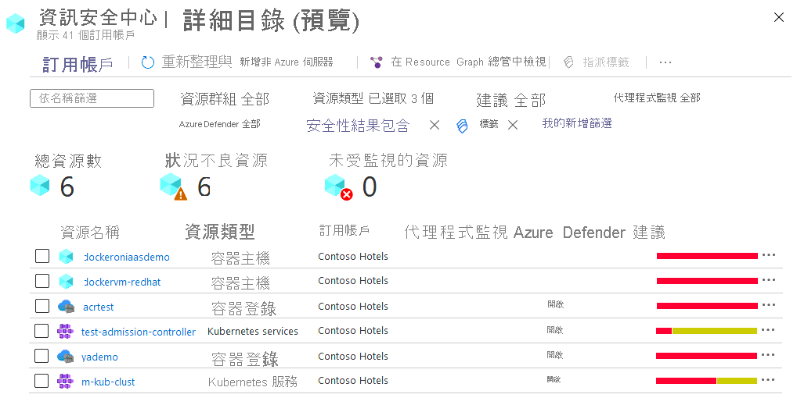

# 安全中心的集裝箱安全

Azure 安全中心是用於容器安全的 Azure 本機解決方案。 安全中心也是雲工作負載、VM、伺服器和容器安全性的最佳單一窗格體驗。

本文介紹了安全中心如何説明您改進、監視和維護容器及其應用的安全性。 您將瞭解安全中心如何説明容器安全這些核心方面：

* 弱點管理
* 容器環境的硬化
* 運行時保護

有關如何使用這些功能的說明，請參閱[監視容器的安全性](monitor-container-security.md)。

## 漏洞管理 - 掃描容器映射
要監視基於 ARM 的 Azure 容器註冊表，請確保位於安全中心的標準層（請參閱[定價](/azure/security-center/security-center-pricing)）。 然後，啟用可選的容器註冊表捆綁包。 推送新映射時，安全中心使用業界領先的漏洞掃描供應商 Qualys 的掃描器掃描圖像。

當發現問題時（由 Qualys 或安全中心）時，您將在安全中心儀表板中收到通知。 對於每個漏洞，安全中心都提供可操作的建議以及嚴重性分類，以及如何修復問題的指導。 有關安全中心對容器的建議的詳細資訊，請參閱[建議的參考清單](recommendations-reference.md#recs-containers)。

安全中心對掃描器的調查結果進行篩選和分類。 當圖像正常運行時，安全中心將其標記為正常。 安全中心僅針對要解決的問題的圖像生成安全建議。 通過僅在出現問題時通知，安全中心可降低出現不需要的資訊警報的可能性。

## 環境硬化

### 持續監控 Docker 配置
Azure 安全中心標識託管在 IaaS Linux VM 或其他運行 Docker 容器的 Linux 電腦上的非託管容器。 安全中心不斷評估這些容器的配置。 然後，它比較他們與[互聯網安全中心（CIS）Docker基準](https://www.cisecurity.org/benchmark/docker/)。

安全中心包括 CIS Docker 基準測試的整個規則集，如果容器不符合任何控制項，則會發出警報。 當它發現配置錯誤時，安全中心將生成安全建議。 使用**建議頁面**查看建議並修復問題。 您還將在 **"容器"** 選項卡上看到建議，該選項卡顯示使用 Docker 部署的所有虛擬機器。 

有關此功能可能顯示的相關安全中心建議的詳細資訊，請參閱建議參考表的[容器部分](recommendations-reference.md#recs-containers)。

當您探索 VM 的安全問題時，安全中心會提供有關電腦上的容器的其他資訊。 此類資訊包括 Docker 版本和主機上運行的映射數。 

>[!NOTE]
> 這些 CIS 基準檢查不會在 AKS 管理的實例或資料磚管理的 VM 上運行。

### 持續監控庫伯奈斯集群
安全中心與 Azure Kubernetes 服務 （AKS） 協同工作，這是 Microsoft 用於開發、部署和管理容器化應用程式的託管容器編排服務。

AKS 提供安全控制和對群集安全狀態的可見度。 安全中心使用這些功能：
* 持續監控 AKS 群集的配置
* 生成符合行業標準的安全建議

有關此功能可能顯示的相關安全中心建議的詳細資訊，請參閱建議參考表的[容器部分](recommendations-reference.md#recs-containers)。

## 運行時保護 - 即時威脅檢測

安全中心為您的容器化環境提供即時威脅檢測，並針對可疑活動生成警報。 您可以使用這項資訊來快速修復安全性問題，並改善您容器的安全性。

我們在主機和 AKS 群集級別檢測威脅。 有關詳細資訊，請參閱[Azure 容器的威脅檢測](threat-protection.md#azure-containers)。

## 集裝箱安全常見問題解答

### Azure 安全中心可以掃描哪些類型的映射？
安全中心掃描提供 shell 訪問基於 Linux 作業系統的圖像。 

Qualys 掃描器不支援超簡約圖像，如[Docker 劃痕](https://hub.docker.com/_/scratch/)圖像，或僅包含應用程式及其運行時依賴項的"無版本"映射，而沒有包管理器、shell 或作業系統。

### Azure 安全中心如何掃描映射？
從註冊表中拉出映射。 然後，它與 Qualys 掃描器在隔離的沙箱中運行，該掃描器提取已知漏洞的清單。

安全中心對掃描器的調查結果進行篩選和分類。 當圖像正常運行時，安全中心將其標記為正常。 安全中心僅針對要解決的問題的圖像生成安全建議。 通過僅在出現問題時通知，安全中心可降低出現不需要的資訊警報的可能性。

### Azure 安全中心掃描圖像的頻率如何？
每次推送都會觸發圖像掃描。

### 我能否通過 REST API 獲取掃描結果？
是。 結果在[子評估休息 API](/rest/api/securitycenter/subassessments/list/)下。 此外，還可以使用 Azure 資源圖 （ARG），即類似于 Kusto 的 API，用於所有資源：查詢可以獲取特定掃描。
 

## 後續步驟

要瞭解有關 Azure 安全中心中的容器安全性的更多詳細資訊，請參閱以下相關文章：

* 要查看容器相關資源的安全狀態，請參閱["保護電腦和應用程式](security-center-virtual-machine-protection.md#containers)"的容器部分。

* [與 Azure 庫伯奈斯服務集成](azure-kubernetes-service-integration.md)的詳細資訊

* [與 Azure 容器註冊表集成](azure-container-registry-integration.md)的詳細資訊