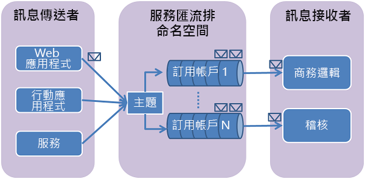

# <a name="use-azure-cli-to-create-a-service-bus-topic-and-subscriptions-to-the-topic"></a>使用 Azure CLI 建立服務匯流排主題和主題的訂用帳戶
在本快速入門中，您會使用 Azure CLI 來建立服務匯流排主題，然後建立該主題的訂用帳戶。 

## <a name="what-are-service-bus-topics-and-subscriptions"></a>什麼是服務匯流排主題和訂用帳戶？
服務匯流排主題和訂用帳戶支援「發佈/訂閱」 ** 訊息通訊模型。 使用主題和訂用帳戶時，分散式應用程式的元件彼此不直接通訊，相反的，他們會透過扮演中繼角色的主題來交換訊息。



有別於服務匯流排佇列，服務匯流排佇列中的每個訊息只會由單一取用者處理，主題和訂用帳戶採用發佈/訂閱模式，提供一對多的通訊形式。 一個主題可以登錄多個訂用帳戶。 當訊息傳送至主題時，每個訂用帳戶都可取得訊息來個別處理。 主題的訂用帳戶類似於虛擬佇列，同樣可接收已傳送到主題的訊息複本。 您可以選擇為個別訂用帳戶登錄主題的篩選規則，以篩選或限制主題的哪些訊息由哪些主題訂用帳戶接收。

服務匯流排主題和訂用帳戶可讓您擴大處理非常多使用者和應用程式上大量的訊息。

## <a name="prerequisites"></a>先決條件
如果您沒有 Azure 訂用帳戶，您可以在開始前建立[免費帳戶][free account]。

在本快速入門中，您會使用可在登入 Azure 入口網站後啟動的 Azure Cloud Shell。 如需 Azure Cloud Shell 的詳細資訊，請參閱 [Azure Cloud Shell 概觀](../cloud-shell/overview.md)。 您也可以[安裝](/cli/azure/install-azure-cli) Azure PowerShell 並在電腦上使用。 

## <a name="create-a-service-bus-topic-and-subscriptions"></a>建立服務匯流排主題和訂用帳戶
[主題的每個訂用帳戶](service-bus-messaging-overview.md#topics)都會接收到每則訊息的複本。 主題在通訊協定和語意上都與服務匯流排佇列完全相容。 服務匯流排主題支援具有篩選條件、並且可透過選用動作來設定或修改訊息屬性的多種選取規則。 每當有規則符合時，就會產生一則訊息。 若要深入了解規則、篩選條件和動作，請進入此[連結](topic-filters.md)。

1. 登入 [Azure 入口網站](https://portal.azure.com)。
2. 選取下圖中的圖示來啟動 Azure Cloud Shell。 如果 Cloud Shell 處於 **PowerShell** 模式，請切換至 **Bash** 模式。 

    :::image type="content" source="./media/service-bus-quickstart-powershell/launch-cloud-shell.png" alt-text="啟動 Cloud Shell":::
3. 執行下列命令以建立 Azure 資源群組。 您可以視需要更新資源群組名稱和位置。 

    ```azurecli-interactive
    az group create --name MyResourceGroup --location eastus
    ```
4. 執行下列命令來建立服務匯流排傳訊命名空間。 將命名空間名稱更新為唯一名稱。 

    ```azurecli-interactive
    namespaceName=MyNameSpace$RANDOM
    az servicebus namespace create --resource-group MyResourceGroup --name $namespaceName --location eastus
    ```
5. 請執行下列命令，在命名空間中建立主題。 

    ```azurecli-interactive
    az servicebus topic create --resource-group MyResourceGroup   --namespace-name $namespaceName --name MyTopic
    ```
6. 針對主題建立第一個訂用帳戶
    
    ```azurecli-interactive
    az servicebus topic subscription create --resource-group MyResourceGroup --namespace-name $namespaceName --topic-name MyTopic --name S1    
    ```
6. 針對主題建立第二個訂用帳戶
    
    ```azurecli-interactive
    az servicebus topic subscription create --resource-group MyResourceGroup --namespace-name $namespaceName --topic-name MyTopic --name S2    
    ```
6. 針對主題建立第三個訂用帳戶
    
    ```azurecli-interactive
    az servicebus topic subscription create --resource-group MyResourceGroup --namespace-name $namespaceName --topic-name MyTopic --name S3    
    ```
7. 使用自訂屬性，透過篩選條件在第一個訂用帳戶上建立篩選 (`StoreId` 是 `Store1`、`Store2` 和 `Store3` 的其中一個)。

    ```azurecli-interactive
    az servicebus topic subscription rule create --resource-group MyResourceGroup --namespace-name $namespaceName --topic-name MyTopic --subscription-name S1 --name MyFilter --filter-sql-expression "StoreId IN ('Store1','Store2','Store3')"    
    ```
8. 使用自訂屬性，透過篩選條件在第二個訂用帳戶上建立篩選 (`StoreId = Store4`)

    ```azurecli-interactive
    az servicebus topic subscription rule create --resource-group MyResourceGroup --namespace-name $namespaceName --topic-name myTopic --subscription-name S2 --name MySecondFilter --filter-sql-expression "StoreId = 'Store4'"    
    ```
9. 使用自訂屬性，透過篩選條件在第三個訂用帳戶上建立篩選 (`StoreId` 不在 `Store1`、`Store2`、`Store3` 或 `Store4` 中)。

    ```azurecli-interactive
    az servicebus topic subscription rule create --resource-group MyResourceGroup --namespace-name $namespaceName --topic-name MyTopic --subscription-name S3 --name MyThirdFilter --filter-sql-expression "StoreId NOT IN ('Store1','Store2','Store3', 'Store4')"     
    ```
10. 執行下列命令，以取得命名空間的主要連接字串。 您可以使用此連接字串連線到佇列，並傳送和接收訊息。 

    ```azurecli-interactive
    az servicebus namespace authorization-rule keys list --resource-group MyResourceGroup --namespace-name $namespaceName --name RootManageSharedAccessKey --query primaryConnectionString --output tsv    
    ```

    記下連接字串和主題名稱。 您會使用這兩個資訊傳送及接收訊息。 
    

## <a name="next-steps"></a>後續步驟
若要了解如何傳送訊息至主題，並透過訂用帳戶接收那些訊息，請參閱下列文章：選取 TOC 中的程式設計語言。 

> [!div class="nextstepaction"]
> [發佈和訂閱訊息](service-bus-dotnet-how-to-use-topics-subscriptions.md)


[free account]: https://azure.microsoft.com/free/?ref=microsoft.com&utm_source=microsoft.com&utm_medium=docs&utm_campaign=visualstudio
[fully qualified domain name]: https://wikipedia.org/wiki/Fully_qualified_domain_name
[Install the Azure CLI]: /cli/azure/install-azure-cli
[az group create]: /cli/azure/group#az_group_create
