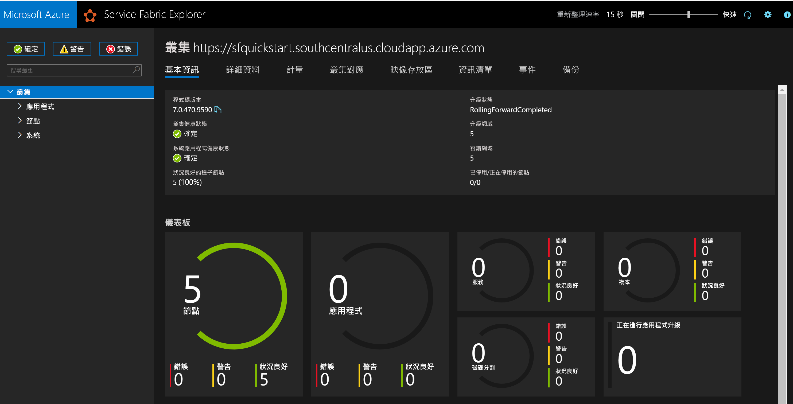

# <a name="quickstart-create-a-service-fabric-cluster-using-arm-template"></a>快速入門：使用 ARM 範本建立 Service Fabric 叢集

Azure Service Fabric 是一個分散式系統平台，可讓您輕鬆封裝、部署及管理可調整和可信賴的微服務與容器。 Service Fabric *叢集*是一組透過網路連線的虛擬機器，您可以將微服務部署到其中並進行管理。 本文說明如何使用 Azure Resource Manager 範本 (ARM 範本) 在 Azure 中部署 Service Fabric 測試叢集。

[!INCLUDE [About Azure Resource Manager](../../includes/resource-manager-quickstart-introduction.md)]

這個有五個節點的 Windows 叢集會使用自我簽署憑證來加以保護，因此僅適用於教學目的 (而不適用於生產工作負載)。 我們會使用 Azure PowerShell 來部署範本。 除了 Azure PowerShell 以外，您也可以使用 Azure 入口網站、Azure CLI 和 REST API。 若要了解其他部署方法，請參閱[部署範本](../azure-resource-manager/templates/deploy-portal.md)。

如果您的環境符合必要條件，而且您很熟悉 ARM 範本，請選取 [部署至 Azure] 按鈕。 範本會在 Azure 入口網站中開啟。

[](https://portal.azure.com/#create/Microsoft.Template/uri/https%3A%2F%2Fraw.githubusercontent.com%2FAzure%2Fazure-quickstart-templates%2Fmaster%2Fservice-fabric-secure-cluster-5-node-1-nodetype%2Fazuredeploy.json)

## <a name="prerequisites"></a>必要條件

如果您沒有 Azure 訂用帳戶，請在開始前建立[免費帳戶](https://azure.microsoft.com/free/)。

### <a name="install-service-fabric-sdk-and-powershell-modules"></a>安裝 Service Fabric SDK 和 PowerShell 模組

若要完成本快速入門，您將需要：

* 安裝 [Service Fabric SDK 和 PowerShell 模組](service-fabric-get-started.md)。

* 安裝 [Azure PowerShell](/powershell/azure/install-az-ps)。

### <a name="download-the-sample-template-and-certificate-helper-script"></a>下載範例範本和憑證協助程式指令碼

複製或下載 [Azure Resource Manager 快速入門範本](https://github.com/Azure/azure-quickstart-templates)存放庫。 或者，從本機的 *service-fabric-secure-cluster-5-node-1-nodetype* 資料夾複製下列所會用到的檔案：

* [New-ServiceFabricClusterCertificate.ps1](https://raw.githubusercontent.com/Azure/azure-quickstart-templates/master/service-fabric-secure-cluster-5-node-1-nodetype/New-ServiceFabricClusterCertificate.ps1)
* [azuredeploy.json](https://raw.githubusercontent.com/Azure/azure-quickstart-templates/master/service-fabric-secure-cluster-5-node-1-nodetype/azuredeploy.json)
* [azuredeploy.parameters.json](https://raw.githubusercontent.com/Azure/azure-quickstart-templates/master/service-fabric-secure-cluster-5-node-1-nodetype/azuredeploy.parameters.json)

### <a name="sign-in-to-azure"></a>登入 Azure

登入 Azure，並指定要用來建立 Service Fabric 叢集的訂用帳戶。

```powershell
# Sign in to your Azure account
Login-AzAccount -SubscriptionId "<subscription ID>"
```

### <a name="create-a-self-signed-certificate-stored-in-key-vault"></a>建立儲存在 Key Vault 中的自我簽署憑證

Service Fabric 使用 X.509 憑證來[保護叢集](./service-fabric-cluster-security.md)和提供應用程式安全性功能，並使用 [Key Vault](../key-vault/general/overview.md) 來管理這些憑證。 若要成功建立叢集，就需要有叢集憑證以便啟用節點對節點的通訊。 為了建立此快速入門測試叢集，我們將建立自我簽署的憑證來驗證叢集。 生產工作負載所需要的憑證，必須使用已正確設定的 Windows Server 憑證服務來建立，或是來自已核准憑證授權單位 (CA) 中的憑證也可以。

```powershell
# Designate unique (within cloudapp.azure.com) names for your resources
$resourceGroupName = "SFQuickstartRG"
$keyVaultName = "SFQuickstartKV"

# Create a new resource group for your Key Vault and Service Fabric cluster
New-AzResourceGroup -Name $resourceGroupName -Location SouthCentralUS

# Create a Key Vault enabled for deployment
New-AzKeyVault -VaultName $KeyVaultName -ResourceGroupName $resourceGroupName -Location SouthCentralUS -EnabledForDeployment

# Generate a certificate and upload it to Key Vault
.\New-ServiceFabricClusterCertificate.ps1
```

指令碼會提示您輸入下列資訊 (請務必修改下列範例值中的 *CertDNSName* 和 *KeyVaultName*)：

* **密碼：** Password!1
* **CertDNSName:** *sfquickstart*.southcentralus.cloudapp.azure.com
* **KeyVaultName：** *SFQuickstartKV*
* **KeyVaultSecretName：** clustercert

完成時，指令碼就會提供要部署範本所需的參數值。 請務必將這些值儲存在下列變數中，如此一來，您才能部署叢集範本：

```powershell
$sourceVaultId = "<Source Vault Resource Id>"
$certUrlValue = "<Certificate URL>"
$certThumbprint = "<Certificate Thumbprint>"
```

## <a name="review-the-template"></a>檢閱範本

本快速入門中使用的範本是來自 [Azure 快速入門範本](https://azure.microsoft.com/resources/templates/service-fabric-secure-cluster-5-node-1-nodetype/)。 本文的範本太長，無法在此完整顯示。 若要檢視範本，請參閱 [azuredeploy.json](https://raw.githubusercontent.com/Azure/azure-quickstart-templates/master/service-fabric-secure-cluster-5-node-1-nodetype/azuredeploy.json) 檔案。

範本中已定義多個 Azure 資源：

* [Microsoft.Storage/storageAccounts](/azure/templates/microsoft.storage/storageaccounts)
* [Microsoft.Network/virtualNetworks](/azure/templates/microsoft.network/virtualnetworks)
* [Microsoft.Network/publicIPAddresses](/azure/templates/microsoft.network/publicipaddresses)
* [Microsoft.Network/loadBalancers](/azure/templates/microsoft.network/loadbalancers)
* [Microsoft.Compute/virtualMachineScaleSets](/azure/templates/microsoft.compute/virtualmachinescalesets)
* [Microsoft.ServiceFabric/clusters](/azure/templates/microsoft.servicefabric/clusters)

若要尋找更多有關 Azure Service Fabric 的範本，請參閱 [Azure 快速入門範本](https://azure.microsoft.com/resources/templates/?sort=Popular&term=service+fabric)。

### <a name="customize-the-parameters-file"></a>自訂參數檔案

開啟 *azuredeploy.parameters.json* 並編輯參數值，以便：

* **clusterName** 符合您在建立叢集憑證時為 *CertDNSName* 提供的值
* **adminUserName** 是預設 *GEN-UNIQUE* 權杖以外的某個值
* **adminPassword** 是預設 *GEN-PASSWORD* 權杖以外的某個值
* **certificateThumbprint**、**sourceVaultResourceId** 和 **certificateUrlValue** 全都是空白字串 (`""`)

例如：

```json
{
  "$schema": "https://schema.management.azure.com/schemas/2019-04-01/deploymentParameters.json#",
  "contentVersion": "1.0.0.0",
  "parameters": {
    "clusterName": {
      "value": "sfquickstart"
    },
    "adminUsername": {
      "value": "testadm"
    },
    "adminPassword": {
      "value": "Password#1234"
    },
    "certificateThumbprint": {
      "value": ""
    },
    "sourceVaultResourceId": {
      "value": ""
    },
    "certificateUrlValue": {
      "value": ""
    }
  }
}
```

## <a name="deploy-the-template"></a>部署範本

將 ARM 範本和參數檔案的路徑儲存在變數中，然後部署範本。

```powershell
$templateFilePath = "<full path to azuredeploy.json>"
$parameterFilePath = "<full path to azuredeploy.parameters.json>"

New-AzResourceGroupDeployment `
    -ResourceGroupName $resourceGroupName `
    -TemplateFile $templateFilePath `
    -TemplateParameterFile $parameterFilePath `
    -CertificateThumbprint $certThumbprint `
    -CertificateUrlValue $certUrlValue `
    -SourceVaultResourceId $sourceVaultId `
    -Verbose
```

## <a name="review-deployed-resources"></a>檢閱已部署的資源

部署完成之後，請在輸出中尋找 `managementEndpoint` 值，然後在網頁瀏覽器中開啟該網址，以在 [Service Fabric Explorer](./service-fabric-visualizing-your-cluster.md) 中檢視您的叢集。



您也可以從 Azure 入口網站的 [服務總管資源] 刀鋒視窗中尋找 Service Fabric Explorer 端點。

![顯示 Service Fabric Explorer 端點的 [Service Fabric 資源] 刀鋒視窗](./media/quickstart-cluster-template/service-fabric-explorer-endpoint-azure-portal.png)

## <a name="clean-up-resources"></a>清除資源

如果不再需要，請刪除資源群組，這會刪除資源群組中的資源。

```powershell
$resourceGroupName = Read-Host -Prompt "Enter the Resource Group name"
Remove-AzResourceGroup -Name $resourceGroupName
Write-Host "Press [ENTER] to continue..."
```

## <a name="next-steps"></a>後續步驟

若要了解如何建立自訂的 Azure Service Fabric 叢集範本，請參閱：

> [!div class="nextstepaction"]
> [建立 Service Fabric 叢集 Resource Manager 範本](service-fabric-cluster-creation-create-template.md)
