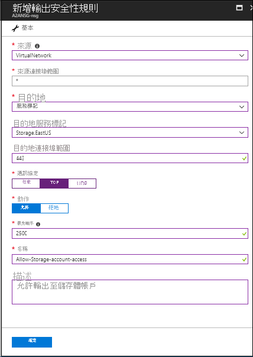
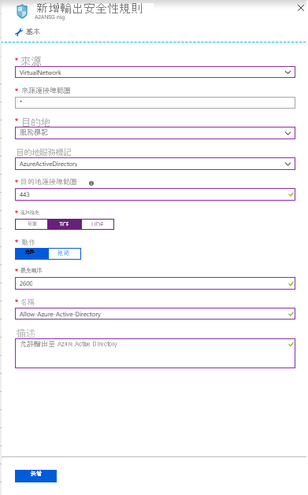

# 關於 Azure VM 嚴重損壞修復中的網路功能

本文提供您使用 [Azure Site Recovery](site-recovery-overview.md)，將 Azure VM 從一個區域複寫和復原到另一個區域時的網路功能指引。

## 開始之前

了解 Site Recovery 如何針對[這種情況](azure-to-azure-architecture.md)提供災害復原。

## 一般網路基礎結構

下圖說明適用於 Azure VM 上執行之應用程式的一般 Azure 環境：

如果您使用 Azure ExpressRoute 或從內部部署網路到 Azure 的 VPN 連線，環境將如下所示：

通常會使用防火牆和網路安全性群組 (NSG) 來保護網路。 防火牆會使用以 URL 或 IP 為基礎的允許清單來控制網路連線能力。 NSG 提供規則，使用 IP 位址範圍來控制網路連線能力。

>[!IMPORTANT]
> Site Recovery 不支援使用經過驗證的 Proxy 來控制網路連線能力，而且無法啟用複寫。

## URL 的輸出連線能力

如果您使用以 URL 為基礎的防火牆 Proxy 來控制輸出連線能力，請允許這些 Site Recovery URL：

**URL** | **詳細資料**  
--- | ---
*.blob.core.windows.net | 需要此項目方可從 VM 將資料寫入來源地區的快取儲存體帳戶中。 如果您知道 Vm 的所有快取儲存體帳戶，您可以允許存取特定的儲存體帳戶 Url （例如： cache1.blob.core.windows.net 和 cache2.blob.core.windows.net），而不是 *. blob.core.windows.net
login.microsoftonline.com | 需要此項目方可進行 Site Recovery 服務 URL 的授權和驗證。
*.hypervrecoverymanager.windowsazure.com | 需要此項目方可從 VM 進行 Site Recovery 服務通訊。
*.servicebus.windows.net | 需要此項目方可從 VM 寫入 Site Recovery 監視和診斷資料。

## IP 位址範圍的輸出連線能力

如果您使用 NSG 來控制輸出連線能力，則必須允許這些服務標記。

- 對應至來源區域儲存體帳戶的所有 IP 位址範圍
    - 為這個來源地區建立[儲存體服務標記](../virtual-network/security-overview.md#service-tags)型 NSG 規則。
    - 允許這些位址，方可從 VM 將該資料寫入到快取儲存體帳戶。
- 建立 [Azure Active Directory (AAD) 服務標籤](../virtual-network/security-overview.md#service-tags)型 NSG 規則，以允許存取對應至 AAD 的所有 IP 位址
- 針對目的地區域建立以 EventsHub 服務標記為基礎的 NSG 規則，以允許存取 Site Recovery 監視。
- 建立以 AzureSiteRecovery 服務標記為基礎的 NSG 規則，以允許存取任何區域中的 Site Recovery 服務。
- 建議您在測試 NSG 上建立必要的 NSG 規則，並確認沒有問題後，再於生產 NSG 上建立規則。

## 範例 NSG 設定

這個範例示範如何針對要複寫的 VM 設定 NSG 規則。

- 如果您使用 NSG 規則來控制輸出連線，請針對所有必要的 IP 位址範圍，將「允許 HTTPS 輸出」規則應用至連接埠：443。
- 此範例假設 VM 來源位置為「美國東部」，而目標位置為「美國中部」。

### NSG 規則：美國東部

1. 在 NSG 上針對 "Storage.EastUS" 建立輸出 HTTPS (443) 安全性規則，如以下螢幕擷取畫面所示。

      

2. 在 NSG 上針對 "AzureActiveDirectory" 建立輸出 HTTPS (443) 安全性規則，如以下螢幕擷取畫面所示。

      

3. 類似于上述安全性規則，請在對應至目標位置的 NSG 上，建立 "CentralUS" 的輸出 HTTPS （443）安全性規則。 這可讓您存取 Site Recovery 監視。

4. 為 NSG 上的 "AzureSiteRecovery" 建立輸出 HTTPS （443）安全性規則。 這可讓您存取任何區域中的 Site Recovery 服務。

### NSG 規則：美國中部

需要這些規則，才能啟用從目標區域到來源地區容錯移轉後的複寫：

1. 在 NSG 上針對 "Storage.CentralUS" 建立輸出 HTTPS (443) 安全性規則。

2. 在 NSG 上針對 "AzureActiveDirectory" 建立輸出 HTTPS (443) 安全性規則。

3. 類似于上述安全性規則，請在對應至來源位置的 NSG 上，建立 "EastUS" 的輸出 HTTPS （443）安全性規則。 這可讓您存取 Site Recovery 監視。

4. 為 NSG 上的 "AzureSiteRecovery" 建立輸出 HTTPS （443）安全性規則。 這可讓您存取任何區域中的 Site Recovery 服務。

## 網路虛擬設備設定

如果您使用網路虛擬設備 (NVA) 來控制 VM 的輸出網路流量，那麼只要所有的複寫流量都通過 NVA，該設備便有可能進行節流。 建議您在虛擬網路中為「儲存體」建立一個網路服務端點，這樣複寫流量就不會流向 NVA。

### 為儲存體建立網路服務端點
您可以在虛擬網路中為「儲存體」建立一個網路服務端點，這樣複寫流量就不會離開 Azure 範圍。

- 選取您的 Azure 虛擬網路，然後按一下 [服務端點]。

    

- 按一下 [新增]，[新增服務端點] 索引標籤隨即開啟。
- 選取 [服務] 底下的 [Microsoft.Storage]，接下來選取 [子網路] 底下的必要子網路，然後按一下 [新增]。

>[!NOTE]
>不要限制虛擬網路存取您用於 ASR 的儲存體帳戶。 您應該允許從 [所有網路] 存取。

### 強制通道

您可以使用[自訂路由](../virtual-network/virtual-networks-udr-overview.md#custom-routes)覆寫 0.0.0.0/0 位址前置詞的 Azure 預設系統路由，並將 VM 流量導向內部部署網路虛擬設備 (NVA)，但不建議將此設定用於 Site Recovery 複寫。 如果您使用自訂路由，則應該在虛擬網路中為「儲存體」[建立虛擬網路服務端點](azure-to-azure-about-networking.md#create-network-service-endpoint-for-storage)，這樣一來，複寫流量就不會離開 Azure 界限。

## 後續步驟
- [複寫 Azure 虛擬機器](site-recovery-azure-to-azure.md)來開始保護您的工作負載。
- 深入了解如何針對 Azure 虛擬機器容錯移轉[保留 IP 位址](site-recovery-retain-ip-azure-vm-failover.md)。
- 深入瞭解[使用 ExpressRoute 進行 Azure 虛擬機器](azure-vm-disaster-recovery-with-expressroute.md)的嚴重損壞修復。
