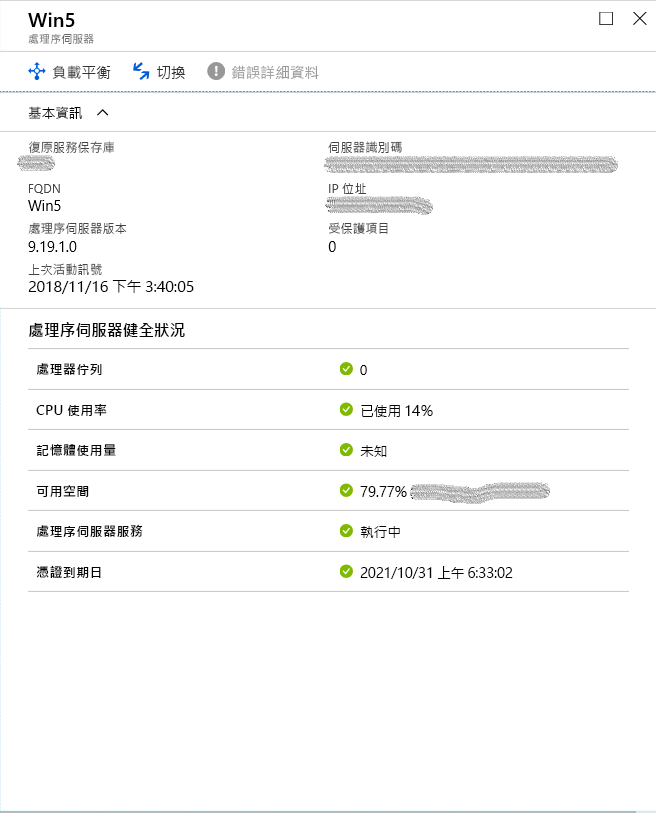
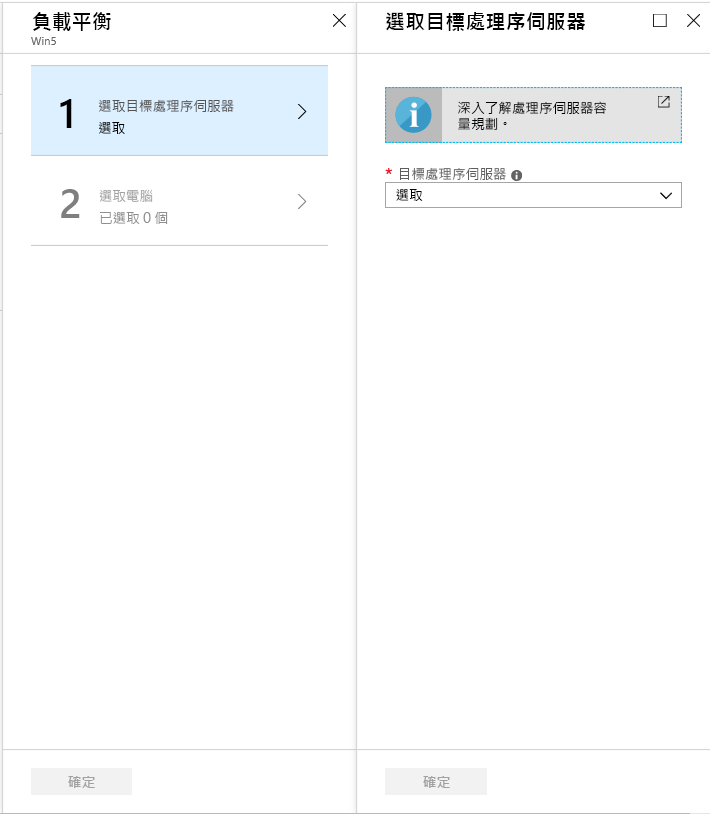
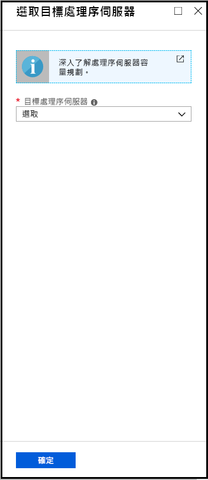

# <a name="manage-process-servers"></a>管理處理序伺服器

本文介紹了用於管理網站恢復過程伺服器的常見任務。

進程伺服器用於接收、優化複製資料並將其發送到 Azure。 它還在要複製的 VMware VM 和物理伺服器上執行移動服務推送安裝，並自動探索本地電腦。 為了將本地 VMware VM 或物理伺服器複製到 Azure，預設情況下，進程伺服器安裝在佈建服務器電腦上。 

- 針對大型部署，您可能需要額外的內部部署處理序伺服器才能調整容量。
- 對於從 Azure 到本地的故障恢復，必須在 Azure 中設置臨時進程伺服器。 容錯回復完成後，您可以刪除此 VM。 

瞭解有關進程伺服器的更多詳細資訊。


## <a name="upgrade-a-process-server"></a>升級處理序伺服器

在本地部署進程伺服器或作為用於故障倒退的 Azure VM 時，將安裝進程伺服器的最新版本。 Site Recovery 小組會定期發行修正程式和增強功能，我們建議您將處理序伺服器保持在最新狀態。 您可以按照如下方式升級進程伺服器：

[!INCLUDE [site-recovery-vmware-upgrade -process-server](../../includes/site-recovery-vmware-upgrade-process-server-internal.md)]


## <a name="move-vms-to-balance-the-process-server-load"></a>移動 VM 以平衡進程伺服器負載

通過在兩個進程伺服器之間移動 VM 來平衡負載，如下所示：

1. 在保存庫中，在 **"管理**"下按一下 **"網站恢復基礎結構**"。 **在 VMware &物理電腦**下，按一下**佈建服務器**。
2. 按一下與其註冊進程伺服器的佈建服務器。
3. 按一下要為其載入平衡流量的進程伺服器。

    

4. 按一下 **"負載平衡**"，選擇要將電腦移動到的目標進程伺服器。 然後按一下 **"確定"**

    

2. 按一下 **"選擇電腦**"，然後選擇要從當前進程伺服器移動到目標進程伺服器的電腦。 系統會針對每個虛擬機器顯示平均資料變更的詳細資料。 然後按一下 **[確定]**。 
3. 在保存庫中，監視**監視** > **網站恢復作業**下的作業進度。

更改大約需要 15 分鐘才能反映在門戶中。 要獲得更快的效果[，請刷新佈建服務器](vmware-azure-manage-configuration-server.md#refresh-configuration-server)。

## <a name="switch-an-entire-workload-to-another-process-server"></a>將整個工作負載切換到另一個進程伺服器

將進程伺服器處理的整個工作負載移動到其他進程伺服器，如下所示：

1. 在保存庫中，在 **"管理**"下按一下 **"網站恢復基礎結構**"。 **在 VMware &物理電腦**下，按一下**佈建服務器**。
2. 按一下與其註冊進程伺服器的佈建服務器。
3. 按一下要從中切換工作負荷的進程伺服器。
4. 按一下 **"切換**"，選擇要將工作負載移動到的目標進程伺服器。 然後按一下 **"確定"**

    

5. 在保存庫中，監視**監視** > **網站恢復作業**下的作業進度。

更改大約需要 15 分鐘才能反映在門戶中。 要獲得更快的效果[，請刷新佈建服務器](vmware-azure-manage-configuration-server.md#refresh-configuration-server)。

## <a name="register-a-master-target-server"></a>註冊主目標伺服器

主目標伺服器駐留在佈建服務器和橫向擴展進程伺服器上。 它必須在佈建服務器中註冊。 如果此註冊失敗，可能會影響受保護項的運行狀況。 要將主目標伺服器註冊為佈建服務器，請登錄到需要註冊的特定佈建服務器/橫向擴展進程伺服器。 導航到資料夾 **%PROGRAMDATA%\ASR\代理**，並在管理員命令提示符上運行以下內容。

   ```
   cmd
   cdpcli.exe --registermt

   net stop obengine

   net start obengine

   exit
   ```

## <a name="reregister-a-process-server"></a>重新註冊處理序伺服器

將本地或 Azure VM 上運行的進程伺服器重新註冊佈建服務器，如下所示：

[!INCLUDE [site-recovery-vmware-register-process-server](../../includes/site-recovery-vmware-register-process-server.md)]

儲存設定之後，請執行下列作業：

1. 在處理序伺服器上，開啟系統管理員命令提示字元。
2. 瀏覽至 **%PROGRAMDATA%\ASR\Agent** 資料夾，然後執行命令：

    ```
    cdpcli.exe --registermt
    net stop obengine
    net start obengine
    ```

## <a name="modify-proxy-settings-for-an-on-premises-process-server"></a>修改內部部署處理序伺服器的 Proxy 設定

如果本地進程伺服器使用代理連接到 Azure，則可以修改代理設置，如下所示：

1. 登錄到進程伺服器電腦。 
2. 開啟系統管理 PowerShell 命令視窗並執行下列命令：
   ```powershell
   $pwd = ConvertTo-SecureString -String MyProxyUserPassword
   Set-OBMachineSetting -ProxyServer http://myproxyserver.domain.com -ProxyPort PortNumber –ProxyUserName domain\username -ProxyPassword $pwd
   net stop obengine
   net start obengine
   ```
2. 流覽到資料夾 **%PROGRAMDATA%\ASR\代理**，並運行此命令：
   ```
   cmd
   cdpcli.exe --registermt

   net stop obengine

   net start obengine

   exit
   ```

## <a name="remove-a-process-server"></a>移除處理序伺服器

[!INCLUDE [site-recovery-vmware-unregister-process-server](../../includes/site-recovery-vmware-unregister-process-server.md)]

## <a name="exclude-folders-from-anti-virus-software"></a>從防毒軟體中排除資料夾

如果防毒軟體在橫向擴展進程伺服器（或主目標伺服器）上運行，則從防病毒操作中排除以下資料夾：


- C:\Program Files\Microsoft Azure Recovery Services Agent
- C:\ProgramData\ASR
- C:\ProgramData\ASRLogs
- C:\ProgramData\ASRSetupLogs
- C:\ProgramData\LogUploadServiceLogs
- C:\ProgramData\Microsoft Azure Site Recovery
- 進程伺服器安裝目錄。 例如：C：\程式檔 （x86）\微軟 Azure 網站恢復