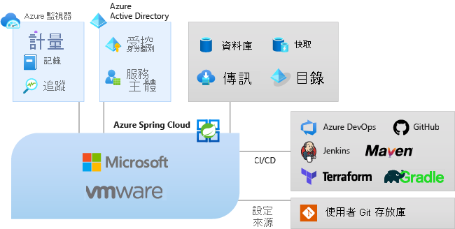

# 什麼是 Azure Spring Cloud？

Azure Spring Cloud 可讓您在不需要變更程式碼的情況下，輕鬆地將 Spring Boot 的微服務應用程式部署到 Azure。  服務會管理 Spring Cloud 應用程式的基礎結構，讓開發人員可以專注於處理程式碼。  Azure Spring Cloud 能使用全方位的監視和診斷、設定管理、服務探索、CI/CD 整合、藍色-綠色部署等等，來提供生命週期管理。

## 為何使用 Azure Spring Cloud？

將應用程式部署至 Azure Spring Cloud 能帶來許多優點。  您可以：
* 有效率地遷移現有的 Spring 應用程式，並管理雲端規模調整和成本。
* 使用 Spring Cloud 模式將應用程式現代化，以提升敏捷性和傳遞速度。
* 以雲端規模執行 Java，並在沒有複雜基礎結構的情況下驅動更高的使用量。
* 快速開發及部署，而不需要容器化相依性。
* 有效率且輕鬆地監視生產工作負載。

Azure Spring Cloud 可支援 Java [Spring Boot](https://spring.io/projects/spring-boot) 和 ASP.NET Core [Steeltoe](https://steeltoe.io/) 應用程式。 Steeltoe 支援目前以公開預覽的形式提供。 公開預覽版供應項目可讓您在其正式發行前，先試驗新功能。 公開預覽功能和服務不適用於生產環境。 如需詳細資訊，請參閱[常見問題集](https://azure.microsoft.com/support/faq/)或提出[支援要求](https://docs.microsoft.com/azure/azure-portal/supportability/how-to-create-azure-support-request)。

## 服務概觀

Azure Spring Cloud 作為 Azure 生態系統的一部分，可讓您輕鬆繫結到其他 Azure 服務，包括儲存體、資料庫、監視等等。  

  

* Azure Spring Cloud 是適用於 Spring Boot 應用程式的完全受控服務，可讓您專注於建立及執行應用程式，而不必擔心管理基礎結構的瑣事。

* 只要部署您的 JAR 或程式碼，Azure Spring Cloud 就會自動將應用程式與 Spring 服務執行階段和內建應用程式生命週期連線。

* 輕鬆監視。 部署之後，您可以監視應用程式效能、修正錯誤，並快速改善應用程式。 

* 完整整合至 Azure 的生態系統和服務。

* Azure Spring Cloud 已可供企業使用，具備完全受控的基礎結構、內建生命週期管理，且可容易監控。

## 文件概觀
本文件包含的章節說明如何開始使用 Azure Spring Cloud 服務並加以運用。

* 開始使用
    * [啟動您的第一個應用程式](spring-cloud-quickstart.md)
    * [佈建 Azure Spring Cloud 服務](spring-cloud-quickstart-provision-service-instance.md)
    * [設定組態伺服器]()
    * [建置和部署應用程式](spring-cloud-quickstart-deploy-apps.md)
    * [使用記錄、計量和追蹤](spring-cloud-quickstart-logs-metrics-tracing.md)
* 操作方式
    * [開發](spring-cloud-tutorial-prepare-app-deployment.md)：準備現有的 Java Spring 應用程式以部署到 Azure Spring Cloud。 若能夠正確設定，Azure Spring Cloud 將能提供豐富的服務以監視、調整及更新 Java Spring Cloud 應用程式。
    * [部署](spring-cloud-howto-staging-environment.md)：如何在 Azure Spring Cloud 中使用藍色-綠色部署模式來設定暫存部署。 藍/綠部署是 Azure DevOps 的持續傳遞模式，此模式仰賴在部署新版本 (綠色) 時，仍讓現有版本 (藍色) 持續運作的方式。
    * [設定應用程式](spring-cloud-howto-start-stop-delete.md)：啟動、停止和刪除您的 Azure Spring Cloud 應用程式。 使用 Azure 入口網站或 Azure CLI 變更 Azure Spring Cloud 中的應用程式狀態。
    * [調整](spring-cloud-tutorial-scale-manual.md)：使用 Azure 入口網站中的 Azure Spring Cloud 儀表板或自動調整設定來調整所有微服務應用程式。 公用 IP 可與外部資源 (例如資料庫、儲存體和金鑰保存庫) 通訊。
    * [監視應用程式](spring-cloud-tutorial-distributed-tracing.md)：分散式追蹤工具可輕鬆地偵錯和監視複雜的問題。 Azure Spring Cloud 可整合 Spring Cloud Sleuth 與 Azure 的 Application Insights。 這項整合可讓您從 Azure 入口網站獲得強大的分散式追蹤功能。
    * [安全的應用程式](spring-cloud-howto-enable-system-assigned-managed-identity.md)：Azure 資源會在 Azure Active Directory 中提供自動受控識別。 您可以使用此身分識別來向任何支援 Azure AD 驗證的服務進行驗證，不需要任何您程式碼中的認證。
    * [與其他 Azure 服務整合](spring-cloud-tutorial-bind-cosmos.md)：您可以將精選的 Azure 服務自動繫結至應用程式 (例如將應用程式繫結至 Azure Cosmos DB 資料庫)，而不必手動設定 Spring Boot 應用程式。
    * [自動化](spring-cloud-howto-cicd.md)：持續整合與持續傳遞工具可讓您以最輕鬆的方式，快速將更新部署至現有的應用程式，同時將風險降至最低。 Azure DevOps 有助於組織和控制這些主要工作。 
    * [疑難排解](spring-cloud-howto-self-diagnose-solve.md)：Azure Spring Cloud 診斷提供互動式體驗，可協助您針對應用程式進行疑難排解。 不需要組態。 當您發現問題時，Azure Spring Cloud 診斷會找出問題，並引導您取得有助於疑難排解及解決問題的資訊。
    * [移轉](https://docs.microsoft.com/azure/developer/java/migration/migrate-spring-boot-to-azure-spring-cloud)：如何遷移現有的 Spring Cloud 應用程式或 Spring Boot 應用程式以在 Azure Spring Cloud 上執行。

## 後續步驟

若要開始使用，請完成 [Spring Cloud 快速入門](spring-cloud-quickstart.md)

範例可從 GitHub 上取得：[Azure Spring Cloud 範例](https://github.com/Azure-Samples/Azure-Spring-Cloud-Samples/tree/master/)。
