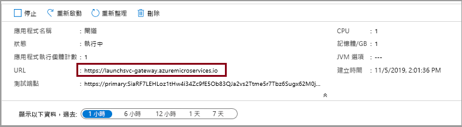

# <a name="quickstart-build-and-deploy-apps-to-azure-spring-cloud"></a>快速入門：建置應用程式並將其部署至 Azure Spring Cloud

本文件說明如何使用下列方式建置微服務應用程式，並將其部署至 Azure Spring Cloud：
* Azure CLI
* Maven 外掛程式
* Intellij

在使用 Azure CLI 或 Maven 進行部署之前，請先完成[佈建 Azure Spring Cloud 執行個體](spring-cloud-quickstart-provision-service-instance.md)和[設定 Config Server](spring-cloud-quickstart-setup-config-server.md) 的範例。

## <a name="prerequisites"></a>先決條件

* [安裝 JDK 8](https://docs.microsoft.com/java/azure/jdk/?view=azure-java-stable)
* [註冊 Azure 訂用帳戶](https://azure.microsoft.com/free/)
* (選擇性) [安裝 Azure CLI 版本 2.0.67 或更高版本](https://docs.microsoft.com/cli/azure/install-azure-cli?view=azure-cli-latest)，並使用下列命令安裝 Azure Spring Cloud 擴充功能：`az extension add --name spring-cloud`
* (選擇性) [安裝 Azure Toolkit for IntelliJ](https://plugins.jetbrains.com/plugin/8053-azure-toolkit-for-intellij/) 並[登入](https://docs.microsoft.com/azure/developer/java/toolkit-for-intellij/create-hello-world-web-app#installation-and-sign-in)

## <a name="deployment-procedures"></a>部署程序

#### <a name="cli"></a>[CLI](#tab/Azure-CLI)

### <a name="build-the-microservices-applications-locally"></a>於本機建置微服務應用程式

1. 將範例應用程式存放庫複製到您的 Azure 雲端帳戶。  

    ```azurecli
    git clone https://github.com/Azure-Samples/piggymetrics
    ```

2. 變更目錄並建置專案。

    ```azurecli
    cd piggymetrics
    mvn clean package -DskipTests
    ```

編譯專案大約需要 5 分鐘的時間。 完成後，在每個服務的相對應資料夾中應該會有適用於該服務的個別 JAR 檔案。

### <a name="create-and-deploy-the-apps"></a>建立及部署應用程式

1. 使用下列命令來設定預設資源群組名稱及叢集名稱：

    ```azurecli
    az configure --defaults group=<resource group name>
    az configure --defaults spring-cloud=<service instance name>
    ```

1. 使用在上一個步驟中所建置的 JAR 檔案來建立 Azure Spring Cloud 微服務。 您將會建立三個應用程式：**gateway**、**auth-service** 及 **account-service**。

    ```azurecli
    az spring-cloud app create --name gateway
    az spring-cloud app create --name auth-service
    az spring-cloud app create --name account-service
    ```

1. 我們需要將在上一個步驟中建立的應用程式部署至 Azure。 使用下列命令來部署全部三個應用程式：

    ```azurecli
    az spring-cloud app deploy -n gateway --jar-path ./gateway/target/gateway.jar
    az spring-cloud app deploy -n account-service --jar-path ./account-service/target/account-service.jar
    az spring-cloud app deploy -n auth-service --jar-path ./auth-service/target/auth-service.jar
    ```

### <a name="assign-public-endpoint-to-gateway"></a>將公用端點指派到閘道

我們需要透過網頁伺服器存取應用程式的方法。 我們的閘道應用程式需要公眾對應的端點。

1. 使用下列命令來指派端點：

    ```azurecli
    az spring-cloud app update -n gateway --is-public true
    ```

2. 查詢**閘道**應用程式來取得其公用 IP，讓您可以確認該應用程式正在執行：

    ```azurecli
    az spring-cloud app show --name gateway --query properties.url
    ```

#### <a name="maven"></a>[Maven](#tab/Maven)

### <a name="clone-and-build-the-sample-application-repository"></a>複製並建置範例應用程式存放庫

1. 執行下列命令以複製 Git 存放庫：

    ```
    git clone https://github.com/Azure-Samples/PiggyMetrics
    ```
  
1. 變更目錄，並執行下列命令來建置專案：

    ```
    cd piggymetrics
    mvn clean package -DskipTests
    ```

### <a name="generate-configurations-and-deploy-to-the-azure-spring-cloud"></a>產生設定並部署至 Azure Spring Cloud

1. 在包含父系 POM 的 PiggyMetrics 根資料夾中執行下列命令，以產生設定。 如果您已使用 Azure CLI 登入，此命令會自動挑選認證。 否則，系統會將您登入並出現提示指示。 如需詳細資訊，請參閱我們的 [Wiki 頁面](https://github.com/microsoft/azure-maven-plugins/wiki/Authentication)。

    ```
    mvn com.microsoft.azure:azure-spring-cloud-maven-plugin:1.1.0:config
    ```
    
    系統會要求您選取：
    * **模組：** 選取及 `gateway`、`auth-service` 和 `account-service`。
    * **訂用帳戶︰** 這是您用來建立 Azure Spring Cloud 執行個體的訂用帳戶。
    * **服務執行個體：** 這是 Azure Spring Cloud 執行個體的名稱。
    * **公用端點：** 從提供的專案清單中，輸入與 `gateway` 相對應的數字。  這將會提供公用存取權。

1. POM 現在包含外掛程式相依性和設定。 使用下列命令部署應用程式。 

    ```
    mvn azure-spring-cloud:deploy
    ```

#### <a name="intellij"></a>[IntelliJ](#tab/IntelliJ)

### <a name="import-sample-project-in-intellij"></a>在 IntelliJ 中匯入範例專案

1. 下載並解壓縮本教學課程的來源存放庫，或使用 Git 加以複製：`git clone https://github.com/Azure-Samples/piggymetrics` 

1. 開啟 IntelliJ [歡迎] 對話方塊，選取 [匯入專案] 以開啟匯入精靈。

1. 選取 `piggymetric` 資料夾。

    

### <a name="deploy-gateway-app-to-azure-spring-cloud"></a>將閘道應用程式部署至 Azure Spring Cloud
若要部署至 Azure，您必須透過 Azure Toolkit for IntelliJ 使用您的 Azure 帳戶登入，然後選擇您的訂用帳戶。 如需登入詳細資訊，請參閱[安裝和登入](https://docs.microsoft.com/azure/developer/java/toolkit-for-intellij/create-hello-world-web-app#installation-and-sign-in)。

1. 在 IntelliJ 專案總管中以滑鼠右鍵按一下專案，然後選取 [Azure] ->  [部署至 Azure Spring Cloud]。

    

1. 在 [名稱] 欄位中，將 *:gateway* 附加至參考設定的現有**名稱**。
1. 在 [成品] 文字方塊中，選取 [com.piggymetrics:gateway:1.0-SNAPSHOT]。
1. 在 [訂用帳戶] 文字方塊中，驗證您的訂用帳戶。
1. 在 [Spring Cloud] 文字方塊中，選取您在[佈建 Azure Spring Cloud 執行個體](https://docs.microsoft.com/azure/spring-cloud/spring-cloud-quickstart-provision-service-instance)中所建立的 Azure Spring Cloud 執行個體。
1. 將 [公用端點] 設定為 [啟用]。
1. 在 [應用程式：] 文字方塊中，選取 [建立應用程式...]。
1. 輸入 gateway，然後按一下 [確定]。

    

1. 在對話方塊的 [啟動前] 區段中，按兩下 [執行 Maven 目標]。
1. 在 [工作目錄] 文字方塊中，瀏覽至 piggymetrics/gateway 資料夾。
1. 在 [命令列] 文字方塊中，輸入package -DskipTests。 按一下 [確定]  。
1. 按一下 [部署 Azure Spring Cloud 應用程式] 對話方塊底部的 [執行] 按鈕來開始部署。 外掛程式會在 `gateway` 應用程式上執行 `mvn package` 命令，並部署 `package` 命令所產生的 jar。

### <a name="deploy-auth-service-and-account-service-apps-to-azure-spring-cloud"></a>將驗證服務和帳戶服務應用程式部署至 Azure Spring Cloud
您可以重複上述步驟，將 `auth-service` 和 `account-service` 應用程式部署至 Azure Spring Cloud：

1. 修改 [名稱] 和 [成品] 以識別 `auth-service` 應用程式。
1. 在 [應用程式：] 文字方塊中，選取 [建立應用程式...] 以建立 `auth-service` 應用程式。
1. 確認 [公用端點] 選項已設為 [停用]。
1. 在對話方塊的 [啟動前] 區段中，將 [工作目錄] 切換為 piggymetrics/auth-service 資料夾。
1. 按一下 [部署 Azure Spring Cloud 應用程式] 對話方塊底部的 [執行] 按鈕來開始部署。 
1. 重複這些程序來設定和部署 `account-service`。
---

瀏覽至上一個步驟輸出的 URL 來存取 PiggyMetrics 應用程式。 例如，`https://<service instance name>-gateway.azuremicroservices.io`


您也可以瀏覽 Azure 入口網站來尋找 URL。 
1. 瀏覽到服務
2. 選取**應用程式**
3. 選取**閘道**

    
    
4. 在 [閘道] | [概觀] 頁面上尋找 URL

    

## <a name="clean-up-resources"></a>清除資源
在前述步驟中，您在資源群組中建立了 Azure 資源。 如果您在未來不需要這些資源，請從入口網站刪除資源群組，或在 Cloud Shell 中執行下列命令：
```azurecli
az group delete --name <your resource group name; for example: helloworld-1558400876966-rg> --yes
```
在上述步驟中，您也會設定預設的資源群組名稱。 若要清除該預設值，請在 Cloud Shell 中執行下列命令：
```azurecli
az configure --defaults group=
```
## <a name="next-steps"></a>後續步驟
> [!div class="nextstepaction"]
> [記錄、計量和追蹤](spring-cloud-quickstart-logs-metrics-tracing.md)
