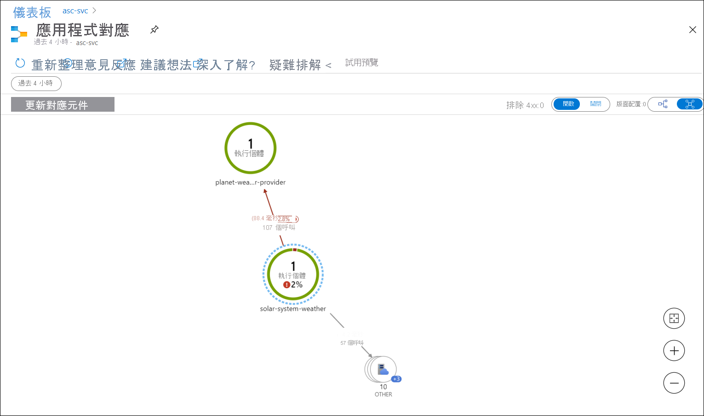
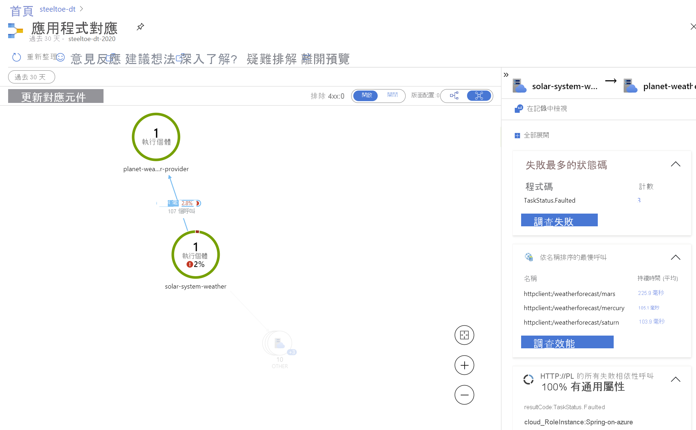

# <a name="quickstart-monitoring-azure-spring-cloud-apps-with-logs-metrics-and-tracing"></a>快速入門：使用記錄、計量和追蹤來監視 Azure Spring Cloud 應用程式

::: zone pivot="programming-language-csharp"
透過 Azure Spring Cloud 內建的監視功能，您就可以對複雜的問題進行偵錯和監視。 Azure Spring Cloud 會整合 Steeltoe [分散式追蹤](https://steeltoe.io/docs/3/tracing/distributed-tracing)與 Azure 的 [Application Insights](https://docs.microsoft.com/azure/azure-monitor/app/app-insights-overview)。 這項整合可讓您從 Azure 入口網站獲得強大的記錄、計量和分散式追蹤功能。

下列程序說明如何搭配您在先前的快速入門中部署的範例應用程式來使用記錄串流、記錄分析、計量和分散式追蹤。

## <a name="prerequisites"></a>先決條件

* 完成此系列的前面幾個快速入門：

  * [佈建 Azure Spring Cloud 服務](spring-cloud-quickstart-provision-service-instance.md)。
  * [設定 Azure Spring Cloud 設定伺服器](spring-cloud-quickstart-setup-config-server.md)。
  * [建置和部署應用程式](spring-cloud-quickstart-deploy-apps.md)。

## <a name="logs"></a>記錄

在 Azure Spring Cloud 上查看記錄的方式有兩種：**記錄串流**是每個應用程式執行個體的即時記錄，或使用**記錄分析**查看具有進階查詢功能的彙總記錄。

### <a name="log-streaming"></a>記錄串流

您可以在 Azure CLI 中搭配下列命令來使用記錄串流。

```azurecli
az spring-cloud app logs -n solar-system-weather -f
```

您將會看到類似於下列範例的輸出：

```output
=> ConnectionId:0HM2HOMHT82UK => RequestPath:/weatherforecast RequestId:0HM2HOMHT82UK:00000003, SpanId:|e8c1682e-46518cc0202c5fd9., TraceId:e8c1682e-46518cc0202c5fd9, ParentId: => Microsoft.Azure.SpringCloud.Sample.SolarSystemWeather.Controllers.WeatherForecastController.Get (Microsoft.Azure.SpringCloud.Sample.SolarSystemWeather)
Executing action method Microsoft.Azure.SpringCloud.Sample.SolarSystemWeather.Controllers.WeatherForecastController.Get (Microsoft.Azure.SpringCloud.Sample.SolarSystemWeather) - Validation state: Valid
←[40m←[32minfo←[39m←[22m←[49m: Microsoft.Azure.SpringCloud.Sample.SolarSystemWeather.Controllers.WeatherForecastController[0]

=> ConnectionId:0HM2HOMHT82UK => RequestPath:/weatherforecast RequestId:0HM2HOMHT82UK:00000003, SpanId:|e8c1682e-46518cc0202c5fd9., TraceId:e8c1682e-46518cc0202c5fd9, ParentId: => Microsoft.Azure.SpringCloud.Sample.SolarSystemWeather.Controllers.WeatherForecastController.Get (Microsoft.Azure.SpringCloud.Sample.SolarSystemWeather)
Retrieved weather data from 4 planets
←[40m←[32minfo←[39m←[22m←[49m: Microsoft.AspNetCore.Mvc.Infrastructure.ControllerActionInvoker[2]

=> ConnectionId:0HM2HOMHT82UK => RequestPath:/weatherforecast RequestId:0HM2HOMHT82UK:00000003, SpanId:|e8c1682e-46518cc0202c5fd9., TraceId:e8c1682e-46518cc0202c5fd9, ParentId: => Microsoft.Azure.SpringCloud.Sample.SolarSystemWeather.Controllers.WeatherForecastController.Get (Microsoft.Azure.SpringCloud.Sample.SolarSystemWeather)
Executing ObjectResult, writing value of type 'System.Collections.Generic.KeyValuePair`2[[System.String, System.Private.CoreLib, Version=4.0.0.0, Culture=neutral, PublicKeyToken=7cec85d7bea7798e],[System.String, System.Private.CoreLib, Version=4.0.0.0, Culture=neutral, PublicKeyToken=7cec85d7bea7798e]][]'.
←[40m←[32minfo←[39m←[22m←[49m: Microsoft.AspNetCore.Mvc.Infrastructure.ControllerActionInvoker[2]
```

> [!TIP]
> 使用 `az spring-cloud app logs -h` 探索更多參數和記錄串流功能。

### <a name="log-analytics"></a>Log Analytics

1. 移至 [服務 |總覽] 頁面，並在 [監視] 區段中選取 [記錄]。 在 Azure Spring Cloud 的其中一個範例查詢上選取 [執行]。

   [  ](media/spring-cloud-quickstart-logs-metrics-tracing/logs-entry.png#lightbox)
    
1. 編輯查詢以移除會將顯示限制為警告和錯誤記錄的 Where 子句。

1. 然後選取 [`Run`]，您就會看到記錄。 如需撰寫查詢的詳細指引，請參閱 [Azure Log Analytics 文件](https://docs.microsoft.com/azure/azure-monitor/log-query/get-started-queries)。

   [  ](media/spring-cloud-quickstart-logs-metrics-tracing/logs-query-steeltoe.png#lightbox)

## <a name="metrics"></a>計量

1. 在 Azure 入口網站中，移至 [服務 |概觀] 頁面，並在 [監視] 區段中選取 [計量]。 在 [計量] 中選取 [`system.cpu.usage`] 來新增第一個計量，並在 [彙總] 中選取 [`Avg`] 來查看整體 CPU 使用量的時間表。

   [  ](media/spring-cloud-quickstart-logs-metrics-tracing/metrics-basic-cpu-steeltoe.png#lightbox)
    
1. 按一下工具列中的 [新增篩選]，然後選取 [`App=solar-system-weather`]，只查看 **solar-system-weather** 應用程式的 CPU 使用量。

   [  ](media/spring-cloud-quickstart-logs-metrics-tracing/metrics-filter-steeltoe.png#lightbox)

1. 關閉在上一個步驟中建立的篩選，選取 [套用分割]，然後針對 [值] 選取 [`App`]，以查看不同應用程式的 CPU 使用量。

   [  ](media/spring-cloud-quickstart-logs-metrics-tracing/metrics-split-steeltoe.png#lightbox)

## <a name="distributed-tracing"></a>分散式追蹤

1. 在 Azure 入口網站中，移至 [服務 |概觀] 頁面，並在 [監視] 區段中選取 [分散式追蹤]。 然後選取右側的 [檢視應用程式對應] 索引標籤。

   [  ](media/spring-cloud-quickstart-logs-metrics-tracing/tracing-entry.png#lightbox)

1. 您現在可以看到應用程式之間的呼叫狀態。 

   [  ](media/spring-cloud-quickstart-logs-metrics-tracing/tracing-overview-steeltoe.png#lightbox)
    
1. 選取 **solar-system-weather** 和 **planet-weather-provider** 之間的連結，以查看更多詳細資料，例如 HTTP 方法的最慢呼叫。

   [  ](media/spring-cloud-quickstart-logs-metrics-tracing/tracing-call-steeltoe.png#lightbox)
    
1. 最後，選取 [調查效能] 來探索更強大的內建效能分析。

   [  ](media/spring-cloud-quickstart-logs-metrics-tracing/tracing-performance-steeltoe.png#lightbox)
::: zone-end

::: zone pivot="programming-language-java"
透過 Azure Spring Cloud 內建的監視功能，您就可以對複雜的問題進行偵錯和監視。 Azure Spring Cloud 可整合 [Spring Cloud Sleuth](https://spring.io/projects/spring-cloud-sleuth) 與 Azure 的 [Application Insights](https://docs.microsoft.com/azure/azure-monitor/app/app-insights-overview)。 這項整合可讓您從 Azure 入口網站獲得強大的記錄、計量和分散式追蹤功能。 下列程序說明如何搭配已部署的 PiggyMetrics 應用程式使用記錄串流、記錄分析、計量和分散式追蹤。

## <a name="prerequisites"></a>先決條件

完成先前的步驟： 

* [佈建 Azure Spring Cloud 的執行個體](spring-cloud-quickstart-provision-service-instance.md)
* [設定 Config Server](spring-cloud-quickstart-setup-config-server.md)
* [建置和部署應用程式](spring-cloud-quickstart-deploy-apps.md)。

## <a name="logs"></a>記錄

在 Azure Spring Cloud 上查看記錄的方式有兩種：**記錄串流**是每個應用程式執行個體的即時記錄，或使用**記錄分析**查看具有進階查詢功能的彙總記錄。

### <a name="log-streaming"></a>記錄串流

#### <a name="cli"></a>[CLI](#tab/Azure-CLI)

您可以在 Azure CLI 中搭配下列命令來使用記錄串流。

```azurecli
az spring-cloud app logs -s <service instance name> -g <resource group name> -n gateway -f
```

您會看到類似下面的記錄：

[  ](media/spring-cloud-quickstart-logs-metrics-tracing/logs-streaming-cli.png#lightbox)

> [!TIP]
> 使用 `az spring-cloud app logs -h` 探索更多參數和記錄串流功能。

#### <a name="intellij"></a>[IntelliJ](#tab/IntelliJ)

若要使用 Azure Toolkit for IntelliJ 取得記錄：

1. 選取 [Azure Explorer]，然後選取 [Spring Cloud]。

1. 以滑鼠右鍵按一下正在執行的應用程式。

1. 從下拉式清單中選取 [串流記錄]。

   
    
1. 選取**執行個體**。

   
    
1. 串流記錄會顯示在輸出視窗中。

   

---
### <a name="log-analytics"></a>Log Analytics

1. 移至 [服務 |總覽] 頁面，並在 [監視] 區段中選取 [記錄]。 在 Azure Spring Cloud 的其中一個範例查詢上按一下 [執行]。 

   [  ](media/spring-cloud-quickstart-logs-metrics-tracing/logs-entry.png#lightbox)
    
1. 然後您會看到篩選過的記錄。 如需撰寫查詢的詳細指引，請參閱 [Azure Log Analytics 文件](https://docs.microsoft.com/azure/azure-monitor/log-query/get-started-queries)。

   [  ](media/spring-cloud-quickstart-logs-metrics-tracing/logs-query.png#lightbox)

## <a name="metrics"></a>計量

1. 移至 [服務 |總覽] 頁面，並在 [監視] 區段中選取 [計量]。 在 [計量] 中選取 [`system.cpu.usage`] 來新增第一個計量，並在 [彙總] 中選取 [`Avg`] 來查看整體 CPU 使用量的時間表。

   [  ](media/spring-cloud-quickstart-logs-metrics-tracing/metrics-basic-cpu.png#lightbox)
    
1. 按一下上方工具列中的 [新增篩選]，然後選取 [`App=Gateway`]，僅查看**閘道**應用程式的 CPU 使用量。

   [  ](media/spring-cloud-quickstart-logs-metrics-tracing/metrics-filter.png#lightbox)

1. 關閉上面建立的篩選器，按一下 [套用分割]，然後針對 [值] 選取 [`App`]，以查看不同應用程式的 CPU 使用量。

   [  ](media/spring-cloud-quickstart-logs-metrics-tracing/metrics-split.png#lightbox)

## <a name="distributed-tracing"></a>分散式追蹤

1. 移至 [服務 |總覽] 頁面，並在 [監視] 區段中選取 [分散式追蹤]。 然後按一下右側的 [檢視應用程式對應] 索引標籤。

   [  ](media/spring-cloud-quickstart-logs-metrics-tracing/tracing-entry.png#lightbox)

1. 您現在可以看到 Piggymetrics 應用程式之間的呼叫狀態。 

   [  ](media/spring-cloud-quickstart-logs-metrics-tracing/tracing-overview.png#lightbox)
    
1. 按一下 **gateway** 和 **account-service** 之間的連結，以查看更多詳細資料，例如 HTTP 方法的最慢呼叫。

   [  ](media/spring-cloud-quickstart-logs-metrics-tracing/tracing-call.png#lightbox)
    
1. 最後，按一下 [調查效能] 來探索更強大的內建效能分析。

   [  ](media/spring-cloud-quickstart-logs-metrics-tracing/tracing-performance.png#lightbox)

::: zone-end

## <a name="clean-up-resources"></a>清除資源

在這些快速入門中，您已建立 Azure 資源，這些資源如果留在訂用帳戶中，將會繼續產生費用。 如果您在未來不需要這些資源，請使用入口網站刪除資源群組，或在 Cloud Shell 中執行下列命令來刪除：

```azurecli
az group delete --name <your resource group name; for example: helloworld-1558400876966-rg> --yes
```

在先前的快速入門中，您也設定了預設的資源群組名稱。 如果您不打算繼續進行下一個快速入門，則請執行下列 CLI 命令來清除該預設值：

```azurecli
az configure --defaults group=
```

## <a name="next-steps"></a>下一步

若要探索更多的 Azure Spring Cloud 監視功能，請參閱：

> [!div class="nextstepaction"]
> [診斷服務](diagnostic-services.md)
>
> [分散式追蹤](spring-cloud-tutorial-distributed-tracing.md)
>
> [即時串流記錄](spring-cloud-howto-log-streaming.md)
