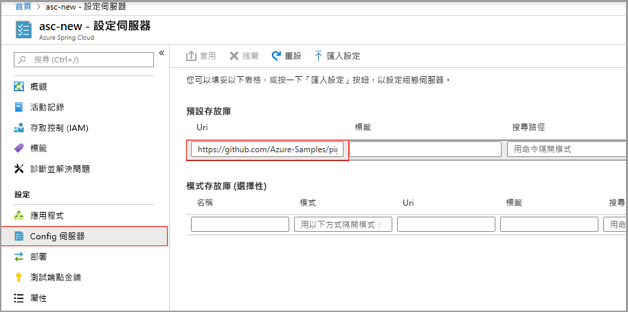
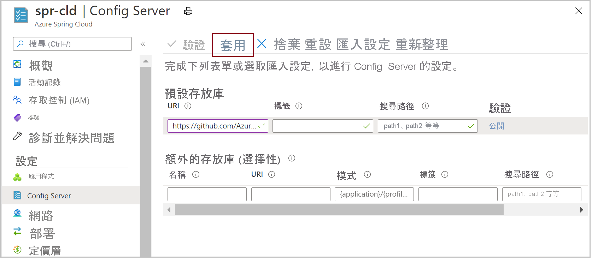
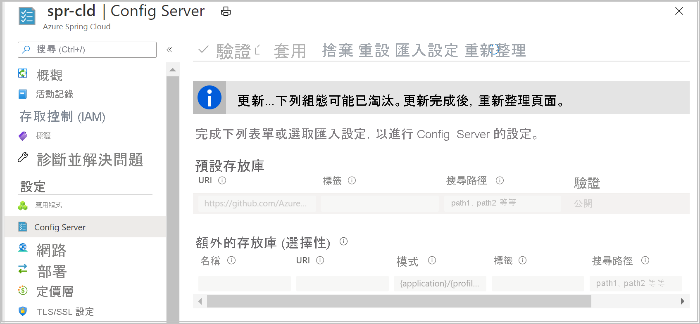

# <a name="quickstart-set-up-azure-spring-cloud-configuration-server"></a>快速入門：設定 Azure Spring Cloud 設定伺服器

Azure Spring Cloud Config Server 是分散式系統的集中式設定服務。 其會使用目前支援本機儲存體、Git 和 Subversion 的可插入存放庫層。 在本快速入門中，您會設定「設定伺服器」以從 Git 存放庫取得資料。

::: zone pivot="programming-language-csharp"

## <a name="prerequisites"></a>先決條件

* 完成此系列的上一個快速入門：[佈建 Azure Spring Cloud 服務](spring-cloud-quickstart-provision-service-instance.md)。

## <a name="azure-spring-cloud-config-server-procedures"></a>Azure Spring Cloud Config Server 程序

執行下列命令，使用專案的 Git 存放庫位置來設定您的 config-server。 將 `<service instance name>` 取代為您先前建立的服務名稱。 您在前面的快速入門中設定的服務執行個體名稱預設值無法用於此命令。

```azurecli
az spring-cloud config-server git set -n <service instance name> --uri https://github.com/Azure-Samples/Azure-Spring-Cloud-Samples --search-paths steeltoe-sample/config
```

此命令會告知設定伺服器在範例應用程式存放庫的 [steeltoe-sample/config](https://github.com/Azure-Samples/Azure-Spring-Cloud-Samples/tree/master/steeltoe-sample/config) 資料夾中尋找設定資料。 因為會取得設定資料的應用程式名稱是 `planet-weather-provider`，所以將使用的檔案是 [planet-weather-provider.yml](https://github.com/Azure-Samples/Azure-Spring-Cloud-Samples/blob/master/steeltoe-sample/config/planet-weather-provider.yml)。

::: zone-end

::: zone pivot="programming-language-java"
Azure Spring Cloud Config Server 是分散式系統的集中式設定服務。 其會使用目前支援本機儲存體、Git 和 Subversion 的可插入存放庫層。  設定 Config Server 以將微服務應用程式部署至 Azure Spring Cloud。

## <a name="prerequisites"></a>先決條件

* [安裝 JDK 8](/java/azure/jdk/?preserve-view=true&view=azure-java-stable)
* [註冊 Azure 訂用帳戶](https://azure.microsoft.com/free/)
* (選擇性) [安裝 Azure CLI 版本 2.0.67 或更高版本](/cli/azure/install-azure-cli?preserve-view=true&view=azure-cli-latest)，並使用下列命令安裝 Azure Spring Cloud 擴充功能：`az extension add --name spring-cloud`
* (選擇性) [安裝 Azure Toolkit for IntelliJ](https://plugins.jetbrains.com/plugin/8053-azure-toolkit-for-intellij/) 並[登入](/azure/developer/java/toolkit-for-intellij/create-hello-world-web-app#installation-and-sign-in)

## <a name="azure-spring-cloud-config-server-procedures"></a>Azure Spring Cloud Config Server 程序

#### <a name="portal"></a>[入口網站](#tab/Azure-portal)

下列程序會使用 Azure 入口網站來設定 Config Server，以部署 [Piggymetrics 範例](spring-cloud-quickstart-sample-app-introduction.md)。

1. 移至服務 [概觀] 頁面並選取 [設定伺服器]。

2. 在 [預設存放庫] 區段中，將 [URI] 設定為 [https://github.com/Azure-Samples/piggymetrics-config ]。

3. 按一下 **[驗證]** 。

    

4. 在驗證完成後，按一下 [套用] 以儲存您的變更。

    

5. 更新設定可能需要幾分鐘的時間。
 
     

6. 設定完成後，您應該會收到通知。

#### <a name="cli"></a>[CLI](#tab/Azure-CLI)

下列程序會使用 Azure CLI 來設定 Config Server，以部署 [Piggymetrics 範例](spring-cloud-quickstart-sample-app-introduction.md)。

使用專案的 Git 存放庫位置來設定您的 config-server：

```azurecli
az spring-cloud config-server git set -n <service instance name> --uri https://github.com/Azure-Samples/piggymetrics-config
```
---
::: zone-end

## <a name="troubleshooting-of-azure-spring-cloud-config-server"></a>Azure Spring Cloud Config Server 的疑難排解

下列程序說明如何對 Config Server 設定進行疑難排解。

1. 在 Azure 入口網站中，移至服務 [概觀] 頁面，然後選取 [記錄]。 
1. 選取 [查詢]，並選取 [顯示包含「錯誤」或「例外狀況」字詞的應用程式記錄]。 
1. 按一下 **[執行]** 。 
1. 如果您在記錄中發現 **java.lang.illegalStateException** 錯誤，這表示 Spring Cloud Service 找不到來自 Config Server 的屬性。

    [  ](media/spring-cloud-quickstart-setup-config-server/setup-config-server-query.png)

1. 移至服務 [概觀] 頁面。
1. 選取 [診斷並解決問題]。 
1. 選取 **Config Server** 偵測器。

    [  ](media/spring-cloud-quickstart-setup-config-server/setup-config-server-diagnose.png)

3. 按一下 [Config Server 健康情況檢查]。

    [  ](media/spring-cloud-quickstart-setup-config-server/setup-config-server-genie.png)

4. 按一下 [Config Server 狀態]，以查看更多來自偵測器的詳細資料。

    [  ](media/spring-cloud-quickstart-setup-config-server/setup-config-server-health-status.png)

## <a name="next-steps"></a>後續步驟

在本快速入門中，您已建立 Azure 資源，這些資源如果留在訂用帳戶中，將會繼續產生費用。 如果您不打算繼續進行下一個快速入門，請參閱[清除資源](spring-cloud-quickstart-logs-metrics-tracing.md#clean-up-resources)。 否則，請繼續進行下一個快速入門：

> [!div class="nextstepaction"]
> [建置和部署應用程式](spring-cloud-quickstart-deploy-apps.md)
