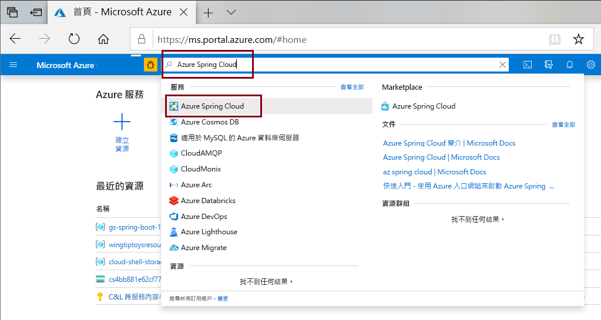
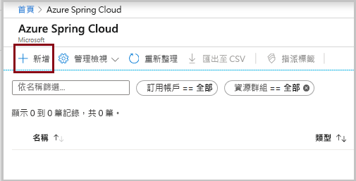
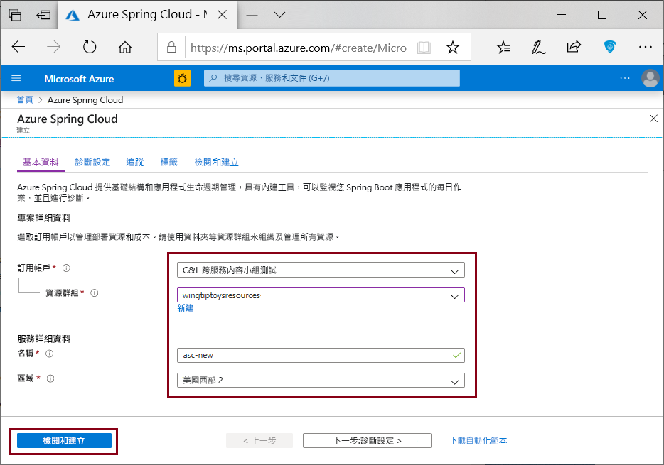

# <a name="quickstart-deploy-your-first-azure-spring-cloud-application"></a>快速入門：部署您的第一個 Azure Spring Cloud 應用程式

本快速入門說明如何部署可在 Azure 上執行的簡單 Azure Spring Cloud 微服務應用程式。 

本教學課程使用的應用程式程式碼是以 Spring Initializr 建立的簡單應用程式。 當您完成此範例時，應用程式將可在線上存取，並可透過 Azure 入口網站來管理。

本快速入門說明如何：

> [!div class="checklist"]
> * 產生基本的 Spring Cloud 專案
> * 佈建服務執行個體
> * 使用公用端點建置及部署應用程式
> * 即時串流記錄

## <a name="prerequisites"></a>Prerequisites

若要完成本快速入門：

* [安裝 JDK 8](https://docs.microsoft.com/java/azure/jdk/?view=azure-java-stable)
* [註冊 Azure 訂用帳戶](https://azure.microsoft.com/free/)
* (選擇性) [安裝 Azure CLI 版本 2.0.67 或更高版本](https://docs.microsoft.com/cli/azure/install-azure-cli?view=azure-cli-latest)，並使用下列命令安裝 Azure Spring Cloud 擴充功能：`az extension add --name spring-cloud`
* (選擇性) [安裝 Azure Toolkit for IntelliJ](https://plugins.jetbrains.com/plugin/8053-azure-toolkit-for-intellij/) 並[登入](https://docs.microsoft.com/azure/developer/java/toolkit-for-intellij/create-hello-world-web-app#installation-and-sign-in)

## <a name="generate-a-spring-cloud-project"></a>產生 Spring Cloud 專案

從 [Spring Initializr](https://start.spring.io/#!type=maven-project&language=java&platformVersion=2.3.3.RELEASE&packaging=jar&jvmVersion=1.8&groupId=com.example&artifactId=hellospring&name=hellospring&description=Demo%20project%20for%20Spring%20Boot&packageName=com.example.hellospring&dependencies=web,cloud-eureka,actuator,cloud-starter-sleuth,cloud-starter-zipkin) 開始，使用 Azure Spring Cloud 的建議相依性來產生範例專案。 下圖顯示為此範例專案所設定的 Initializr。
```url
https://start.spring.io/#!type=maven-project&language=java&platformVersion=2.3.3.RELEASE&packaging=jar&jvmVersion=1.8&groupId=com.example&artifactId=hellospring&name=hellospring&description=Demo%20project%20for%20Spring%20Boot&packageName=com.example.hellospring&dependencies=web,cloud-eureka,actuator,cloud-starter-sleuth,cloud-starter-zipkin
```

  

1. 當所有相依性都已設定後，按一下 [產生]。 下載並解壓縮套件，然後藉由新增 `src/main/java/com/example/hellospring/HelloController.java` 來建立簡易 Web 應用程式的 Web 控制器，如下所示：

    ```java
    package com.example.hellospring;
    
    import org.springframework.web.bind.annotation.RestController;
    import org.springframework.web.bind.annotation.RequestMapping;
    
    @RestController
    public class HelloController {
    
        @RequestMapping("/")
        public String index() {
            return "Greetings from Azure Spring Cloud!";
        }
    
    }
    ```
## <a name="provision-an-instance-of-azure-spring-cloud"></a>佈建 Azure Spring Cloud 的執行個體

下列程序會使用 Azure 入口網站來建立 Azure Spring Cloud 的執行個體。

1. 在新的索引標籤中，開啟 [Azure 入口網站](https://ms.portal.azure.com/)。 

2. 從頂端的搜尋方塊，搜尋 *Azure Spring Cloud*。

3. 從結果中選取 *Azure Spring Cloud*。

    

4. 在 Azure Spring Cloud 頁面上，按一下 [+ 新增]。

    

5. 填寫 Azure Spring Cloud [建立] 頁面上的表單。  請參考下列指引：
    - 訂用帳戶：選取您想要用來支付此資源費用的訂用帳戶。
    - **資源群組**：為新資源建立新資源群組是最佳做法。 稍後將會使用該資訊作為 **\<resource group name\>** 。
    - **服務詳細資料/名稱**：指定 **\<service instance name\>** 。  名稱長度必須為 4 到 32 個字元，且只能包含小寫字母、數字及連字號。  服務名稱的第一個字元必須是字母，且最後一個字元必須是字母或數字。
    - **位置**：選取您服務執行個體的區域。

    

6. 按一下 [檢閱及建立]。

## <a name="build-and-deploy-the-app"></a>建置並部署應用程式
    
#### <a name="cli"></a>[CLI](#tab/Azure-CLI)
下列程序會使用 Azure CLI 來建置和部署應用程式。 從專案根目錄中，執行下列命令。

1. 使用 Maven 建置專案：

    ```console
    mvn clean package -DskipTests
    ```

1. 安裝適用於 Azure CLI 的 Azure Spring Cloud 擴充功能 (如果尚未安裝)：

    ```azurecli
    az extension add --name spring-cloud
    ```
    
1. 建立已指派公用端點的應用程式：

    ```azurecli
    az spring-cloud app create -n hellospring -s <service instance name> -g <resource group name> --is-public
    ```

1. 部署應用程式的 Jar 檔案：

    ```azurecli
    az spring-cloud app deploy -n hellospring -s <service instance name> -g <resource group name> --jar-path target\hellospring-0.0.1-SNAPSHOT.jar
    ```
    
1. 系統需要幾分鐘的時間來完成部署應用程式。 若要確認其已部署完成，請移至 Azure 入口網站的 [應用程式] 刀鋒視窗。 您應該會看到應用程式的狀態。

#### <a name="intellij"></a>[IntelliJ](#tab/IntelliJ)

下列程序會使用適用於 Azure Spring Cloud 的 IntelliJ 外掛程式，在 IntelliJ IDEA 中部署範例應用程式。  

### <a name="import-project"></a>匯入專案

1. 開啟 IntelliJ [歡迎] 對話方塊，然後選取 [匯入專案] 以開啟匯入精靈。
1. 選取 `hellospring` 資料夾。

    

### <a name="deploy-the-app"></a>部署應用程式
若要部署至 Azure，您必須使用您的 Azure 帳戶登入，然後選擇您的訂用帳戶。  如需登入詳細資訊，請參閱[安裝和登入](https://docs.microsoft.com/azure/developer/java/toolkit-for-intellij/create-hello-world-web-app#installation-and-sign-in)。

1. 在 IntelliJ 專案總管中以滑鼠右鍵按一下專案，然後選取 [Azure] ->  [部署至 Azure Spring Cloud]。

    [  ](media/spring-cloud-quickstart-java/intellij-deploy-azure-1.png#lightbox)

1. 在 [名稱] 欄位中，接受應用程式的名稱。 [名稱] 是指設定，而不是應用程式名稱。 使用者通常不需要加以變更。
1. 在 [成品] 文字方塊中，選取 [hellospring-0.0.1-SNAPSHOT.jar]。
1. 在 [訂用帳戶] 文字方塊中，驗證您的訂用帳戶。
1. 在 [Spring Cloud] 文字方塊中，選取您在[佈建 Azure Spring Cloud 執行個體](https://docs.microsoft.com/azure/spring-cloud/spring-cloud-quickstart-provision-service-instance)中所建立的 Azure Spring Cloud 執行個體。
1. 將 [公用端點] 設定為 [啟用]。
1. 在 [應用程式：] 文字方塊中，選取 [建立應用程式...]。
1. 輸入 hellospring，然後按一下 [確定]。

    [  ](media/spring-cloud-quickstart-java/intellij-deploy-to-azure.png#lightbox)

1. 按一下 [部署 Azure Spring Cloud 應用程式] 對話方塊底部的 [執行] 按鈕來開始部署。 外掛程式會在 `hellospring` 應用程式上執行 `mvn package` 命令，並部署 `package` 命令所產生的 jar。
---

一旦部署完成後，您就可以在 `https://<service instance name>-hellospring.azuremicroservices.io/` 上存取應用程式。

  [  ](media/spring-cloud-quickstart-java/access-app-browser.png#lightbox)

## <a name="streaming-logs-in-real-time"></a>即時串流記錄

#### <a name="cli"></a>[CLI](#tab/Azure-CLI)

使用下列命令，從應用程式取得即時記錄。

```azurecli
az spring-cloud app logs -n hellospring -s <service instance name> -g <resource group name> --lines 100 -f

```
記錄會出現在結果中：

[  ](media/spring-cloud-quickstart-java/streaming-logs.png#lightbox)

>[!TIP]
> 使用 `az spring-cloud app logs -h` 探索更多參數和記錄串流功能。

#### <a name="intellij"></a>[IntelliJ](#tab/IntelliJ)

1. 選取 [Azure Explorer]，然後選取 [Spring Cloud]。
1. 以滑鼠右鍵按一下正在執行的應用程式。
1. 從下拉式清單中選取 [串流記錄]。
1. 選取執行個體。

    [  ](media/spring-cloud-quickstart-java/intellij-get-streaming-logs.png)

1. 串流記錄會顯示在輸出視窗中。

    [  ](media/spring-cloud-quickstart-java/intellij-streaming-logs-output.png)
---

如需進階記錄分析功能，請從 [Azure 入口網站](https://portal.azure.com/)的功能表中，瀏覽至 [記錄] 索引標籤。 這裡的記錄會有幾分鐘的延遲。

[  ](media/spring-cloud-quickstart-java/logs-analytics.png#lightbox)

## <a name="clean-up-resources"></a>清除資源
在前述步驟中，您在資源群組中建立了 Azure 資源。 如果您在未來不需要這些資源，請從入口網站刪除資源群組，或在 Cloud Shell 中執行下列命令：
```azurecli
az group delete --name <your resource group name; for example: hellospring-1558400876966-rg> --yes
```

在此快速入門中，您已了解如何：

> [!div class="checklist"]
> * 產生基本的 Azure Spring Cloud 專案
> * 佈建服務執行個體
> * 使用公用端點建置及部署應用程式
> * 即時串流記錄
## <a name="next-steps"></a>後續步驟
> [!div class="nextstepaction"]
> [建置和執行微服務](spring-cloud-quickstart-sample-app-introduction.md)

GitHub 上可用的其他範例：[Azure Spring Cloud 範例](https://github.com/Azure-Samples/Azure-Spring-Cloud-Samples/tree/master/service-binding-cosmosdb-sql)。
