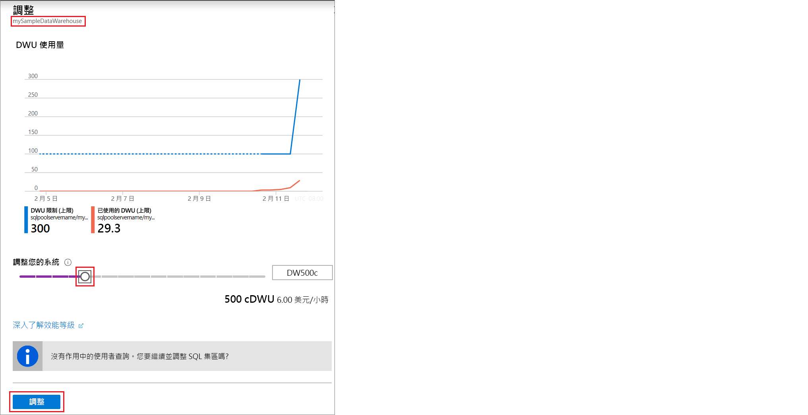

# 快速入門：在 Azure 入口網站中調整 Azure Synapse Analytics SQL 集區中的計算

在 Azure 入口網站中調整 SQL 集區中的計算。 [相應放大計算](sql-data-warehouse-manage-compute-overview.md)以提升效能，或將計算調整回來以節省成本。 

如果您沒有 Azure 訂用帳戶，請在開始前建立[免費帳戶](https://azure.microsoft.com/free/)。

## 登入 Azure 入口網站

登入 [Azure 入口網站](https://portal.azure.com/)。

## 開始之前

您可以調整您已有的 SQL 集區，也可以使用[快速入門：建立與連線 - 入口網站](create-data-warehouse-portal.md)建立名為 **mySampleDataWarehouse** 的 SQL 集區。  本快速入門會調整 **mySampleDataWarehouse**。

>[!Note]
>您的 SQL 集區必須在線上才能進行調整。 

## 調整計算

您可以藉由增加或減少資料倉儲單位來調整 SQL 集區計算資源。 [建立與連線 - 入口網站] 快速入門 (create-data-warehouse-portal.md) 已建立 **mySampleDataWarehouse**，並使用 400 DWU 加以初始化。 下列步驟會調整 **mySampleDataWarehouse** 的 DWU。

若要變更資料倉儲單位：

1. 按一下 Azure 入口網站左側頁面中的 [Azure Synapse Analytics (先前為 SQL DW)]  。
2. 從 [Azure Synapse Analytics (先前為 SQL DW)]  頁面中選取 [mySampleDataWarehouse]  。 SQL 集區隨即開啟。
3. 按一下 [調整]  。

    ![按一下 [調整]](media/quickstart-scale-compute-portal/click-scale.png)

2. 在 [調整] 面板中，將滑桿向左或右移動來變更 DWU 設定。 然後，選取 [調整]。

    

## 後續步驟
您現在已了解如何調整 SQL 集區的計算。 若要深入了解 SQL 集區，請繼續進行載入資料的教學課程。

> [!div class="nextstepaction"]
>[將資料載入至 SQL 集區](load-data-from-azure-blob-storage-using-polybase.md)
