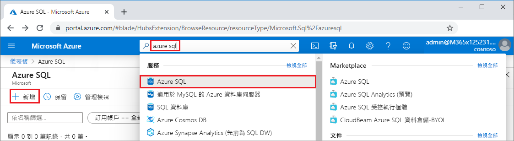
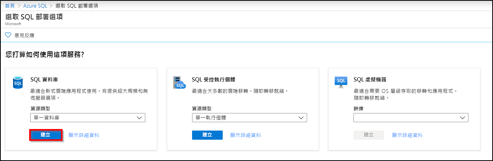
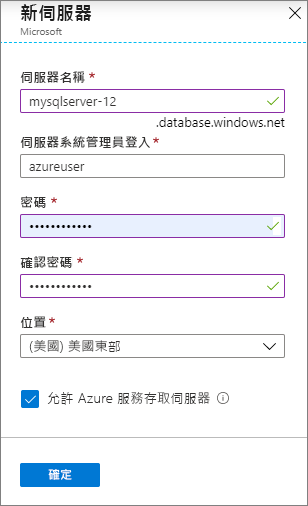
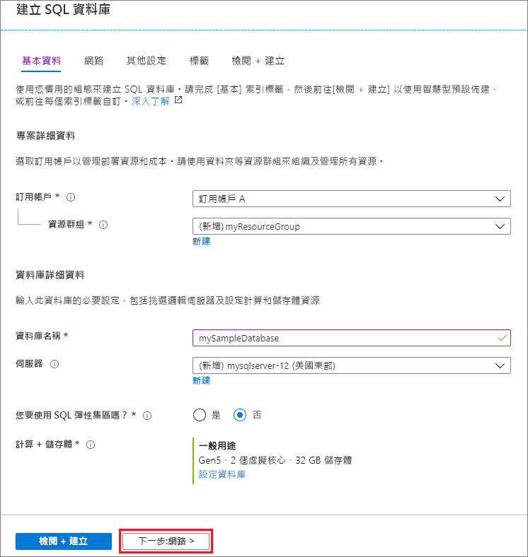
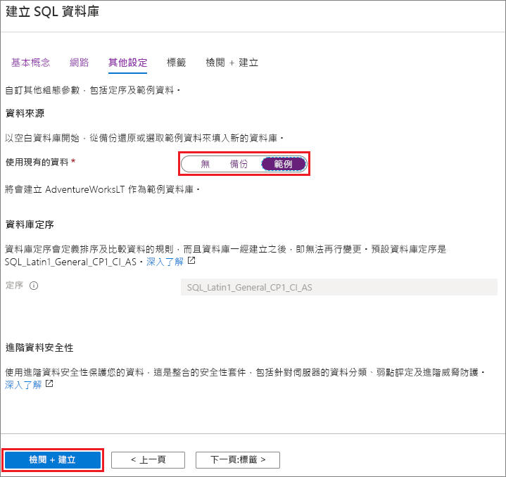
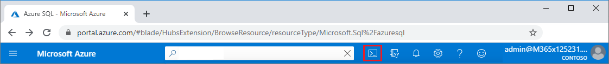

在此步驟中，您會建立 Azure SQL Database 伺服器，以及使用 AdventureWorksLT 範例資料的單一資料庫。 您可以使用 Azure 入口網站功能表和畫面，或在 Azure Cloud Shell 中使用 Azure CLI 或 PowerShell 指令碼來建立資料庫。

所有的方法都包括設定伺服器層級的防火牆規則，以允許您用來存取伺服器之電腦的公用 IP 位址。 如需建立伺服器防火牆規則的詳細資訊，請參閱[建立伺服器層級防火牆](../sql-database-server-level-firewall-rule.md)。 您也可以設定資料庫層級的防火牆規則。 請參閱[建立資料庫層級防火牆規則](/sql/relational-databases/system-stored-procedures/sp-set-database-firewall-rule-azure-sql-database)。 

# <a name="portal"></a>[入口網站](#tab/azure-portal)

要在 Azure 入口網站中建立資源群組、SQL 伺服器和單一資料庫：

1. 登入[入口網站](https://portal.azure.com)。
1. 從搜尋列中，搜尋並選取 [Azure SQL]。
1. 在 [Azure SQL] 頁面上，選取 [新增]。 
   
   
   
1. 在 [選取 SQL 部署選項] 頁面上，選取 [SQL 資料庫] 圖格，並在**資源類型**下選取 [單一資料庫]。 您可以選取 [顯示詳細資料]，以檢視不同資料庫的更多資訊。
1. 選取 [建立]。
   
   
   
1. 在 **建立 SQL 資料庫**表單的 [基本資料] 索引標籤上，在 [專案詳細資料] 下，選取正確的 Azure **訂用帳戶** (如果尚未選取)。
1. 在 [資源群組] 下選取 [建立新的]，輸入 myResourceGroup，然後選取 [確定]。
1. 在 [資料庫詳細資料]下，針對**資料庫名稱**輸入 *mySampleDatabase*。
1. 在 [伺服器] 中，選取 [建立新的]，並填寫**新伺服器**表單，如下所示：
   - **伺服器名稱**：輸入 mysqlserver 和一些字元來表示唯一性。
   - **伺服器管理員登入**：輸入 azureuser。
   - **密碼**：輸入符合需求的密碼，然後在 [確認密碼] 欄位中再次輸入。
   - **位置**：下拉並選擇位置，例如 **(美國) 美國東部**。
   
   選取 [確定]。
   
   
   
   請記錄伺服器管理員登入和密碼，以便登入伺服器和資料庫。 如果您忘記登入或密碼，可以在建立資料庫後，於 **SQL 伺服器**頁面上取得登入名稱或重設密碼。 若要開啟 **SQL 伺服器**頁面，請選取資料庫**概觀**頁面上的伺服器名稱。
   
1. 在 [計算 + 儲存體] 下，如果想要重新設定預設值，請選取 [設定資料庫]。
   
   在 [設定] 頁面上，您可以選擇：
   - 將**計算層**從**已佈建**變更為**無伺服器**。
   - 檢閱並變更 [虛擬核心] 和 [資料大小上限] 的設定。
   - 選取 [變更組態] 來變更硬體世代。
   
   完成變更之後，請選取 [套用]。
   
1. 完成時，選取 [下一步:網路功能]，為於頁面底部。
   
   
   
1. 在 [網路功能] 索引標籤的 [連線方法] 下，選取 [公用端點]。 
1. 在 [防火牆規則] 下，將 [新增目前的用戶端 IP 位址] 設定為 **是**。
1. 完成時，選取 [下一步:其他設定]，位於頁面底部。
   
   
   
   如需防火牆設定的詳細資訊，請參閱[允許 Azure 服務和資源存取此伺服器](../sql-database-networkaccess-overview.md)和[新增私人端點](../../private-link/private-endpoint-overview.md)。
   
1. 在 [其他設定] 索引標籤的 [資料來源] 區段中，針對 [使用現有的資料]，選取 [範例]。
1. 選取頁面底部的 [檢閱 + 建立]。
   
   
   
1. 檢閱設定之後，選取 [建立]。

# <a name="azure-cli"></a>[Azure CLI](#tab/azure-cli)

您可以使用 Azure 命令列介面 (Azure CLI) 來建立 Azure 資源群組、SQL 伺服器和單一資料庫。 如果您不想使用 Azure Cloud Shell，請在您的電腦上[安裝 Azure CLI](/cli/azure/install-azure-cli)。

若要在 Azure Cloud Shell 中執行下列程式碼範例，請選取程式碼範例標題列中的 [試用]。 當 Cloud Shell 開啟時，請選取程式碼範例標題列中的 [複製]，然後將程式碼範例貼入 Cloud Shell 視窗中。 在程式碼中，將 `<Subscription ID>` 取代為您的 Azure 訂用帳戶識別碼，並針對 `$startip` 和 `$endip`，將 `0.0.0.0` 取代為您所使用之電腦的公用 IP 位址。

遵循螢幕上的提示來登入 Azure 並執行程式碼。 

您也可以從 Azure 入口網站使用 Azure Cloud Shell，方法是選取頂端列的 Cloud Shell 圖示。 
   
   
   
第一次使用入口網站中的 Cloud Shell 時，請在 [歡迎使用] 對話方塊中選取 [Bash]。 後續的工作階段會在 Bash 環境中使用 Azure CLI；或者您也可以從 Cloud Shell 控制列選取 **Bash**。 

下列 Azure CLI 程式碼會建立 Azure 資源群組、SQL 伺服器、單一資料庫，以及用來存取伺服器的防火牆規則。 請務必記錄所產生的資源群組和伺服器名稱，以便您稍後可以管理這些資源。

```azurecli-interactive
#!/bin/bash

# Sign in to Azure and set execution context (if necessary)
az login
az account set --subscription <Subscription ID>

# Set the resource group name and location for your server
resourceGroupName=myResourceGroup-$RANDOM
location=westus2

# Set an admin login and password for your database
adminlogin=azureuser
password=Azure1234567

# Set a logical server name that is unique in the system
servername=server-$RANDOM

# Set the ip address range that can access your database
startip=0.0.0.0
endip=0.0.0.0

# Create a resource group
az group create \
    --name $resourceGroupName \
    --location $location

# Create a logical server in the resource group
az sql server create \
    --name $servername \
    --resource-group $resourceGroupName \
    --location $location  \
    --admin-user $adminlogin \
    --admin-password $password

# Configure a firewall rule for the server
az sql server firewall-rule create \
    --resource-group $resourceGroupName \
    --server $servername \
    -n AllowYourIp \
    --start-ip-address $startip \
    --end-ip-address $endip

# Create a gen5 2 vCore database in the server
az sql db create \
    --resource-group $resourceGroupName \
    --server $servername \
    --name mySampleDatabase \
    --sample-name AdventureWorksLT \
    --edition GeneralPurpose \
    --family Gen5 \
    --capacity 2 \
```

上述程式碼會使用這些 Azure CLI 命令：

| Command | 描述 |
|---|---|
| [az account set](/cli/azure/account?view=azure-cli-latest#az-account-set) | 將訂用帳戶設定為目前使用中的訂用帳戶。 | 
| [az group create](/cli/azure/group#az-group-create) | 建立用來存放所有資源的資源群組。 |
| [az sql server create](/cli/azure/sql/server#az-sql-server-create) | 建立裝載單一資料庫和彈性集區的 SQL Database 伺服器。 |
| [az sql server firewall-rule create](/cli/azure/sql/server/firewall-rule##az-sql-server-firewall-rule-create) | 建立伺服器的防火牆規則。 | 
| [az sql db create](/cli/azure/sql/db#az-sql-db-create?view=azure-cli-latest) | 建立資料庫。 | 

如需 Azure SQL Database Azure CLI 的範例 ，請參閱 [Azure CLI 範例](../sql-database-cli-samples.md)。

# <a name="powershell"></a>[PowerShell](#tab/azure-powershell)

您可以使用 Windows PowerShell 來建立 Azure 資源群組、SQL 伺服器和單一資料庫。 如果您不想使用 Azure Cloud Shell，請[安裝 Azure PowerShell 模組](/powershell/azure/install-az-ps)。

[!INCLUDE [updated-for-az](../../../includes/updated-for-az.md)]

若要在 Azure Cloud Shell 中執行下列程式碼範例，請選取程式碼標題列中的 [試用]。 當 Cloud Shell 開啟時，請選取程式碼範例標題列中的 [複製]，然後將程式碼範例貼入 Cloud Shell 視窗中。 在程式碼中，將 `<Subscription ID>` 取代為您的 Azure 訂用帳戶識別碼，並針對 `$startIp` 和 `$endIp`，將 `0.0.0.0` 取代為您所使用之電腦的公用 IP 位址。 

遵循螢幕上的提示來登入 Azure 並執行程式碼。 

您也可以從 Azure 入口網站使用 Azure Cloud Shell，方法是選取頂端列的 Cloud Shell 圖示。 
   
   
   
第一次使用入口網站中的 Cloud Shell 時，請從 [歡迎使用] 對話方塊中選取 [PowerShell]。 後續的工作階段會使用 PowerShell，您也可以從 Cloud Shell 控制列中加以選取。 

下列 PowerShell 程式碼會建立 Azure 資源群組、SQL 伺服器、單一資料庫，以及用來存取伺服器的防火牆規則。 請務必記錄所產生的資源群組和伺服器名稱，以便您稍後可以管理這些資源。

   ```powershell-interactive
   # Set variables for your server and database
   $subscriptionId = '<SubscriptionID>'
   $resourceGroupName = "myResourceGroup-$(Get-Random)"
   $location = "West US"
   $adminLogin = "azureuser"
   $password = "Azure1234567"
   $serverName = "mysqlserver-$(Get-Random)"
   $databaseName = "mySampleDatabase"

   # The ip address range that you want to allow to access your server 
   $startIp = "0.0.0.0"
   $endIp = "0.0.0.0"

   # Show randomized variables
   Write-host "Resource group name is" $resourceGroupName 
   Write-host "Server name is" $serverName 

   # Connect to Azure
   Connect-AzAccount

   # Set subscription ID
   Set-AzContext -SubscriptionId $subscriptionId 

   # Create a resource group
   Write-host "Creating resource group..."
   $resourceGroup = New-AzResourceGroup -Name $resourceGroupName -Location $location -Tag @{Owner="SQLDB-Samples"}
   $resourceGroup

   # Create a server with a system wide unique server name
   Write-host "Creating primary logical server..."
   $server = New-AzSqlServer -ResourceGroupName $resourceGroupName `
      -ServerName $serverName `
      -Location $location `
      -SqlAdministratorCredentials $(New-Object -TypeName System.Management.Automation.PSCredential `
      -ArgumentList $adminLogin, $(ConvertTo-SecureString -String $password -AsPlainText -Force))
   $server

   # Create a server firewall rule that allows access from the specified IP range
   Write-host "Configuring firewall for primary logical server..."
   $serverFirewallRule = New-AzSqlServerFirewallRule -ResourceGroupName $resourceGroupName `
      -ServerName $serverName `
      -FirewallRuleName "AllowedIPs" -StartIpAddress $startIp -EndIpAddress $endIp
   $serverFirewallRule

   # Create General Purpose Gen4 database with 1 vCore
   Write-host "Creating a gen5 2 vCore database..."
   $database = New-AzSqlDatabase  -ResourceGroupName $resourceGroupName `
      -ServerName $serverName `
      -DatabaseName $databaseName `
      -Edition GeneralPurpose `
      -VCore 2 `
      -ComputeGeneration Gen5 `
      -MinimumCapacity 2 `
      -SampleName "AdventureWorksLT"
   $database
   ```

上述程式碼會使用這些 PowerShell Cmdlet：

| Command | 注意 |
|---|---|
| [New-AzResourceGroup](/powershell/module/az.resources/new-azresourcegroup) | 建立用來存放所有資源的資源群組。 |
| [New-AzSqlServer](/powershell/module/az.sql/new-azsqlserver) | 建立裝載單一資料庫和彈性集區的 SQL Database 伺服器。 |
| [New-AzSqlServerFirewallRule](/powershell/module/az.sql/new-azsqlserverfirewallrule) | 建立邏輯伺服器的防火牆規則。 | 
| [New-AzSqlDatabase](/powershell/module/az.sql/new-azsqldatabase) | 建立 Azure SQL Database 單一資料庫。 | 

如需更多 Azure SQL Database PowerShell 範例，請參閱 [Azure PowerShell 範例](../sql-database-powershell-samples.md)。

---
