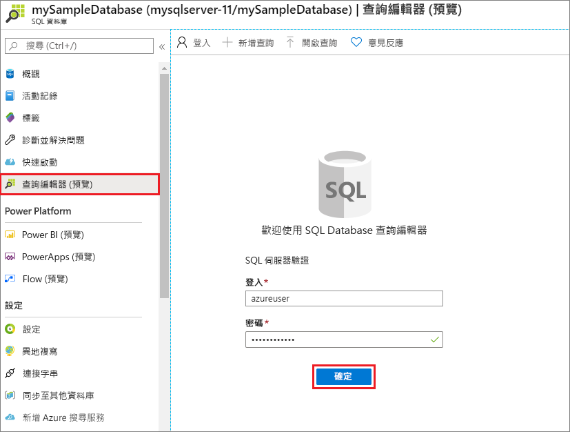
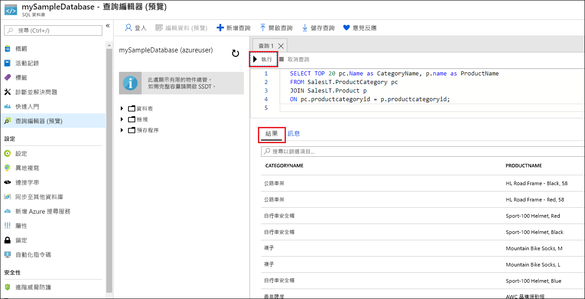

# <a name="quickstart-create-an-azure-sql-database-single-database"></a>快速入門：建立 Azure SQL Database 單一資料庫

在本快速入門中，您可以使用 Azure 入口網站、PowerShell 指令碼或 Azure CLI 指令碼來建立 Azure SQL Database 單一資料庫。 接著，您可以使用 Azure 入口網站中的**查詢編輯器**來查詢資料庫。 

[單一資料庫](sql-database-single-database.md)是最快速且最簡單的 Azure SQL Database 部署選項。 您可以在指定 Azure 區域中的 [Azure 資源群組](../azure-resource-manager/management/overview.md) 內，管理 [SQL Database 伺服器](sql-database-servers.md)中的單一資料庫。 在本快速入門中，您會為新的資料庫建立新的資源群組和 SQL 伺服器。

您可以在「已佈建」  或「無伺服器」  的計算層中建立單一資料庫。 已佈建的資料庫會預先配置固定數量的計算資源 (包括 CPU 和記憶體)，並使用兩種[購買模型](sql-database-purchase-models.md)的其中一種。 本快速入門會使用[以虛擬核心為基礎的購買模型](sql-database-service-tiers-vcore.md)來建立已佈建的資料庫，但您也可以選擇[以 DTU 為基礎的模型](sql-database-service-tiers-DTU.md)。 

無伺服器計算層僅適用於以虛擬核心為基礎的購買模型，而且具有自動調整的計算資源範圍，包括 CPU 和記憶體。 若要在無伺服器計算層中建立單一資料庫，請參閱[建立無伺服器資料庫](sql-database-serverless.md#create-new-database-in-serverless-compute-tier)。

## <a name="prerequisite"></a>必要條件

- 有效的 Azure 訂用帳戶。 如果您沒有訂用帳戶，請[建立免費帳戶](https://azure.microsoft.com/free/)。 

## <a name="create-a-single-database"></a>建立單一資料庫

[!INCLUDE [sql-database-create-single-database](includes/sql-database-create-single-database.md)]

## <a name="query-the-database"></a>查詢資料庫

資料庫建好之後，您可以使用 Azure 入口網站內建的**查詢編輯器**連線到資料庫，並查詢資料。

1. 在入口網站中，搜尋並選取 [SQL 資料庫]  ，然後從清單中選取您的資料庫。
1. 在資料庫的 [SQL Database]  頁面上，選取左側功能表中的 [查詢編輯器 (預覽)]  。
1. 輸入您的伺服器系統管理員登入資訊，然後選取 [確定]  。
   
   

1. 在 [查詢編輯器]  窗格中輸入下列查詢。

   ```sql
   SELECT TOP 20 pc.Name as CategoryName, p.name as ProductName
   FROM SalesLT.ProductCategory pc
   JOIN SalesLT.Product p
   ON pc.productcategoryid = p.productcategoryid;
   ```

1. 選取 [執行]  ，然後在 [結果]  窗格中檢閱查詢結果。

   

1. 關閉 [查詢編輯器]  頁面，並在系統提示是否要捨棄未儲存的編輯時選取 [確定]  。

## <a name="clean-up-resources"></a>清除資源

請保留資源群組、伺服器和單一資料庫，以繼續進行後續步驟，並了解如何使用不同的方法來連線及查詢您的資料庫。

當您使用完這些資源時，您可以刪除所建立的資源群組，而這也會刪除其中的伺服器和單一資料庫。

### <a name="portal"></a>[入口網站](#tab/azure-portal)

使用 Azure 入口網站來刪除 **myResourceGroup** 和其所有資源：

1. 在入口網站中，搜尋並選取 [資源群組]  ，然後從清單中選取 [myResourceGroup]  。
1. 在 [資源群組] 頁面中，選取 [刪除資源群組]  。
1. 在 [輸入資源群組名稱]  底下，輸入 myResourceGroup  ，然後選取 [刪除]  。

### <a name="azure-cli"></a>[Azure CLI](#tab/azure-cli)

若要刪除資源群組及其所有資源，請使用您的資源組名稱來執行下列 Azure CLI 命令：

```azurecli-interactive
az group delete --name <your resource group>
```

### <a name="powershell"></a>[PowerShell](#tab/azure-powershell)

若要刪除資源群組及其所有資源，請使用您的資源組名稱來執行下列 PowerShell Cmdlet：

```azurepowershell-interactive
Remove-AzResourceGroup -Name <your resource group>
```

---

## <a name="next-steps"></a>後續步驟

使用不同的工具和語言來[連線及查詢](sql-database-connect-query.md)您的資料庫：
> [!div class="nextstepaction"]
> [使用 SQL Server Management Studio 進行連線和查詢](sql-database-connect-query-ssms.md)
> 
> [使用 Azure Data Studio 進行連線及查詢](/sql/azure-data-studio/quickstart-sql-database?toc=/azure/sql-database/toc.json)
