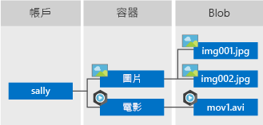
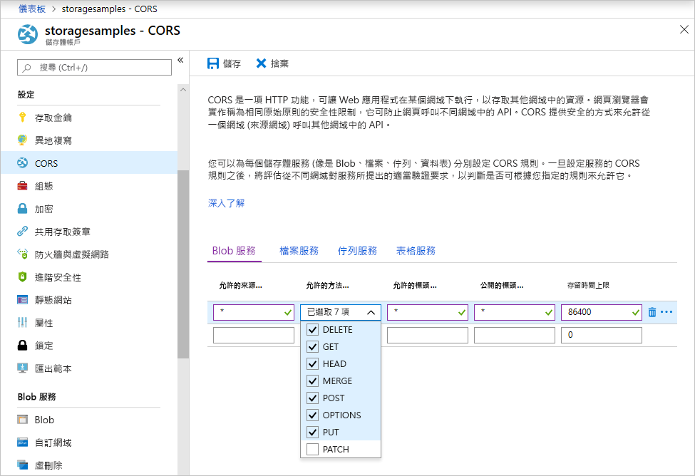

<!-- Customer intent: As a web application developer I want to interface with Azure Blob storage entirely on the client so that I can build a SPA application that is able to upload and delete files on blob storage. -->

# <a name="quickstart-manage-blobs-with-javascript-v12-sdk-in-a-browser"></a>快速入門：在瀏覽器中使用 JavaScript v12 SDK 來管理 Blob

Azure Blob 儲存體經過最佳化，能妥善儲存大量的非結構化資料。 Blob 是可保存文字或二進位資料的物件，包括影像、文件、串流媒體和封存資料。 在本快速入門中，您將了解如何在瀏覽器中使用 JavaScript 來管理 Blob。 您將上傳和列出 Blob，並將建立和刪除容器。

其他資源：

* [API 參考文件](/javascript/api/@azure/storage-blob)
* [程式庫原始程式碼](https://github.com/Azure/azure-sdk-for-js/tree/master/sdk/storage/storage-blob)
* [套件 (npm)](https://www.npmjs.com/package/@azure/storage-blob)
* [範例](../common/storage-samples-javascript.md?toc=%2fazure%2fstorage%2fblobs%2ftoc.json#blob-samples)

## <a name="prerequisites"></a>必要條件

* [具有有效訂用帳戶的 Azure 帳戶](https://azure.microsoft.com/free/?ref=microsoft.com&utm_source=microsoft.com&utm_medium=docs&utm_campaign=visualstudio)
* [Azure 儲存體帳戶](../common/storage-account-create.md)
* [Node.js](https://nodejs.org)
* [Microsoft Visual Studio Code](https://code.visualstudio.com)
* 可用於瀏覽器偵錯的 Visual Studio Code 擴充功能，例如：
    * [適用於 Microsoft Edge 的偵錯工具](https://marketplace.visualstudio.com/items?itemName=msjsdiag.debugger-for-edge)
    * [適用於 Chrome 的偵錯工具](https://marketplace.visualstudio.com/items?itemName=msjsdiag.debugger-for-chrome)
    * [適用於 Firefox 的偵錯工具](https://marketplace.visualstudio.com/items?itemName=firefox-devtools.vscode-firefox-debug)


[!INCLUDE [storage-multi-protocol-access-preview](../../../includes/storage-multi-protocol-access-preview.md)]

## <a name="object-model"></a>物件模型

Blob 儲存體提供三種類型資源：

* 儲存體帳戶
* 儲存體帳戶中的容器
* 容器中的 Blob

下圖顯示資源之間的關係。



在本快速入門中，您將使用下列 JavaScript 類別與這些資源互動：

* [BlobServiceClient](/javascript/api/@azure/storage-blob/blobserviceclient)：`BlobServiceClient` 類別可讓您操作 Azure 儲存體資源和 Blob 容器。
* [ContainerClient](/javascript/api/@azure/storage-blob/containerclient)：`ContainerClient` 類別可讓您操作 Azure 儲存體容器及其 Blob。
* [BlockBlobClient](/javascript/api/@azure/storage-blob/blockblobclient)：`BlockBlobClient` 類別可讓您操作 Azure 儲存體 Blob。

## <a name="setting-up"></a>設定

本節會引導您準備專案以搭配適用於 JavaScript 的 Azure Blob 儲存體用戶端程式庫 v12 使用。

### <a name="create-a-cors-rule"></a>建立 CORS 規則

您必須先設定帳戶以啟用[跨原始資源共用](/rest/api/storageservices/cross-origin-resource-sharing--cors--support-for-the-azure-storage-services) (或簡稱為 CORS)，Web 應用程式才可從用戶端存取 Blob 儲存體。

在 Azure 入口網站中，選取您的儲存體帳戶。 若要定義新的 CORS 規則，請瀏覽至 [設定] 區段，然後選取 [CORS]。 在此快速入門中，您會建立開啟的 CORS 規則：



下表說明每個 CORS 設定以及用來定義規則的值。

|設定  |值  | 描述 |
|---------|---------|---------|
| **允許的原始來源** | **\** _ | 接受設為可接受原始來源之網域的逗號分隔清單。 將值設為 `_` 時，會允許所有網域存取儲存體帳戶。 |
| **允許的方法** | **DELETE**、**GET**、**HEAD**、**MERGE**、**POST**、**OPTIONS** 和 **PUT** | 列出可對儲存體帳戶執行的 HTTP 動詞。 基於此快速入門的用途，請選取所有可用選項。 |
| **允許的標頭** | **\** _ | 定義儲存體帳戶所允許的要求標頭清單 (包括帶有前置詞的標頭)。 將值設為 `_`，會允許所有標頭存取。 |
| **公開的標頭** | **\** _ | 列出帳戶允許的回應標頭。 將值設為 `_`，會允許帳戶傳送任何標頭。 |
| **存留期上限** | **86400** | 瀏覽器快取預檢 OPTIONS 要求的時間量上限 (以秒為單位)。 值為 *86400* 時，會允許快取保留一天。 |

在您使用此表格中的值填入欄位之後，請按一下 [儲存] 按鈕。

> [!IMPORTANT]
> 請確定您在生產環境中使用的任何設定，都只會公開對您的儲存體帳戶所需的最低存取數量，以維護安全存取。 此處所說明的 CORS 設定定義的是寬鬆的安全性原則，適用於快速入門。 不過，不建議將這些設定用於實際的環境中。

### <a name="create-a-shared-access-signature"></a>建立共用存取簽章

在瀏覽器中執行的程式碼會使用共用存取簽章 (SAS) 來授權 Azure Blob 儲存體要求。 藉由使用 SAS，用戶端不需要帳戶存取金鑰或連接字串，即可為儲存體資源的存取授權。 如需 SAS 的詳細資訊，請參閱[使用共用存取簽章 (SAS)](../common/storage-sas-overview.md)。

請遵循下列步驟來取得 Blob 服務 SAS URL：

1. 在 Azure 入口網站中，選取您的儲存體帳戶。
2. 瀏覽至 [設定] 區段，然後選取 [共用存取簽章]。
3. 向下捲動，然後按一下 [產生 SAS 與連接字串] 按鈕。
4. 進一步向下捲動並找出 [Blob 服務 SAS URL] 欄位
5. 按一下 [Blob 服務 SAS URL] 欄位最右側的 [複製到剪貼簿] 按鈕。
6. 將複製的 URL 儲存在某處，以便在後續的步驟中使用。

### <a name="add-the-azure-blob-storage-client-library"></a>新增 Azure Blob 儲存體用戶端程式庫

在您的本機電腦上，建立名為 *azure-blobs-js-browser* 的新資料夾，然後在 Visual Studio Code 中加以開啟。

選取 [檢視] > [終端]，以在 Visual Studio Code 中開啟主控台視窗。 在終端視窗中執行下列 Node.js 套件管理員 (npm) 命令，以建立 [package.json](https://docs.npmjs.com/files/package.json) 檔案。

```console
npm init -y
```

Azure SDK 是由許多不同的套件所組成。 您可根據想要使用的服務，選擇所需的套件。 在終端視窗中執行下列 `npm` 命令，以安裝 `@azure/storage-blob` 套件。

```console
npm install --save @azure/storage-blob
```

#### <a name="bundle-the-azure-blob-storage-client-library"></a>搭配 Azure Blob 儲存體用戶端程式庫

若要在網站上使用 Azure SDK 程式庫，請將您的程式碼轉換為在瀏覽器內運作。 您可使用稱為搭配程式的工具來執行此作業。 搭配作業會採用以 [Node.js](https://nodejs.org) 慣例撰寫的 JavaScript 程式碼，並將其轉換成瀏覽器所理解的格式。 本快速入門文章使用 [Parcel](https://parceljs.org/) 搭配程式。

在終端視窗中執行下列 `npm` 命令以安裝 Parcel：

```console
npm install -g parcel-bundler
```

在 Visual Studio Code 中，開啟 package.json 檔案，然後在 `license` 與 `dependencies` 項目之間新增 `browserlist`。 此 `browserlist` 會以最新版的三個熱門瀏覽器為目標。 完整 package.json 檔案現在應如下所示：

:::code language="json" source="~/azure-storage-snippets/blobs/quickstarts/JavaScript/V12/azure-blobs-js-browser/package.json" highlight="12-16":::

儲存 package.json 檔案。

### <a name="import-the-azure-blob-storage-client-library"></a>匯入 Azure Blob 儲存體用戶端程式庫

若要在 JavaScript 中使用 Azure SDK 程式庫，請匯入 `@azure/storage-blob` 套件。 在含有下列 JavaScript 程式碼的 Visual Studio Code 中，建立新的檔案。

:::code language="javascript" source="~/azure-storage-snippets/blobs/quickstarts/JavaScript/V12/azure-blobs-js-browser/index.js" id="snippet_ImportLibrary":::

將檔案儲存為 azure-blobs-js-browser 目錄中的 index.js。

### <a name="implement-the-html-page"></a>實作 HTML 網頁

在 Visual Studio Code 中建立新檔案並新增下列 HTML 程式碼。

:::code language="html" source="~/azure-storage-snippets/blobs/quickstarts/JavaScript/V12/azure-blobs-js-browser/index.html":::

將檔案儲存為 azure-blobs-js-browser 資料夾中的 index.html。

## <a name="code-examples"></a>程式碼範例

此範例程式碼會示範如何使用適用於 JavaScript 的 Azure Blob 儲存體用戶端程式庫完成下列動作：

* [宣告 UI 元素的欄位](#declare-fields-for-ui-elements)
* [新增您的儲存體帳戶資訊](#add-your-storage-account-info)
* [建立用戶端物件](#create-client-objects)
* [建立及刪除儲存體容器](#create-and-delete-a-storage-container)
* [列出 Blob](#list-blobs)
* [上傳 Blob](#upload-blobs)
* [刪除 Blob](#delete-blobs)

將所有程式碼片段新增至 index.js 檔案之後，您將會執行程式碼。

### <a name="declare-fields-for-ui-elements"></a>宣告 UI 元素的欄位

在 index.js 檔案的結尾加入下列程式碼。

:::code language="JavaScript" source="~/azure-storage-snippets/blobs/quickstarts/JavaScript/V12/azure-blobs-js-browser/index.js" id="snippet_DeclareVariables":::

儲存 index.js 檔案。

此程式碼會宣告每個 HTML 元素的欄位，並實作 `reportStatus` 函式來顯示輸出。

在下列各節中，您會將每個新的 JavaScript 程式碼區塊加在前一個區塊後面。

### <a name="add-your-storage-account-info"></a>新增您的儲存體帳戶資訊

新增程式碼以存取您的儲存體帳戶。 將預留位置取代為您稍早產生的 Blob 服務 SAS URL。 在 index.js 檔案的結尾加入下列程式碼。

:::code language="javascript" source="~/azure-storage-snippets/blobs/quickstarts/JavaScript/V12/azure-blobs-js-browser/index.js" id="snippet_StorageAcctInfo":::

儲存 index.js 檔案。

### <a name="create-client-objects"></a>建立用戶端物件

建立 [BlobServiceClient](/javascript/api/@azure/storage-blob/blobserviceclient) 和 [ContainerClient](/javascript/api/@azure/storage-blob/containerclient) 物件，以便與 Azure Blob 儲存體服務互動。 在 index.js 檔案的結尾加入下列程式碼。

:::code language="javascript" source="~/azure-storage-snippets/blobs/quickstarts/JavaScript/V12/azure-blobs-js-browser/index.js" id="snippet_CreateClientObjects":::

儲存 index.js 檔案。

### <a name="create-and-delete-a-storage-container"></a>建立及刪除儲存體容器

在您按一下網頁上對應的按鈕時，建立和刪除儲存體容器。 在 index.js 檔案的結尾加入下列程式碼。

:::code language="javascript" source="~/azure-storage-snippets/blobs/quickstarts/JavaScript/V12/azure-blobs-js-browser/index.js" id="snippet_CreateDeleteContainer":::

儲存 index.js 檔案。

### <a name="list-blobs"></a>列出 Blob

在您按一下 [列出檔案] 按鈕時，列出儲存體容器的內容。 在 index.js 檔案的結尾加入下列程式碼。

:::code language="javascript" source="~/azure-storage-snippets/blobs/quickstarts/JavaScript/V12/azure-blobs-js-browser/index.js" id="snippet_ListBlobs":::

儲存 index.js 檔案。

此程式碼會呼叫 [ContainerClient.listBlobsFlat](/javascript/api/@azure/storage-blob/containerclient#listblobsflat-containerlistblobsoptions-) 函式，然後使用迭代器來擷取每個傳回的 [BlobItem](/javascript/api/@azure/storage-blob/blobitem) 名稱。 對於每個 `BlobItem`，其會使用 [name](/javascript/api/@azure/storage-blob/blobitem#name) 屬性值來更新 [檔案] 清單。

### <a name="upload-blobs"></a>上傳 Blob

在您按一下 [選取並上傳檔案] 按鈕時，將檔案上傳至儲存體容器。 在 index.js 檔案的結尾加入下列程式碼。

:::code language="javascript" source="~/azure-storage-snippets/blobs/quickstarts/JavaScript/V12/azure-blobs-js-browser/index.js" id="snippet_UploadBlobs":::

儲存 index.js 檔案。

此程式碼會將 [選取並上傳檔案]  按鈕連結到隱藏的 `file-input` 元素。 `click` 按鈕事件會觸發 `click` 檔案輸入事件，並顯示檔案選擇器。 當您選取檔案並關閉對話方塊後，`input` 事件就會發生，並呼叫 `uploadFiles` 函式。 此函式會建立 [BlockBlobClient](/javascript/api/@azure/storage-blob/blockblobclient) 物件，然後針對您選取的每個檔案呼叫瀏覽器專用的 [uploadBrowserData](/javascript/api/@azure/storage-blob/blockblobclient#uploadbrowserdata-blob---arraybuffer---arraybufferview--blockblobparalleluploadoptions-) 函式。 每次呼叫都會傳回 `Promise`。 每個 `Promise` 都會新增至一份清單，使其能夠全部一起等候，這麼一來，檔案就能平行地上傳。

### <a name="delete-blobs"></a>刪除 Blob

在您按一下 [刪除選取的檔案] 按鈕時，從儲存體容器中刪除檔案。 在 index.js 檔案的結尾加入下列程式碼。

:::code language="javascript" source="~/azure-storage-snippets/blobs/quickstarts/JavaScript/V12/azure-blobs-js-browser/index.js" id="snippet_DeleteBlobs":::

儲存 index.js 檔案。

此程式碼會呼叫 [ContainerClient.deleteBlob](/javascript/api/@azure/storage-blob/containerclient#deleteblob-string--blobdeleteoptions-)函式來移除清單中選定的每個檔案。 然後呼叫稍早說明的 `listFiles` 函式，來重新整理 **檔案** 清單的內容。

## <a name="run-the-code"></a>執行程式碼

若要在 Visual Studio Code 偵錯工具內執行程式碼，請為您的瀏覽器設定 launch.json 檔案。

### <a name="configure-the-debugger"></a>設定偵錯工具

若要在 Visual Studio Code 中設定偵錯工具擴充功能：

1. 選取 [執行] > [新增組態]。
2. 視您稍早在[必要條件](#prerequisites)一節中安裝的擴充功能而定，選取 [Edge]、[Chrome] 或 [Firefox]。

新增組態就會建立 launch.json 檔案並在編輯器中加以開啟。 修改 launch.json 檔案，讓 `url` 值成為 `http://localhost:1234/index.html`，如下所示：

:::code language="json" source="~/azure-storage-snippets/blobs/quickstarts/JavaScript/V12/azure-blobs-js-browser/.vscode/launch.json" highlight="11":::

更新之後，儲存 launch.json 檔案。 此組態會告訴 Visual Studio Code 要開啟哪一個瀏覽器和要載入哪一個 URL。

### <a name="launch-the-web-server"></a>啟動 Web 伺服器

若要啟動本機開發 Web 伺服器，請選取 [檢視] > [終端]以在 Visual Studio Code 內開啟主控台視窗，然後輸入下列命令。

```console
parcel index.html
```

Parcel 會搭配您的程式碼，並且在 `http://localhost:1234/index.html` 為您的網頁啟動本機開發伺服器。 每當您儲存檔案時，您對 index.js 所做的變更將會自動建立並反映在開發伺服器上。

如果您收到一則訊息，指出 **無法使用已設定的連接埠 1234**，您可執行 `parcel -p <port#> index.html` 命令來變更連接埠。 在 launch.json 檔案中，更新 URL 路徑中要符合的連接埠。

### <a name="start-debugging"></a>開始偵錯

在偵錯工具中執行頁面並了解 Blob 儲存體的運作方式。 如果發生任何錯誤，網頁上的 [狀態] 窗格會顯示所收到的錯誤訊息。

若要在已連結 Visual Studio Code 偵錯工具的瀏覽器中開啟 index.html，請選取 [執行] > [開始偵錯]，或在 Visual Studio Code 中按 F5。

### <a name="use-the-web-app"></a>執行 Web 應用程式

在 [Azure 入口網站](https://portal.azure.com)中，您可依照下列步驟來確認 API 呼叫的結果。

#### <a name="step-1---create-a-container"></a>步驟 1 - 建立容器

1. 在 Web 應用程式中，選取 [建立容器]。 狀態指出已建立容器。
2. 若要在 Azure 入口網站中確認，請選取您的儲存體帳戶。 在 [Blob 服務] 之下，選取 [容器]。 確認新的容器是否出現。 (您可能需要選取 [重新整理]。)

#### <a name="step-2---upload-a-blob-to-the-container"></a>步驟 2 - 將 Blob 上傳至容器

1. 在您的本機電腦上，建立並儲存測試檔案，例如 test.txt。
2. 在 Web 應用程式中，按一下 [選取並上傳檔案]。
3. 瀏覽至您的測試檔案，然後選取 [開啟]。 狀態指出檔案已上傳，並已擷取檔案清單。
4. 在 Azure 入口網站中，選取您稍早建立的新容器名稱。 確認測試檔案是否出現。

#### <a name="step-3---delete-the-blob"></a>步驟 3 - 刪除 Blob

1. 在 Web 應用程式的 [檔案] 之下，選取測試檔案。
2. 選取 [刪除選取的檔案]。 狀態指出檔案已刪除，且容器未包含任何檔案。
3. 在 Azure 入口網站中，選取 [重新整理]。 確認您看到 [找不到任何 Blob]。

#### <a name="step-4---delete-the-container"></a>步驟 4 - 刪除容器

1. 在 Web 應用程式中，選取 [刪除容器]。 狀態指出容器已刪除。
2. 在 Azure 入口網站中，選取入口網站窗格左上角的 [ **\<account-name\> | 容器**] 連結。
3. 選取 [重新整理]。 新的容器隨即消失。
4. 關閉 Web 應用程式。

### <a name="clean-up-resources"></a>清除資源

按一下 Visual Studio Code 中的 [終端] 主控台，然後按 CTRL + C 來停止網頁伺服器。

若要清除本快速入門建立的資源，請移至 [Azure 入口網站](https://portal.azure.com)並刪除您在[必要條件](#prerequisites)一節中建立的資源群組。

## <a name="next-steps"></a>後續步驟

在本快速入門中，您已了解如何使用 JavaScript 上傳、列出及刪除 Blob。 您也了解如何建立和刪除 Blob 儲存體容器。

如需教學課程、範例、快速入門及其他文件，請瀏覽：

> [!div class="nextstepaction"]
> [Azure for JavaScript 文件](/azure/developer/javascript/)

* 若要深入了解，請參閱[適用於 JavaScript 的 Azure Blob 儲存體用戶端程式庫](https://github.com/Azure/azure-sdk-for-js/blob/master/sdk/storage/storage-blob)。
* 若要查看 Blob 儲存體範例應用程式，請繼續執行 [Azure Blob 儲存體用戶端程式庫 v12 JavaScript 範例](https://github.com/Azure/azure-sdk-for-js/tree/master/sdk/storage/storage-blob/samples)。