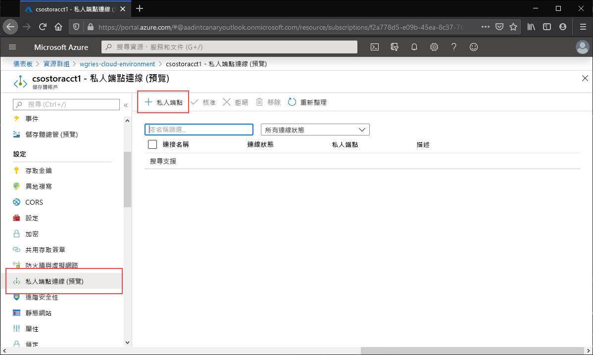
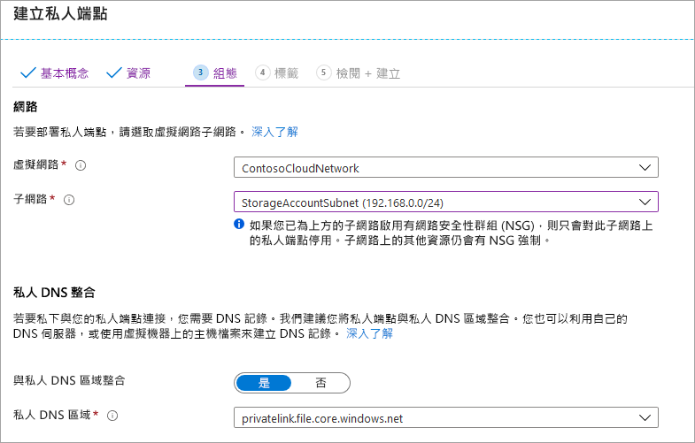

# <a name="configuring-azure-files-network-endpoints"></a>設定 Azure 檔案儲存體網路端點
Azure 檔案儲存體提供兩種主要的端點類型來存取 Azure 檔案共用： 
- 公用端點，具有公用 IP 位址，並可從全球任何地方存取。
- 私人端點，存在於虛擬網路內，並具有該虛擬網路位址空間內的私人 IP 位址。

公用和私人端點都存在於 Azure 儲存體帳戶上。 儲存體帳戶是一種管理構造，所代表的是儲存體的共用集區，您可以在此集區中部署多個檔案共用，以及其他儲存體資源 (例如，Blob 容器或佇列)。

本文著重於如何設定儲存體帳戶的端點，以便直接存取 Azure 檔案共用。 本文件中提供的大部分詳細資料，也適用於了解 Azure 檔案同步如何與儲存體帳戶的公用及私人端點相互操作，但如需有關 Azure 檔案同步部署的網路考慮詳細資訊，請參閱[設定 Azure 檔案同步 Proxy 和防火牆設定](storage-sync-files-firewall-and-proxy.md)。

閱讀本操作說明指南之前，建議您先閱讀 [Azure 檔案儲存體的網路功能可量](storage-files-networking-overview.md)。

## <a name="prerequisites"></a>Prerequisites
- 本文會假設您已經建立 Azure 訂用帳戶。 如果您還沒有訂用帳戶，則先建立[免費帳戶](https://azure.microsoft.com/free/?WT.mc_id=A261C142F)，再開始操作。
- 本文會假設在您想從內部部署環境連線的儲存體帳戶中，您已建立 Azure 檔案共用。 若要了解如何建立 Azure 檔案共用，請參閱[建立 Azure 檔案共用](storage-how-to-create-file-share.md)。
- 如果您想要使用 Azure PowerShell，請[安裝最新版本](https://docs.microsoft.com/powershell/azure/install-az-ps)。
- 如果您想要使用 Azure CLI，請[安裝最新版本](https://docs.microsoft.com/cli/azure/install-azure-cli?view=azure-cli-latest)。

## <a name="create-a-private-endpoint"></a>建立私人端點
為您的儲存體帳戶建立私人端點時會部署下列 Azure 資源：

- **私人端點**：代表儲存體帳戶私人端點的 Azure 資源。 您可以將此視為連線儲存體帳戶和網路介面的資源。
- **網路介面 (NIC)** ：維護指定虛擬網路/子網路中私人 IP 位址的網路介面。 這與您部署虛擬機器時所部署的資源完全相同，但此資源不會指派給 VM，而是由私人端點所擁有。
- **私人 DNS 區域**：如果您之前從未對此虛擬網路部署過私人端點，系統將會為虛擬網路部署新的私人 DNS 區域。 同時也會為此 DNS 區域中的儲存體帳戶建立 DNS A 記錄。 如果您已在此虛擬網路中部署私人端點，新的儲存體帳戶 A 記錄將會新增至現有 DNS 區域。 部署 DNS 區域是選擇性的，但強烈建議您部署，而且如果您使用 AD 服務主體或 FileREST API 來掛接 Azure 檔案共用，則這是必要動作。

> [!Note]  
> 本文會針對 Azure 公用區域使用儲存體帳戶 DNS 尾碼 `core.windows.net`。 此註解也適用於 Azure 主權雲端 (例如 Azure 美國政府雲端和 Azure 中國雲端)，只需替換為適合您環境的尾碼即可。 

# <a name="portal"></a>[入口網站](#tab/azure-portal)
瀏覽至您想要為其建立私人端點的儲存體帳戶。 在儲存體帳戶的目錄中，選取 [私人端點連線]  和 [+ 私人端點]  ，以建立新的私人端點。 



產生的精靈會有多個頁面需要完成。

在 [基本]  刀鋒視窗中，為您的私人端點選取所需的資源群組、名稱和區域。 您可以任意選取這些項目，而不一定要與儲存體帳戶相符，但您建立私人端點的所在區域，必須與您要在其中建立私人端點的虛擬網路相同。

![此螢幕擷取畫面顯示 [建立私人端點] 區段的 [基本] 區段](media/storage-files-networking-endpoints/create-private-endpoint-1.png)

在 [資源]  索引標籤上，選取 [連線到我目錄中的 Azure 資源]  的選項按鈕。 在 [資源類型]  底下，選取 [Microsoft.Storage/storageAccounts]  作為 [資源類型]。 [資源]  欄位是您要連線到的 Azure 檔案共用所屬的儲存體帳戶。 目標子資源是**檔案**，因為這是用於 Azure 檔案儲存體的。

[設定]  刀鋒視窗可讓您選取要新增私人端點的特定虛擬網路和子網路。 選取您先前建立的虛擬網路。 您必須選取與先前新增了服務端點的子網路不同的子網路。 [設定] 刀鋒視窗也包含用來建立/更新私人 DNS 區域的資訊。 我們建議您使用預設的 `privatelink.file.core.windows.net` 區域。



按一下 [檢閱 + 建立]  以建立私人端點。 

如果您的虛擬網路內有虛擬機器，或已依照[此處](storage-files-networking-dns.md)所述的方式設定 DNS 轉送，您可以從 PowerShell、命令列或終端機執行下列命令，測試您的私人端點是否已正確設定 (適用於 Windows、Linux 或 macOS)。 您必須將 `<storage-account-name>` 取代為適當的儲存體帳戶名稱：

```
nslookup <storage-account-name>.file.core.windows.net
```

如果一切都已成功運作，您應該會看到下列輸出，其中 `192.168.0.5` 是虛擬網路中私人端點的私人 IP 位址 (Windows 版的輸出)：

```Output
Server:  UnKnown
Address:  10.2.4.4

Non-authoritative answer:
Name:    storageaccount.privatelink.file.core.windows.net
Address:  192.168.0.5
Aliases:  storageaccount.file.core.windows.net
```

# <a name="powershell"></a>[PowerShell](#tab/azure-powershell)
若要為您的儲存體帳戶建立私人端點，您必須先取得儲存體帳戶的參考，以及您要新增私人端點的虛擬網路子網路。 取代下列 `<storage-account-resource-group-name>`、`<storage-account-name>`、`<vnet-resource-group-name>`、`<vnet-name>` 和 `<vnet-subnet-name>`：

```PowerShell
$storageAccountResourceGroupName = "<storage-account-resource-group-name>"
$storageAccountName = "<storage-account-name>"
$virtualNetworkResourceGroupName = "<vnet-resource-group-name>"
$virtualNetworkName = "<vnet-name>"
$subnetName = "<vnet-subnet-name>"

# Get storage account reference, and throw error if it doesn't exist
$storageAccount = Get-AzStorageAccount `
        -ResourceGroupName $storageAccountResourceGroupName `
        -Name $storageAccountName `
        -ErrorAction SilentlyContinue

if ($null -eq $storageAccount) {
    $errorMessage = "Storage account $storageAccountName not found "
    $errorMessage += "in resource group $storageAccountResourceGroupName."
    Write-Error -Message $errorMessage -ErrorAction Stop
}

# Get virtual network reference, and throw error if it doesn't exist
$virtualNetwork = Get-AzVirtualNetwork `
        -ResourceGroupName $virtualNetworkResourceGroupName `
        -Name $virtualNetworkName `
        -ErrorAction SilentlyContinue

if ($null -eq $virtualNetwork) {
    $errorMessage = "Virtual network $virtualNetworkName not found "
    $errorMessage += "in resource group $virtualNetworkResourceGroupName."
    Write-Error -Message $errorMessage -ErrorAction Stop
}

# Get reference to virtual network subnet, and throw error if it doesn't exist
$subnet = $virtualNetwork | `
    Select-Object -ExpandProperty Subnets | `
    Where-Object { $_.Name -eq $subnetName }

if ($null -eq $subnet) {
    Write-Error `
            -Message "Subnet $subnetName not found in virtual network $virtualNetworkName." `
            -ErrorAction Stop
}
```

若要建立私人端點，您必須對儲存體帳戶建立私人連結服務連線。 私人連結服務連線是建立私人端點時的輸入項目。 

```PowerShell
# Disable private endpoint network policies
$subnet.PrivateEndpointNetworkPolicies = "Disabled"
$virtualNetwork | Set-AzVirtualNetwork | Out-Null

# Create a private link service connection to the storage account.
$privateEndpointConnection = New-AzPrivateLinkServiceConnection `
        -Name "$storageAccountName-Connection" `
        -PrivateLinkServiceId $storageAccount.Id `
        -GroupId "file"

# Create a new private endpoint.
$privateEndpoint = New-AzPrivateEndpoint `
        -ResourceGroupName $storageAccountResourceGroupName `
        -Name "$storageAccountName-PrivateEndpoint" `
        -Location $virtualNetwork.Location `
        -Subnet $subnet `
        -PrivateLinkServiceConnection $privateEndpointConnection `
        -ErrorAction Stop
```

建立 Azure 私人 DNS 區域可讓儲存體帳戶的原始名稱 (例如 `storageaccount.file.core.windows.net`) 解析為虛擬網路內的私人 IP。 雖然從建立私人端點的角度來看，這是選擇性項目，但使用 AD 使用者主體來掛接 Azure 檔案共用或透過 REST API 來存取時，這確實是必要項目。  

```PowerShell
# Get the desired storage account suffix (core.windows.net for public cloud).
# This is done like this so this script will seamlessly work for non-public Azure.
$storageAccountSuffix = Get-AzContext | `
    Select-Object -ExpandProperty Environment | `
    Select-Object -ExpandProperty StorageEndpointSuffix

# For public cloud, this will generate the following DNS suffix:
# privatelink.file.core.windows.net.
$dnsZoneName = "privatelink.file.$storageAccountSuffix"

# Find a DNS zone matching desired name attached to this virtual network.
$dnsZone = Get-AzPrivateDnsZone | `
    Where-Object { $_.Name -eq $dnsZoneName } | `
    Where-Object {
        $privateDnsLink = Get-AzPrivateDnsVirtualNetworkLink `
                -ResourceGroupName $_.ResourceGroupName `
                -ZoneName $_.Name `
                -ErrorAction SilentlyContinue
        
        $privateDnsLink.VirtualNetworkId -eq $virtualNetwork.Id
    }

if ($null -eq $dnsZone) {
    # No matching DNS zone attached to virtual network, so create new one.
    $dnsZone = New-AzPrivateDnsZone `
            -ResourceGroupName $virtualNetworkResourceGroupName `
            -Name $dnsZoneName `
            -ErrorAction Stop

    $privateDnsLink = New-AzPrivateDnsVirtualNetworkLink `
            -ResourceGroupName $virtualNetworkResourceGroupName `
            -ZoneName $dnsZoneName `
            -Name "$virtualNetworkName-DnsLink" `
            -VirtualNetworkId $virtualNetwork.Id `
            -ErrorAction Stop
}
```

現在您已有私人 DNS 區域的參考，接下來您必須為儲存體帳戶建立 A 記錄。

```PowerShell
$privateEndpointIP = $privateEndpoint | `
    Select-Object -ExpandProperty NetworkInterfaces | `
    Select-Object @{ 
        Name = "NetworkInterfaces"; 
        Expression = { Get-AzNetworkInterface -ResourceId $_.Id } 
    } | `
    Select-Object -ExpandProperty NetworkInterfaces | `
    Select-Object -ExpandProperty IpConfigurations | `
    Select-Object -ExpandProperty PrivateIpAddress

$privateDnsRecordConfig = New-AzPrivateDnsRecordConfig `
        -IPv4Address $privateEndpointIP

New-AzPrivateDnsRecordSet `
        -ResourceGroupName $virtualNetworkResourceGroupName `
        -Name $storageAccountName `
        -RecordType A `
        -ZoneName $dnsZoneName `
        -Ttl 600 `
        -PrivateDnsRecords $privateDnsRecordConfig `
        -ErrorAction Stop | `
    Out-Null
```

如果您的虛擬網路內有虛擬機器，或已依照[此處](storage-files-networking-dns.md)所述的方式設定 DNS 轉送，您可以透過下列命令來測試您的私人端點是否已正確設定：

```PowerShell
$storageAccountHostName = [System.Uri]::new($storageAccount.PrimaryEndpoints.File) | `
    Select-Object -ExpandProperty Host

Resolve-DnsName -Name $storageAccountHostName
```

如果一切都已成功運作，您應該會看到下列輸出，其中 `192.168.0.5` 是虛擬網路中私人端點的私人 IP 位址：

```Output
Name                             Type   TTL   Section    NameHost
----                             ----   ---   -------    --------
storageaccount.file.core.windows CNAME  60    Answer     storageaccount.privatelink.file.core.windows.net
.net

Name       : storageaccount.privatelink.file.core.windows.net
QueryType  : A
TTL        : 600
Section    : Answer
IP4Address : 192.168.0.5
```

# <a name="azure-cli"></a>[Azure CLI](#tab/azure-cli)
若要為您的儲存體帳戶建立私人端點，您必須先取得儲存體帳戶的參考，以及您要新增私人端點的虛擬網路子網路。 取代下列 `<storage-account-resource-group-name>`、`<storage-account-name>`、`<vnet-resource-group-name>`、`<vnet-name>` 和 `<vnet-subnet-name>`：

```bash
storageAccountResourceGroupName="<storage-account-resource-group-name>"
storageAccountName="<storage-account-name>"
virtualNetworkResourceGroupName="<vnet-resource-group-name>"
virtualNetworkName="<vnet-name>"
subnetName="<vnet-subnet-name>"

# Get storage account ID 
storageAccount=$(az storage account show \
        --resource-group $storageAccountResourceGroupName \
        --name $storageAccountName \
        --query "id" | \
    tr -d '"')

# Get virtual network ID
virtualNetwork=$(az network vnet show \
        --resource-group $virtualNetworkResourceGroupName \
        --name $virtualNetworkName \
        --query "id" | \
    tr -d '"')

# Get subnet ID
subnet=$(az network vnet subnet show \
        --resource-group $virtualNetworkResourceGroupName \
        --vnet-name $virtualNetworkName \
        --name $subnetName \
        --query "id" | \
    tr -d '"')
```

若要建立私人端點，您必須先確定子網路的私人端點網路原則已設定為停用。 然後，您可以使用 `az network private-endpoint create` 命令來建立私人端點

```bash
# Disable private endpoint network policies
az network vnet subnet update \
        --ids $subnet \
        --disable-private-endpoint-network-policies \
        --output none

# Get virtual network location
region=$(az network vnet show \
        --ids $virtualNetwork \
        --query "location" | \
    tr -d '"')

# Create a private endpoint
privateEndpoint=$(az network private-endpoint create \
        --resource-group $virtualNetworkResourceGroupName \
        --name "$storageAccountName-PrivateEndpoint" \
        --location $region \
        --subnet $subnet \
        --private-connection-resource-id $storageAccount \
        --group-ids "file" \
        --connection-name "$storageAccountName-Connection" \
        --query "id" | \
    tr -d '"')
```

建立 Azure 私人 DNS 區域可讓儲存體帳戶的原始名稱 (例如 `storageaccount.file.core.windows.net`) 解析為虛擬網路內的私人 IP。 雖然從建立私人端點的角度來看，這是選擇性項目，但使用 AD 使用者主體來掛接 Azure 檔案共用或透過 REST API 來存取時，這確實是必要項目。  

```bash
# Get the desired storage account suffix (core.windows.net for public cloud).
# This is done like this so this script will seamlessly work for non-public Azure.
storageAccountSuffix=$(az cloud show \
        --query "suffixes.storageEndpoint" | \
    tr -d '"')

# For public cloud, this will generate the following DNS suffix:
# privatelink.file.core.windows.net.
dnsZoneName="privatelink.file.$storageAccountSuffix"

# Find a DNS zone matching desired name attached to this virtual network.
possibleDnsZones=$(az network private-dns zone list \
        --query "[?name == '$dnsZoneName'].id" \
        --output tsv)

for possibleDnsZone in $possibleDnsZones
do
    possibleResourceGroupName=$(az resource show \
            --ids $possibleDnsZone \
            --query "resourceGroup" | \
        tr -d '"')
    
    link=$(az network private-dns link vnet list \
            --resource-group $possibleResourceGroupName \
            --zone-name $dnsZoneName \
            --query "[?virtualNetwork.id == '$virtualNetwork'].id" \
            --output tsv)
    
    if [ -z $link ]
    then
        1 > /dev/null
    else 
        dnsZoneResourceGroup=$possibleResourceGroupName
        dnsZone=$possibleDnsZone
        break
    fi  
done

if [ -z $dnsZone ]
then
    # No matching DNS zone attached to virtual network, so create a new one
    dnsZone=$(az network private-dns zone create \
            --resource-group $virtualNetworkResourceGroupName \
            --name $dnsZoneName \
            --query "id" | \
        tr -d '"')
    
    az network private-dns link vnet create \
            --resource-group $resourceGroupName \
            --zone-name $zoneName \
            --name "$virtualNetworkName-DnsLink" \
            --virtual-network $virtualNetwork \
            --registration-enabled false \
            --output none
fi
```

現在您已有私人 DNS 區域的參考，接下來您必須為儲存體帳戶建立 A 記錄。

```bash
privateEndpointNIC=$(az network private-endpoint show \
        --ids $privateEndpoint \
        --query "networkInterfaces[0].id" | \
    tr -d '"')

privateEndpointIP=$(az network nic show \
        --ids $privateEndpointNIC \
        --query "ipConfigurations[0].privateIpAddress" | \
    tr -d '"')

az network private-dns record-set a create \
        --resource-group $dnsZoneResourceGroup \
        --zone-name $dnsZoneName \
        --name $storageAccountName \
        --output none

az network private-dns record-set a add-record \
        --resource-group $dnsZoneResourceGroup \
        --zone-name $dnsZoneName \
        --record-set-name $storageAccountName \
        --ipv4-address $privateEndpointIP \
        --output none
```

如果您的虛擬網路內有虛擬機器，或已依照[此處](storage-files-networking-dns.md)所述的方式設定 DNS 轉送，您可以透過下列命令來測試您的私人端點是否已正確設定：

```bash
httpEndpoint=$(az storage account show \
        --resource-group $storageAccountResourceGroupName \
        --name $storageAccountName \
        --query "primaryEndpoints.File" | \
    tr -d '"')

hostName=$(echo $httpEndpoint | cut -c7-$(expr length $httpEndpoint) | tr -d "/")
nslookup $hostName
```

如果一切都已成功運作，您應該會看到下列輸出，其中 `192.168.0.5` 是虛擬網路中私人端點的私人 IP 位址：

```Output
Server:         127.0.0.53
Address:        127.0.0.53#53

Non-authoritative answer:
storageaccount.file.core.windows.net      canonical name = storageaccount.privatelink.file.core.windows.net.
Name:   storageaccount.privatelink.file.core.windows.net
Address: 192.168.0.5
```

---

## <a name="restrict-access-to-the-public-endpoint"></a>限制公用端點的存取
您可以使用儲存體帳戶防火牆設定來限制公用端點的存取。 一般而言，大部分的儲存體帳戶防火牆原則都會將網路存取限制在一或多個虛擬網路內。 有兩種方法可以將對於儲存體帳戶的存取限制在虛擬網路內：

- [為儲存體帳戶建立一個或多個私人端點](#create-a-private-endpoint)，並限制所有對公用端點的存取。 這可確保只有來自所要虛擬網路內的流量，才能存取儲存體帳戶內的 Azure 檔案共用。
- 將公用端點限制在一或多個虛擬網路內。 其運作方式是使用稱為「服務端點」  的虛擬網路功能。 當您透過服務端點來限制流往儲存體帳戶的流量時，您仍然可以透過公用 IP 位址來存取儲存體帳戶。

### <a name="restrict-all-access-to-the-public-endpoint"></a>限制公用端點的所有存取
當公用端點的所有存取都受到限制時，您仍然可以透過其本身的私人端點來存取儲存體帳戶。 否則，以儲存體帳戶公用端點為目標的有效要求將會遭到拒絕。 

# <a name="portal"></a>[入口網站](#tab/azure-portal)
瀏覽至您想要對其限制所有公用端點存取的儲存體帳戶。 在儲存體帳戶的目錄中，選取 [防火牆和虛擬網路]  。

在頁面頂端，選取 [選取的網路]  選項按鈕。 這會將一些設定取消隱藏，以控制公用端點的限制。 請核取 [允許受信任的 Microsoft 服務存取此服務帳戶]  ，以允許受信任的第一方 Microsoft 服務 (例如 Azure 檔案同步) 來存取儲存體帳戶。


# <a name="powershell"></a>[PowerShell](#tab/azure-powershell)
下列 PowerShell 命令會拒絕所有傳送至儲存體帳戶公用端點的流量。 請注意，此命令會將 `-Bypass` 參數設定為 `AzureServices`。 這會允許受信任的第一方服務 (例如 Azure 檔案同步) 透過公用端點存取儲存體帳戶。

```PowerShell
# This assumes $storageAccount is still defined from the beginning of this of this guide.
$storageAccount | Update-AzStorageAccountNetworkRuleSet `
        -DefaultAction Deny `
        -Bypass AzureServices `
        -WarningAction SilentlyContinue `
        -ErrorAction Stop | `
    Out-Null
```

# <a name="azure-cli"></a>[Azure CLI](#tab/azure-cli)
下列 CLI 命令會拒絕所有傳送至儲存體帳戶公用端點的流量。 請注意，此命令會將 `-bypass` 參數設定為 `AzureServices`。 這會允許受信任的第一方服務 (例如 Azure 檔案同步) 透過公用端點存取儲存體帳戶。

```bash
# This assumes $storageAccountResourceGroupName and $storageAccountName 
# are still defined from the beginning of this guide.
az storage account update \
    --resource-group $storageAccountResourceGroupName \
    --name $storageAccountName \
    --bypass "AzureServices" \
    --default-action "Deny" \
    --output none
```
---

### <a name="restrict-access-to-the-public-endpoint-to-specific-virtual-networks"></a>將公用端點的存取限制在特定虛擬網路
如果您將儲存體帳戶限制為允許特定虛擬網路的存取，表示您允許來自指定虛擬網路內的公用端點要求。 其運作方式是使用稱為「服務端點」  的虛擬網路功能。 這可以搭配使用或不搭配使用私人端點。

# <a name="portal"></a>[入口網站](#tab/azure-portal)
瀏覽至您想要將其公用端點限制為特定虛擬網路的儲存體帳戶。 在儲存體帳戶的目錄中，選取 [防火牆和虛擬網路]  。 

在頁面頂端，選取 [選取的網路]  選項按鈕。 這會將一些設定取消隱藏，以控制公用端點的限制。 按一下 [+ 新增現有虛擬網路]  ，以選取已允許透過公用端點存取儲存體帳戶的特定虛擬網路。 這將需要選取虛擬網路和該虛擬網路的子網路。 

請核取 [允許受信任的 Microsoft 服務存取此服務帳戶]  ，以允許受信任的第一方 Microsoft 服務 (例如 Azure 檔案同步) 來存取儲存體帳戶。

![[防火牆和虛擬網路] 刀鋒視窗的螢幕擷取畫面，其中包含允許透過公用端點存取儲存體帳戶的特定虛擬網路](media/storage-files-networking-endpoints/restrict-public-endpoint-1.png)

# <a name="powershell"></a>[PowerShell](#tab/azure-powershell)
若要使用服務端點來將儲存體帳戶的公用端點存取限制為特定虛擬網路，我們必須先收集儲存體帳戶和虛擬網路的相關資訊。 填入 `<storage-account-resource-group>`、`<storage-account-name>`、`<vnet-resource-group-name>`、`<vnet-name>` 和 `<subnet-name>` 以收集這些資訊。

```PowerShell
$storageAccountResourceGroupName = "<storage-account-resource-group>"
$storageAccountName = "<storage-account-name>"
$restrictToVirtualNetworkResourceGroupName = "<vnet-resource-group-name>"
$restrictToVirtualNetworkName = "<vnet-name>"
$subnetName = "<subnet-name>"

$storageAccount = Get-AzStorageAccount `
        -ResourceGroupName $storageAccountResourceGroupName `
        -Name $storageAccountName `
        -ErrorAction Stop

$virtualNetwork = Get-AzVirtualNetwork `
        -ResourceGroupName $restrictToVirtualNetworkResourceGroupName `
        -Name $restrictToVirtualNetworkName `
        -ErrorAction Stop

$subnet = $virtualNetwork | `
    Select-Object -ExpandProperty Subnets | `
    Where-Object { $_.Name -eq $subnetName }

if ($null -eq $subnet) {
    Write-Error `
            -Message "Subnet $subnetName not found in virtual network $restrictToVirtualNetworkName." `
            -ErrorAction Stop
}
```

為了讓 Azure 網路的網狀架構允許來自虛擬網路的流量，進而取得儲存體帳戶公用端點，虛擬網路的子網路必須公開 `Microsoft.Storage` 服務端點。 下列 PowerShell 命令會將 `Microsoft.Storage` 服務端點新增至子網路 (如果尚未新增)。

```PowerShell
$serviceEndpoints = $subnet | `
    Select-Object -ExpandProperty ServiceEndpoints | `
    Select-Object -ExpandProperty Service

if ($serviceEndpoints -notcontains "Microsoft.Storage") {
    if ($null -eq $serviceEndpoints) {
        $serviceEndpoints = @("Microsoft.Storage")
    } elseif ($serviceEndpoints -is [string]) {
        $serviceEndpoints = @($serviceEndpoints, "Microsoft.Storage")
    } else {
        $serviceEndpoints += "Microsoft.Storage"
    }

    $virtualNetwork = $virtualNetwork | Set-AzVirtualNetworkSubnetConfig `
            -Name $subnetName `
            -AddressPrefix $subnet.AddressPrefix `
            -ServiceEndpoint $serviceEndpoints `
            -WarningAction SilentlyContinue `
            -ErrorAction Stop | `
        Set-AzVirtualNetwork `
            -ErrorAction Stop
}
```

限制儲存體帳戶流量的最後一個步驟是建立網路規則，並將其新增至儲存體帳戶的網路規則集。

```PowerShell
$networkRule = $storageAccount | Add-AzStorageAccountNetworkRule `
    -VirtualNetworkResourceId $subnet.Id `
    -ErrorAction Stop

$storageAccount | Update-AzStorageAccountNetworkRuleSet `
        -DefaultAction Deny `
        -Bypass AzureServices `
        -VirtualNetworkRule $networkRule `
        -WarningAction SilentlyContinue `
        -ErrorAction Stop | `
    Out-Null
```

# <a name="azure-cli"></a>[Azure CLI](#tab/azure-cli)
若要使用服務端點來將儲存體帳戶的公用端點存取限制為特定虛擬網路，我們必須先收集儲存體帳戶和虛擬網路的相關資訊。 填入 `<storage-account-resource-group>`、`<storage-account-name>`、`<vnet-resource-group-name>`、`<vnet-name>` 和 `<subnet-name>` 以收集這些資訊。

```bash
storageAccountResourceGroupName="<storage-account-resource-group>"
storageAccountName="<storage-account-name>"
restrictToVirtualNetworkResourceGroupName="<vnet-resource-group-name>"
restrictToVirtualNetworkName="<vnet-name>"
subnetName="<subnet-name>"

storageAccount=$(az storage account show \
        --resource-group $storageAccountResourceGroupName \
        --name $storageAccountName \
        --query "id" | \
    tr -d '"')

virtualNetwork=$(az network vnet show \
        --resource-group $restrictToVirtualNetworkResourceGroupName \
        --name $restrictToVirtualNetworkName \
        --query "id" | \
    tr -d '"')

subnet=$(az network vnet subnet show \
        --resource-group $restrictToVirtualNetworkResourceGroupName \
        --vnet-name $restrictToVirtualNetworkName \
        --name $subnetName \
        --query "id" | \
    tr -d '"')
```

為了讓 Azure 網路的網狀架構允許來自虛擬網路的流量，進而取得儲存體帳戶公用端點，虛擬網路的子網路必須公開 `Microsoft.Storage` 服務端點。 下列 CLI 命令會將 `Microsoft.Storage` 服務端點新增至子網路 (如果尚未新增)。

```bash
serviceEndpoints=$(az network vnet subnet show \
        --resource-group $restrictToVirtualNetworkResourceGroupName \
        --vnet-name $restrictToVirtualNetworkName \
        --name $subnetName \
        --query "serviceEndpoints[].service" \
        --output tsv)

foundStorageServiceEndpoint=false
for serviceEndpoint in $serviceEndpoints
do
    if [ $serviceEndpoint = "Microsoft.Storage" ]
    then
        foundStorageServiceEndpoint=true
    fi
done

if [ $foundStorageServiceEndpoint = false ] 
then
    serviceEndpointList=""

    for serviceEndpoint in $serviceEndpoints
    do
        serviceEndpointList+=$serviceEndpoint
        serviceEndpointList+=" "
    done
    
    serviceEndpointList+="Microsoft.Storage"

    az network vnet subnet update \
            --ids $subnet \
            --service-endpoints $serviceEndpointList \
            --output none
fi
```

限制儲存體帳戶流量的最後一個步驟是建立網路規則，並將其新增至儲存體帳戶的網路規則集。

```bash
az storage account network-rule add \
        --resource-group $storageAccountResourceGroupName \
        --account-name $storageAccountName \
        --subnet $subnet \
        --output none

az storage account update \
        --resource-group $storageAccountResourceGroupName \
        --name $storageAccountName \
        --bypass "AzureServices" \
        --default-action "Deny" \
        --output none
```

---

## <a name="see-also"></a>另請參閱
- [Azure 檔案儲存體的網路功能考量](storage-files-networking-overview.md)
- [設定 Azure 檔案儲存體的 DNS 轉送](storage-files-networking-dns.md)
- [設定 Azure 檔案儲存體的 S2S VPN](storage-files-configure-s2s-vpn.md)