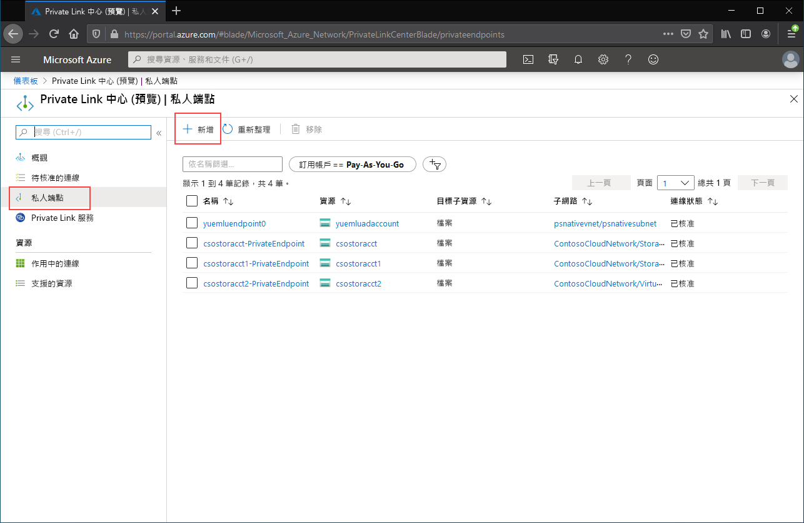

# <a name="configuring-azure-file-sync-network-endpoints"></a>設定 Azure 檔案同步網路端點
Azure 檔案儲存體和 Azure 檔案同步提供兩種主要類型的端點，用來存取 Azure 檔案共用： 
- 公用端點，具有公用 IP 位址，並可從全球任何地方存取。
- 私人端點，存在於虛擬網路內，並具有該虛擬網路位址空間內的私人 IP 位址。

對於 Azure 檔案儲存體和 Azure 檔案同步，分別是 Azure 管理物件、儲存體帳戶和儲存體同步服務，可控制公用和私人端點。 儲存體帳戶是一種管理建構，代表共用的儲存體集區，您可以在其中部署多個檔案共用，以及其他儲存體資源 (例如 Blob 容器或佇列)。 儲存體同步服務是一種管理建構，代表已註冊的伺服器，這是具有與 Azure 檔案同步建立的信任關係的 Windows 檔案伺服器，以及定義同步關聯性拓撲的同步群組。 

本文著重於如何設定 Azure 檔案儲存體和 Azure 檔案同步的網路端點。若要深入瞭解如何設定網路端點以直接存取 Azure 檔案共用，而不是藉由 Azure 檔案同步快取內部部署，請參閱 [設定 Azure 檔案儲存體網路端點](storage-files-networking-endpoints.md)。

閱讀本操作說明指南之前，建議您先閱讀 [Azure 檔案同步網路功能考量](storage-sync-files-networking-overview.md)。

## <a name="prerequisites"></a>必要條件 
本文假設：
- 您有 Azure 訂用帳戶。 如果您還沒有訂用帳戶，則先建立[免費帳戶](https://azure.microsoft.com/free/?WT.mc_id=A261C142F)，再開始操作。
- 您已在儲存體帳戶中建立 Azure 檔案共用，而您想要從內部部署環境連線至該檔案共用。 若要了解如何建立 Azure 檔案共用，請參閱[建立 Azure 檔案共用](storage-how-to-create-file-share.md)。
- 您已建立儲存體同步服務，並向其註冊您的 Windows 檔案伺服器。 若要瞭解如何部署 Azure 檔案同步，請參閱 [部署 Azure 檔案同步](storage-sync-files-deployment-guide.md)。

此外：
- 如果您想要使用 Azure PowerShell，請[安裝最新版本](https://docs.microsoft.com/powershell/azure/install-az-ps)。
- 如果您想要使用 Azure CLI，請[安裝最新版本](https://docs.microsoft.com/cli/azure/install-azure-cli?view=azure-cli-latest)。

## <a name="create-the-private-endpoints"></a>建立私人端點
當您建立 Azure 資源的私人端點時，便會部署下列資源：

- **私人端點**：Azure 資源，是指儲存體帳戶或儲存體同步服務的私人端點。 您可以將此視為連線 Azure 資源和網路介面的資源。
- **網路介面 (NIC)** ：維護指定虛擬網路/子網路中私人 IP 位址的網路介面。 這與您部署虛擬機器時所部署的資源完全相同，但此資源不會指派給 VM，而是由私人端點所擁有。
- **私人 DNS 區域**：如果您之前從未對此虛擬網路部署過私人端點，系統將會為虛擬網路部署新的私人 DNS 區域。 此 DNS 區域中的 Azure 資源也會建立 DNS A 記錄。 如果您已在此虛擬網路中部署私人端點，將會在現有的 DNS 區域中新增一筆 Azure 資源記錄。 部署 DNS 區域是選擇性的，但強烈建議您簡化所需的 DNS 管理。

> [!Note]  
> 本文使用適用於 Azure 公用區域的 DNS 尾碼、適用於儲存體帳戶的 `core.windows.net`，以及儲存體同步服務的 `afs.azure.net`。 此註解也適用於 Azure 主權雲端 (例如 Azure 美國政府雲端)，只需替換為適合您環境的尾碼即可。

### <a name="create-the-storage-account-private-endpoint"></a>建立儲存體帳戶的私人端點
# <a name="portal"></a>[入口網站](#tab/azure-portal)
[!INCLUDE [storage-files-networking-endpoints-private-portal](../../../includes/storage-files-networking-endpoints-private-portal.md)]

如果您的虛擬網路中有虛擬機器，或已依照 [設定 Azure 檔案儲存體的 DNS 轉送](storage-files-networking-dns.md) 其中所述來設定 DNS 轉送，您便可透過 PowerShell、命令列或終端機 (適用於 Windows、Linux 或 macOS) 執行下列命令，藉此測試您的私人端點是否已正確設定。 您必須將 `<storage-account-name>` 取代為適當的儲存體帳戶名稱：

```
nslookup <storage-account-name>.file.core.windows.net
```

如果一切都已成功運作，您應該會看到下列輸出，其中 `192.168.0.5` 是虛擬網路中私人端點的私人 IP 位址 (Windows 版的輸出)：

```Output
Server:  UnKnown
Address:  10.2.4.4

Non-authoritative answer:
Name:    storageaccount.privatelink.file.core.windows.net
Address:  192.168.0.5
Aliases:  storageaccount.file.core.windows.net
```

# <a name="powershell"></a>[PowerShell](#tab/azure-powershell)
[!INCLUDE [storage-files-networking-endpoints-private-powershell](../../../includes/storage-files-networking-endpoints-private-powershell.md)]

如果您的虛擬網路內有虛擬機器，或已如 [設定 Azure 檔案儲存體的 DNS 轉送](storage-files-networking-dns.md) 其中所述來設定 DNS 轉送，您便可藉由下列命令來測試您的私人端點是否已正確設定：

```PowerShell
$storageAccountHostName = [System.Uri]::new($storageAccount.PrimaryEndpoints.file) | `
    Select-Object -ExpandProperty Host

Resolve-DnsName -Name $storageAccountHostName
```

如果一切都已成功運作，您應該會看到下列輸出，其中 `192.168.0.5` 是虛擬網路中私人端點的私人 IP 位址：

```Output
Name                             Type   TTL   Section    NameHost
----                             ----   ---   -------    --------
storageaccount.file.core.windows CNAME  60    Answer     storageaccount.privatelink.file.core.windows.net
.net

Name       : storageaccount.privatelink.file.core.windows.net
QueryType  : A
TTL        : 600
Section    : Answer
IP4Address : 192.168.0.5
```

# <a name="azure-cli"></a>[Azure CLI](#tab/azure-cli)
[!INCLUDE [storage-files-networking-endpoints-private-cli](../../../includes/storage-files-networking-endpoints-private-cli.md)]

如果您的虛擬網路內有虛擬機器，或已如 [設定 Azure 檔案儲存體的 DNS 轉送](storage-files-networking-dns.md) 其中所述來設定 DNS 轉送，您便可藉由下列命令來測試您的私人端點是否已正確設定：

```bash
httpEndpoint=$(az storage account show \
        --resource-group $storageAccountResourceGroupName \
        --name $storageAccountName \
        --query "primaryEndpoints.file" | \
    tr -d '"')

hostName=$(echo $httpEndpoint | cut -c7-$(expr length $httpEndpoint) | tr -d "/")
nslookup $hostName
```

如果一切都已成功運作，您應該會看到下列輸出，其中 `192.168.0.5` 是虛擬網路中私人端點的私人 IP 位址：

```Output
Server:         127.0.0.53
Address:        127.0.0.53#53

Non-authoritative answer:
storageaccount.file.core.windows.net      canonical name = storageaccount.privatelink.file.core.windows.net.
Name:   storageaccount.privatelink.file.core.windows.net
Address: 192.168.0.5
```

---

### <a name="create-the-storage-sync-private-endpoint"></a>建立儲存體同步私人端點
> [!Important]  
> 若要在儲存體同步服務資源上使用私人端點，您必須使用 Azure 檔案同步代理程式10.1 版或更新版本。 10.1 版之前的代理程式版本不支援儲存體同步服務上的私人端點。 所有先前的代理程式版本都支援儲存體帳戶資源上的私人端點。

# <a name="portal"></a>[入口網站](#tab/azure-portal)
在 Azure 入口網站頂端的搜尋列中輸入 *Private Link*，瀏覽至 **Private Link 中心**。 在 Private Link 中心的目錄中，選取 [私人端點]，然後 [+ 新增] 以建立新的私人端點。

[](media/storage-sync-files-networking-endpoints/create-storage-sync-private-endpoint-0.png#lightbox)

產生的精靈會有多個頁面需要完成。

在 [基本] 刀鋒視窗中，為您的私人端點選取所需的資源群組、名稱和區域。 這些可以是您想要的任何內容，而不一定要與儲存體同步服務相符，但您建立私人端點的所在區域，必須與您要在其中建立私人端點的虛擬網路相同。

![此螢幕擷取畫面顯示 [建立私人端點] 區段的 [基本] 區段](media/storage-sync-files-networking-endpoints/create-storage-sync-private-endpoint-1.png)

在 [資源] 索引標籤上，選取 [連線到我目錄中的 Azure 資源] 的選項按鈕。 在 [資源類型] 下，針對資源類型選取 [Microsoft.StorageSync/storageSyncServices]。 

[設定] 刀鋒視窗可讓您選取要新增私人端點的特定虛擬網路和子網路。 選取與您在上述儲存體帳戶中使用的相同虛擬網路。 [設定] 刀鋒視窗也包含用來建立/更新私人 DNS 區域的資訊。

按一下 [檢閱 + 建立] 以建立私人端點。

您可以透過 PowerShell 執行下列命令，以測試您的私人端點是否已正確設定。 

```powershell
$privateEndpointResourceGroupName = "<your-private-endpoint-resource-group>"
$privateEndpointName = "<your-private-endpoint-name>"

Get-AzPrivateEndpoint `
        -ResourceGroupName $privateEndpointResourceGroupName `
        -Name $privateEndpointName `
        -ErrorAction Stop | `
    Select-Object -ExpandProperty NetworkInterfaces | `
    Select-Object -ExpandProperty Id | `
    ForEach-Object { Get-AzNetworkInterface -ResourceId $_ } | `
    Select-Object -ExpandProperty IpConfigurations | `
    Select-Object -ExpandProperty PrivateLinkConnectionProperties | `
    Select-Object -ExpandProperty Fqdns | `
    ForEach-Object { Resolve-DnsName -Name $_ } | `
    Format-List
```

如果一切都正常運作，您應該會看到下列輸出，其中 `192.168.1.4`、`192.168.1.5`、`192.168.1.6`和 `192.168.1.7` 是指派給私人端點的私人 IP 位址：

```Output
Name     : mysssmanagement.westus2.afs.azure.net
Type     : CNAME
TTL      : 60
Section  : Answer
NameHost : mysssmanagement.westus2.privatelink.afs.azure.net


Name       : mysssmanagement.westus2.privatelink.afs.azure.net
QueryType  : A
TTL        : 60
Section    : Answer
IP4Address : 192.168.1.4

Name     : myssssyncp.westus2.afs.azure.net
Type     : CNAME
TTL      : 60
Section  : Answer
NameHost : myssssyncp.westus2.privatelink.afs.azure.net


Name       : myssssyncp.westus2.privatelink.afs.azure.net
QueryType  : A
TTL        : 60
Section    : Answer
IP4Address : 192.168.1.5

Name     : myssssyncs.westus2.afs.azure.net
Type     : CNAME
TTL      : 60
Section  : Answer
NameHost : myssssyncs.westus2.privatelink.afs.azure.net


Name       : myssssyncs.westus2.privatelink.afs.azure.net
QueryType  : A
TTL        : 60
Section    : Answer
IP4Address : 192.168.1.6

Name     : mysssmonitoring.westus2.afs.azure.net
Type     : CNAME
TTL      : 60
Section  : Answer
NameHost : mysssmonitoring.westus2.privatelink.afs.azure.net


Name       : mysssmonitoring.westus2.privatelink.afs.azure.net
QueryType  : A
TTL        : 60
Section    : Answer
IP4Address : 192.168.1.7

```

# <a name="powershell"></a>[PowerShell](#tab/azure-powershell)
若要針對儲存體同步服務建立私人端點，您必須先取得儲存體同步服務的參考。 請記得將 `<storage-sync-service-resource-group>` 和 `<storage-sync-service>` 取代為適用於您環境的正確值。 下列 PowerShell 命令會假設您所使用的項目，已填入上述的虛擬網路資訊。 

```powershell
$storageSyncServiceResourceGroupName = "<storage-sync-service-resource-group>"
$storageSyncServiceName = "<storage-sync-service>"

$storageSyncService = Get-AzStorageSyncService `
        -ResourceGroupName $storageSyncServiceResourceGroupName `
        -Name $storageSyncServiceName `
        -ErrorAction SilentlyContinue

if ($null -eq $storageSyncService) {
    $errorMessage = "Storage Sync Service $storageSyncServiceName not found "
    $errorMessage += "in resource group $storageSyncServiceResourceGroupName."
    Write-Error -Message $errorMessage -ErrorAction Stop
}
```

若要建立私人端點，您必須建立儲存體同步服務的私人連結服務連線。 私人連結連線是建立私人端點的輸入項目。

```PowerShell 
# Disable private endpoint network policies
$subnet.PrivateEndpointNetworkPolicies = "Disabled"
$virtualNetwork = $virtualNetwork | `
    Set-AzVirtualNetwork -ErrorAction Stop

# Create a private link service connection to the storage account.
$privateEndpointConnection = New-AzPrivateLinkServiceConnection `
        -Name "$storageSyncServiceName-Connection" `
        -PrivateLinkServiceId $storageSyncService.ResourceId `
        -GroupId "Afs" `
        -ErrorAction Stop

# Create a new private endpoint.
$privateEndpoint = New-AzPrivateEndpoint `
        -ResourceGroupName $storageSyncServiceResourceGroupName `
        -Name "$storageSyncServiceName-PrivateEndpoint" `
        -Location $virtualNetwork.Location `
        -Subnet $subnet `
        -PrivateLinkServiceConnection $privateEndpointConnection `
        -ErrorAction Stop
```

建立 Azure 私人 DNS 區域，可讓儲存體同步服務的主機名稱 (例如 `mysssmanagement.westus2.afs.azure.net`) 解析為虛擬網路中儲存體同步服務的正確私人 IP。 雖然從建立私人端點的角度來看，這是選擇性項目，但 Azure 檔案同步代理程式存取儲存體同步服務時，這確實是必要項目。 

```powershell
# Get the desired Storage Sync Service suffix (afs.azure.net for public cloud).
# This is done like this so this script will seamlessly work for non-public Azure.
$azureEnvironment = Get-AzContext | `
    Select-Object -ExpandProperty Environment | `
    Select-Object -ExpandProperty Name

switch($azureEnvironment) {
    "AzureCloud" {
        $storageSyncSuffix = "afs.azure.net"
    }

    "AzureUSGovernment" {
        $storageSyncSuffix = "afs.azure.us"
    }
    
    default {
        Write-Error 
                -Message "The Azure environment $_ is not currently supported by Azure File Sync." `
                -ErrorAction Stop
    }
}

# For public cloud, this will generate the following DNS suffix:
# privatelink.afs.azure.net
$dnsZoneName = "privatelink.$storageSyncSuffix"

# Find a DNS zone matching desired name attached to this virtual network.
$dnsZone = Get-AzPrivateDnsZone | `
    Where-Object { $_.Name -eq $dnsZoneName } | `
    Where-Object {
        $privateDnsLink = Get-AzPrivateDnsVirtualNetworkLink `
                -ResourceGroupName $_.ResourceGroupName `
                -ZoneName $_.Name `
                -ErrorAction SilentlyContinue
        
        $privateDnsLink.VirtualNetworkId -eq $virtualNetwork.Id
    }

if ($null -eq $dnsZone) {
    # No matching DNS zone attached to virtual network, so create new one.
    $dnsZone = New-AzPrivateDnsZone `
            -ResourceGroupName $virtualNetworkResourceGroupName `
            -Name $dnsZoneName `
            -ErrorAction Stop

    $privateDnsLink = New-AzPrivateDnsVirtualNetworkLink `
            -ResourceGroupName $virtualNetworkResourceGroupName `
            -ZoneName $dnsZoneName `
            -Name "$virtualNetworkName-DnsLink" `
            -VirtualNetworkId $virtualNetwork.Id `
            -ErrorAction Stop
}
```
現在您已有私人 DNS 區域的參考，接下來您必須為儲存體同步服務建立 A 記錄。

```PowerShell 
$privateEndpointIpFqdnMappings = $privateEndpoint | `
    Select-Object -ExpandProperty NetworkInterfaces | `
    Select-Object -ExpandProperty Id | `
    ForEach-Object { Get-AzNetworkInterface -ResourceId $_ } | `
    Select-Object -ExpandProperty IpConfigurations | `
    ForEach-Object { 
        $privateIpAddress = $_.PrivateIpAddress; 
        $_ | `
            Select-Object -ExpandProperty PrivateLinkConnectionProperties | `
            Select-Object -ExpandProperty Fqdns | `
            Select-Object `
                @{ 
                    Name = "PrivateIpAddress"; 
                    Expression = { $privateIpAddress } 
                }, `
                @{ 
                    Name = "FQDN"; 
                    Expression = { $_ } 
                } 
    }

foreach($ipFqdn in $privateEndpointIpFqdnMappings) {
    $privateDnsRecordConfig = New-AzPrivateDnsRecordConfig `
        -IPv4Address $ipFqdn.PrivateIpAddress
    
    $dnsEntry = $ipFqdn.FQDN.Substring(0, 
        $ipFqdn.FQDN.IndexOf(".", $ipFqdn.FQDN.IndexOf(".") + 1))

    New-AzPrivateDnsRecordSet `
            -ResourceGroupName $virtualNetworkResourceGroupName `
            -Name $dnsEntry `
            -RecordType A `
            -ZoneName $dnsZoneName `
            -Ttl 600 `
            -PrivateDnsRecords $privateDnsRecordConfig `
            -ErrorAction Stop | `
        Out-Null
}
```

# <a name="azure-cli"></a>[Azure CLI](#tab/azure-cli)
若要針對儲存體同步服務建立私人端點，您必須先取得儲存體同步服務的參考。 請記得將 `<storage-sync-service-resource-group>` 和 `<storage-sync-service>` 取代為適用於您環境的正確值。 下列 CLI 命令會假設您所使用的項目，已填入上述的虛擬網路資訊。 

```bash
storageSyncServiceResourceGroupName="<storage-sync-service-resource-group>"
storageSyncServiceName="<storage-sync-service>"

storageSyncService=$(az resource show \
        --resource-group $storageSyncServiceResourceGroupName \
        --name $storageSyncServiceName \
        --resource-type "Microsoft.StorageSync/storageSyncServices" \
        --query "id" | \
    tr -d '"')

storageSyncServiceRegion=$(az resource show \
        --resource-group $storageSyncServiceResourceGroupName \
        --name $storageSyncServiceName \
        --resource-type "Microsoft.StorageSync/storageSyncServices" \
        --query "location" | \
    tr -d '"')
```

若要建立私人端點，您必須先確定子網路的私人端點網路原則已設定為停用。 然後，您可以藉由 `az network private-endpoint create` 命令建立私人端點。

```bash
# Disable private endpoint network policies
az network vnet subnet update \
        --ids $subnet \
        --disable-private-endpoint-network-policies \
        --output none

# Get virtual network location
region=$(az network vnet show \
        --ids $virtualNetwork \
        --query "location" | \
    tr -d '"')

# Create a private endpoint
privateEndpoint=$(az network private-endpoint create \
        --resource-group $storageSyncServiceResourceGroupName \
        --name "$storageSyncServiceName-PrivateEndpoint" \
        --location $region \
        --subnet $subnet \
        --private-connection-resource-id $storageSyncService \
        --group-id "Afs" \
        --connection-name "$storageSyncServiceName-Connection" \
        --query "id" | \
    tr -d '"')
```

建立 Azure 私人 DNS 區域，可讓儲存體同步服務的主機名稱 (例如 `mysssmanagement.westus2.afs.azure.net`) 解析為虛擬網路中儲存體同步服務的正確私人 IP。 雖然從建立私人端點的角度來看，這是選擇性項目，但 Azure 檔案同步代理程式存取儲存體同步服務時，這確實是必要項目。 

```bash
# Get the desired storage account suffix (afs.azure.net for public cloud).
# This is done like this so this script will seamlessly work for non-public Azure.
azureEnvironment=$(az cloud show \
        --query "name" |
    tr -d '"')

storageSyncSuffix=""
if [ $azureEnvironment == "AzureCloud" ]
then
    storageSyncSuffix="afs.azure.net"
elif [ $azureEnvironment == "AzureUSGovernment" ]
then
    storageSyncSuffix="afs.azure.us"
else
    echo "Unsupported Azure environment $azureEnvironment."
fi

# For public cloud, this will generate the following DNS suffix:
# privatelinke.afs.azure.net.
dnsZoneName="privatelink.$storageSyncSuffix"

# Find a DNS zone matching desired name attached to this virtual network.
possibleDnsZones=""
possibleDnsZones=$(az network private-dns zone list \
        --query "[?name == '$dnsZoneName'].id" \
        --output tsv)

dnsZone=""
possibleDnsZone=""
for possibleDnsZone in $possibleDnsZones
do
    possibleResourceGroupName=$(az resource show \
            --ids $possibleDnsZone \
            --query "resourceGroup" | \
        tr -d '"')
    
    link=$(az network private-dns link vnet list \
            --resource-group $possibleResourceGroupName \
            --zone-name $dnsZoneName \
            --query "[?virtualNetwork.id == '$virtualNetwork'].id" \
            --output tsv)
    
    if [ -z $link ]
    then
        echo "1" > /dev/null
    else 
        dnsZoneResourceGroup=$possibleResourceGroupName
        dnsZone=$possibleDnsZone
        break
    fi  
done

if [ -z $dnsZone ]
then
    # No matching DNS zone attached to virtual network, so create a new one
    dnsZone=$(az network private-dns zone create \
            --resource-group $virtualNetworkResourceGroupName \
            --name $dnsZoneName \
            --query "id" | \
        tr -d '"')
    
    az network private-dns link vnet create \
            --resource-group $virtualNetworkResourceGroupName \
            --zone-name $dnsZoneName \
            --name "$virtualNetworkName-DnsLink" \
            --virtual-network $virtualNetwork \
            --registration-enabled false \
            --output none
    
    dnsZoneResourceGroup=$virtualNetworkResourceGroupName
fi
```

現在您已有私人 DNS 區域的參考，接下來您必須為儲存體同步服務建立 A 記錄。

```bash
privateEndpointNIC=$(az network private-endpoint show \
        --ids $privateEndpoint \
        --query "networkInterfaces[0].id" | \
    tr -d '"')

privateIpAddresses=$(az network nic show \
        --ids $privateEndpointNIC \
        --query "ipConfigurations[].privateIpAddress" \
        --output tsv) 

hostNames=$(az network nic show \
        --ids $privateEndpointNIC \
        --query "ipConfigurations[].privateLinkConnectionProperties.fqdns[]" \
        --output tsv)

i=0
for privateIpAddress in $privateIpAddresses
do
    j=0
    targetHostName=""
    for hostName in $hostNames
    do
        if [ $i == $j ]
        then
            targetHostName=$hostName
            break
        fi

        j=$(expr $j + 1)
    done

    endpointName=$(echo $targetHostName | \
        cut -c1-$(expr $(expr index $targetHostName ".") - 1))

    az network private-dns record-set a create \
        --resource-group $dnsZoneResourceGroup \
        --zone-name $dnsZoneName \
        --name "$endpointName.$storageSyncServiceRegion" \
        --output none
    
    az network private-dns record-set a add-record \
        --resource-group $dnsZoneResourceGroup \
        --zone-name $dnsZoneName \
        --record-set-name "$endpointName.$storageSyncServiceRegion" \
        --ipv4-address $privateIpAddress \
        --output none

    i=$(expr $i + 1)
done
```
---

## <a name="restrict-access-to-the-public-endpoints"></a>限制公用端點的存取
您可以限制對儲存體帳戶和儲存體同步服務的公用端點的存取。 限制公用端點存取可確保僅接受來自核准位置的網路封包，從而提供額外的安全性。 

### <a name="restrict-access-to-the-storage-account-public-endpoint"></a>限制對儲存體帳戶公用端點的存取
公用端點的存取限制是使用儲存體帳戶防火牆設定來完成。 一般而言，大部分的儲存體帳戶防火牆原則都會將網路存取限制在一或多個虛擬網路內。 有兩種方法可以將對於儲存體帳戶的存取限制在虛擬網路內：

- [建立儲存體帳戶的一或多個私人端點](#create-the-storage-account-private-endpoint) 並停用公用端點的存取權。 這可確保只有來自所要虛擬網路內的流量，才能存取儲存體帳戶內的 Azure 檔案共用。
- 將公用端點限制在一或多個虛擬網路內。 其運作方式是使用稱為「服務端點」的虛擬網路功能。 當您透過服務端點來限制流往儲存體帳戶的流量時，您仍然可以透過公用 IP 位址來存取儲存體帳戶。

#### <a name="disable-access-to-the-storage-account-public-endpoint"></a>停用儲存體帳戶公用端點的存取權
當公用端點的存取權停用時，仍然可以透過其私人端點來存取儲存體帳戶。 否則，以儲存體帳戶公用端點為目標的有效要求將會遭到拒絕。 

# <a name="portal"></a>[入口網站](#tab/azure-portal)
[!INCLUDE [storage-files-networking-endpoints-public-disable-portal](../../../includes/storage-files-networking-endpoints-public-disable-portal.md)]

# <a name="powershell"></a>[PowerShell](#tab/azure-powershell)
[!INCLUDE [storage-files-networking-endpoints-public-disable-powershell](../../../includes/storage-files-networking-endpoints-public-disable-powershell.md)]

# <a name="azure-cli"></a>[Azure CLI](#tab/azure-cli)
[!INCLUDE [storage-files-networking-endpoints-public-disable-cli](../../../includes/storage-files-networking-endpoints-public-disable-cli.md)]

---

#### <a name="restrict-access-to-the-storage-account-public-endpoint-to-specific-virtual-networks"></a>限制對特定虛擬網路的儲存體帳戶公用端點的存取
如果您將儲存體帳戶限制為允許特定虛擬網路的存取，表示您允許來自指定虛擬網路內的公用端點要求。 其運作方式是使用稱為「服務端點」的虛擬網路功能。 這可以搭配使用或不搭配使用私人端點。

# <a name="portal"></a>[入口網站](#tab/azure-portal)
[!INCLUDE [storage-files-networking-endpoints-public-restrict-portal](../../../includes/storage-files-networking-endpoints-public-restrict-portal.md)]

# <a name="powershell"></a>[PowerShell](#tab/azure-powershell)
[!INCLUDE [storage-files-networking-endpoints-public-restrict-powershell](../../../includes/storage-files-networking-endpoints-public-restrict-powershell.md)]

# <a name="azure-cli"></a>[Azure CLI](#tab/azure-cli)
[!INCLUDE [storage-files-networking-endpoints-public-restrict-cli](../../../includes/storage-files-networking-endpoints-public-restrict-cli.md)]

---

### <a name="disable-access-to-the-storage-sync-service-public-endpoint"></a>停用儲存體同步服務公用端點的存取權
Azure 檔案同步可讓您僅透過私人端點來限制對特定虛擬網路的存取；Azure 檔案同步不支援服務端點，以限制對特定虛擬網路的公用端點的存取。 這表示儲存體同步服務的公用端點的兩個狀態分別為「已啟用」和「已停用」。

# <a name="portal"></a>[入口網站](#tab/azure-portal)
這不可能通過 Azure 入口網站。 請選取 [Azure PowerShell] 或 [Azure CLI] 索引標籤指示，取得如何停用儲存體同步服務公用端點的相關指示。 

# <a name="powershell"></a>[PowerShell](#tab/azure-powershell)
若要停用對儲存體同步服務的公用端點的存取權，我們會將儲存體同步服務上的 `incomingTrafficPolicy` 屬性設定為 `AllowVirtualNetworksOnly`。 如果您想要啟用儲存體同步服務的公用端點的存取權，請改為將 `incomingTrafficPolicy` 設定為 `AllowAllTraffic`。 請記得取代 `<storage-sync-service-resource-group>` 和 `<storage-sync-service>`。

```powershell
$storageSyncServiceResourceGroupName = "<storage-sync-service-resource-group>"
$storageSyncServiceName = "<storage-sync-service>"

$storageSyncService = Get-AzResource `
        -ResourceGroupName $storageSyncServiceResourceGroupName `
        -ResourceName $storageSyncServiceName `
        -ResourceType "Microsoft.StorageSync/storageSyncServices"

$storageSyncService.Properties.incomingTrafficPolicy = "AllowVirtualNetworksOnly"
$storageSyncService = $storageSyncService | Set-AzResource -Confirm:$false -Force
```

# <a name="azure-cli"></a>[Azure CLI](#tab/azure-cli)
若要停用對儲存體同步服務的公用端點的存取權，我們會將儲存體同步服務上的 `incomingTrafficPolicy` 屬性設定為 `AllowVirtualNetworksOnly`。 如果您想要啟用儲存體同步服務的公用端點的存取權，請改為將 `incomingTrafficPolicy` 設定為 `AllowAllTraffic`。 請記得取代 `<storage-sync-service-resource-group>` 和 `<storage-sync-service>`。

```bash
storageSyncServiceResourceGroupName="<storage-sync-service-resource-group>"
storageSyncServiceName="<storage-sync-service>"

az resource update \
        --resource-group $storageSyncServiceResourceGroupName \
        --name $storageSyncServiceName \
        --resource-type "Microsoft.StorageSync/storageSyncServices" \
        --set "properties.incomingTrafficPolicy=AllowVirtualNetworksOnly" \
        --output none
```
---

## <a name="see-also"></a>另請參閱
- [規劃 Azure 檔案同步部署](storage-sync-files-planning.md)
- [部署 Azure 檔案同步](storage-sync-files-deployment-guide.md)
