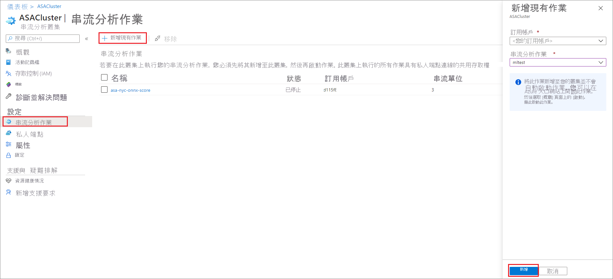
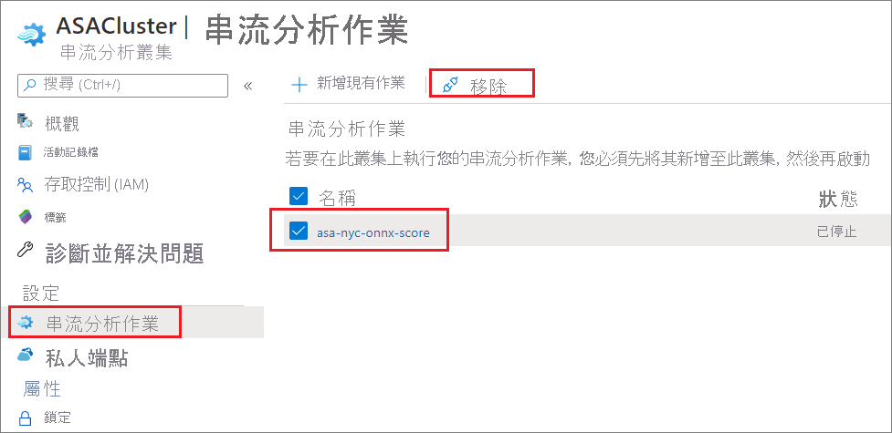

# 在 Azure 串流分析叢集中新增和移除作業

您可以在串流分析叢集上執行多個 Azure 串流分析作業。 只需簡單的 2 步驟程序，就可在叢集上執行作業：將作業新增至叢集並啟動作業。 本文說明如何從現有的叢集中新增和移除作業。 遵循快速入門以[建立串流分析叢集](create-cluster.md) (如果您還沒有串流分析叢集)。

## 將串流分析作業新增至叢集

只有現有的串流分析作業可以新增至叢集。 遵循快速入門以[了解如何使用 Azure 入口網站建立作業](stream-analytics-quick-create-portal.md)。 一旦您有要新增至叢集的作業，請使用下列步驟將作業新增至您的叢集。

1. 在 Azure 入口網站中，找出並選取您的串流分析叢集。

1. 在 **設定** 下，選取 [串流分析作業]。 接著選取 [新增現有作業]。

1. 選取您要新增至叢集的訂用帳戶和串流分析作業。 只能將與叢集位於相同區域中的串流分析作業新增至叢集。

   

1. 將作業新增至叢集之後，瀏覽至作業資源並[啟動作業](start-job.md#azure-portal)。 作業接著會開始在您的叢集上執行。

您可以從串流分析作業資源頁面執行其他所有作業，例如監視、警示和診斷記錄。

## 從叢集移除串流分析作業

串流分析作業必須處於已停止狀態，才能從叢集中移除。 如果您的作業仍在執行中，請先停止作業，再繼續進行下列步驟。

1. 找出並選取您的串流分析叢集。

1. 在 **設定** 下，選取 [串流分析作業]。

1. 選取您要從這個叢集中移除的作業，然後選取 [移除] 。

   

   從串流分析叢集移除作業時，該作業會回到標準的多租用戶環境。

## 後續步驟

您現在已了解如何在 Azure 串流分析叢集中新增和移除作業。 接下來，您可以學習如何管理私人端點和調整您的叢集：

* [縮放 Azure 串流分析叢集](scale-cluster.md)
* [在 Azure 串流分析叢集中管理私人端點](private-endpoints.md)
