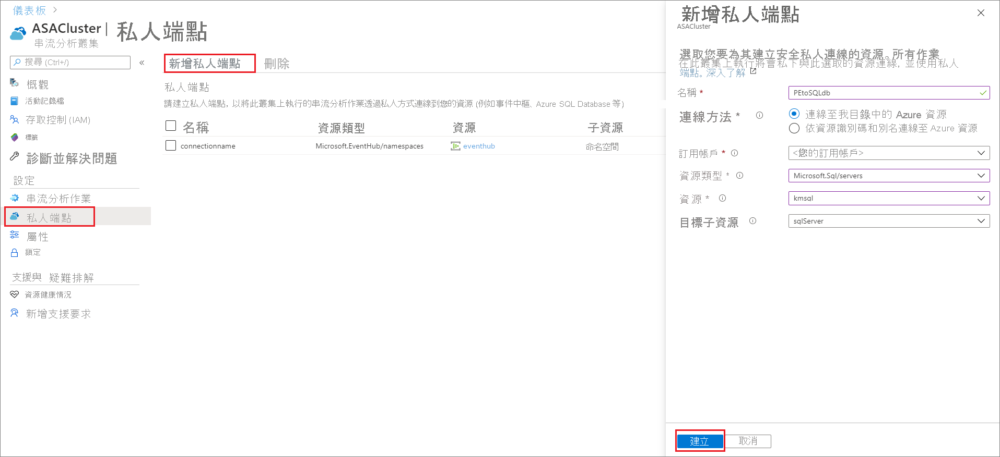
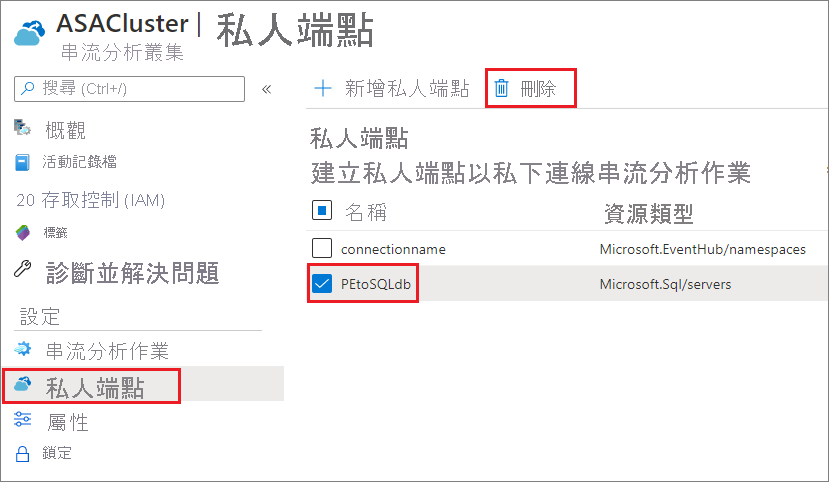

# 在 Azure 串流分析叢集中建立和刪除私人端點

您可以將在叢集上執行的 Azure 串流分析作業連ㄍ到位於防火牆或 Azure 虛擬網路 (VNet) 後方的輸入和輸出資源。 首先，您會在串流分析叢集中建立資源 (例如 Azure 事件中樞或 Azure SQL Database) 的私人端點。 然後，從您的輸入或輸出核准私人端點連線。

一旦核准連線，在串流分析叢集中執行的任何作業都可透過私人端點存取資源。 本文說明如何在 Azure 串流分析叢集中建立和刪除私人端點。

## 在串流分析叢集中建立私人端點

您可在本節中學習如何在 Azure 串流分析叢集中建立私人端點。

1. 在 Azure 入口網站中，找出並選取您的串流分析叢集。

1. 在 **設定**下，選取 [私人端點]。

1. 選取 **新增私人端點**然後輸入下列資訊，選擇要透過私人端點安全存取的資源。

   |設定|值|
   |---|---|
   |名稱|為私人端點輸入任何名稱。 如果此名稱已被使用，請建立唯一名稱。|
   |連線方法|選取 [連線到我目錄中的 Azure 資源]。  您可以選擇其中一個資源，使用私人端點安全地連線，或者使用與您共用的資源識別碼或別名，連線到其他人的資源。|
   |訂用帳戶|選取您的訂用帳戶。|
   |資源類型|選擇[對應至您資源的資源類型](../private-link/private-endpoint-overview.md#private-link-resource)。|
   |資源|選取要使用私人端點連線的資源。|
   |目標子資源|屬於上方所選資源，且能供您私人端點存取的子資源類型。|

   

1. 核准來自目標資源的連線。 例如，如果您在上一個步驟中建立了 Azure SQL Database 執行個體的私人端點，則應該移至此 SQL Database 執行個體，並查看應取得核准的擱置連線。 系統可能需要數分鐘才會顯示連線要求。

    

1. 您可以回到您的串流分析叢集，查看狀態在數分鐘內由**擱置中客戶核准**、**擱置中 DNS 安裝**變更為**設定完成**。

## 在串流分析叢集中刪除私人端點

1. 在 Azure 入口網站中，找出並選取您的串流分析叢集。

1. 在 **設定**下，選取 [私人端點]。

1. 選取您要刪除的私人端點，然後選取 [刪除]。

   

## 後續步驟

您現在了解如何在 Azure 串流分析叢集中管理私人端點。 接下來，您可以學習如何縮放叢集並在叢集中執行作業：

* [縮放 Azure 串流分析叢集](scale-cluster.md)
* [管理串流分析叢集中的串流分析作業](manage-jobs-cluster.md)