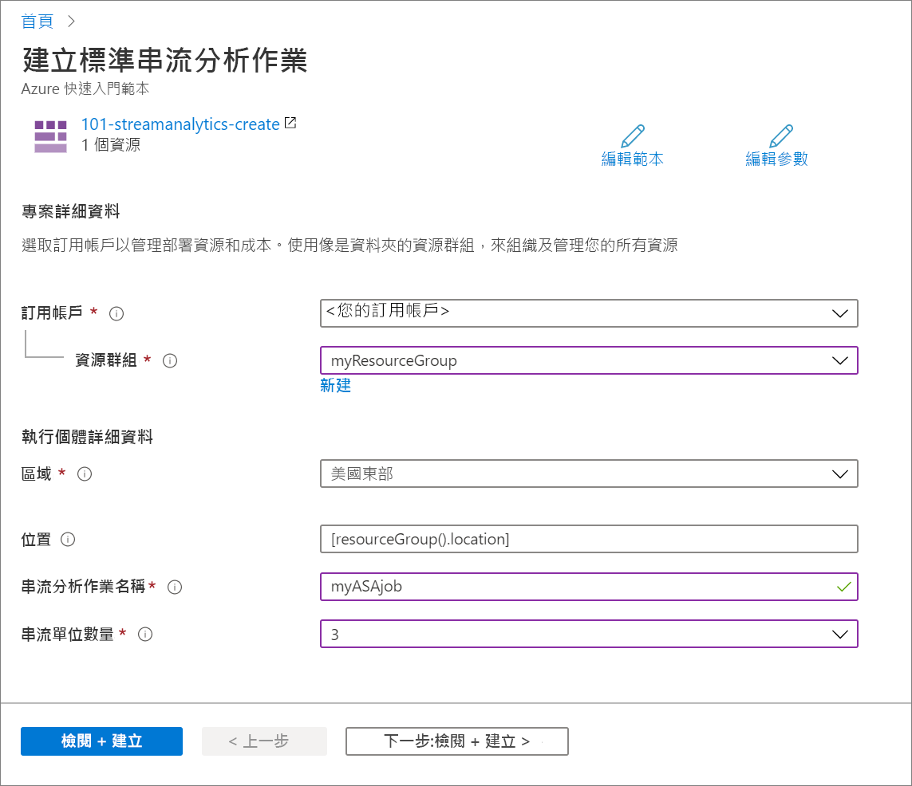

# <a name="quickstart-create-an-azure-stream-analytics-job-by-using-an-arm-template"></a>快速入門：使用 ARM 範本建立 Azure 串流分析作業

在此快速入門中，您將使用 Azure Resource Manager 範本 (ARM 範本) 建立 Azure 串流分析作業。 建立作業之後，即可驗證該部署。

[!INCLUDE [About Azure Resource Manager](../../includes/resource-manager-quickstart-introduction.md)]

如果您的環境符合必要條件，而且您很熟悉 ARM 範本，請選取 [部署至 Azure] 按鈕。 範本會在 Azure 入口網站中開啟。

[](https://portal.azure.com/#create/Microsoft.Template/uri/https%3A%2F%2Fraw.githubusercontent.com%2FAzure%2Fazure-quickstart-templates%2Fmaster%2F101-streamanalytics-create%2Fazuredeploy.json)

## <a name="prerequisites"></a>必要條件

若要完成此文章，您需要：

* 擁有 Azure 訂用帳戶 - [建立免費帳戶](https://azure.microsoft.com/free/)。

## <a name="review-the-template"></a>檢閱範本

本快速入門中使用的範本是來自 [Azure 快速入門範本](https://azure.microsoft.com/resources/templates/101-streamanalytics-create/)。

:::code language="json" source="~/quickstart-templates/101-streamanalytics-create/azuredeploy.json":::

範本中定義的 Azure 資源是 [Microsoft.StreamAnalytics/StreamingJobs](/azure/templates/microsoft.streamanalytics/streamingjobs)：建立 Azure 串流分析作業。

## <a name="deploy-the-template"></a>部署範本

在此節中，您會使用 ARM 範本建立 Azure 串流分析作業。

1. 選取以下影像來登入 Azure 並開啟範本。 此範本會建立 Azure 串流分析作業。

   [](https://portal.azure.com/#create/Microsoft.Template/uri/https%3A%2F%2Fraw.githubusercontent.com%2FAzure%2Fazure-quickstart-templates%2Fmaster%2F101-streamanalytics-create%2Fazuredeploy.json)

2. 提供所需的值來建立您的 Azure 串流分析作業。

   

   提供下列值：

   |屬性  |描述  |
   |---------|---------|
   |**訂用帳戶**     | 從下拉式清單中選取您的 Azure 訂用帳戶。        |
   |**資源群組**     | 指定您是要建立新的資源群組，還是使用現有資源群組。 資源群組是存放 Azure 方案相關資源的容器。 如需詳細資訊，請參閱 [Azure 資源群組概觀](../azure-resource-manager/management/overview.md)。 |
   |**區域**     | 選取 [美國東部]。 如需其他可用的區域，請參閱[依區域提供的 Azure 服務](https://azure.microsoft.com/regions/services/)。        |
   |**串流分析作業名稱**     | 提供您串流分析作業的名稱。      |
   |**串流單位數量**     |  選擇您需要的串流單位數目。 如需詳細資訊，請參閱[了解和調整串流單位](stream-analytics-streaming-unit-consumption.md)。       |

3. 選取 [檢閱 + 建立]，然後選取 [建立]。

## <a name="review-deployed-resources"></a>檢閱已部署的資源

您可以使用 Azure 入口網站來檢查 Azure 串流分析作業，或使用下列 Azure CLI 或 Azure PowerShell 指令碼來列出資源。

### <a name="azure-cli"></a>Azure CLI

```azurecli-interactive
echo "Enter your Azure Stream Analytics job name:" &&
read streamAnalyticsJobName &&
echo "Enter the resource group where the Azure Stream Analytics job exists:" &&
read resourcegroupName &&
az stream-analytics job show -g $resourcegroupName -n $streamAnalyticsJobName
```

### <a name="azure-powershell"></a>Azure PowerShell

```azurepowershell-interactive
$resourceGroupName = Read-Host -Prompt "Enter the resource group name where your Azure Stream Analytics job exists"
(Get-AzResource -ResourceType "Microsoft.StreamAnalytics/StreamingJobs" -ResourceGroupName $resourceGroupName).Name
 Write-Host "Press [ENTER] to continue..."
```

## <a name="clean-up-resources"></a>清除資源

如果您預計繼續進行後續的教學課程，可以讓這些資源留在原處。 當不再需要時，請刪除資源群組，這會刪除 Azure 串流分析作業。 若要使用 Azure CLI 或 Azure PowerShell 刪除資源群組：

### <a name="azure-cli"></a>Azure CLI

```azurecli-interactive
echo "Enter the Resource Group name:" &&
read resourceGroupName &&
az group delete --name $resourceGroupName &&
echo "Press [ENTER] to continue ..."
```

### <a name="azure-powershell"></a>Azure PowerShell

```azurepowershell-interactive
$resourceGroupName = Read-Host -Prompt "Enter the Resource Group name"
Remove-AzResourceGroup -Name $resourceGroupName
Write-Host "Press [ENTER] to continue..."
```

## <a name="next-steps"></a>後續步驟

在此快速入門中，您已透過使用 ARM 範本建立 Azure 串流分析作業，並已驗證該部署。 前往下一篇文章以了解如何使用 VS Code 匯出現有作業的 ARM 範本。

> [!div class="nextstepaction"]
> [匯出 Azure 串流分析作業 ARM 範本](resource-manager-export.md)
