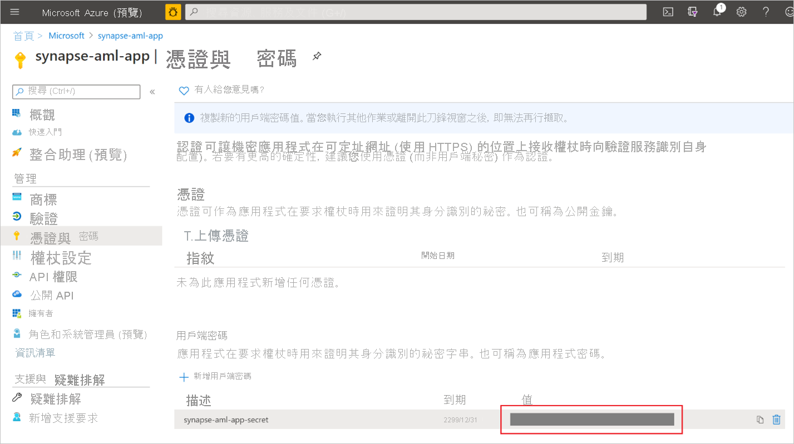
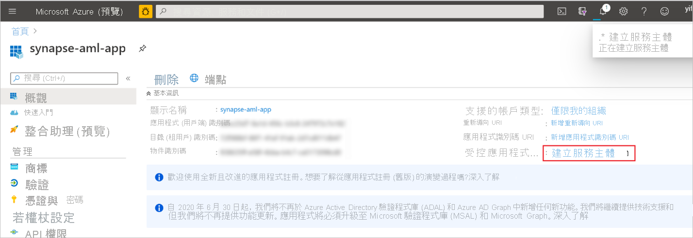
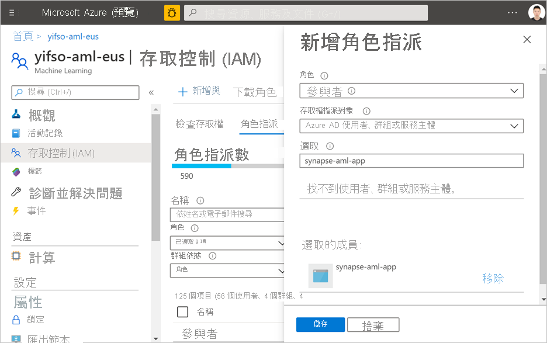

# 快速入門：在 Synapse 中建立新的 Azure Machine Learning 連結服務

在本快速入門中，您會將 Azure Synapse Analytics 工作區連結至 Azure Machine Learning 工作區。 連結這些工作區可讓您利用 Synapse 中各種體驗的 Azure Machine Learning。

例如，這會連結到 Azure Machine Learning 的工作區，可實現下列體驗：

- 在 Synapse 管線中，以步驟的方式執行您的 Azure Machine Learning 管線。 若要深入了解，請參閱[執行 Azure Machine Learning 管線](/azure/data-factory/transform-data-machine-learning-service)。

- 從 Azure Machine Learning 模型登錄中引入機器學習模型，並對 Synapse SQL 集區中的模型進行評分，藉此透過預測來擴充資料。 如需詳細資訊，請參閱[教學課程：適用於 Synapse SQL 集區的機器學習模型評分精靈](tutorial-sql-pool-model-scoring-wizard.md)。

## Prerequisites

- Azure 訂用帳戶 - [建立免費帳戶](https://azure.microsoft.com/free/)。
- [Synapse Analytics 工作區](../get-started-create-workspace.md)，並將 ADLS Gen2 儲存體帳戶設定為預設儲存體。 您必須是所要使用 ADLS Gen2 檔案系統的 **儲存體 Blob 資料參與者**。
- [Azure Machine Learning 工作區](/azure/machine-learning/how-to-manage-workspace)。
- 您需要權限 (或具有權限使用者的要求) 來建立服務主體和祕密，讓您可以用來建立連結的服務。 請注意，必須在 Azure Machine Learning 工作區中將「參與者」角色指派給此服務主體。

## 登入 Azure 入口網站

登入 [Azure 入口網站](https://portal.azure.com/)

## 建立服務主體

此步驟會建立新的服務主體。 如果您想要使用現有的服務主體，可跳過此步驟。
1. 開啟 Azure 入口網站。 

1. 前往 [Azure Active Directory] -> [應用程式註冊]。

1. 按一下 [新增註冊]。 然後，遵循 UI 上的指示來註冊新的應用程式。

1. 應用程式註冊之後。 產生應用程式的祕密。 前往 [您的應用程式] -> [憑證與秘密]。 按一下 [新增用戶端密碼] 以產生秘密。 確保秘密安全，稍後將會用到。

   

1. 建立應用程式的服務主體。 移至 [應用程式] -> [概觀]，然後按一下 [建立服務主體]。 在某些情況下，會自動建立此服務主體。

   

1. 將服務主體新增為 Azure Machine Learning 工作區的「參與者」。 請注意，這必須是 Azure Machine Learning 工作區所屬資源群組的擁有者。

   

## 建立連結的服務

1. 在您要建立新 Azure Machine Learning 連結服務的 Synapse 工作區中，移至 [管理] -> [連結服務]，建立類型為 "Azure Machine Learning" 的新連結服務。

   

2. 填寫表單：

   - 服務主體識別碼：這是應用程式的「應用程式 (用戶端) 識別碼」。
  
     > [!NOTE]
     > 這「不是」應用程式角色的名稱。 您可以在應用程式的概觀頁面中找到此識別碼。 這應該是一個很長的字串，看起來像這個 "81707eac-ab38-406u-8f6c-10ce76a568d5"。

   - 服務主體金鑰：您在上一節中產生的祕密。

3. 按一下 [測試連線]，以確認組態是否正確。 如果連線測試成功，請按一下 [儲存]。

   如果連線測試失敗，請確定服務主體識別碼和祕密正確，然後再試一次。

## 後續步驟

- [教學課程：機器學習模型評分精靈 - 專用 SQL 集區](tutorial-sql-pool-model-scoring-wizard.md)
- [Azure Synapse Analytics 中的機器學習功能](what-is-machine-learning.md)
