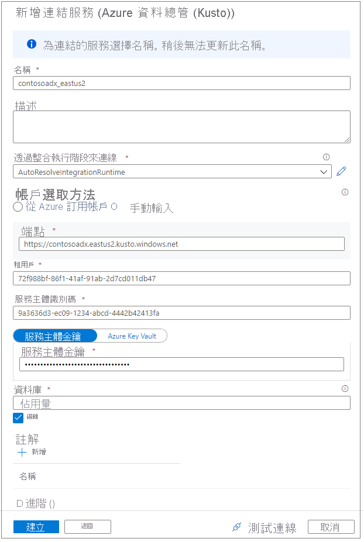

# 使用適用於 Azure Synapse Analytics 的 Apache Spark 連線到 Azure 資料總管

本文說明如何使用適用於 Azure Synapse Analytics 的 Apache Spark 從 Synapse Studio 存取 Azure 資料總管資料庫。

## 必要條件

* [建立 Azure 資料總管叢集與資料庫](/azure/data-explorer/create-cluster-database-portal)。
* 擁有現有的 Azure Synapse Analytics 工作區，或建立新的工作區，方法是遵循下列文章中的步驟：[快速入門：建立 Azure Synapse 工作區](./quickstart-create-workspace.md)。
* 擁有現有的 Apache Spark 集區，或建立新的集區，方法是遵循下列文章中的步驟：[快速入門：使用 Azure 入口網站建立 Apache Spark 集區](./quickstart-create-apache-spark-pool-portal.md)。
* [佈建 Azure AD 應用程式來建立 Azure Active Directory (Azure AD) 應用程式](/azure/data-explorer/kusto/management/access-control/how-to-provision-aad-app)。
* 遵循[管理 Azure 資料總管資料庫權限](/azure/data-explorer/manage-database-permissions)中的步驟，向 Azure AD 應用程式授與資料庫的存取權限。

## 移至 Synapse Studio

從 Azure Synapse 工作區，選取 [啟動 Synapse Studio]。 在 Synapse Studio 首頁上，選取 [資料] 以移至 [資料物件總管]。

## 將 Azure 資料總管資料庫連線到 Azure Synapse 工作區

將 Azure 資料總管資料庫連線到工作區的作業會透過連結服務來完成。 透過 Azure 資料總管連結服務，您可以從適用於 Azure Synapse 的 Apache Spark 瀏覽和探索資料、讀取和寫入。 您也可以在管線中執行整合作業。

在資料物件總管中，遵循下列步驟來直接連線 Azure 資料總管叢集：

1. 選取 [資料] 附近的 [+] 圖示。
1. 選取 [連線] 以連線到外部資料。
1. 選取 [Azure 資料總管 (Kusto)]。
1. 選取 [繼續]。
1. 使用自訂名稱來命名連結服務。 此名稱會出現在「資料物件總管」中，可供 Azure Synapse 執行階段用來連線到資料庫。
1. 從您的訂用帳戶選取 Azure 資料總管叢集，或輸入 URI。
1. 輸入 [服務主體識別碼] 和 [服務主體金鑰]。 請確定此服務主體具有資料庫的檢視存取權以進行讀取作業，並具有擷取器存取權以便擷取資料。
1. 輸入 Azure 資料總管資料庫的名稱。
1. 選取 [測試連線] 以確保您擁有正確的權限。
1. 選取 [建立]。

    

    > [!NOTE]
    > (選擇性) [測試連線] 不會驗證寫入存取權。 請確定您的服務主體識別碼具有 Azure 資料總管資料庫的寫入存取權。

1. Azure 資料總管叢集和資料庫會出現在 [Azure 資料總管] 區段底下的 [已連結] 索引標籤上。

    

    > [!NOTE]
    > 在目前版本中，系統會根據您對 Azure 資料總管資料庫的 Azure AD 帳戶權限來填入資料庫物件。 當您執行 Apache Spark 筆記本或整合作業時，將會使用連結服務中的認證 (例如，服務主體)。

## 與程式碼產生的動作快速互動

當您以滑鼠右鍵按一下資料庫或資料表時，就會出現範例 Spark 筆記本的清單。 選取選項來讀取資料、寫入資料或將資料串流至 Azure 資料總管。

以下是讀取資料的範例。 將筆記本連結至 Spark 集區，並執行資料格。

   > [!NOTE]
   > 第一次執行可能需要 3 分鐘以上的時間來起始 Spark 工作階段。 後續執行速度將會大幅加快。

## 限制

Azure Synapse 受控虛擬網路目前不支援 Azure 資料總管連接器。

## 後續步驟

* [使用進階選項的範例程式碼](https://github.com/Azure/azure-kusto-spark/blob/master/samples/src/main/python/SynapseSample.py)
* [Azure 資料總管 (Kusto) Spark 連接器](https://github.com/Azure/azure-kusto-spark)