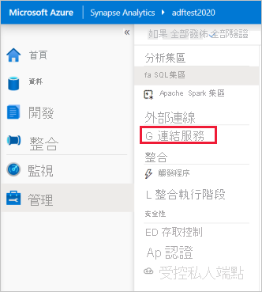
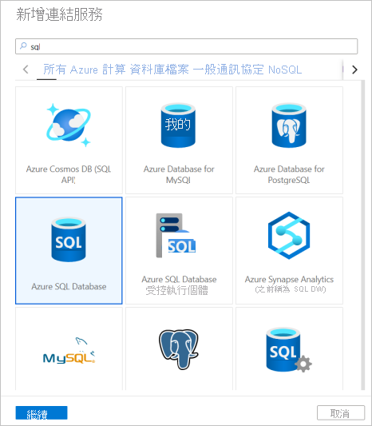
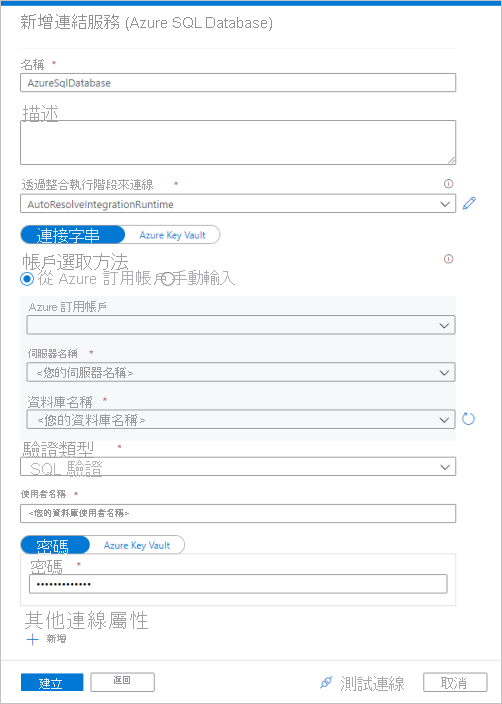
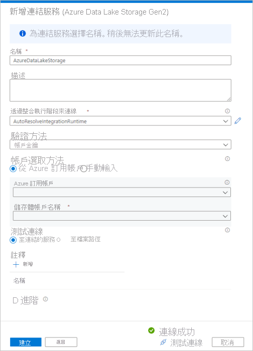
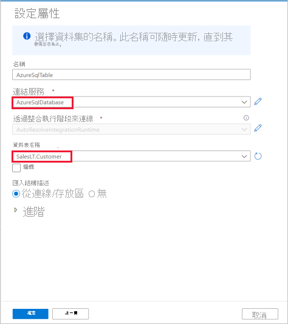
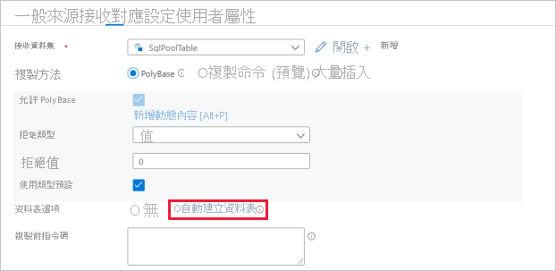

# 快速入門：使用複製活動將資料載入專用 SQL 集區中

Azure Synapse Analytics 提供各種分析引擎，協助您內嵌、轉換、模型化及分析您的資料。 專用 SQL 集區提供以 T-SQL 為基礎的計算和儲存功能。 在 Synapse 工作區中建立專用 SQL 集區後，就可以載入、模型化、處理及提供資料，以提供更快速的分析見解。

在本快速入門中，您將了解如何「將資料從 Azure SQL Database 載入至 Azure Synapse Analytics」。 您可以依照類似的步驟，從其他類型的資料存放區複製資料。 這個類似的流程也適用於其他來源和接收的資料複製。

## 必要條件

* Azure 訂用帳戶：如果您沒有 Azure 訂用帳戶，請在開始前建立[免費帳戶](https://azure.microsoft.com/free/)。
* Azure Synapse 工作區：遵循以下指示，使用 Azure 入口網站建立 Synapse 工作區：[快速入門：建立 Synapse 工作區](quickstart-create-workspace.md)。
* Azure SQL Database：本教學課程會從 Azure SQL Database 中的 Adventure Works LT 範例資料集複製資料。 您可以遵循[在 Azure SQL Database 中建立範例資料庫](../azure-sql/database/single-database-create-quickstart.md)中的指示，在 SQL Database 中建立此範例資料庫。 或者，您可以依照類似的步驟來使用其他資料存放區。
* Azure 儲存體帳戶：在複製作業中，Azure 儲存體會作為「暫存」區域。 如果您沒有 Azure 儲存體帳戶，請參閱[建立儲存體帳戶](../storage/common/storage-account-create.md)中的指示。
* Azure Synapse Analytics：您可以使用專用 SQL 集區作為接收資料存放區。 如果您沒有 Azure Synapse Analytics 執行個體，請參閱[建立專用 SQL 集區](quickstart-create-sql-pool-portal.md)，按照步驟建立。

### 瀏覽至 Synapse Studio

建立 Synapse 工作區之後，有兩種方式可以開啟 Synapse Studio：

* 在 [Azure 入口網站](https://ms.portal.azure.com/#home)中開啟 Synapse 工作區。 在 [開始使用] 底下的 [開啟 Synapse Studio] 卡片上，選取 [開啟]。
* 開啟 [Azure Synapse Analytics](https://web.azuresynapse.net/) 並登入您的工作區。

在本快速入門中，我們會使用名為 "adftest2020" 的工作區作為範例。 其會自動讓您瀏覽至 Synapse Studio 首頁。

## 建立連結的服務

在 Azure Synapse Analytics 中，連結服務可讓您定義其他服務的連線資訊。 在本節中，您將建立下列兩種連結服務：Azure SQL Database 和 Azure Data Lake Storage Gen2 (ADLS Gen2) 連結服務。

1. 在 Synapse Studio 首頁上，在左側導覽中選取 [管理] 索引標籤。
1. 在 [外部連線] 底下，選取 [連結服務]。
  
   

1. 若要新增連結服務，請選取 [新增]。
1. 從資源庫選取 [Azure SQL Database]，然後選取 [繼續]。 您可以在搜尋方塊中輸入 "sql"，以篩選連接器。

   

1. 在 [新增連結服務] 頁面中，從下拉式清單中選取您的伺服器名稱和資料庫名稱，並指定使用者名稱和密碼。 按一下 [測試連線] 以驗證設定，然後選取 [建立]。

   

1. 重複步驟 3-4，但從資源庫中選取 [Azure Data Lake Storage Gen2]。 在 [新增連結服務] 頁面中，從下拉式清單中選取您的儲存體帳戶名稱。 按一下 [測試連線] 以驗證設定，然後選取 [建立]。 

   
 
## 建立管線

管線包含執行一組活動的邏輯流程。 在本節中，您將建立一個包含複製活動的管線，將資料從 Azure SQL Database 內嵌至專用 SQL 集區。

1. 移至 [整合] 索引標籤。選取管線標頭旁的加號圖示，然後選取 [管線]。

   

1. 在 [活動] 窗格的 [移動和轉換] 底下，將 [複製資料] 拖曳至管線畫布。
1. 選取複製活動，然後移至 [來源] 索引標籤。選取 [新增] 以建立新的來源資料集。

   

1. 選取 [Azure SQL Database] 作為資料存放區，然後選取 [繼續]。
1. 在 [設定屬性] 窗格中，選取您在先前步驟中建立的 Azure SQL Database 連結服務。 
1. 在 [資料表名稱] 底下，選取要在下列複製活動中使用的範例資料表。 在本快速入門中，我們會使用 "SalesLT.Customer" 資料表作為範例。 

   
1. 於完成時選取 [確定]。
1. 選取複製活動，然後移至 [接收] 索引標籤。選取 [新增] 以建立新的接收資料集。
1. 選取 [Azure Synapse 專用 SQL 及區] 作為資料存放區，然後選取 [繼續]。
1. 在 [設定屬性] 窗格中，選取您在先前步驟中建立的 SQL 分析集區。 如果您要寫入現有的資料表，請在 [資料表名稱] 底下，從下拉式清單加以選取。 否則，請勾選 [編輯] 並輸入新的資料表名稱。 於完成時選取 [確定]。
1. 針對 [接收資料集設定]，在 [資料表選項] 欄位中啟用 [自動建立資料表]。

   

1. 在 [設定] 頁面中，選取 [啟用暫存] 的核取方塊。 如果您的來源資料與 PolyBase 不相容，則適用此選項。 在 [暫存設定] 區段中，選取您在先前步驟中建立的 Azure Data Lake Storage Gen2 連結服務作為暫存儲存體。 

    此儲存體用來暫存資料，之後再使用 PolyBase 將資料載入到 Azure Synapse Analytics。 複製完成後，系統會自動清除 Azure Data Lake Storage Gen2 中的暫存資料。

   

1. 若要驗證管線，請選取工具列上的 [驗證]。 您會在頁面右側看到管線驗證輸出的結果。 

## 偵錯和發佈管線

完成管線的設定後，您就可以在發佈成品之前執行偵錯執行，以確認一切正確無誤。

1. 若要對管線進行偵錯，請選取工具列上的 [偵錯]。 您可以在視窗底部的 [輸出] 索引標籤中檢視管線執行的狀態。 

   

1. 管線執行成功後，請在頂端的工具列中選取 [全部發佈]。 此動作會將您建立的實體 (資料集和管線) 發佈至 Synapse Analytics 服務。
1. 請靜待 [發佈成功] 訊息顯示。 若要查看通知訊息，請選取右上方的鈴鐺按鈕。 

## 觸發和監視管線

在本節中，您會手動觸發在上一個步驟中發佈的管線。 

1. 選取工具列上的 [新增觸發程序]，然後選取 [立即觸發]。 在 [管線執行] 頁面上，選取 [確定]。  
1. 移至左側資訊看板中的 [監視器] 索引標籤。 您會看到手動觸發程序所觸發的管線執行。 
1. 當管線執行成功完成時，請選取 [管線名稱] 資料行底下的連結，以檢視活動執行詳細資料，或重新執行管線。 此範例中只有一個活動，因此您在清單中只會看到一個項目。 
1. 如需有關複製作業的詳細資料，請選取 [活動名稱] 資料行下的 [詳細資料] 連結 (眼鏡圖示)。 您可以監視的詳細資料包括從來源複製到接收的資料量、資料輸送量、執行步驟與對應的持續期間，以及所使用的組態。

   

1. 若要切換回 [管線執行] 檢視，請選取頂端的 [所有管線執行] 連結。 選取 [重新整理] 即可重新整理清單。
1. 確認您的資料已在專用 SQL 集區中正確寫入。

## 後續步驟

前往下列文章，以了解 Azure Synapse Analytics 支援：

> [!div class="nextstepaction"]
> [管線和活動](https://docs.microsoft.com/azure/data-factory/concepts-pipelines-activities?toc=/azure/synapse-analytics/toc.json&bc=/azure/synapse-analytics/breadcrumb/toc.json)
> [連接器概關](https://docs.microsoft.com/azure/data-factory/connector-overview?toc=/azure/synapse-analytics/toc.json&bc=/azure/synapse-analytics/breadcrumb/toc.json)
> [複製活動](https://docs.microsoft.com/azure/data-factory/copy-activity-overview?toc=/azure/synapse-analytics/toc.json&bc=/azure/synapse-analytics/breadcrumb/toc.json)